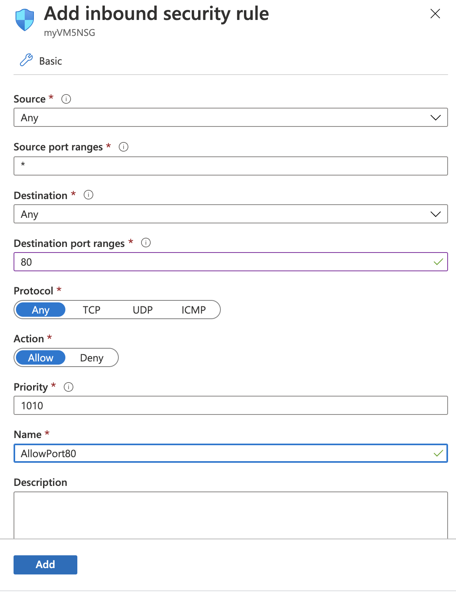

# Azure Trailblazer Academy Azure Net App Files Storage Lab
## Overview
## Access Data in Azure  with Azure NetApp Files
The Azure NetApp Files service is an enterprise-class, high-performance, file storage service. Azure NetApp Files supports any workload type and is highly available by default. You can select service and performance levels and set up snapshots through the service.

In this Lab we will create a Highly Available NAS Share, that will shared by two Virtual Machines

## Lab-4: Follow Along to Setup Web Server

### Step-1: Provision Two VM's

- Start a **Cloud Shell**, by selecting the icon shown below

-  When prompted select **Bash** and if necessary answer **create** to a cloud shell storage account (it will be very tiny)

- Create VM1 
        At the command prompt, paste in this text below,
        
        az vm create --resource-group ata-ANF-RG --name WebVM1 --admin-username ata --admin-password Trailblazer1! --nsg-rule ssh --vnet-name myvnet1 --subnet default --plan-publisher nginxinc --plan-product nginx-plus-v1 --plan-name nginx-plus-ub1804 --image nginxinc:nginx-plus-v1:nginx-plus-ub1804:2.0.0
            
- Create VM2
        At the command prompt, paste in this text below, **replacing the Resource Group** with your Resource Group
        
        az vm create --resource-group ata-ANF-RG --name WebVM2 --admin-username ata --admin-password Trailblazer1! --nsg-rule ssh --vnet-name myvnet1 --subnet default --plan-publisher nginxinc --plan-product nginx-plus-v1 --plan-name nginx-plus-ub1804 --image nginxinc:nginx-plus-v1:nginx-plus-ub1804:2.0.0

### Step-2: Configure Web Server (On Each VM)

-   We will be using Azure Cloud Shell, again to enter a few commands on each VM

#### For WebVM1: Using Azure Cloud
####          Username : ata and Password Trailblazer1!

-   ssh ata@**(WebVM1-Public-IP)**

-   confirm with yes, if prompted

-   Enter the password Trailblazer1!

Now execute the below commands one by one

        sudo bash
        cd /etc/nginx/conf.d
        cat >default.conf
        
Copy and Paste the below text (you will not have a prompt, system waiting for text below)
    
        server {
            location / {
                root /mnt/myvol1/data/www;
            }

            location /images/ {
                root /mnt/myvol1/data;
            autoindex on;
            }
        }
            
Type  Ctrl-d (Press Control Key along with "d" key)

Continue to execute the below commands one by one

        mkdir /mnt/myvol1/data
        mkdir /mnt/myvol1/data/www
        mkdir /mnt/myvol1/data/images
        cp /usr/share/nginx/html/index.html /mnt/myvol1/data/www/index.html
        cp /usr/share/plymouth/ubuntu-logo.png /mnt/myvol1/data/images/.
        cp /usr/share/pixmaps/debian-logo.png /mnt/myvol1/data/images/.
        service nginx restart
        
        

#### For WebVM2: Using Azure Cloud
####          Username : ata and Password Trailblazer1!

-   ssh ata@**(WebVM2-Public-IP)**

-   confirm with yes, if prompted

-   Enter the password Trailblazer1!

Now execute the below commands one by one

        sudo bash
        cd /etc/nginx/conf.d
        cat >default.conf
        
Copy and Paste the below text (you will not have a prompt, system waiting for text below)
    
        server {
            location / {
                root /mnt/myvol1/data/www;
            }

            location /images/ {
                root /mnt/myvol1/data;
            autoindex on;
            }
        }
            
Type  Ctrl-d (Press Control Key along with "d "key)

Continue to execute the below commands one by one

        service nginx restart
  
  
  
  ### Step-3: For WebVM1 Enable Http Port 80 Access
  
- In the Azure Portal, Locate and Select Your Resource Group
  
- In the list in the center select your VM **WebVM1**
  
  Selet the **Networking Item** form the list on the side
  

- You should see a panel that looks imiliar to the below
 
   
   
   
  
- Click on **Add Inbound Port Rule** Button on Far Right

Complete the fields in the Add Inbound Security Rule Panel

Set **Destination port ranges** to **80**

Set **Name** to **AllowPort80**

- Click Add Button

  
  ### Step-4: For WebVM2 Enable Http Port 80 Access
    
  - In the Azure Portal, Locate and Select Your Resource Group
    
  - In the list in the center select your VM **WebVM2**
    
    Selet the **Networking Item** form the list on the side
    
    
  
  
  
  - You should see a panel that looks imiliar to the below
  
    
    
    
  - Click on **Add Inbound Port Rule** Button on Far Right

  Complete the fields in the Add Inbound Security Rule Panel

  

  Set **Destination port ranges** to **80**

  Set **Name** to **AllowPort80**

  - Click Add Button

  
  ### Step-5 : Connect to the Web Server
  
  - Using a web browser, connect to http://WebVM1 Public IP Address/images/
  
  - Using a another web browser, connect to http://WebVM2 Public IP Address/images/

