# Azure Trailblazer Academy Azure Net App Files Storage Lab
## Overview
## Access Data in Azure  with Azure NetApp Files
The Azure NetApp Files service is an enterprise-class, high-performance, file storage service. Azure NetApp Files supports any workload type and is highly available by default. You can select service and performance levels and set up snapshots through the service.

In this Lab we will create a Highly Available NAS Share, that will shared by two Virtual Machines

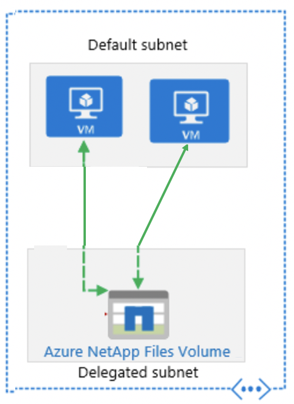

### Labs:
- [Lab-1: Setup the Azure NetApp Files Service](#lab-1-Register-ANF-service)
- [Lab-2: Provision a Pool and Volume to Contain Your Data](#lab-2-Provision-Capacity)
- [Lab-3: Create VM and Mount Volume](#lab-2-Provision-Capacity)

## Lab-1: Setup the Azure NetApp Files Service 
### Step-1: Register the ANF Service
- Login to Azure Portal (https://portal.azure.com) 

- In the serach bar type **Subscription** and **Click on Subscription**

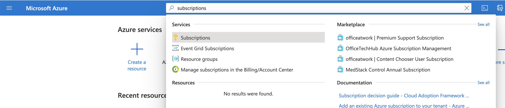

- **Click on the Subcription**, which was whitelisted for Azure NetApp Files

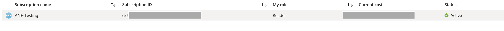

- Scroll down on left hand menu until you see **Resource Provider** and Click on it

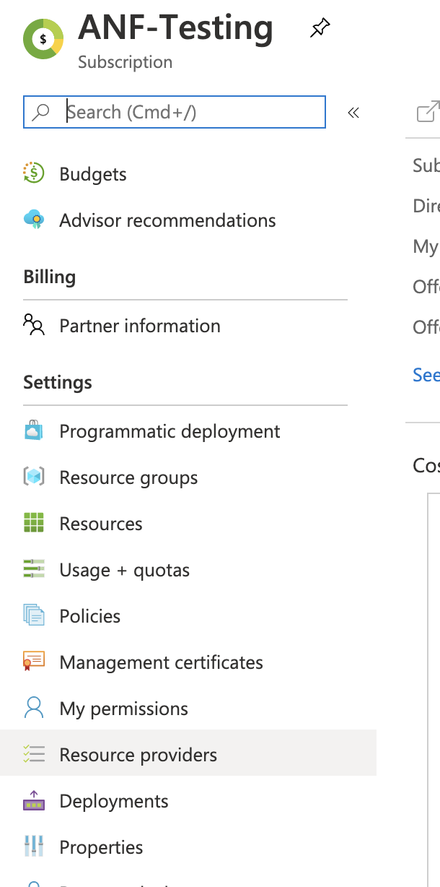

- Type **Microsoft.NetApp** in the search bar

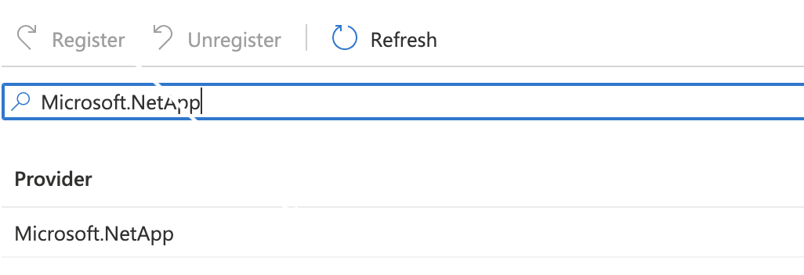

- Now Click the **Register** Button

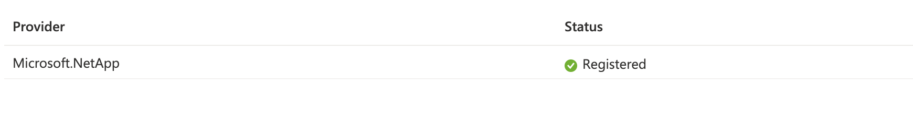

After a few minutes the Provider will show a Registered Status, you can click **Refresh** periodically to update status

### Step-2: Create ANF Storage account
- In the Azure portal’s search box, enter Azure NetApp Files and then **select Azure NetApp Files** from the list that appears.
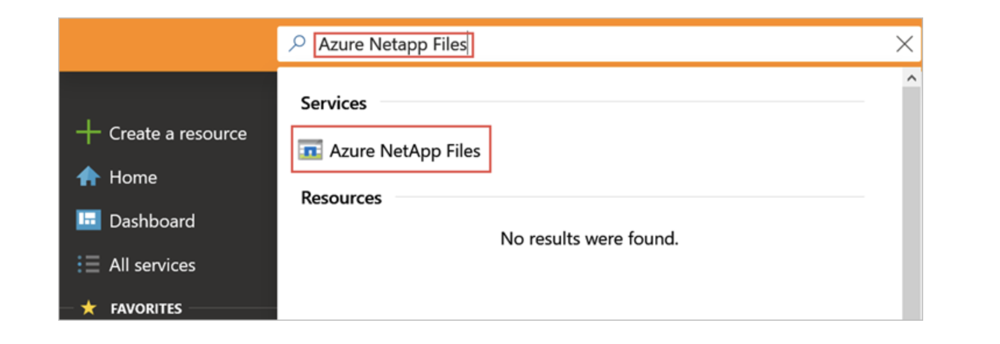

### Step-3: Click **+ Add** to create a new NetApp account
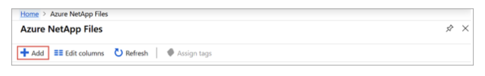

### Step-4: Enter the Info Below
In the New NetApp Account window, provide the following information:

Enter **myaccount1** for the account name.

Select your subscription.

Select Create new to create new resource group. 

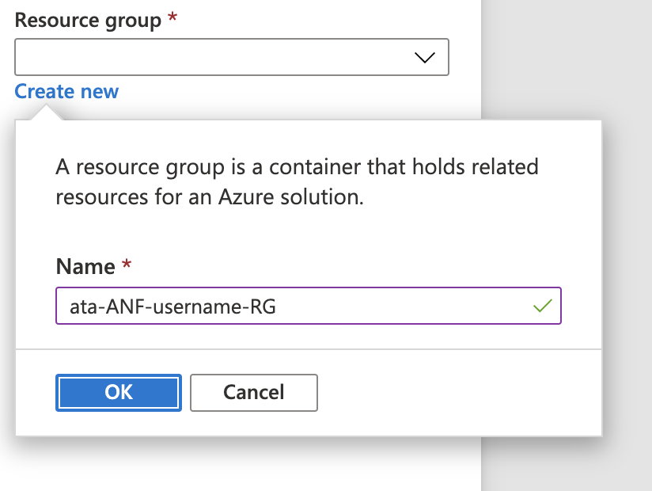

Enter    **ata-ANF-RG** for the resource group name. Click OK.

Select your account location.
 then 
 
Hit **Create** button.

## Lab-2: Provision a Pool and Volume to Contain Your Data

### Step-1: Provision a Capacity Pool to Contain Your Volumes

From the Azure NetApp Files management blade, select your NetApp account (**myaccount1**)

From the Azure NetApp Files management blade of your NetApp account, click **Capacity pools**
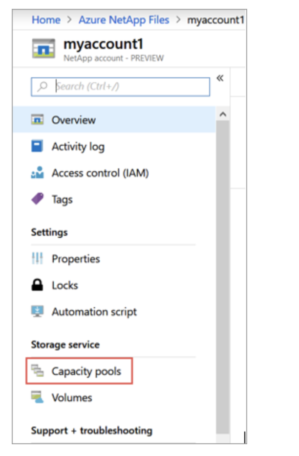

Click **+ Add pools**
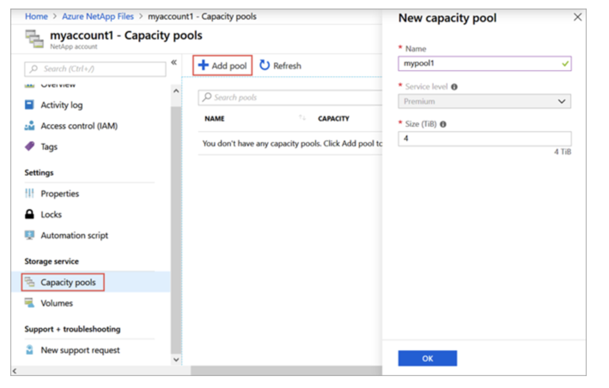

Provide information for the capacity pool:

Enter **mypool1** as the pool name

Select **Premium** for the service level

Specify **4** (TiB) as the pool size

Click **OK**

### Step-2: Create a NFS Volume to Contain Your Data

From the Azure NetApp Files management blade of your NetApp account, click **Volumes**

Click **+ Add volume**

In the Create a Volume window, provide information for the volume:

Enter **myvol1** as the volume name.

Select your capacity pool (**mypool1**)

Use the **default value** for quota.

Under **virtual network**, click **Create new** to create a new Azure virtual network (Vnet). 

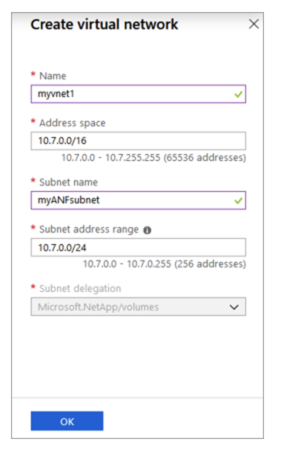

Then fill in the following information:

Enter **myvnet1** as the Vnet name

**Accept the default address range**, for example, 10.7.0.0/16

Leave **default** as the subnet name

**Accept the default address range, for example**, 10.7.0.0/24

Select **Microsoft.NetApp/volumes** for subnet delegation

Click **OK** to create the Vnet.

Click **Protocol**, from the Top Selection

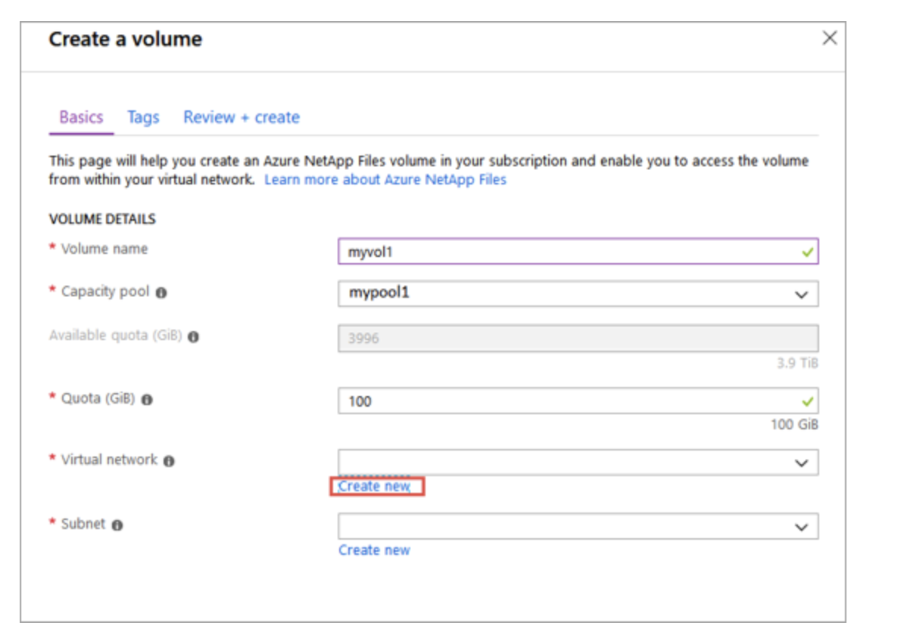

Select **NFS** as the protocol type for the volume

Enter **myvol1** as the file path that will be used to create the export path for the volume

Select the NFS version **NFSv3**

Click the **Review + Create Buttom** at the bottom

Finally Click the **Create Button**

Oncen your volume has created click on **Go to Resource**

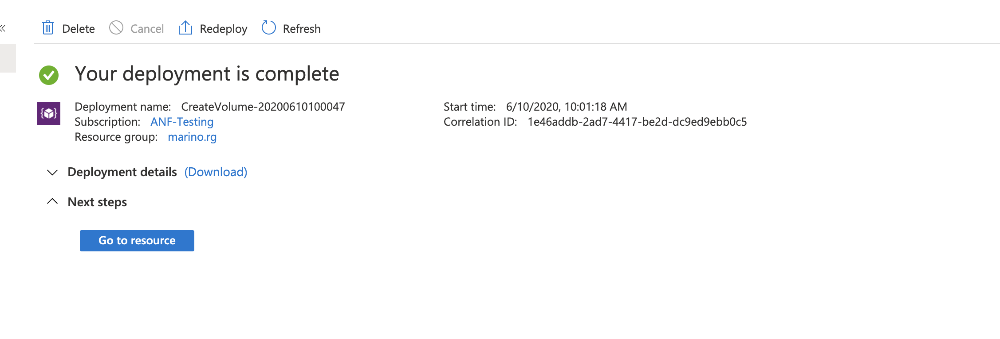

Select **Mount Options** from the menu and 
-   **Take note of your IP Address located under Mount Instructions in  Step 2 (you will need this later on in the lab)**

### Step-3: Add a VM Subnet to your VNet

- From the search bar search for and  Select **Virtual Network**

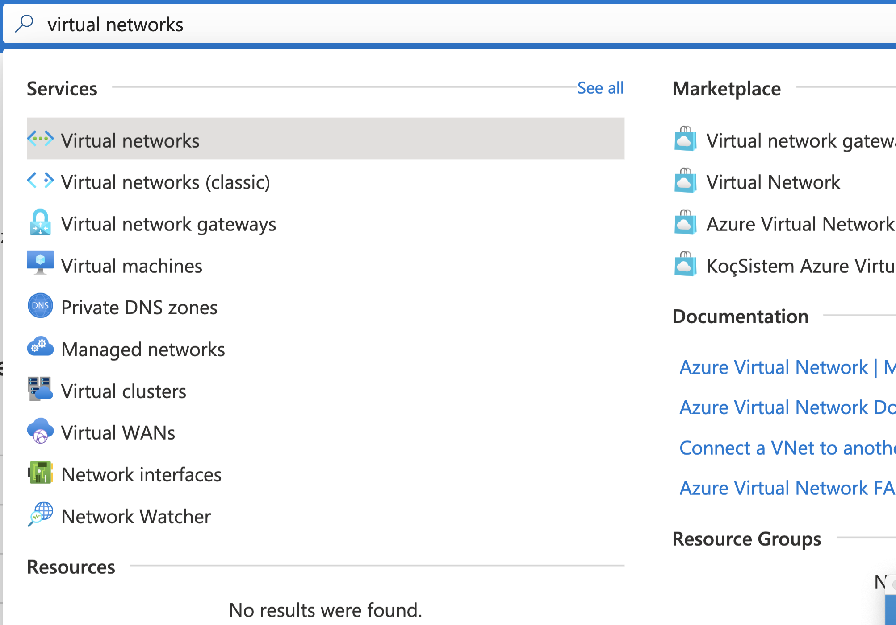

- Select your VNet which should be myvnet1

- Select **Subnet** from the left hand menu

- Select +Subnet

-  Enter the name as **default**, leave everything else as is and hit **ok**

## Lab-3: Create VM and Mount Volume

### Step-1: Provision Two VM's

#### When provisioning VM's, attempt to use the first two commands below, however if you are receiving permission/access errors, then use the second set of commands to provision your VM's

- Start a **Cloud Shell**, by selecting the icon shown below

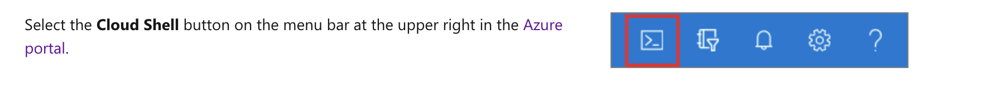

-  When prompted select **Bash** and if necessary answer **create** to a cloud shell storage account (it will be very tiny)

- Create VM1 
        At the command prompt, paste in this text below,
        
        az vm create --resource-group ata-ANF-RG --name WebVM1 --admin-username ata --admin-password Trailblazer1! --nsg-rule ssh --vnet-name myvnet1 --subnet default --plan-publisher nginxinc --plan-product nginx-plus-v1 --plan-name nginx-plus-ub1804 --image nginxinc:nginx-plus-v1:nginx-plus-ub1804:2.0.0
            
- Create VM2
        At the command prompt, paste in this text below, **replacing the Resource Group** with your Resource Group
        
        az vm create --resource-group ata-ANF-RG --name WebVM2 --admin-username ata --admin-password Trailblazer1! --nsg-rule ssh --vnet-name myvnet1 --subnet default --plan-publisher nginxinc --plan-product nginx-plus-v1 --plan-name nginx-plus-ub1804 --image nginxinc:nginx-plus-v1:nginx-plus-ub1804:2.0.0

#### Alternate commands to use if the above two VM create commands are not working for you

- Create VM1 
        At the command prompt, paste in this text below,
             
        az vm create --resource-group ata-ANF-RG --name WebVM1 --admin-username ata --admin-password Trailblazer1! --nsg-rule ssh --vnet-name myvnet1 --subnet default --image UbuntuLTS
                 
- Create VM2
        At the command prompt, paste in this text below, **replacing the Resource Group** with your Resource Group
                         
          az vm create --resource-group ata-ANF-RG --name WebVM2 --admin-username ata --admin-password Trailblazer1! --nsg-rule ssh --vnet-name myvnet1 --subnet default --image UbuntuLTS

### Step-2: Mount Volumes to VM and Create a File (On Each VM)

-   We will be using Azure Cloud Shell, again to enter a few commands on each VM

#### For VM1: Using Azure Cloud
####          Username : ata and Password Trailblazer1!

-   ssh ata@**(WebVM1-Public-IP)**

-   confirm with yes, if prompted

-   Enter the password Trailblazer1!

Now execute the below commands one by one

-  For VM1 (**replace the IP Address below with your IP from the mount instructions of your volume**)

        sudo apt-get -y install nfs-common
        sudo mkdir /mnt/myvol1
        sudo chmod 777 /mnt/myvol1
        sudo mount -t nfs -o rw,hard,rsize=65536,wsize=65536,vers=3,tcp 10.10.1.244:/myvol1 /mnt/myvol1
        touch /mnt/myvol1/file1
        ls -ls /mnt/myvol1

#### For VM2: Using Azure Cloud
####          Username : ata and Password Trailblazer1!

-   ssh ata@**(<WebVM2-Public-IP)**

-   confirm with yes, if prompted

-   Enter the password Trailblazer1!

-   Now execute the below commands one by one

- For VM2 (**replace the IP Address below with your IP from the mount instructions of your volume**)

        sudo apt-get -y install nfs-common
        sudo mkdir /mnt/myvol1
        sudo chmod 777 /mnt/myvol1
        sudo mount -t nfs -o rw,hard,rsize=65536,wsize=65536,vers=3,tcp 10.10.1.244:/myvol1 /mnt/myvol1
        touch /mnt/myvol1/file2
        ls -ls /mnt/myvol1

-  You should see in the ouput from the second VM, both files that were created from VM1 (file1) and VM2 (file2) since its a shared volume

