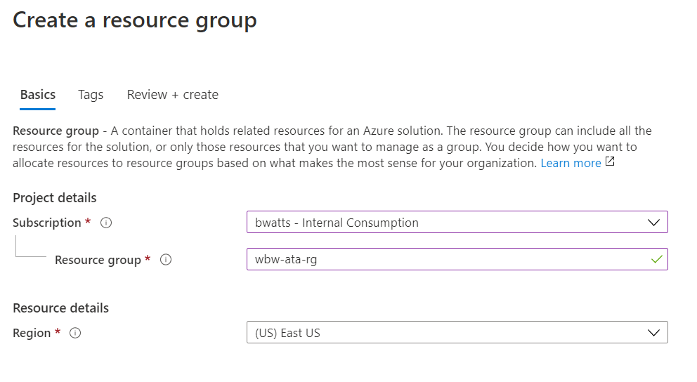
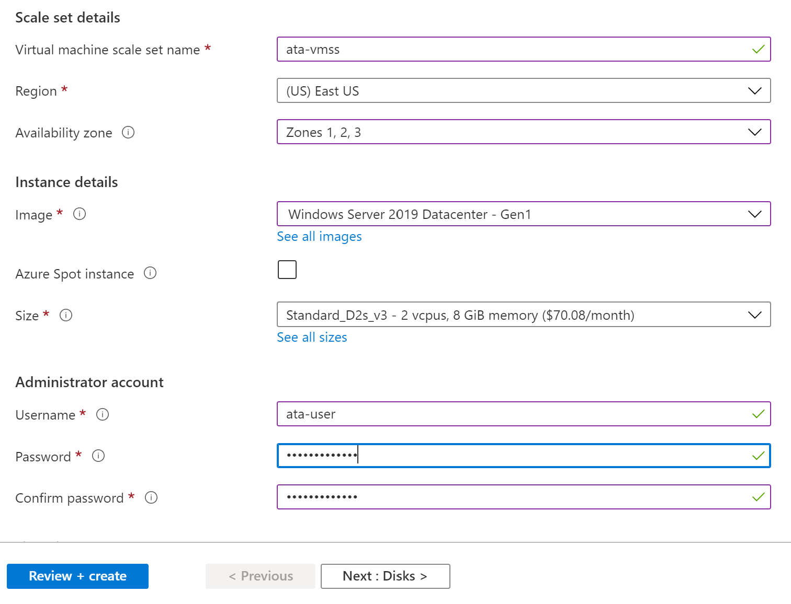
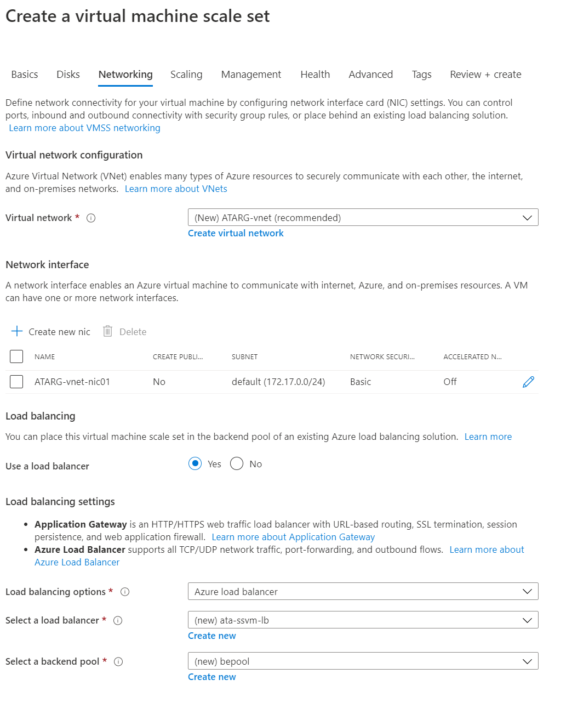
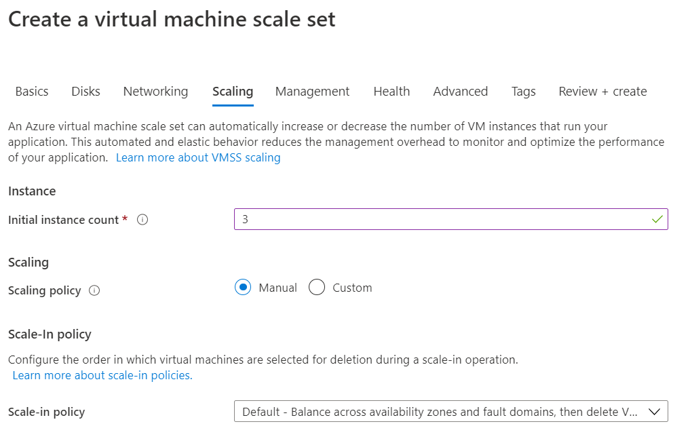
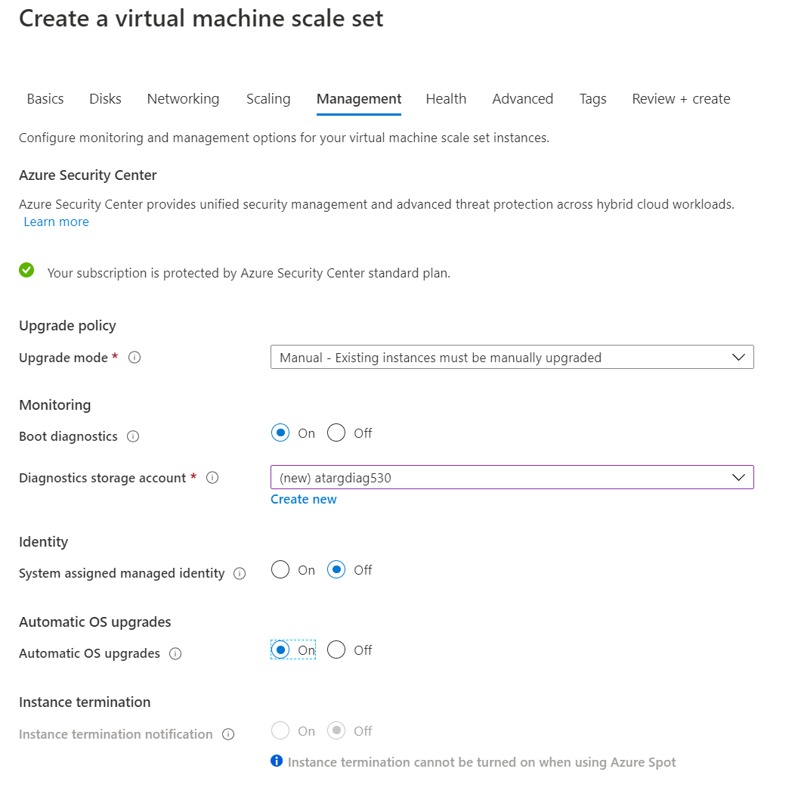
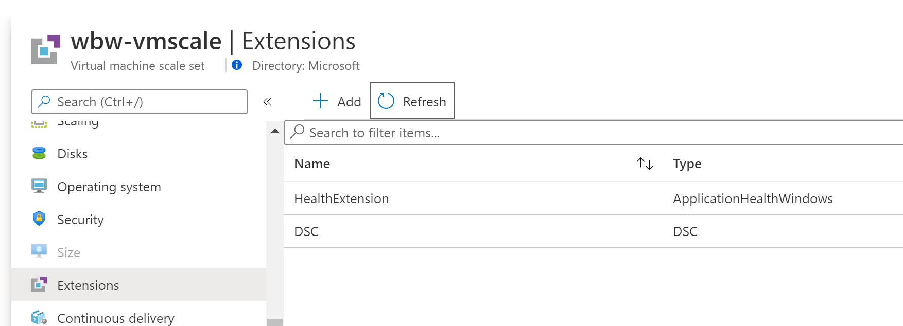
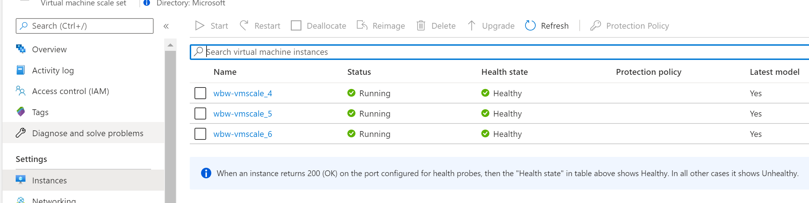
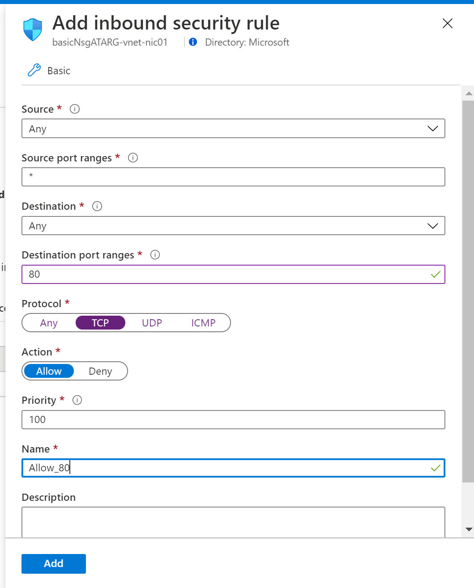

# Azure IaaS Lab

## Prerequisites

- Microsoft Azure subscription
- Resource Group to deploy Azure services
- Permissions to create the following resource  
    - VNet  
    - Public Load Balancer  
    - Scale Set with Virtual Machine  

## Reference Architecture  
Below is a big picture of a comon design architecture for a 3 Tier Application deployed in a highly available architecture.  


For this lab we are going to deploy something simular to the business tier of this application. Our focus is to deploy a VM Scale Set behind an Azure Load Balancer.  

  

** Notes: We will not focus on networking in this lab. Networking will be covered later in the course work.

## Step 1: Create a Resource Group
1. In the Azure Portal, search for **Resource Groups**
2. Click on the **Add** button
3. Fill out the **Basics** tab as follows:
- **Subscription:** Choose your subscription
- **Resource Group:** Provide a unique name like **ata-\<username\>-rg
- **Region:** EastUS

  

4. Click the **Next: Review + Create** button
5. Click the **Create** button

## Step 2: Deploy a VM Scale Set

1. In the Azure Portal, search for **Virtual machine scale sets**
2. Click on the **Add** button
3. Fill out the **Basics** tab as follows:
- **Subscription:** Choose your subscription
- **Resource Group:** Select the Resource Group you created for this lab.
- **Virtual Machine Scale Set Name:** Choose a unique name for the VM. Ex: ata-\<username\>-ssvm
- **Region:** East US
- **Availability zone:** Zone 1,2,3
- **Orchestration mode (Preview):** ScaleSet VMs
- **Image:** Windows Server 2019 Datacenter
- **Azure Spot Instance:** Yes
- **Eviction policy:** Capacity only
- **Size:** Standard D2s v3
- **Username:** Enter your user name. Ex: ata-user
- **Password:** Enter your password

 

4. Click the **Next: Disks** button
5. Leave everything as default and click the **Next: Networking** button
6. Fill out **Networking** tab as follows:

- **Virtual Network:** If there is no current Virtual Network in the Subscirption and Region then it will create a new one. This is fine for this excersice being we aren't focusing on the network.
- **Network interface:** Leave this as the default
- **Use a load balancer:** Change this option to Yes to create a new load balancer
- Leave the default options to create a Azure Load Balancer



7. CLick the **Next: Scaling** button
8. Fill out **Scaling** tab as follows:  

- **Initial instance count:** 3
- **Scaling policy:** Manual
- **Scal-in policy:** Default



7. Click the **Next: Management** button
8. Inside the **Management** tab:

- **Upgrade mode:** Manual
- **Boot diagnostics:** On
- **Automatic OS upgrades:** On
- Leave everything else as default



9. Click the **Next: Health** button
10. Fillout the **Health** tab as follows:  

- **Monitor applicaton health:** Enabled
- Leave everything else as default


11. Click on the **Next: Advanced** button
11. Leave everything as default and click on the **Next: Tags** button
12. Enter any custom tags (optional) and click the **Next: Review + Create** button
12. Click the **Create** button

## Step 3: Deploy the website

We will utilize the PowerShell DSC extension to deploy a simple website to our scale set:

1. In the portal click on the **Cloud Shell** icon and make sure your in PowerShell mode


2. Inside the cloud shell run the following command to download the needed script:

```
curl https://raw.githubusercontent.com/microsoft/AzureTrailblazerAcademy/master/month1/labs/lab_IaaS/scripts/add_website.ps1 > add_website.ps1
```

3. After that download run the following command to install the PowerShell DSC extension:

```
./add_website.ps1 -RGNAME \<ResourceGroupName\> -ScaleSetName \<NameofScaleSet\>
```

4. Once the command completes close out of the Cloud Shell and go back to the Portal

5. In the Azure Portal, search for **Virtual machine scale sets**

6. Click on the Virtual machine scale set you create previously and click on the "Extension" tab. Verify that the DSC extention has been deployed.



7. Clcik on the **Intances** tab. Once the DSC script finished the health will go to healthy. If it doesn't show healthy wait 5 minutes and refresh the view.



## Step 4: Allow External Port 80

We are currently allowing the Load Balancer to other VNets in Azure to connect to our Scale Set. In order for us to connect ot the website we will allow port 80 from any location.

1. While still on the Scale Set Resource blade go to the **Networking** tab.

2. Click on add **Inbound Port Rule** and fill in the following:

- **Destination Port Ranges:** 80
- **Protocol:** TCP
- **Name:** Allow 80
- Leave the rest of the option as default and click on **Add**



**Note:** It will take up to 5 minutes for the NSG rule to take affect. 

3. After being patient open the **Overview** tab and take note of the Pubic IP

4. Open an additional tab and go to http://publicIP
