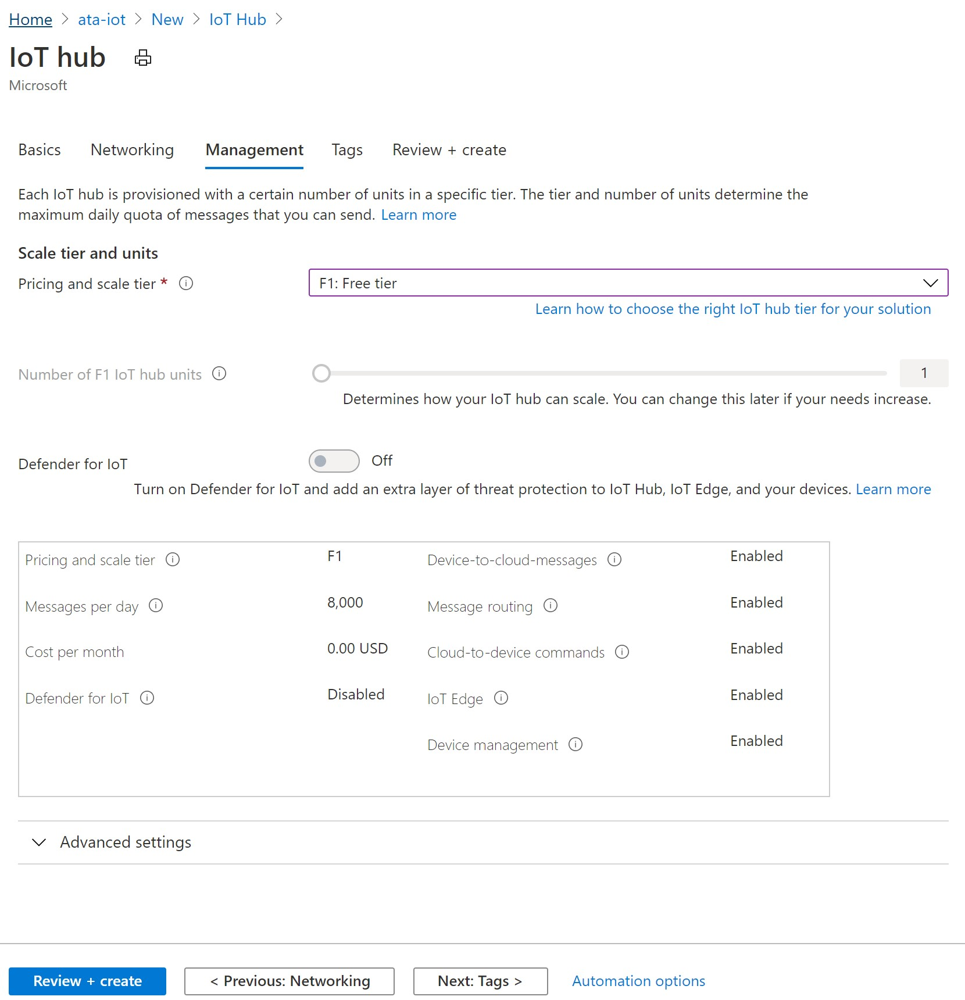
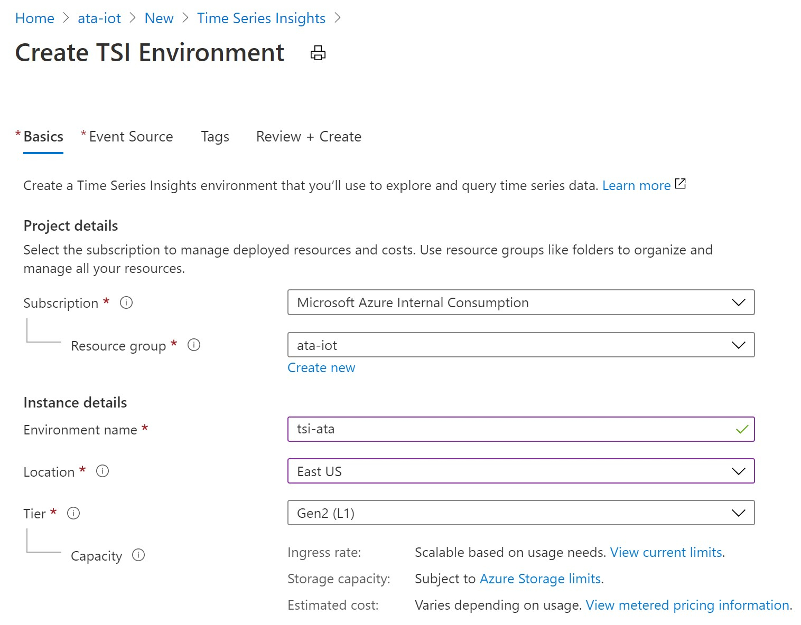
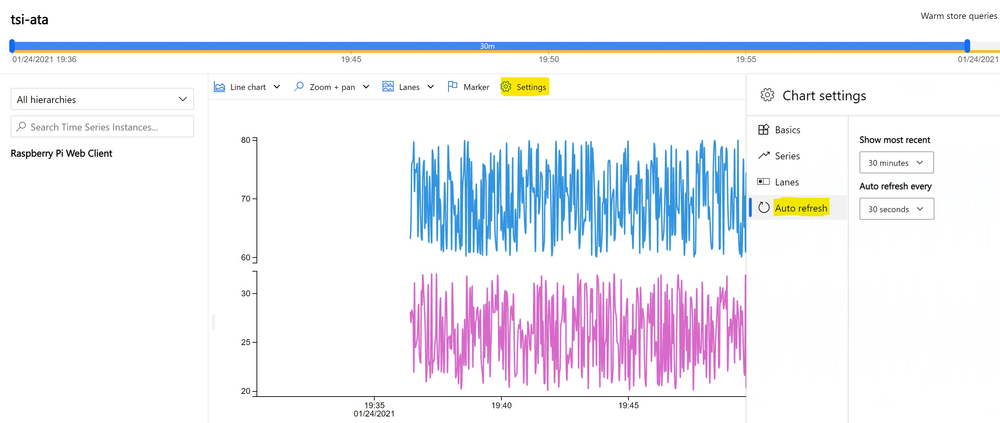
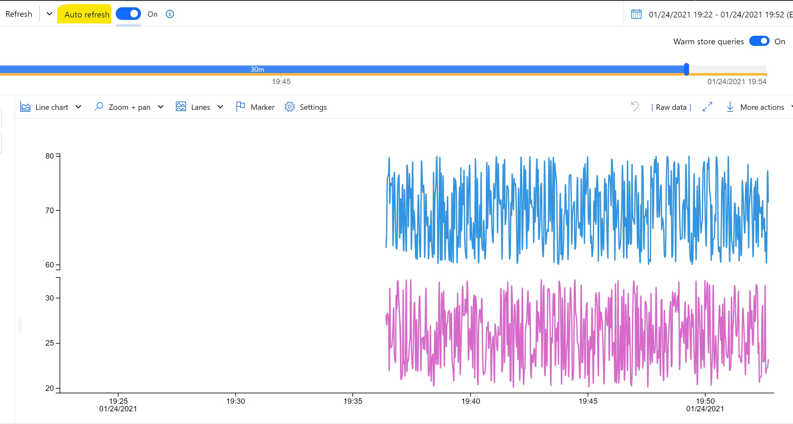
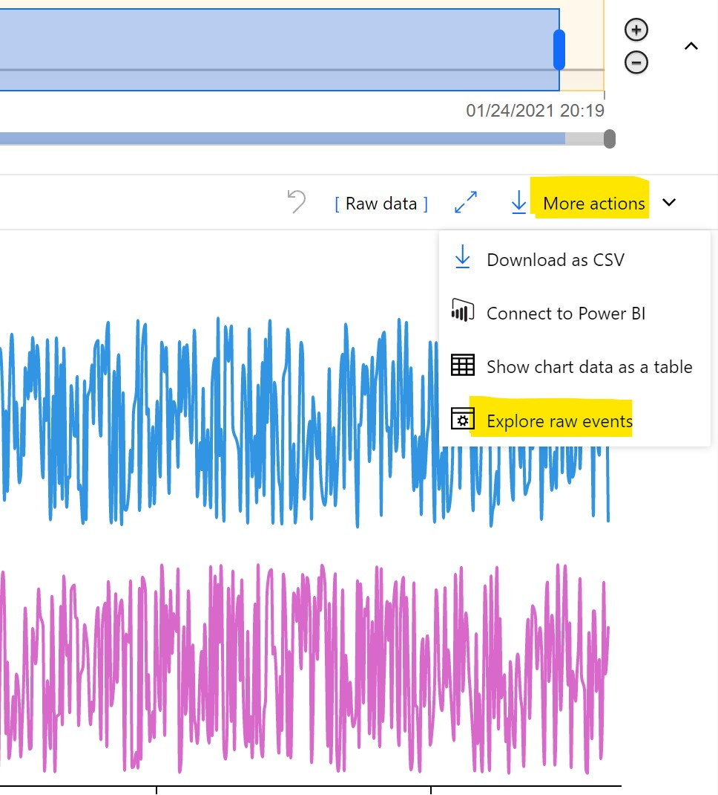
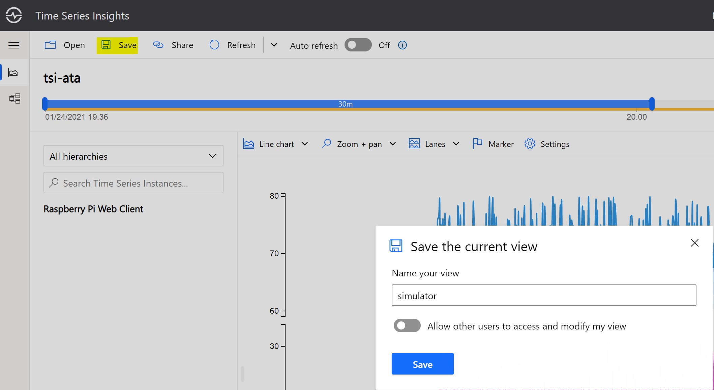

# Azure IoT Lab

## Prerequisites

- Microsoft Azure subscription
- Power BI Pro account (Optional)
- Resource Group to deploy Azure services
- Permissions to create the following resource  
    - IoT Hub
    - Stream Analytics job
    - Time Series Insights
    - Storage Account

## Reference Architecture  
Below is the architecture of the IoT Lab.  

## Step 1: Create a Resource Group
1. In the Azure Portal, search for **Resource Groups**.
2. Click on the **Add** button.
3. Fill out the **Basics** tab as follows:
- **Subscription:** Choose your subscription
- **Resource group:** Provide a unique name like **<initial>-ata-rg
- **Region:** East US

4. Click the **Next: Review + Create** button
5. Click the **Create** button

## Step 2: Deploy the IoT Hub
1. In the Azure Portal, search for **IoT Hub**
2. Click on the **Create** button
3. Fill out the **Basics** tab as follows:
- **Subscription:** Choose your subscription
- **Resource group:** Select the Resource Group you created for this lab
- **Region:** East US
- **IoT hub name:** Choose a unique name for the IoT Hub

4. Fill out the **Management** tab as follows:

- **Pricing and scale tier:** F1: Free tier

5. Click the **Review + create** button
6. Click the **Create** button

## Step 3: Add an IoT device
1. In the Azure Portal, search for the IoT Hub that was created for the lab.
2. From the left menu, click on **IoT devices** under **Exlporers**, then click **+ New**.

3. Create a new device as follows:
- **Device ID:** Choose a unique name for the Device ID
- Leave the default options for the rest of the settings and click the **Save** button.

## Step 4: Connect the IoT device Simulator to the IoT Hub
1. Click on the Device ID of the newly created IoT device and copy the **Primary Connection String**.

2. Go to [Raspberry PI Web Simulator](https://azure-samples.github.io/raspberry-pi-web-simulator/).

3. Replace **Your IoT hub device connection string** with the copied IoT Device Primary Connection String.
 

4. Click **Run** to start to send messages to the IoT Hub.
5. Wait for a few seconds, then verify messages are being sent to the IoT Hub via **Device to cloud messages** metric at the bottom of the **Overview** menu.

## Step 5: Deploy the Stream Analytics job
1. In the Azure Portal, search for **Stream Analytics job**.
2. Click on the **Create** button.
3. Fill out the following then click the **Create** button.
- **Job name:** Choose a unique name for the Stream Analytics job
- **Subscription:** Choose your subscription
- **Resource group:** Select the Resource Group you created for this lab
- **Location:** East US
- **Hosting Environment:** Cloud
- **Streaming units:** 3

## Step 6: Create Input for Stream Analytics job
1. In the Azure Portal, search for the Stream Analytics job that was created for the lab.
2. From the left menu, click on **Inputs** under **Job topology**, then click **+ Add stream input** and select **IoT Hub**.

3. Fill out the following then click the **Save** button.
- **Input alias:** Choose a unique name for the input and check "Select IoT Hub from your subscriptions"
- **Subscription:** Choose your subscription
- **IoT Hub:** Choose the IoT Hub created for this lab
- **Consumer group:** $Default
- **Shared access policy name:** service
- **Endpoint:** Messaging
- **Partition key:** 
- **Event serialization format:** JSON
- **Encoding:** UTF-8

## Step 7: Option 1 - Create Storage Output for Stream Analytics job
1. To create a general-purpose v2 storage account in the Azure portal, follow these steps:
 - On the Azure portal menu, select **All services**. In the list of resources, type **Storage Accounts**. As you begin typing, the list filters based on your input. Select **Storage Accounts**.
 - On the **Storage Accounts** window that appears, choose **Add**.
 - Select the subscription in which to create the storage account.
 - Under the **Resource group** field, select the resource group created for the lab.
 - Next, enter a name for your storage account. The name you choose must be unique across Azure. The name also must be between 3 and 24 characters in length, and can include numbers and lowercase letters only.
 - Select **East US** as location for your storage account.
 - Select **Locally-redundant storage (LRS)** for replication
 - Leave these fields set to their default values:

   |Field  |Value  |
   |---------|---------|
   |Performance     |Standard         |
   |Account kind     |StorageV2 (general-purpose v2)         |
   |Access tier     |Hot         |

 - If you plan to use [Azure Data Lake Storage](https://azure.microsoft.com/services/storage/data-lake-storage/), choose the **Advanced** tab, and then set **Hierarchical namespace** to **Enabled**.
 - Select **Review + Create** to review your storage account settings and create the account.
 - Select **Create**.

2. From the left menu of the Stream Analytics job resource, select **Outputs** under **Job topology**, then click **+ Add** and select **Blob storage/Data Lake Storage Gen2**.

3. Set up the storage output as the following then click on the **Save** button.
- **Output alias**: Choose a unique name for the storage output
- **Subscription:** Choose your subscription
- **Storage account**: The name of the storage account created for this lab
- **Storage account key**: The secret key associated with the storage account
- **Container**: Select Create new and give it a unique name
- **Path pattern**: {date}/{time}
- **Date format**: YYYY/MM/DD
- **Time format**: HH
- **Event serialization format**: Parquet
- **Encoding**: UTF-8
- **Minimum  rows**: 2000
- **Maximum time**: 0 Hours 1 Minutes
- **Authentication mode**: Connection string

## Step 7: Option 2 - Create Power BI Output for Stream Analytics job
1. From the left menu of the Stream Analytics job resource, select **Outputs** under **Job topology**, then click **+ Add** and select **Power BI**.

2. Click on **Authorize** to authorize the connection and provide credentials.

3. Fill out the following then click the **Save** button.
- **Output alias:** Choose a unique name for the Power BI output
- **Group workspace:** Select the workspace that you have permission to access
- **Dataset name:** Choose a unique name for the Power BI output dataset
- **Table name:** Choose a unique name for the Power BI output table
- **Authentication mode:** User token

## Step 8: Edit Query and Start the Stream Analytics job
1. From the left menu, select **Query** under **Job topology**.
2. Edit the query by replacing **YourOutputAlias** and **YourInputAlias** with the values you defined and click on **Save query**.

3. From the left menu, click on **Start** under **Overview** and click on **Start** button at the bottom of the Start job menu.

## Step 9: Deploy the Time Series Insights
1. In the Azure Portal, search for **Time Series Insights**.
2. Click on the **Create** button.
3. Fill out the **Basics** tab as follows:
- **Subscription:** Choose your subscription
- **Resource group:** Select the Resource Group you created for this lab
- **Environment name:** Choose a unique name for the Time Series Insights
- **Location:** East US
- **Tier:** Gen2 (L1)
- **Property name:** deviceId
- **Storage account name:** Choose a unique name for the storage account
- **Storage account kind:** StorageV2 (general purpose V2)
- **Storage account replication:** Locally redundant storage (LRS)

4. Leave the rest as default and click the **Next: Event Source** button.
5. Fill out **Event Source** tab as follows:
- **Create an event source:** Yes
- **Source Type:** IoT Hub
- **Name:** Choose a unique name for the Event Source
- **Subscription:** Choose your subscription
- **IoT Hub name:** Select the IoT Hub you created for this lab
- **IoT Hub access policy name:** service
- **IoT Hub consumer group:** click on **New** button to create a new consumer group, give it a name then click on **Add** button

6. Click the **Review + create** button.
7. Click the **Create** button.

## Step 10: Explore Time Series Insights
1. In the Azure Portal, search for the created Time Series Insights name.
2. Go to Time Series Insights Explorer by clicking on **Go to TSI Explorer** under **Overview** menu.

3. Add measures to the chart by clicking on the deviceId **Raspberry Pi Web Client**, select **humidity** and **temperature** from the drop down, then click on **Add**.

4. Change chart settings for **Auto refresh** to Show most recent 30 minutes and Auto refresh every 30 seconds.

5. Turn on Auto refresh

6. Explore raw events by clicking on **More actions** and select **Explore raw events**

7. Save the view by cicking on **Save** and give the view a name.

## Step 11: Option 1 - Verify parquet files are being added to the storage account

## Step 11: Option 2 - Create Power BI Dashboard
1. Go to [powerbi.com](https://powerbi.microsoft.com/en-us/) and sign in with your work or school account. If the Stream Analytics job query outputs results, you will see that your dataset is already created.

2. In your workspace, click **+ New** to create a dashboard.

3. Create a new dashboard and give it a unique name.

4. At the top of the window click **Edit** and select **Add tile**, select **Custom Streaming Data** under REAL-TIME DATA, then click **Next**.

5. Under **YOUR DATSETS**, select your dataset and then click **Next**.

6. Add a custom streaming data tile, select the following:
- **Visualization Type:** Line chart
- **Axis:** EventProcessedUtcTime
- **Values:** temperature
- **Time window to display:** Last 1 Minutues

7. Click **Next**.
8. Fill in tile details like a **Title**.

9. Click **Apply**.
10. Follow the steps again to add a tile (starting with step 4). This time, do the following:
- **Visualization Type:** Line chart
- **Axis:** EventProcessedUtcTime
- **Values:** humidity
- **Time window to display:** Last 1 Minutues

11. Click **Next**, add a title, and click **Apply**.
The Power BI dashboard now gives you two views of data about temperature and humidity as detected in the streaming data.

