# Hands-on lab to Migrate SQL database to Azure (step-by-step)

## Overview
It is a common need among all compnaies to move databases to the cloud. Azure provide options such as SQL on Azure VM, Azure SQL PaaS DB, Azure SQL Managed Instance. Please refer to this [documentation](https://docs.microsoft.com/en-us/azure/azure-sql/azure-sql-iaas-vs-paas-what-is-overview) for selecting the appropriate type of Azure SQL database option to migrate your SQL workloads.

## Labs:
- [Lab-1: Restore On-premises SQL Database to an Azure VM](#lab-1-estore-on-premises-sql-atabase-to-an-azure-vm) 

- [Lab-2: Migrate SQL 2012 Database to Azure SQL PaaS Database](#lab-2-migrate-sql-2012-database-to-azure-sql-paas-database) 

- [Lab-3: Adding Data Security to your databases](#lab-3-adding-data-security-to-your-databases)


## Lab-1: Restore On-premises SQL Database to an Azure VM
This hands-on lab will provide an experience to restore an on-premises database to Azure VM.
### Tasks:
- [Task-1: Create a Virutal Machine with 2012 SQL database](#task-1-create-a-virutal-machine-with-2012-sql-database) 
- [Task-2: Restore a sample database AdventureWorks from a backup](#task-2-restore-a-sample-database-adventureworks-from-a-backup) 

### Task-1: Create a Virutal Machine with 2012 SQL database
1. Navigate to the [Azure portal](https://portal.azure.com) and select **Resource groups** from the Azure services list.

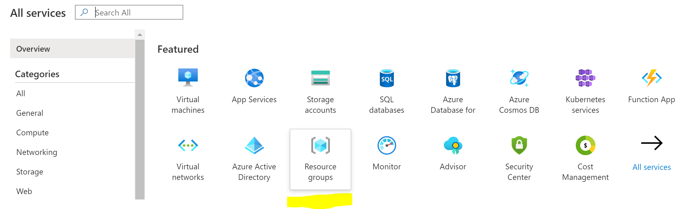

2. Create a **Resource group** by selecting 'add'.
- Enter 'ata-sql-lab-<name>' as the Resource group.
- Select 'East US' as the Region.
- Click on 'Review + Create' button.
- Make sure the validation is passed before clicking on 'Create' button.


- Select 'goto resource' to access the resource group you just created.

3. Create a Virutal Machine. 
- Select 'add' from the resource group and search for 'SQL Server 2012 SP4'
- Click on 'Create'

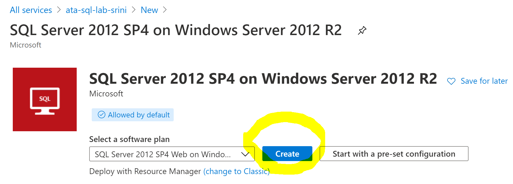

4. Enter the following configuration info:
- Make sure you have selected the correct resource group
- Virtual machine name:'ata-sql-2012-your-initials'
- Region: 'East US'
- Size: Standard_DS12_V2-4 vcpus, 28 Gib Memory(DropDown Selection)
- Username: AzureUser (Keep the Default)
- Password: Atasql2012user (Use this to avoid password issues)
- Select inbound ports: RDP(3389) (We need this to access this VM remotely)

5. Enter the SQL Server User Configuration.
- Click on 'SQL Server settings' tab.
- Select SQL Authentication. 
- Enter SQL Login name:'sqladmin'.
- Enter password:'Atasql2012admin'.


- Rest are default options.
- Click on 'Review + create' button.


- Make sure you have a green check for the **validation passed** and Click on **Create** button.
- Wait till your deployment is complete and you should see 'Go To Resource' button.

### Task-2: Restore a sample database AdventureWorks from a backup

1. Access the Virtual Machine (VM) from your environment.
- Select 'Go to resource' to access Virtual Machine server config
- Select 'Connect' and 'RDP' 
- Click on 'Download RDP File'
- Click on 'Connect'

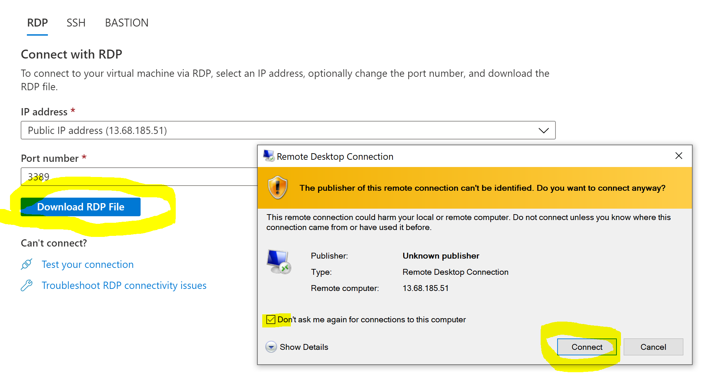

- 'Enter your credentials popup'
- Select 'Use a different account'
- Enter user name as 'azureuser'
- Enter the password ('Atasql2012user')


2. Modify Internet Security to download software.
- Open 'Server Manager' if not open.
- Select 'Local Server'.
- Find 'IE Enhanced Security Configuration' and Turn 'Off'.
- It is not recommended but to avoid internet issues in the lab. Please turn 'On' after the download.

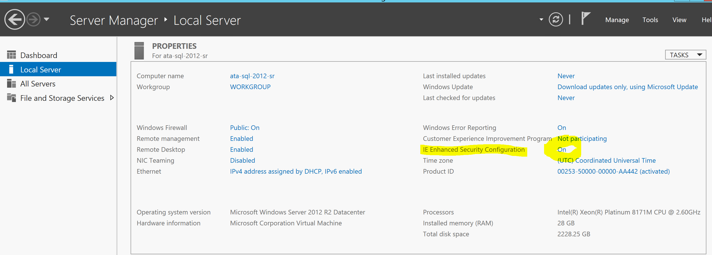

3. Download the AdventureWorks, a sample database for SQL 2012.
- Open Internet Explorer browser and access the [SQL 2012 Backup](https://github.com/Microsoft/sql-server-samples/releases/tag/adventureworks) location.
- Select 'AdventureWorks2012.bak' under "AdventureWorks (OLTP) full database backups" section.

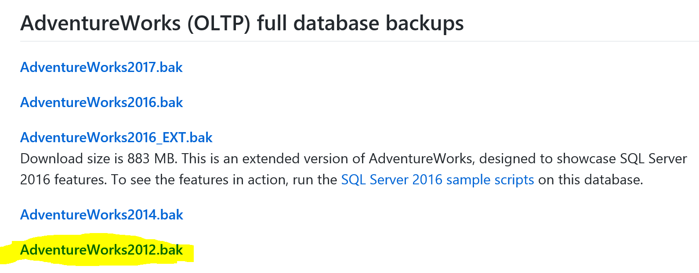

- Save the backup file to local 'c:\Data' folder (Create a new folder).

4. Open SQL Server Management Studio and restore the database.
- Search for 'SQL Server Management Studio' on the desktop.
- Connect to SQL Server with 'sqladmin' login.
- Select 'database' folder and right click to select 'Restore database' option.


- Select 'Device', '...', 'File', 'C:\data Folder' and 'AdventureWorks2012.bak' file.

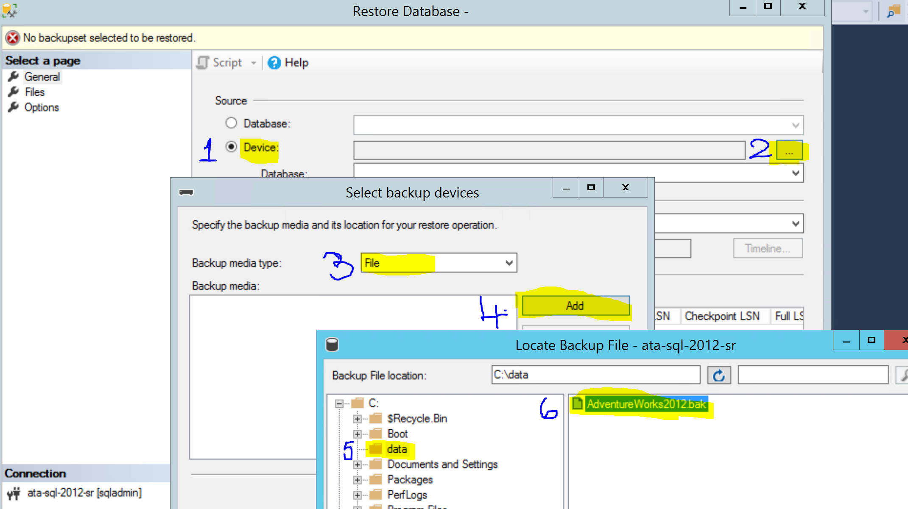

- Click 'OK' three times to start the backup process.

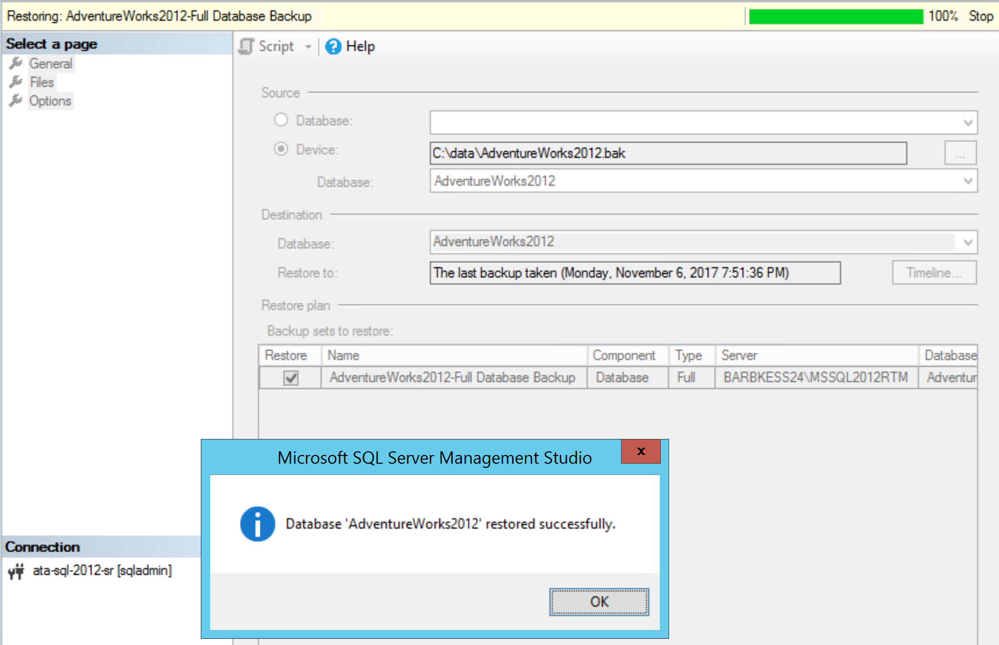

- Expand 'Database'|'AdventureWorks2012'|'Tables'|'HumanResources.employee' table |'Select Top 1000 Rows'.


- Execute the query.
- You have restored the database successfully!

## Lab-2: Migrate SQL 2012 Database to Azure SQL PaaS Database
This hands-on lab will provide an experience to migrate 2012 SQL database to Azure PaaS SQL database using Data Migration Assistant. You can use the same lab to migrate other versions of the Microsoft SQL database also.

You should have a copy of the database backup to complete this exercise. Please follow lab-1 if you don't have one.
### Tasks:
- [Task-3: Create Azure SQL PaaS Database](#task-3-create-azure-sql-paas-database) 
- [Task-4: Install Data Migration Assistant](#task-4-install-data-migration-assistant) 
- [Task-5: Migrate SQL 2012 Schema to Azure SQL PaaS Database](#task-5-migrate-sql-2012-schema-to-azure-sql-paas-database) 
- [Task-6: Migrate SQL 2012 Table Data to Azure SQL DB using DMA](#task-6-migrate-sql-2012-table-data-to-azure-sql-db-using-dma)

### Task-3: Create Azure SQL PaaS Database

1. Open Portal to create SQL PaaS Database.

- Type 'SQL Databases' on the search bar to select the service.
- Select 'Add' to create a new database.
- Select Resource Group
- Enter Database name: 'ata-sql-2012-migrate-<name>'
- Server: Click on 'Create new'
- Enter Server name: 'ata-sql-server-srini'
- Enter Server admin: login: 'azuresqladmin'
- Enter password: 'Atasql2012admin'
- Location: 'East US'
- Click on 'OK' button
- Click on 'Review + create' button
- Click on 'Create' button


- You will see 'Deployment underway screen'

 

- You will see 'Deployment complete' after few minutes
- You are successfully created Azure SQL (PaaS) Database

### Task-4: Install Data Migration Assistant

- We need to evaluate if we can migrate SQL 2012 database to Azure SQL.
- Data Migration Assistant is available to assess the migration.This tool will provide a report about any feature parity and compatibility issues between the on-premises database and the Azure SQL DB service.

1. Open up your SQL 2012 VM and Open a browser to download 'Microsoft Data Migration Assistant' using [this link](https://www.microsoft.com/en-us/download/details.aspx?id=53595).
- Run the install with the default options.


- At the end check the box to launch the Data Migration Assistant (DMA)
2. In the DMA dialog, select + from the left-hand menu to create a new project.


3. Provide the following details and click on 'Create'
- **Project type**: Select **Assessment**.
- **Project name**: Enter `ata-sql2012db-azure-sql`
- **Assessment type**: Select **Database Engine**.
- **Source server type**: Select **SQL Server**.
- **Target server type**: Select **Azure SQL Database**.

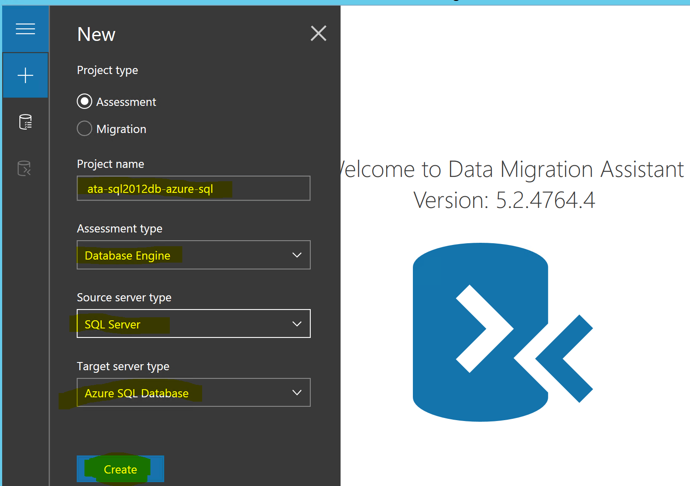

4. On the **Options** screen, ensure **Check database compatibility** and **Check feature parity** are both checked, and then select **Next**.


5. On the **Sources** screen, enter the following into the **Connect to a server** dialog that appears on the right-hand side:
- **Server name**: Select **SQLSERVER2008**.
- **Authentication type**: Select **SQL Server Authentication**.
- **Username**: Enter `ata-sql-2012-sr`
- **Password**: Enter `atasql2012admin`
- **Encrypt connection**: Uncheck this box.
- **Trust server certificate**: Uncheck this box.

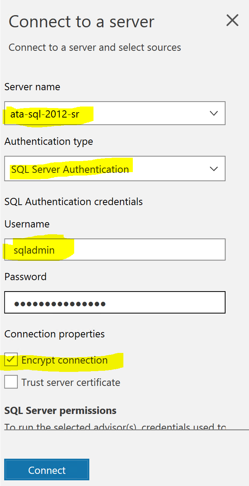

- Select Connect
6. Next you will see 'Add sources' dialog screen, check the box for 'AdventureWorks12' and select Add.


7. Select 'Start Assessment' 


8. Analyze the feature parity issues with the possible migration

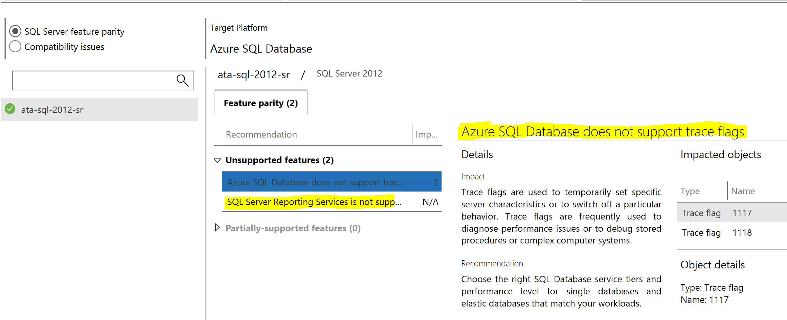

9. Analyze the compatibility issues with the possible migration.

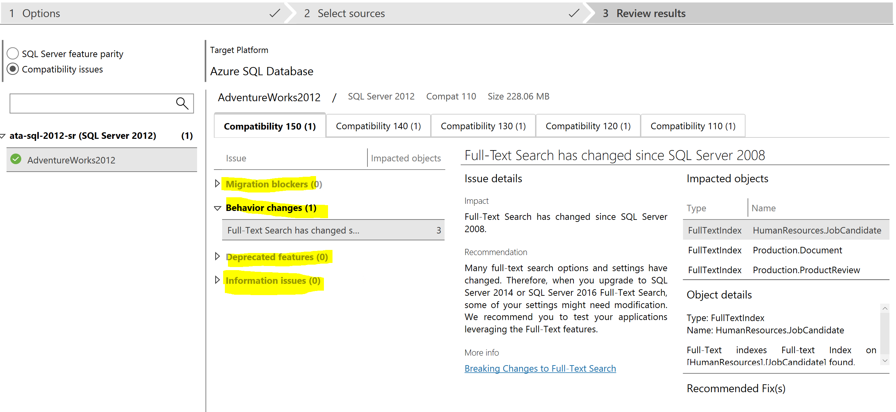

10. Store the assessment to share with your internal teams and Azure Teams.

### Task-5: Migrate SQL 2012 Schema to Azure SQL PaaS Database

1. Select new to create a migration project
2. Enter the following:
- Project type: Select **Migration**
- Project name: Enter 'Migrate-schema-sql2012-AzureSQL'
- Source server type: Select **SQL Server**
- Target server type: Select **Azure SQL Database**
- Migration scope: Select **Schema only**
- Click on **Create**


3. Enter the source database info
- Server name: Enter Your Server Name
- Authentication type: Select **SQL Server Authentication**
- Username: Enter 'sqladmin'
- Password: Enter 'Atasql2012admin'
- Encrypt connection: Uncheck the box
- Trust server certificate: Uncheck the box
- Click on 'Connect'


- Select the 'AdventureWorks2012' database
- Click on 'Next' button
4. Provide the target datbase info
- Get the Azure SQL DB Server name from the Azure Portal 

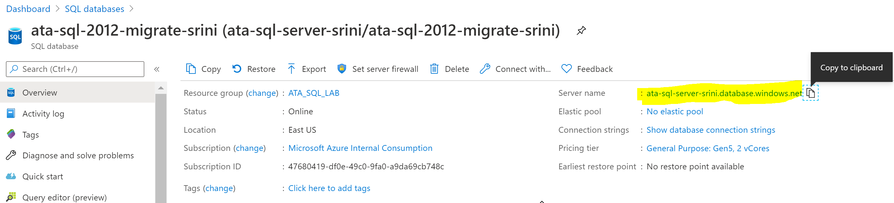

- Allow SQL 2012 VM access to Azure SQL Database
- Get the SQL 2012 VM IP address from the portal

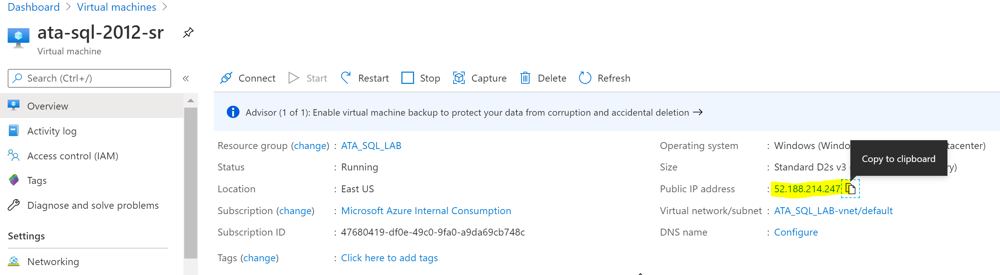

- Select Azure SQL DB server
- Select **Show firewall settings**
- Create a firewall rule to allow the 2012 SQL server client IP
- Enter the SQL 2012 VM IP address as the Start and End IP Range. You are giving access to only one server.


- Enter the Azure SQL DB database info
- Server Name: Paste the name from the portal
- Authentication type: Select **SQL Server Authentication**
- Username: Enter 'azuresqladmin'
- Password: Enter 'Atasql2012admin'
- Encrypt connection: uncheck the box
- Trust server certificate: uncheck the box
- Click on 'Connect'
- Select the database and click on **Next**


5. Select Objects for migration
- Check all the boxes for migration
- Click on **Generate SQL Script**

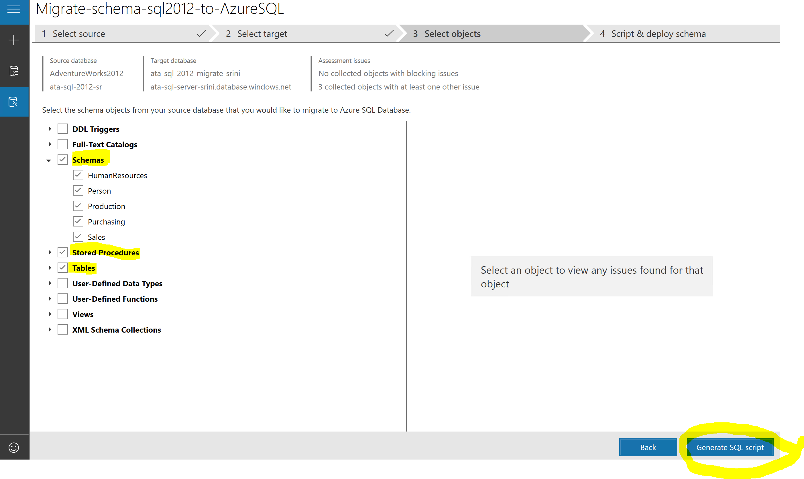

6. Verify the tables and schema in Azure SQL DB.
- Search for SQL Databases and select the database.
- Select **Query editor**.

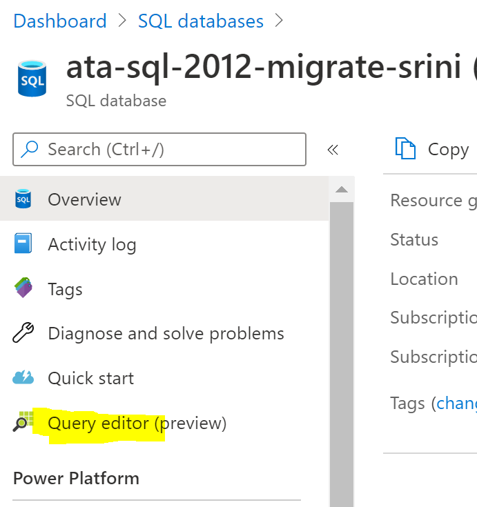

- Enter the password
- Expand Tables & Schema and verify everything is empty


7. Deploy Schema 
- Save the SQL script for reference
- Click on **Deploy schma**


8. Wait till it complete its run. Verify errors.

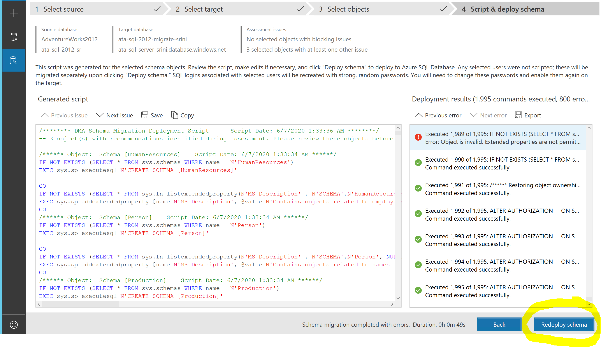

9. Verify the table creation in Azure SQL DB.
- Access the Azure SQL DB 
- Select the **Query editor**
- Expand the **Tables**
- Run a query to see if you have any data


9. You are successfully migrated the SQL 2012 DB schema to Azure SQL DB.

### Task-6: Migrate SQL 2012 Table Data to Azure SQL DB using DMA

1. Create a new migration for migrating the data to Azure SQL DB.
2. Enter the following info:
- Project type: Select **Migration**
- Project name: Enter 'ata-sql2012-to-AzureSQLDB-Data'
- Source server type: **SQL Server**
- Targent server type: **Azure SQL Database**
- Migration scope: **Data only**
- Click on **Create**


3. Provide the source and the target database info. Same info used in the Schema migrate task.

4. Select **Next** to reach 'Select Tables' section

5. Make sure all the tables were selected and click on **Start data migration**


6. Watch the data migration progress and monitor the warnings and errors list.

7. Make sure it successfully migrated the data to all tables.


8. Verify the data in Azure SQL DB
- Search for 'SQL Databases' and Access you Azure SQL DB.
- Select the 'Query Editor' and enter the username and password
- Select HumanResources.Employee table and select top 1000 row option. You will see all the data in the table. Verify few other tables.


9. Congratulations!! You successfully migrated the SQL 2012 database to Azure SQL PaaS Database. Pat yourself on your back!! Great Job!!

10. You can migrate 1000's of databases using powershell scripts. Please reach us if you need help on this. 

## Lab-3: Adding Data Security to your databases
- In this exercise, you enable [Dynamic Data Masking (DDM)](https://docs.microsoft.com/azure/sql-database/sql-database-dynamic-data-masking-get-started) on credit card numbers in the Azure SQL database. DDM limits sensitive data exposure by masking it to non-privileged users. This feature helps prevent unauthorized access to sensitive data by enabling customers to designate how much of the sensitive data to reveal with minimal impact on the application layer. It is a policy-based security feature that hides the sensitive data in the result set of a query over designated database fields, while the data in the database is not changed.

### Task 1: Enable DDM on credit card numbers
 In this task, you will protect the Create Card information by enabling DDM on the `CardNumber` field in the `CreditCard` table. DDM prevents queries against that table from returning the full credit card number.

1. Access your Azure SQL database in the Azure Portal.
- Select Query Editor from the laft pane. 

2. Expand **Tables** and locate the `Sales.CreditCard` table. Expand the table columns and observe that there is a column named `CardNumber`. Right-click the table, and choose **Select Top 1000 Rows** from the context menu.


3. Execute the query, review the Results, including the `CardNumber` field. Notice it is displayed in plain text, making the data available to anyone with access to query the database.


4. To be able to test the mask being applied to the `CardNumber` field, you first create a user in the database to use for testing the masked field. In the Query Editor, select **New Query** and paste the following SQL script into the new query window:

   ```sql
   CREATE USER DDMUser WITHOUT LOGIN;
   GRANT SELECT ON [Sales].[CreditCard] TO DDMUser;
   ```

   > The SQL script above creates a new user in the database named `DDMUser`, and grants that user `SELECT` rights on the `Sales.CreditCard` table.


5. Select **Run** from the Query Editor toolbar to execute the query. You will get a message that the commands completed successfully in the Messages pane.

6. With the new user created, run a quick query to observe the results. Select **New Query** again, and paste the following into the new query window.

   ```sql
   EXECUTE AS USER = 'DDMUser';
   SELECT * FROM [Sales].[CreditCard];
   REVERT;
   ```

7. Select **Run** from the toolbar and examine the Results pane. Notice the credit card number, as above, is visible in plain text.


8. You now apply DDM on the `CardNumber` field to prevent it from being viewed in query results. Select **New Query** from the QueryEditor toolbar and paste the following query into the query window to apply a mask to the `CardNumber` field, and select **Run**.

   ```sql

   ALTER TABLE [Sales].[CreditCard]
   ALTER COLUMN [CardNumber] NVARCHAR(25) MASKED WITH (FUNCTION = 'partial(0,"xxx-xxx-xxx-",4)')
   ```

9. Run the `SELECT` query you opened in step 6 above again, and observe the results. Specifically, inspect the output in the `CardNumber` field. For reference, the query is below.

    ```sql

    EXECUTE AS USER = 'DDMUser';
    SELECT * FROM [Sales].[CreditCard];
    REVERT;
    ```


- The `CardNumber` is now displayed using the mask applied to it, so only the last four digits of the card number are visible. Dynamic Data Masking is a powerful feature that enables you to prevent unauthorized users from viewing sensitive or restricted information. It's a policy-based security feature that hides the sensitive data in the result set of a query over designated database fields, while the data in the database is not changed.

### Task 2: Apply DDM to email addresses
In this task, you use one of the built-in functions for making email addresses using DDM to help protect this information.

1. For this, you target the `LoginEmail` field in the `[Person].[EmailAddress]` table. Open a new query window and execute the following script:

    ```sql

    SELECT TOP (1000) * FROM [Person].[EmailAddress]
    ```


2. Now, as you did above, grant the `DDMUser` `SELECT` rights on the [Person].[EmailAddress]. In a new query window and enter the following script, and then select **Run**:

   ```sql
 
   GRANT SELECT ON [Person].[EmailAddress] to DDMUser;
   ```

3. Next, apply DDM on the `EmailAddress` field to prevent it from being viewed in full in query results. Select **New Query** from the QueryEditor toolbar and paste the following query into the query window to apply a mask to the `EmailAddress` field, and then select **Run**.

   ```sql

   ALTER TABLE [Person].[EmailAddress]
   ALTER COLUMN [EmailAddress] NVARCHAR(250) MASKED WITH (FUNCTION = 'Email()');
   ```

   > **Note**: Observe the use of the built-in `Email()` masking function above. This is one of several pre-defined masks available in SQL Server databases.
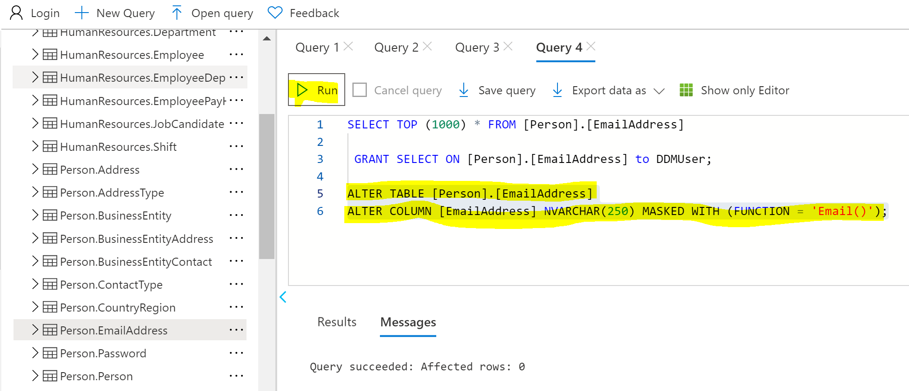

4. Run the `SELECT` query below, and observe the results. Specifically, inspect the output in the `EmailAddress` field. For reference, the query is below.

    ```sql
    
    EXECUTE AS USER = 'DDMUser';
    SELECT TOP (1000) * FROM [Person].[EmailAddress];
    REVERT;
    ```


5. Congratulations! You are successfully masked the PII (Personally Identifiable Information) data!!
