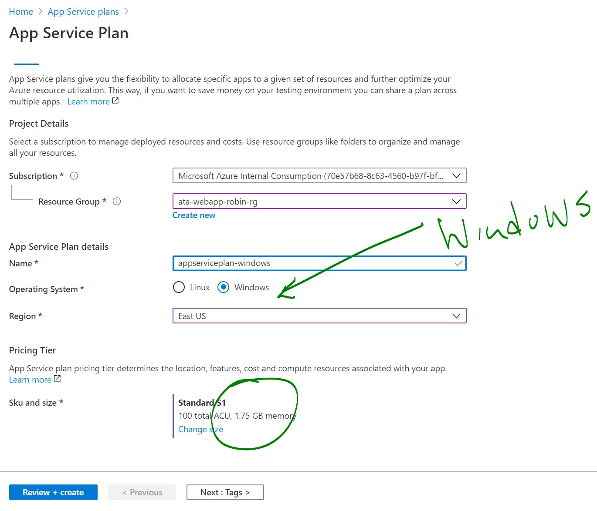
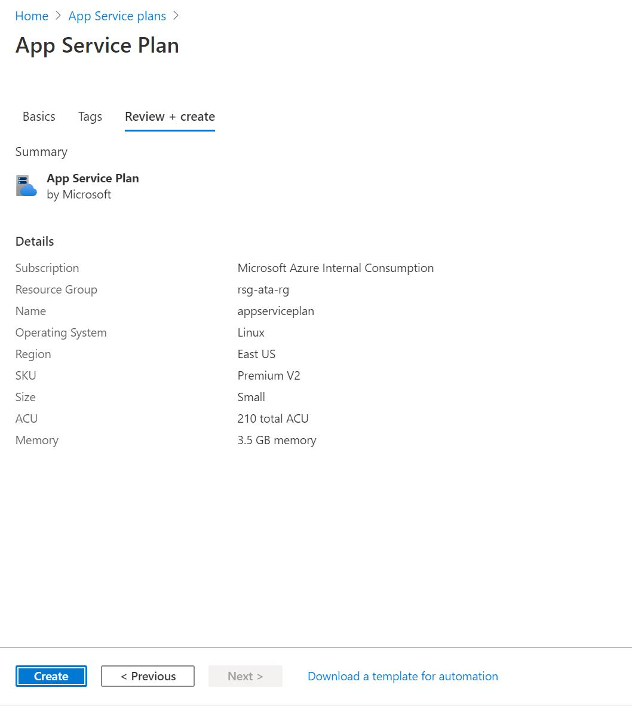
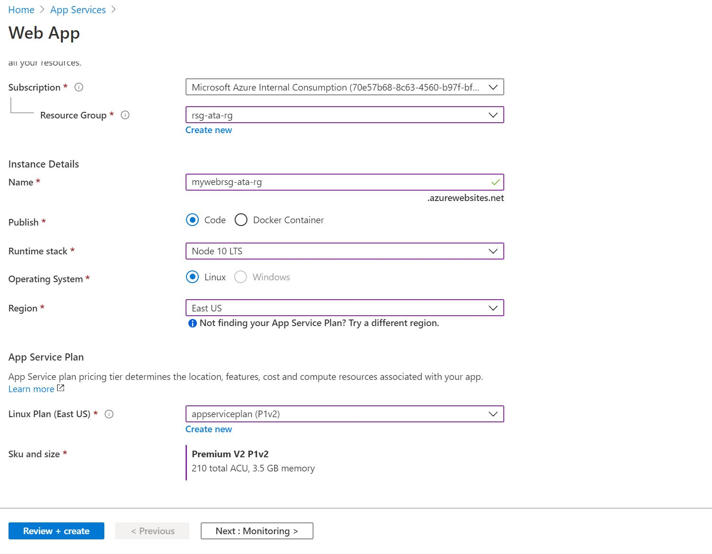
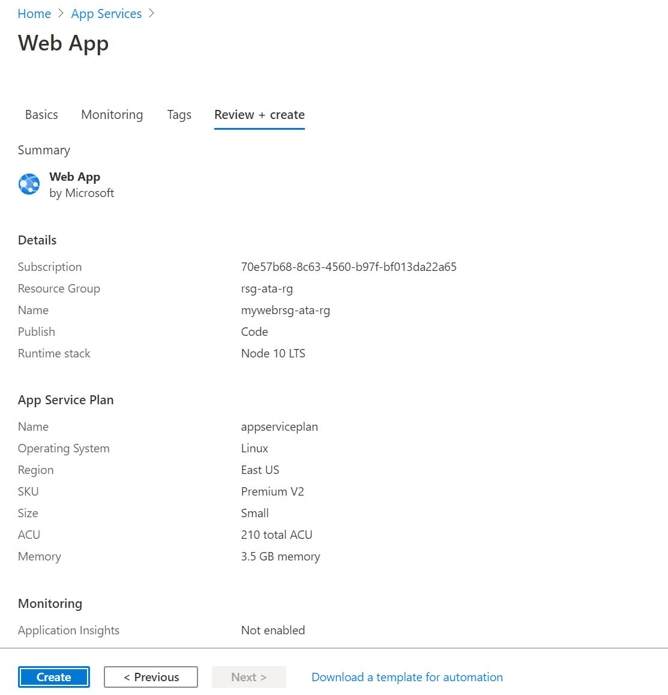
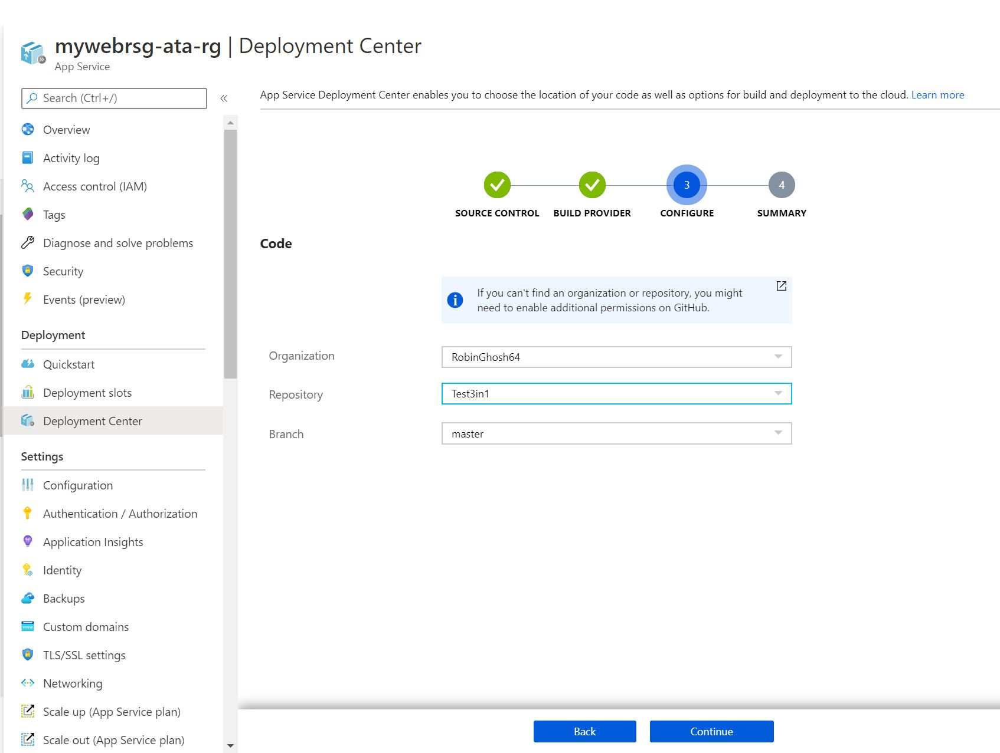
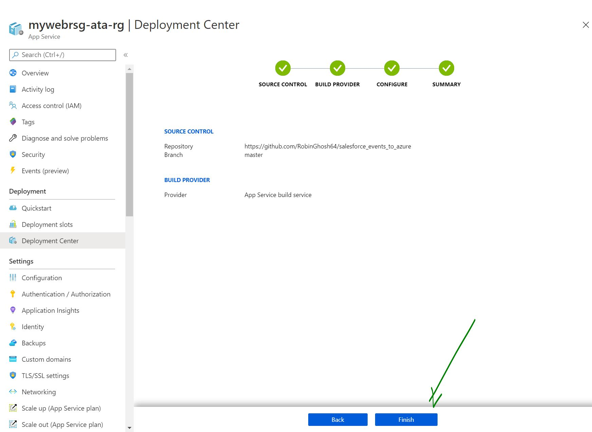
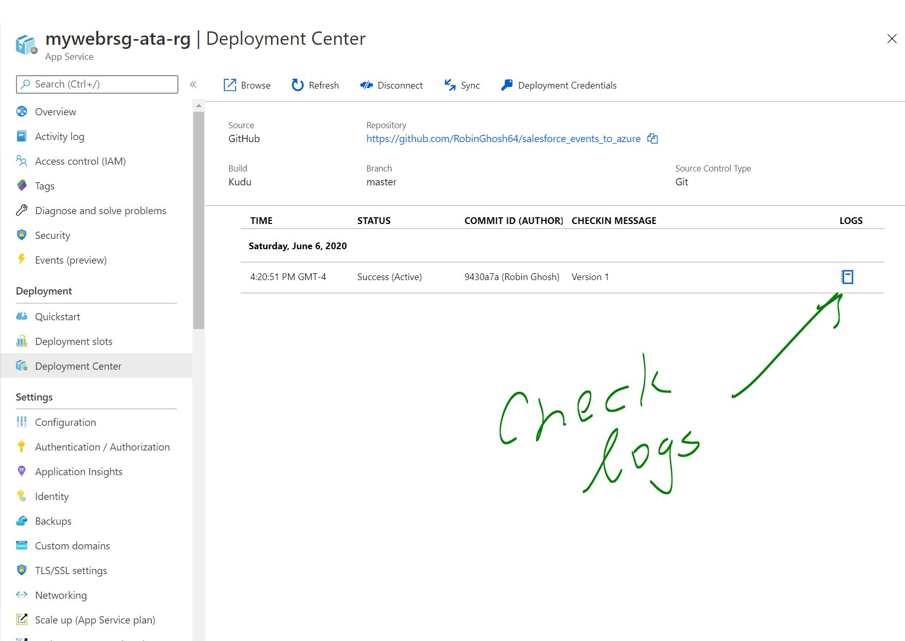
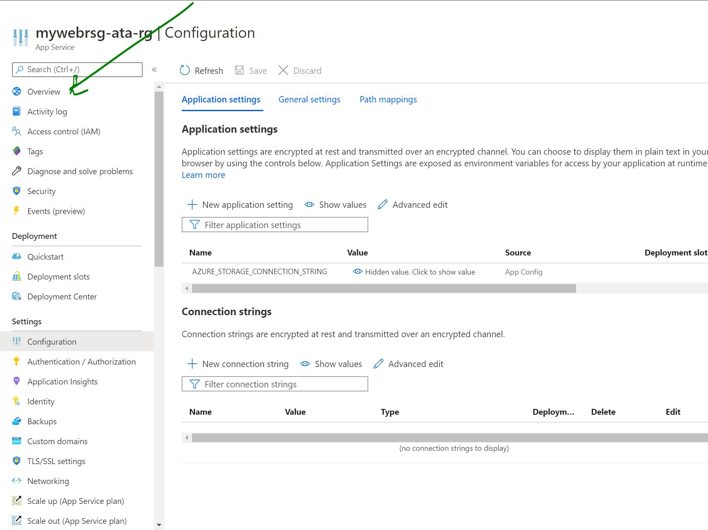

# Azure WebApps Lab  (Robin Ghosh)

## Prerequisites

- Microsoft Azure subscription
- 
- Resource Group to deploy Azure services
- Permissions to create the following resource  
    - App Service Plan
    - Blob Storage

## Step 1: Create a Resource Group
1. In the Azure Portal, search for **Resource Groups**
2. Click on the **Add** button
3. Fill out the **Basics** tab as follows:
- **Subscription:** Choose your subscription
- **Resource group:** Provide a unique name like **<initial>-ata-rg
- **Region:** EastUS

  

4. Click the **Next: Review + Create** button
5. Click the **Create** button

## Step 2: Create a App Service Plan
1. In the Azure Portal, search for **App Service Plan**
2. Click on the **Create** button
3. Fill out the **Basics** tab as follows:
- **Subscription:** Choose your subscription
- **Resource group:** Select the Resource Group you created for this lab
- **Region:** East US
- **App Servie Name:** Choose a unique name for the App Service
- **Pricing tier:** Premium V2

4. Click the **Review + create** button

5. Click the **Create** button

6. You now ended up creating a App Service Plan. One App Service Plan can hold many App Services/Web Services and Apps.

## Step 3: Add a Web App using your App Service Plan
1. In the Azure Portal, search for **App Services**
2. From the left menu, click on **App Services** under **Explorers**, then click **+ Add**

3. Fill out the **Basics** tab as follows:
- **Subscription:** Choose your subscription
- **Resource group:** Select the Resource Group you created for this lab
- **Region:** East US
- **Name:** Choose a unique name for the Web App
- **Publish** Code
- **Runtime Stack:** Select the Resource Group you created for this lab
- **Operating System:** East US
- **App Service Plan:** Select the App Service Plan created earlier

4. Click the **Review + create** button

5. Click the **Create** button

You should see a progress bar and underway screen

This screen will transition to deployed 

## Step 4: Go to your newly created Web App
1. In the Azure Portal, search for **App Services**
2. From the left menu, click on **App Services** under **Explorers**, find your webapp and then click ** on your new web app**
   OR
   You have an option to go through the top Notifications and select **Deployment Succeeded** message and click on **Go to resource**
   
3. You should be on the new web app:

4. Find the  URL of your web application on the right. Click on it.

  
   
  5. Make sure you see a Happy Page by clicking on the **url link of the web app**

  YEAH  YOU SHOULD BE PROUD YOU CREATED A SAMPLE WEB SITE
  
  
## Step 5: What we have now is a sample web application that got deployed by Microsoft. We need to deploy our application
          
           
1. In the Azure Portal, search for **App Services**
2. From the list of App Services select your find your webapp and then click select **your new web app**
 
3. You should be on the new web app:

4. Select **Deployment** on the left blade and then click on  **Deployment Center**

5. Select the **Github** thumbnail
6. Click on **Continue** 

7. Select **Kudu** option thumbnail
8. Click on **Continue**

8. Select **Repo Name** , **Branch**
9. Click on **Continue**

9. Click the **Finish** button

10. Click the **xxx** button

Make sure your logs show signs for a good deployment

## Step 6: Our application got deployed. Let's proceed to set the configurations variables so that it can connect to either SQL Server, BLOB storage or SalesForce resource

1. Go back and again Select our web application  
3. You should be back on your new web app

4. Go down on your left to the  **Settings** section, then  click on  **Configuration**

5. You should see options to different web settings

6. Select and Click on **Application Settings**

7. Click on **New App Settings**
87. Add all the config parameters as specified in the LABS.
   Make sure you are adding the BLOB variable called AZURE_STORAGE_CONNECTION_STRING
    

9. When finished with all, click on the **SAVE** button on the top panel

10. You should see a message stating 'Updating the Web app'

## Step 7: Our App Service has restarted. Hopefully, taken the settings update. Let's go to our Web App

1. Go back to you App Service by selecting the **Overview** on the left blade

12. Make sure your app shows

12. Click on **URL**

13. Make sure you see the connected message in your Web App.

Blob Storage: Success

   YEAH. Great job!

