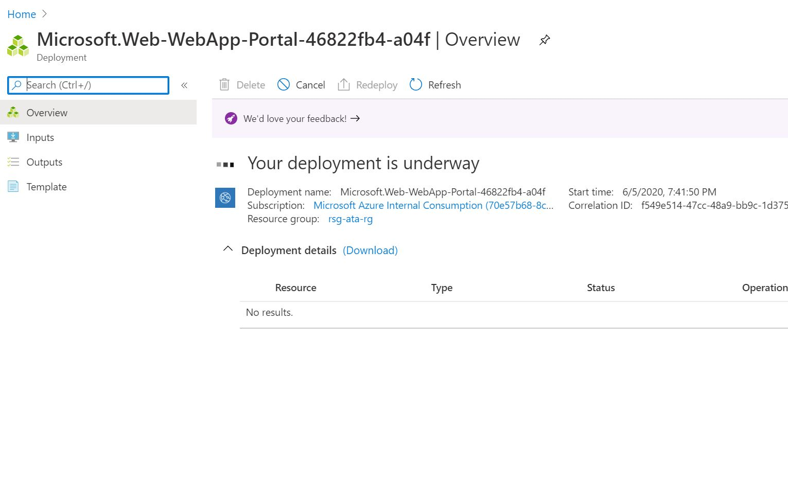
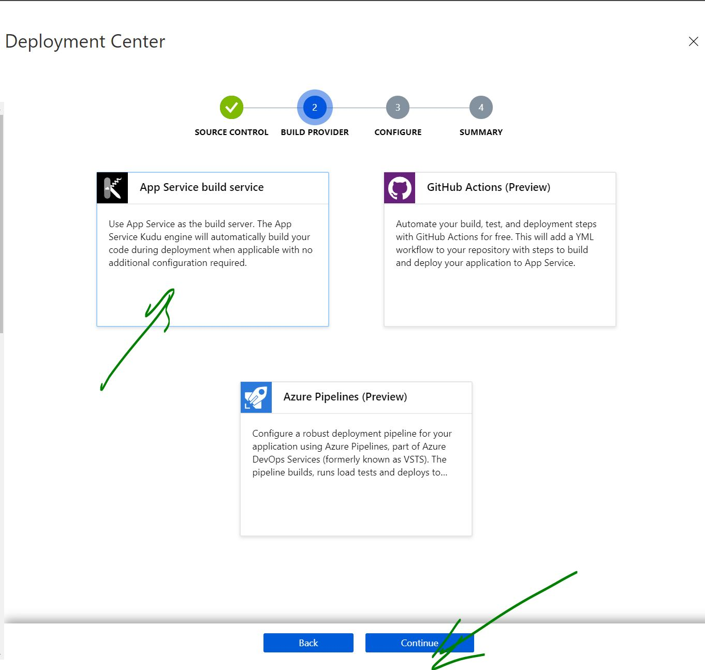
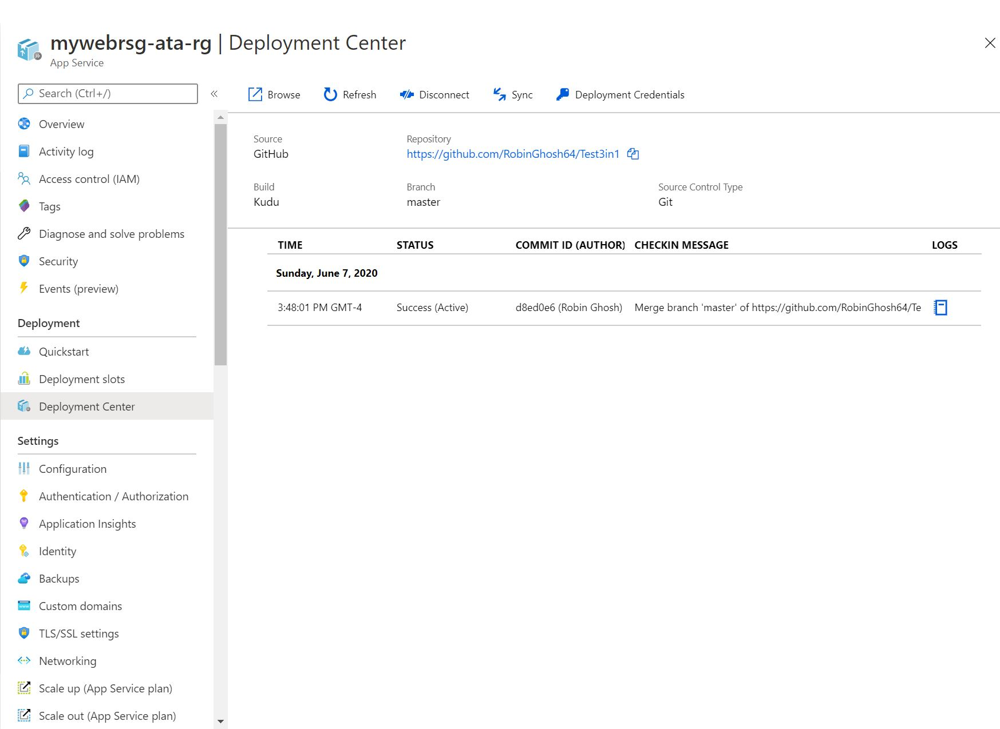

# Azure WebApps Lab  (Robin Ghosh)

## Prerequisites

- Microsoft Azure subscription
- Resource Group to deploy Azure services
- Permissions to create the following resource  
    - App Service Plan
    - Blob Storage

## Step 1: Create a Resource Group
1. In the Azure Portal, search for **Resource Groups**
2. Click on the **Add** button
3. Fill out the **Basics** tab as follows:
- **Subscription:** Choose your subscription
- **Resource group:** Provide a unique name like **<initial>-ata-rg
- **Region:** EastUS

  

4. Click the **Next: Review + Create** button
5. Click the **Create** button

## Step 2: Create a App Service Plan
1. In the Azure Portal, search for **App Service Plan**
2. Click on the **Create** button
3. Fill out the **Basics** tab as follows:
- **Subscription:** Choose your subscription
- **Resource group:** Select the Resource Group you created for this lab
- **Region:** East US
- **App Servie Name:** Choose a unique name for the App Service
- **Pricing tier:** Premium V2

4. Click the **Review + create** button

5. Click the **Create** button

6. You now ended up creating a App Service Plan. One App Service Plan can hold many App Services/Web Services and Apps.

## Step 3: Add a Web App using your App Service Plan
1. In the Azure Portal, search for **App Services**
2. From the left menu, click on **App Services** under **Explorers**, then click **+ Add**

3. Fill out the **Basics** tab as follows:
- **Subscription:** Choose your subscription
- **Resource group:** Select the Resource Group you created for this lab
- **Region:** East US
- **Name:** Choose a unique name for the Web App
- **Publish:** Code
- **Runtime Stack:** Choose NodeJS 10 LTS
- **Operating System:** Choose Linux
- **App Service Plan:** Select the App Service Plan created earlier

4. Click the **Review + create** button

5. Click the **Create** button

You should see a deployment screen with progress bar and a message **Your deployment is underway..**

This screen will transition to .. **Your deployment was successful..**.  There was no need to wait on this page, you could be doing something else on our portal and come back at a later time

6. If everything was okay, you just successfully created a new 'App Service'. 

## Step 4: Go to your newly created Web App
1. In the Azure Portal, search for **App Services**
2. From the left menu, click on **App Services** under **Explorers**, find your app service and then click **on your new app service**
   OR
   You also have another option to go through the top **Notifications** button and select **Deployment Succeeded** message and click on **Go to resource**
   
3. You should be on the new app service

4. Now locate the **URL** section on the top right section and then Click on the **url link of the web site/web app** 
   This is your website, a sample starter one from Microsoft

  
   
5. Make sure you see a web page and based on the Runtime selected, it should greet you with **Hello, Node developer.** 
  Had you selected Java it would have greeted you wuth **Hello, Java Developer.**
 

 6. CONGRATULATIONS !! YOU JUST CREATED A WEB APPLICATION ON AZURE CLOUD
  
  
## Step 5: What we have now is a sample web application that got deployed by Microsoft. Lets deploy our actual application!
          
           
1. In the Azure Portal, search for **App Services**
2. From the list of App Services select your find your webapp and then click select **your new app service**
 
3. You should be on the new app service

4. Find the **Deployment** section on the left blade and then Click on  **Deployment Center**

5. We are in the CI/CD section of the your code deployment.  
   Our plan is to deploy from https://github.com/RobinGhosh64/Test3in1.git sample repository provided in your lab.
   Select the **Github** thumbnail
    
6. Then Click on **Continue** 

7. Select Kudu **K App Service** option thumbnail
8. Click on **Continue**

9. Select **Repo Name** , **Branch**
10. Click the **Continue** button

11. Click the **Finish** button

12. Click the **log** button

Make sure your logs show signs for a good deployment

## Step 6: Our application got deployed. Let's proceed to set the configurations variables so that it can connect to either SQL Server, BLOB storage or SalesForce resource

1. Go back and again Select our web application  
3. You should be back on your new web app

4. Go down on your left to the  **Settings** section, then  click on  **Configuration**

5. You should see options to different web settings

6. Select and Click on **Application Settings**

7. Click on **New application Setting**

8. Add all the configuration parameters needed by your application. Make sure as your adding the list get's updated.
   Make sure you are adding the BLOB config. variable called AZURE_STORAGE_CONNECTION_STRING. This is a mandatory for our LAB.
    

9. When finished with all, click on the **SAVE** button on the top panel

10. You should see a message stating 'Updating the Web app'

## Step 7: Our App Service has restarted. Hopefully, taken the settings update. Let's go to our Web App

1. Go back to you App Service by selecting the **Overview** on the left blade

2. Click on **URL**

3. Make sure you web applications renders and shows the connected message in your Web App.

**Blob Storage: Success**

  CONGRATULATIONS. Great job you have finished the LAB successfully!

