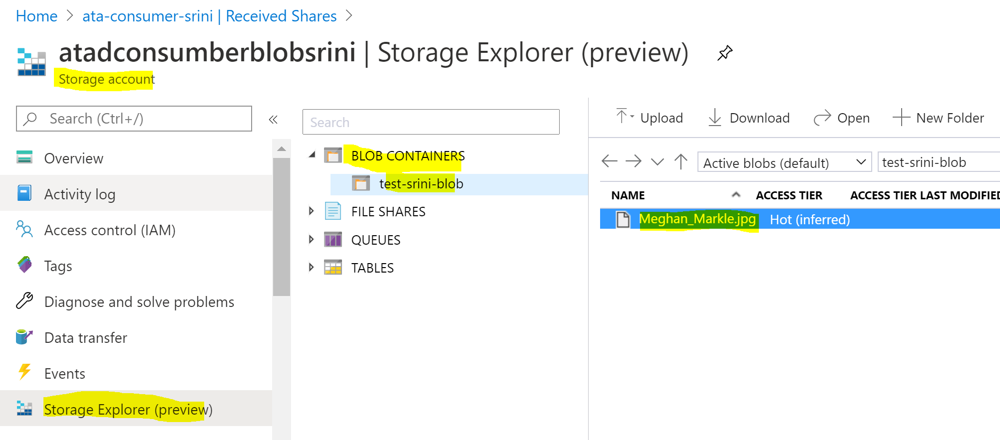
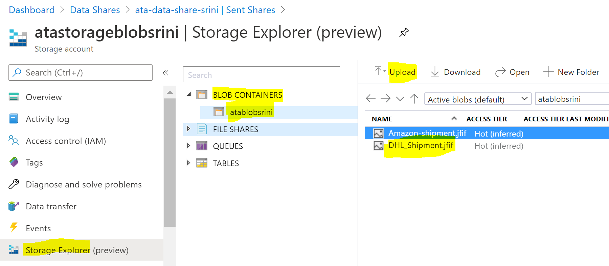
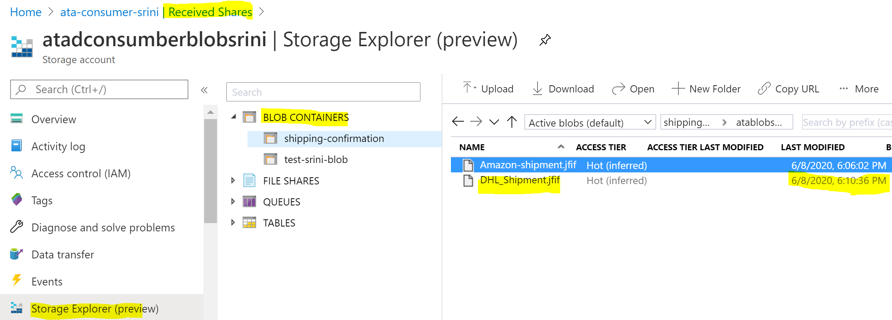

# Azure Trailblazer Academy Azure Storage Lab
## Overview
## Store Data in Azure
Blob storage is optimized for storing massive amounts of unstructured data. Unstructured data is data that doesn't adhere to a particular data model or definition, such as text or binary data. Azure Data Lake Storage Gen2 (ADLSGen2) offers a hierarchical file system as well as the advantages of Blob storage for Big Data Hadoop needs.
### Labs:
- [Lab-1: How to load backup files into Blob Storage?](#lab-1-how-to-load-backup-files-into-blob-storage)
- [Lab-2: How to load structure and unstructured files into Data Lake Storage?](#lab-2-how-to-load-structure-and-unstructured-files-into-data-lake-Storage)

## Sharing Files between the organizations
Share structured and unstructured data from multiple Azure data stores with other organizations in just a few clicks. There’s no infrastructure to set up or manage, no SAS keys are required, and sharing is all code-free. You control data access and set terms of use aligned with your enterprise policies. Use snapshot-based sharing to copy data from the data provider, or use in-place sharing to refer to data in the provider’s account.
### Labs:
- [Lab-3: How to share Files between the organizations?](#lab-3-how-to-share-files-between-the-organizations)

## Lab-1: How to load backup files into Blob Storage? 
- this lab will provide an experience to load database backup, file system image files and log files to the blob storage in Azure. This is very essential to the day to day business operations.   
### Tasks:
- [Task-1: Create Storage account](#Task-1-create-storage-account)
- [Task-2: Create a container](#task-2-create-a-container)
- [Task-3: Upload image file to Blob container](#task-3-upload-image-files-to-blob-container)

### Task-1: Create Storage account
1. Login to Azure Portal (https://portal.azure.com) 
- Select "create a resource".
- select "Storage accounts" service. 
- Click on 'create' button.

2. Create a new resource group.
- Select 'Create new' under 'Resource group' section. 
- Enter "ata-storage-lab-\<YourName\>-rg"
    
    
3. Enter the following information.
- Storage account name: Enter 'atastorageblob\<YourName\>' 
- Location: Select 'East US' as the region
- Leave defaults for the rest
- Select 'Review + create' button.
- Make sure you have completed all the entries high lighted in the diagram. It completes the validation checks.
    
    
4. Select 'Create' button. 
- Make sure you have the green check mark next to 'Validation Passed'. You are good to create the blob storage! Hit the 
- Click on 'Create' button. 
- Wait till you see 'Your deployment is complete'.
- Select 'go to resource' button when you see it.

    

### Task-2: Create a container

1. Select the 'containers' link from the available storage options in the middle of the page.

    
2. Create a new container.
- Select the 'plus' sign next to container to add a new container
- 'New container' window pops up and enter the name 'atablob-\<yourname\>'

    

### Task-3: Upload image files to Blob container
1. Access Storage Explorer.
- Select the 'Storage Explorer(preview)' from the left blade.
- Select the created blob container.
- Select upload button.
- Browse the local data and upload an image.

     

- You have successfully created the blob storage and uploaded the image files!!

## Lab-2: How to load structure and unstructured files into Data Lake Storage?
- This lab provides an experience to load structured and unstructured data files into the data lake store for big data analysis. This provides advantage over Hadoop systems by seperating the storage from compute while providing a better durability without having to store 3 copies of the same data.   
- [Step-1: Create Azure Data Lake Storage Gen2](#step-1-create-azure-data-lake-storage-gen2)
- [Step-2: Create a container](#step-2-create-a-container)
- [Step-3: Upload a folder to the Datalake](#step-3-pload-a-folder-to-the-datalake)

### Step-1: Create Azure Data Lake Storage Gen2
1. Login to Azure Portal (https://portal.azure.com). 
- Select "create a resource" and select "Storage accounts" service. 
- Click on 'create' button.

2. Enter the following Information to create the Data Lake Storage
- Resouce group: Select "ata-storage-lab-Name-rg". 
- Storage account name: Enter 'atastorageADLSGen2\<yourname\>' format.
- Location: Select 'East US' as the region.
- Leave defaults for the rest.
- Select the 'Networking' button.
- Make sure you have completed all the entries high lighted in the diagram. All the above steps are similar to the blob storage creation but you need select 'Networking' to turn on the hierarchical feature.

    

3. Networking Options: 
- Leave the defaults and select the 'Advanced' button 
- Advanced Options:
- Enable the 'hierarchical' option under ADLSGen2 option and select 'Review + Create' button.
    
    

4. Select 'Create' button. 
- Make sure you have the green check mark next to 'Validation Passed'. You are good to create the Data Lake Storage! 
- Click on the 'Create' button. 

- Wait till you see 'Your deployment is complete'.
- Select 'go to resource' button when you see it.

    

### Step-2: Create a container
1 Select the 'containers' link from the available storage options in the middle of the page.

    
2. Create a new container.
- Select the 'plus' sign next to container to add a new container.
- 'New container' window popsup and enter the name 'adlsgen2filesystem\<YourName\>'.

    

### Step-3: Upload a folder to the Datalake
1. Access Storage Explorer in the storage service. 
- Select the 'Storage Explorer(preview)' from the left blade.
- Select the created blob container.
- Select upload button.
- It will prompt you to download Storage Explorer.

2. Install Storage Explorer.
- Install the Storage Explorer on your system.
- Access the Datalake Storage you just created.

3. Upload the data files.
- Browse the local folder and upload all the files.

    
4. You have successfully uploaded the structured and unstructured data files into the Azure data lake for big data analysis!

## Lab-3: How to share Files between the organizations?

### Architecture

### Prerequisites
- Two Azure Subscriptions (Company and Personal).
- Recipient's Azure login e-mail address
- Storage Account
- Permission to write to storage account for the Shared Service (Contributor Role)
- Permission to add role assignment to storage account for the Shared Service (Owner Role) 

## Part-1: Set up Data Share to consume by partners
### Task-1: Create data share service
1. Login to Azure Portal (https://portal.azure.com). 
- Select "create a resource" and select "Data Share" service.
- Click on 'create' button.

2. Create Data Share.
- Enter the following information.
- Resource Group: Select 'ata-storage-lab-\<YourName\>-rg" from the dropdown
- Location: Select "US East" region
- Name: ata-data-share-(YourName)
- Click on "Review+Create" button

3. Initiate Create Data Share process.
- Make sure you get a green check mark next to "Validation Passed". 
- Click on "Create" button to initiate the creation process.
- Verify Deployment completion.
- Make sure you get a confirmation saying "Deployment is complete".
- You will see "Go to Resource" button when it is done.
- Click to "Go to Resource" to access the Data Share you just created.

### Task-2: Add Data Sets to the data share
1. access the data share service
- Select 'Start Sharing your data' from the left blade

- Select + sign next to 'Create' 

2. Enter Sent Share Details:
- Share name:"ata-sent-shipping-scans-(YourName)"
- Shape type: Snapshot (default)
- Description: "Sharing Shipping Scan images with partners"
- Terms of use" "Update hourly"
- Click on Continue

3. Provide Dataset Details
- Select Datasets Tab:
- Set the snapshot schedule
- Activate the snapshots
<imp src="./images/DataShare-Source-set-snapshots.PNG" alt="set snapshot" Height="300">
4. Click on "Add Datasets" button
- Select blob storage as the data type
- Click on "next"

- Select the resource group
- Select the blob storage account
- Select the container
- Click on "next"

- Enter Dataset Name as "ata-shipping-image-share"
- Click on "Add Dataset".
  Displays the created data set.
- Click on "Continue"

### Task-3: Add Recipient to the data share
1. Select Recipients Tab:
- Click on "Add Recipient" 
- Enter your personal email address
- Click on Continue

- Ignore Snapshot schedule and click on "Continue"
- Click on Create 

- Creates sent share 

- Your Azure Data Share has now been created and the recipient of your Data Share is now ready to accept your invitation.

## Part-2: Consume Data Share as a Partner

### Task-1: Login and create a resource group
- Login with your personal email address
- Create a resource group
- Select Resource Groups from the top left menu
- Add a resource group by selecting + sign next to 'Add'
- Enter 'ata-datashare-consumer-(YourName)'
- Select 'East US' as the Region
- Click on 'Review + create' button
- Click 'Create' 

### Task-2: Create Storage Destination
- Type 'Storage accounts' in the search bar
- Add storage account by selecting + sign next to 'Add'
- Resource group: 'ata-datashare-consumer-(YourName)'
- Storage account Name: atadconsumberblob(YourName)
- Location: East US
- Default Option for Rest
- Click on 'Review + create'

- Click on 'Create' When you a green check mark

### Task-3: Accept Data Share invitation
- Search for Data Share Invitations

- Select the invitation
 

### Task-4: Create Data Share Account
- Check mark to Agree Terms
- Select the resource group
- Create a new Data Share

- Click on 'Accept & Configure'

### Task-5 Add Contributor Role to Blob Storage
- Select the storage account
- Select 'Access control (IAM)' from the left blade
- Select 'Add' to add a role
- Brings up 'Add role Assignment' window
- Select 'contributor' role from the dropdown
- Select the data share by typing its name
- Click on 'Save'

### Task-6 Map Data Share to blob storage target
- Access the Data Share by typing ' Data Share' in the Search bar
- Select the data share
- Select 'Received Shares' from the left blade
- select Share
- Select 'Details' tab
- Check the box to select the share to map 
- Select 'Map to Target' 

- Brings up 'Map datasets to target' screen
- Target data type: Azure Blob Storage
- Subscriptions: Select Yours
- Resource groups: Select Yours
- Storage accounts: Select Blob Storage
- Container Name:'shipimages'
- Click on 'Map to Target'

- Completes the mapping process

### Task-7: Enable Snapshot Schedule
- Select Received Shares
- Select 'Snapshot Schedule' tab
- Check the box to select the schedule
- Click on Enable 

### Task-8: Trigger Full Copy Snapshot
- Select Details tab
- Select 'Full Copy' from the 'Trigger snapshot' dropdown

- You should see 'Queued' as the 'last run status'
- Wait till you see 'Succeeded' with a green check mark as the 'Last run status'.

### Task-9 Access the shared data
- Select Datasets tab
- Scroll to the right most to see 'PATH' for the dataset.
- click on the dataset path (link) to access the storage.

- It takes you to the blob storage account.
- You can verify the shared data under blob container.

### Task-10 Upload additional data to the source storage
- Acess the Source Data Share 
- Select 'Sent Shares' and 'DataSets' tab
- Click on the blob storage path
- Select the Storage Explorer and access the container 
- Upload another image to the source blob container

### Task-11 Trigger Incremental Copy Snapshot
- Select Details Tab
- Select 'Incremental Copy' from the 'Trigger snapshot' dropdown
- You should see 'Queued' as the 'last run status'
- Wait till you see 'Succeeded' with a green check mark as the 'last run status'
- Select Datasets tab
- Click on the dataset path to access the storage.
- Access the blob container and verify the incremental load

- You have successfully consumed the full and incremental shared data from your partner! Congratulations!
- You can use this data to build business analytics, PowerBI reports, Machine Learning Models etc.

