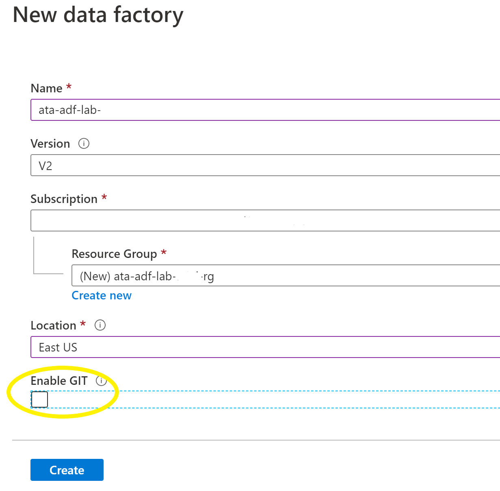

# Azure Trailblazer Academy Azure Data Factory (ADF) Lab
## Overview
Azure Data Factory is the PaaS cloud-based ETL & data integration tool allows you to create data driven workflows in the cloud for orchestrating and automating data movement and data transformation. 

Big data requires service that can orchestrate and operationalize processes to refine these enormous stores of raw data into actionable business insights.

## Lab Overview
This lab will help you gain the experience to ingest data from on-premises databases such as Oracle, SAP, Teradata, Hortonworks, DB2, SQL Server and Cloudera. It will showcase the steps to build a pipeline inside ADF to ingest the data into ADLS GEN2 storage and secure the PII data using data transformation functions inside the Data Flow activity and finally store the data in Synapse SQL Pool (Data warehouse) for building BI dashboard.  

## Pre-requisites:
- 1. Write Access to Azure Data Lake Storage Account (ADLS Gen2)
- 2. Read Access to Sample HR schema in Oracle Database
- 3. Write Access to Synapse SQL Pool Data warehouse  

## Automated Deployment
Press the "*Deploy to Azure*" button below, to provision the Azure Services required required for this lab.

## Task List:
- [Task-1: Create Azure Data Factory Service](#task-1-create-azure-data-factory-service)
- [Task-2: Create linked services](#task-2-create-linked-services)
- [Task-3: Create Data Sets](#task-3-create-date-sets) 
- [Task-4: Create Activity to move the data from the source to target](#task-4-create-activity-to-move-the-data-from-the-source-to-target)
- [Task-5: Create Data Transformation Flow](#task-5-create-data-transformation-flow)
- [Task-6: Build a pipeline to connect activities](#task-6-build-a-pipeline-to-connect-activities)
- [Task-7: Trigger the pipeline execution](#task-7-trigger-the-pipeline-execution) 

### Task-1: Create Azure Data Factory Service
- type 'Data factories' in the search bar 
- select 'Data factories' and select 'add' to create the service
- Provide the following info: 
- Name: 'ata-adf-lab-\<yourname\>'
- Subscription: Make sure it selected the correct subscription
- Select 'Create new' under 'Resource Group' and enter 'ata-adf-lab-\<yourname\>'
- Location: select 'East US'
- Enable GIT: uncheck the box
- Click on 'Create' button  

- select 'Go to resource' when it completes the deployment
- select 'Author & Monitor' in the middle of the screen

- opens up a new tab introducing the drag and drop interface to build pipelines

