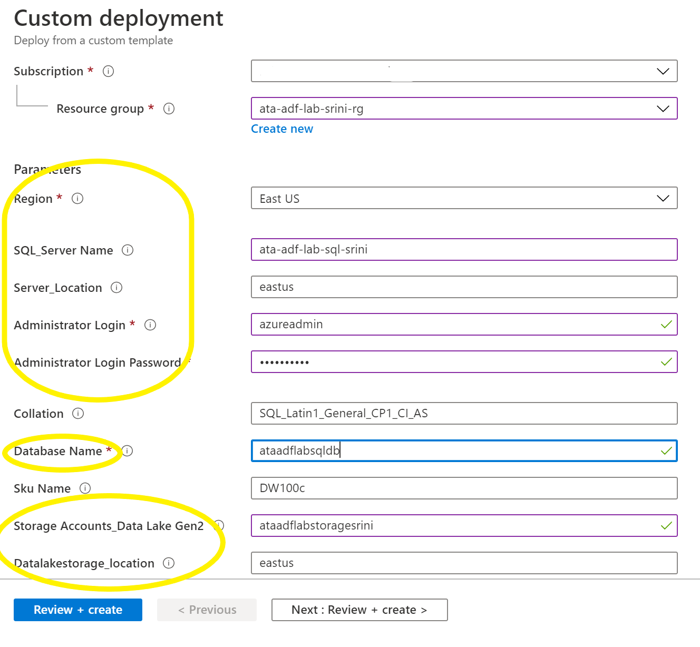
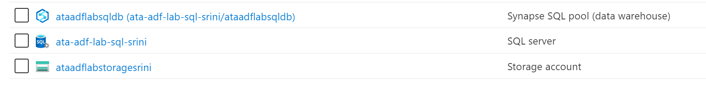
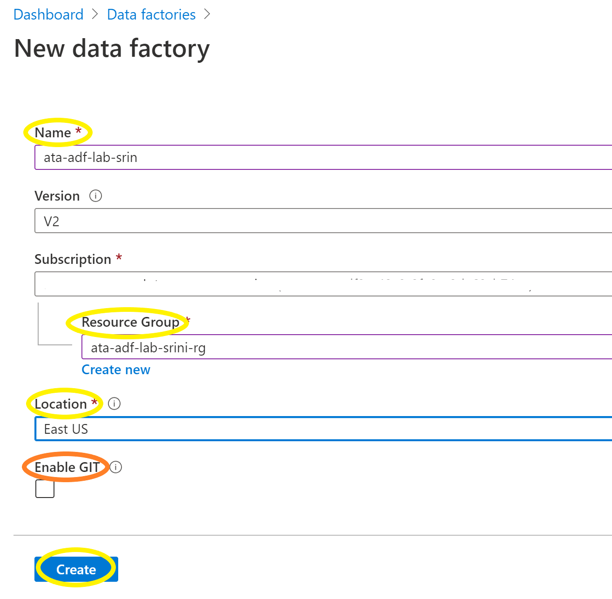
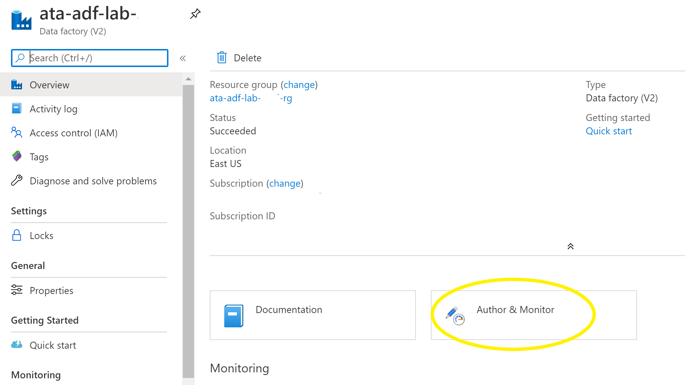
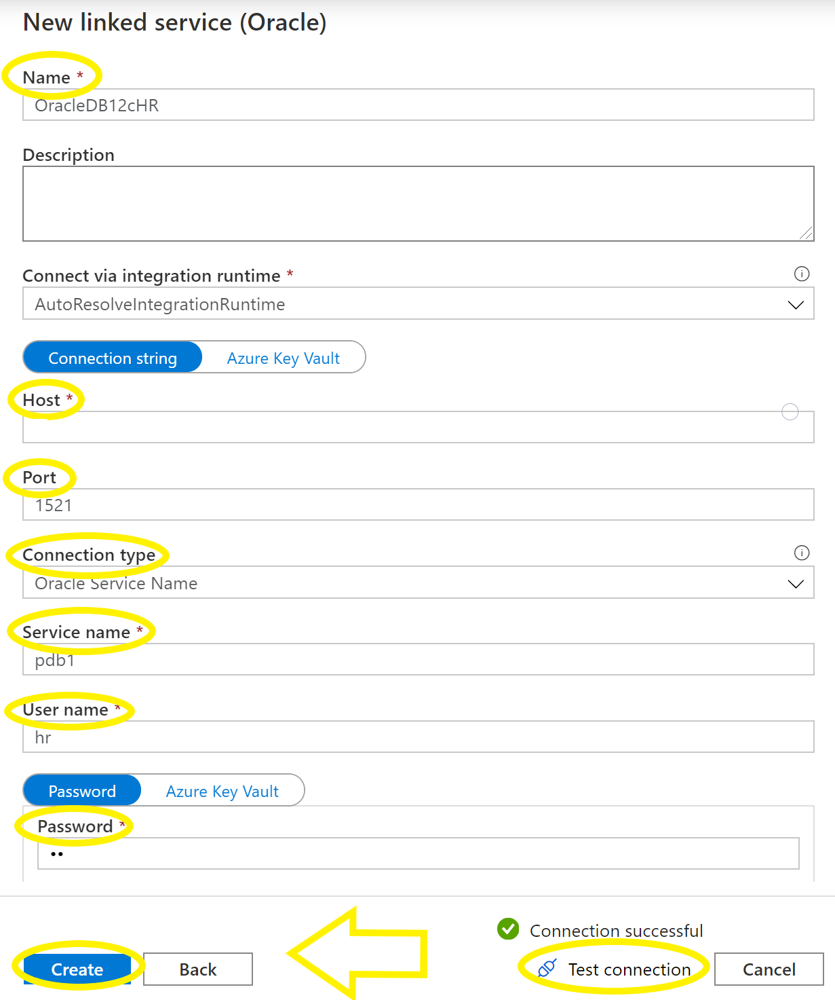
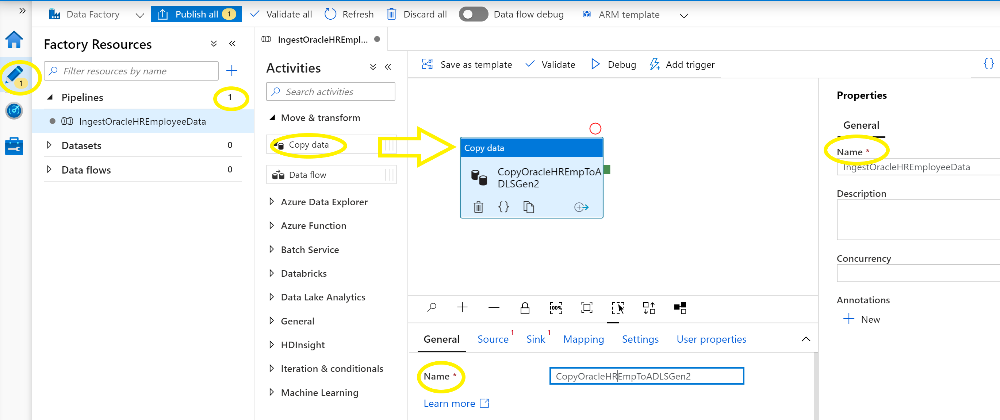
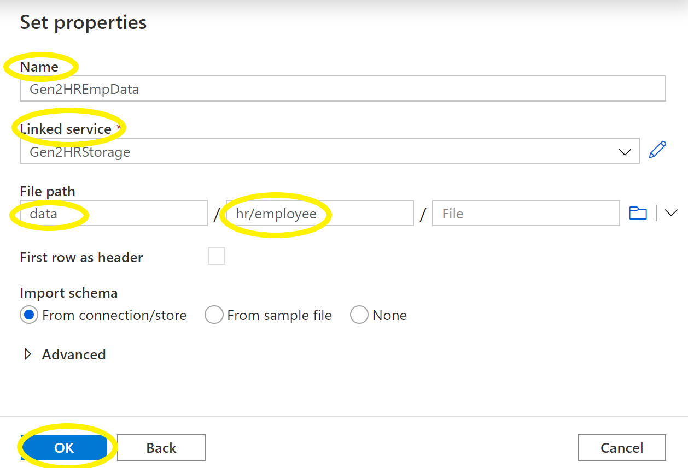
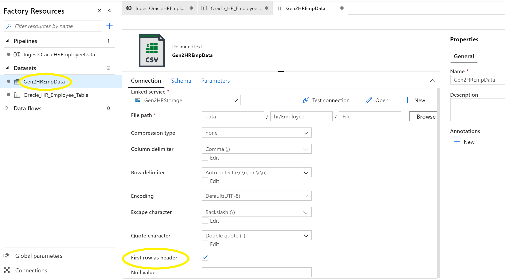
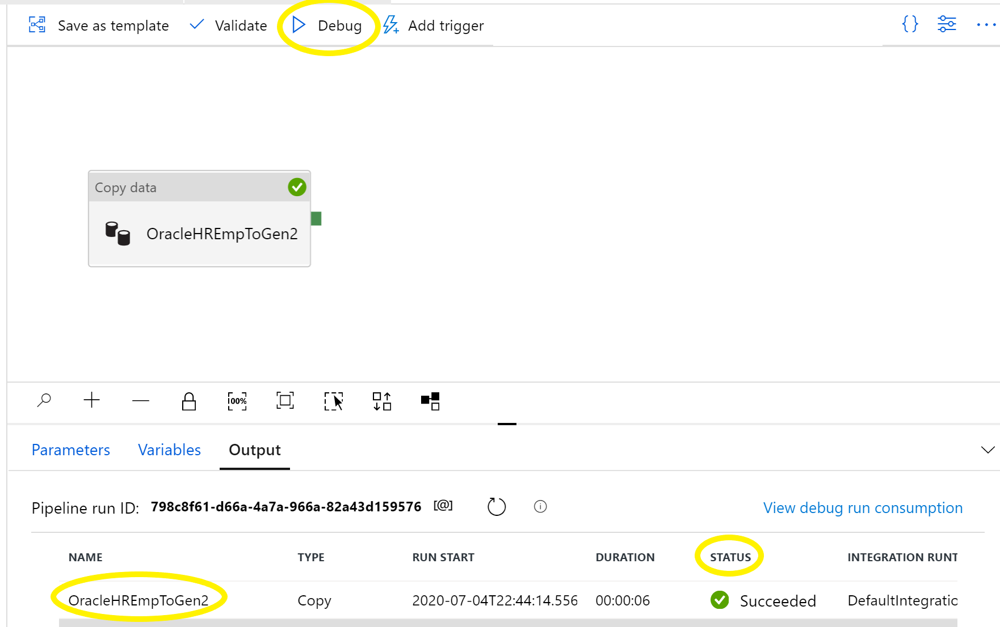
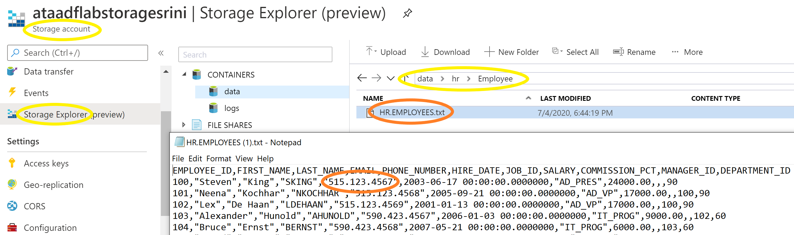

# Azure Trailblazer Academy Azure Data Factory (ADF) Lab
## Overview
Azure Data Factory is the PaaS cloud-based ETL & data integration tool allows you to create data driven workflows in the cloud for orchestrating and automating data movement and data transformation. 

Big data requires service that can orchestrate and operationalize processes to refine these enormous stores of raw data into actionable business insights.

## Lab Overview
This lab will help you gain the experience to ingest data from on-premises databases such as Oracle, SAP, Teradata, Hortonworks, DB2, SQL Server and Cloudera to Azure Data storage, databases and data warehouses services. 
It will showcase the steps to build a pipeline inside ADF to ingest the data into ADLS GEN2 storage and secure the PII data using data transformation functions inside the Data Flow activity and finally store the data in Synapse SQL Pool (Data warehouse) for building BI dashboard.  

## Pre-requisites:
- Write Access to Azure Data Lake Storage Account (ADLS Gen2)
- Read Access to Sample HR schema in Oracle Database
- Write Access to Synapse SQL Pool Data warehouse  

## Automated Deployment
We try to help with the automated deployment to create Azure srevices. Press the "*Deploy to Azure*" button below, to provision the Azure Services required required for this lab.

- Enter the following information:
- Subscription
- select 'Create new' under Resource group
- Resource group: 'ata-adf-lab-/<yourname/>-rg'
- Region: Select 'East US'
- SQL_Server Name:'ata-adf-lab-sql-/<yourname/>'
- Server_location:'eastus'

- AdministratorLogin:'azureadmin'
- Administrator Login Password:'Ataadf123!'
- Database Name:'ataadflabsqldb'
- Storage_Accounts_Data Lake Gen2:'ataadflabstorage/<srini/>/
- Click on 'Review and Create'
- Click on 'Create'

- Please check if it created the following services after successful deploypment.

- We will provide temporary access to an Oracle database for completing this lab in the class.

## Task List:
- [Task-1: Create Azure Data Factory Service](#task-1-create-azure-data-factory-service)
- [Task-2: Create linked services](#task-2-create-linked-services)
- [Task-3: Copy Oracle HR Emplyee data to Azure Storage](#task-3-copy-oracle-hr-employee-data-to-azure-storage) 
- [Task-4: Secure PII Employee data with Data Flows](#task-4-secure-pii-employee-data-with-data-flows)
- [Task-5: Create Data Transformation Flow](#task-5-create-data-transformation-flow)
- [Task-6: Build a pipeline to connect activities](#task-6-build-a-pipeline-to-connect-activities)
- [Task-7: Trigger the pipeline execution](#task-7-trigger-the-pipeline-execution) 

### Task-1: Create Azure Data Factory Service

- type 'Data factories' in the search bar 
- select 'Data factories' and select 'add' to create the service

- Provide the following info: 
- Name: 'ata-adf-lab-\<yourname\>'
- Subscription: Make sure it selected the correct subscription
- Select 'ata-adf-lab-\<yourname\>', the resource group you have created with custom deployment. 
- Location: select 'East US'
- Enable GIT: uncheck the box
- Click on 'Create' button  

- select 'Go to resource' when it completes the deployment
- select 'Author & Monitor' in the middle of the screen

- opens up a new tab introducing the drag and drop interface to build pipelines

### Task-2: Create linked services
- You will be creating connection link services to sync and source systems such as Oracle, ADLS Gen2 and Synapse. 
- select Management hub (ToolBox) icon on the left and select 'Linked Services' under Connections section.  
- 1. Create Oracle Linked Service
- Seelct 'New' under Linked Services
- search for 'Oracle' under 'Data Store' and select 'Oracle Database' and click on 'Continue'
- Enter the following Oracle Connect Info:

- Name: Enter 'OracleDB12cHR'
- Leave the default 'Connection string' option
- Host: Enter Instructor provided server IP address
- Port: 1521 (Default Oracle Port)
- Connection type: Select 'Oracle Service Name'
- Service name: Enter Instructor provided Oracle Service name
- User name: hr
- Password: 'hr'

- Select 'test connection' to verify the successful connection
- Click on 'Create' button to create the Oracle linked service

- 2. Create ADLS Gen2 Storage Linked Service:
- Seelct 'New' under Linked Services
- Search for 'Gen2' under data store and select ADLS Gen2 
- Click on 'Continue'

- Name: Enter 'Gen2HRStorage'
- Authentication Method: Leave the default 'Account Key' selection
- Account Selection method: Leave the default 'From Azure subscription'
- Storage account name: select 'ataadflabstorage/<yourname/>'
- Click on 'Test connection' 
- Click on 'Create' after successful connection to create the ADLS Gen2 storage linked service

- 3. Create Synapse Analytics Linked Service
- Seelct 'New' under Linked Services
- Search for 'Synapse' under data store and select 'Azure Synapse Analytics' 
- Click on 'Continue'

- Enter the folowing info:
- Name: Enter 'SynapseDBHR'
- Server name: select 'ata-adf-lab-sql-/<yourname/>'
- Database name: select 'ataadflabsqldb'
- User name: enter 'azureadmin'
- Password: enter the default 'ataadf123!'
- Click on 'test connect' to test the connection
- Click on 'Create' after the successful connection to create the Synapse linked service

- You have successfully created connection linked services to Oracle, ADLS Gen2 and Synapse SQL Pool.

### Task-3: Copy Oracle HR Emplyee data to Azure Storage
- We have established the connection services to the source Oracle DB and the sink Azure storage, we can create a copy activity to ingest the data.
- 1. Select 'Pencil' icon on the left and select three dots next to pipelines to select 'new pipeline' action. 
- name the pipeline as 'IngestOracleHREmployeeData' under the properties section on the right side.
- Drag the 'Copy data' from 'Move & transform' section under 'Activities' list to the convas in the middle.
- Name the copy activity as 'OracleHREmpToGen2' below the convas under the 'General' tab

- 2. Select 'Source' tab next to 'General' to define the source system. 
- Select 'New' to create a new source dataset
- Select 'Oracle database' as the data store after filtering with 'Oracle' and click on 'Continue'
- Select 'Open' to define the source dataset
- Name the dataset as 'Oracle_HR_Employee_table' under the properties section on the right side.
- Select the 'OracleDB12cHR' linked service and click on 'Test connection' to test the connectivity.
- Filter table list by typing 'hr.emp' and select 'HR.EMPLOYEES' table and select 'Preview data'.

- Make sure you are able to see the employee data 

- 3. Select 'Sink' tab next to 'Source' to define the sink system
- Select 'New' to create a new sink data set
- Select 'ADLS Gen2' as the data store after filtering with 'Gen2' and click on 'Continue'
- Select 'Open' to define the sink dataset
- Select 'Delimited Text' as the format and click on 'Continue'
- Name the dataset as 'Gen2HREmpData'
- select the 'Gen2HRStorage' linked service
- You will have to enter the file system and directory path. 
- First we need to create the directory path in the storage accont. Leave this browser tab as is and switch to the Azure Services tab in the browser.  
- Access storage account and open up the 'storage explorer' to create 'hr' under 'data' file system and create 'employee' as a subfolder under 'hr' folder.

- Switch back to ADF author browser and enter 'data' and 'hr/Empolyee' as the File path and click on 'OK'

- select it again under Datasets to set the first row as the header.
- check the box 

4. Test the copy activity by clicking on 'Debug' option just above the canvas.
- It will start the process and put it in the queue. Wait till it finishes.
- Check for the status and make sure it is successful

5. Verify the data ingestion in ADLS Gen2 storage
- Switch to Azure services tab and access the storage account.
- open up the 'Storage Explorer' and access the data file syste and drill down to 'hr' and 'Employee' folder. 
- Confirm the 'HR.EMPLOYEES.txt' file. Double click on the file to download and view the file.
- You can see how the phone numbers are ingested as text. This is PII data and we should protect this data. 

