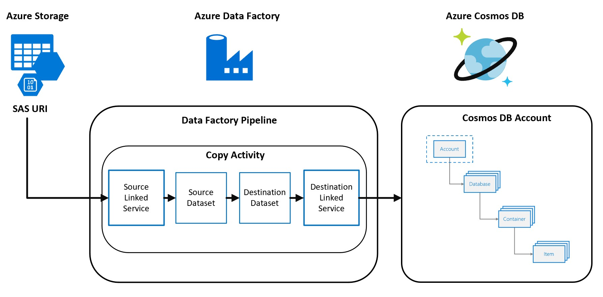

# Azure Cosmos DB Lab

## Prerequisites

- Microsoft Azure subscription
- Resource Group to deploy Azure services
- Permissions to create the following resource 
    - Cosmos DB
    - Data Factory

## Reference Architecture  
Below is the architecture of the Cosmos DB Lab.  

**Cosmos DB Lab Guides**

*It is recommended to complete the labs in the order specified below:*

- [Lab 1: Importing Data into Azure Cosmos DB with Azure Data Factory](Load_Data_ADF.md)
- [Lab 2: Querying in Azure Cosmos DB](Querying_Cosmosdb.md)
- [Lab 3: Indexing in Azure Cosmos DB](Indexing_Cosmosdb.md)