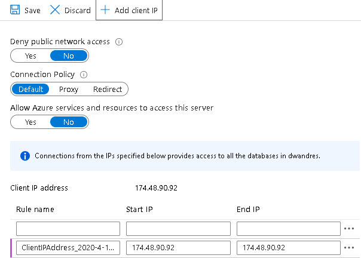

# Azure Data Services Lab

## Prerequisites

- Microsoft Azure subscription

# Lab Setup

## Automated Deployment


## Step 1: Automated Deployment

Press the "*Deploy to Azure*" button below, to provision the Azure Services required required for this lab.

<a href="https://portal.azure.com/#create/Microsoft.Template/uri/https%3A%2F%2Fraw.githubusercontent.com%2Fmicrosoft%2FAzureTrailblazerAcademy%2Fmaster%2Fmonth2%2Flabs%2Flab_data%2Fscripts%2Flab2_data_deployment.json" target="_blank"></a>

## Step 2: Deploy Azure Data Factory

While those other resources are being deployed, follow these steps to manually deploy Azure Data Factory.

1. In the Azure Portal, search for **Data Factories**
2. Click on the **Add** button
3. Fill out the form:
- **Name:** Choose a unique name for your Data Factory
- **Version:** V2
- **Subscription:** Choose your subscription
- **Resource Group:** Use the same Resource Group you used for the automated deployment in Step 1.
- **Location:** East US
- Uncheck the **Enable GIT** checkbox
4. Click the **Create** button


## Step 3: Validation of services

## Validate Correct provisioning of services

Estimated Time: 15 minutes
 
1. Once the automated deployment is complete, expand the resource group you used previosly and review that the following services are provisioned:

- Azure Synapse Analytics (SQL Data Warehouse)
- Azure Storage Accounts
- Azure Data Factory

2. Capture the name of your storage acccount (Data Lake Storage)
3. CLick on the SQL Data Warehouse
4. Click on **Firewalls and virtual networks** and select **Add Client IP**. Then click on **Save**.



5. Click on **Query Editor** and login using the user name and password you entered earlier.
6. Execute the following query:

```
CREATE MASTER KEY;
```

## Step 4: Populate the Azure Storage container Azure CloudShell

1. In the Azure Portal, open an Azure Cloudshell window.
   Complete the configuration process as needed

2. Type the following command to copy the deployment script to Azure Cloud Shell

   This will copy the deployment script that will populate the Azure Data Lake Storage Containers with sample files

```
curl -OL https://raw.githubusercontent.com/microsoft/AzureTrailblazerAcademy/master/month2/labs/lab_data/scripts/data_script.sh
```
1. Type the following to upload the sample files:

```
bash data_script.sh <storageaccountname>
```
Example: bash data_script.sh mdwdemostoredl

3. Click on the storage account and browse to **Containers**:

    - Validate that 2 containers **data** and **logs** are existing
    - Click on the **data** container and validate that these 2 files exist:
        - preferences.json
        - DimDate2.txt
    - Repeat the validation for the **logs** container as well, validate that these 3 files exist in the container:
        - preferences.json
        - weblogsQ1.log
        - weblogsQ2.log
## Step 5: Ingest data using the Copy Activity
  
Estimated Time: 15 minutes

### Task 1: Add the Copy Activity to the designer

1. Navigate to the resource group in you Azure Demo deployment, and expand Azure Data Factory.

1. In the Azure Data Factory screen, in the middle of the screen, click on the button, **Author & Monitor**

1. **Open the authoring canvas** If coming from the ADF homepage, click on the **pencil icon** on the left sidebar or the **create pipeline button** to open the authoring canvas.

1. **Create the pipeline** Click on the **+** button in the Factory Resources pane and select Pipeline

1. **Add a copy activity** In the Activities pane, open the Move and Transform accordion and drag the Copy Data activity onto the pipeline canvas.

    


### Task 2: Create a new HTTP dataset to use as a source

1. In the Source tab of the Copy activity settings, click **+ New**

1. In the data store list, select the **HTTP** tile and click continue

1. In the file format list, select the **DelimitedText** format tile and click continue

1. In Set Properties blade, give your dataset an understandable name such as **HTTPSource** and click on the **Linked Service** dropdown. If you have not created your HTTP Linked Service, select **New**.

1. In the New Linked Service (HTTP) screen, specify the url of the moviesDB csv file. You can access the data with no authentication required using the following endpoint:

    https://raw.githubusercontent.com/microsoft/ignite-learning-paths-training-data/master/data20/demos/moviesDB.csv

1. Place this in the **Base URL** text box. 

1. In the **Authentication type** drop down, select **Anonymous**. and click on **Create**.


    -  Once you have created and selected the linked service, specify the rest of your dataset settings. These settings specify how and where in your connection we want to pull the data. As the url is pointed at the file already, no relative endpoint is required. As the data has a header in the first row, set **First row as header** to be true and select Import schema from **connection/store** to pull the schema from the file itself. Select **Get** as the request method. You will see the followinf screen

        
           
    - Click **OK** once completed.
   
    a. To verify your dataset is configured correctly, click **Preview Data** in the Source tab of the copy activity to get a small snapshot of your data.
   
   

### Task 3: Create a new ADLS Gen2 dataset sink

1. Click on the **Sink tab**, and the click **+ New**

1. Select the **Azure Data Lake Storage Gen2** tile and click **Continue**.

1. Select the **DelimitedText** format tile and click **Continue**.

1. In Set Properties blade, give your dataset an understandable name such as **ADLSG2** and click on the **Linked Service** dropdown. If you have not created your ADLS Linked Service, select **New**.

1. In the New linked service (Azure Data Lake Storage Gen2) blade, select your authentication method as **Account key**, select your **Azure Subscription** and select your Storage account name of **awdlsstudxx**. You will see a screen as follows:

   

1. Click on **Create**

1. Once you have configured your linked service, you enter the set properties blade. As you are writing to this dataset, you want to point the folder where you want moviesDB.csv copied to. In the example below, you are writing to the  **data** folder. While the folder can be dynamically created, the file system must exist prior to writing to it.
    * Set 'File path' to the 'data' folder in ADLS
    * Set **First row as header** to be true. 
    * Set 'Import schema' to 'From connection/store'


1. Click **OK** once completed.

### Task 4: Test the Copy Activity

At this point, you have fully configured your copy activity. To test it out, click on the **Debug** button at the top of the pipeline canvas. This will start a pipeline debug run.

1. To monitor the progress of a pipeline debug run, click on the **Output** tab of the pipeline

1. To view a more detailed description of the activity output, click on the eyeglasses icon. This will open up the copy monitoring screen which provides useful metrics such as Data read/written, throughput and in-depth duration statistics.

   

1. To verify the copy worked as expected, open up your ADLS gen2 storage account and check to see your file was written as expected
1. **Important:** In order to proceed with the next demo - click **Publish All** to deploy the pipeline to the factory

💡 NOTE - At the end of this demo, if you are NOT going through any other demos - delete the resource group to reduce and mimize Azure spend.

## Step 6: Preparing Data Factory Environment

1. Navigate to Azure Data Factory, and click **Author and Monitor**
1. Click on the **Pencil** Icon

1. **Turn on Data Flow Debug** Turn the **Data Flow Debug** slider located at the top of the authoring module on. 

    > NOTE: Data Flow clusters take 5-7 minutes to warm up.
1. Expand **Pipelines**
1. Select **Pipeline1**

1. **Add a Data Flow activity** In the Activities pane, open the Move and Transform accordion and drag the **Data Flow** activity onto the pipeline canvas. In the blade that pops up, click **Create new Data Flow** and select **Mapping Data Flow** and then click **OK**.
Click Close, then click on the  **pipeline1** tab and drag the green box from your Copy activity to the Data Flow Activity to create an on success condition. You will see the following in the canvas:

    

### Task 2: Adding a Data Source

1. **Add an ADLS source** Double click on the Mapping Data Flow object in the canvas. Click on the Add Source button in the Data Flow canvas. In the **Source dataset** dropdown, select your **ADLSG2** dataset used in your Copy activity

    

    * If your dataset is pointing at a folder with other files, you may need to create another dataset or utilize parameterization to make sure only the moviesDB.csv file is read
    * If you have not imported your schema in your ADLS, but have already ingested your data, go to the dataset's 'Schema' tab and click 'Import schema' so that your data flow knows the schema projection.

    Once your debug cluster is warmed up, verify your data is loaded correctly via the Data Preview tab. Once you click the refresh button, Mapping Data Flow will show calculate a snapshot of what your data looks like when it is at each transformation.

1. Click on Source Options
1. Click on Projection
1. Click on Import Schema
  
### Task 3: Using Mapping Data Flow transformation

1. **Add a Select transformation to rename and drop a column** In the preview of the data, you may have noticed that the "Rotton Tomatoes" column is misspelled. To correctly name it and drop the unused Rating column, you can add a [Select transformation](https://docs.microsoft.com/azure/data-factory/data-flow-select) by clicking on the + icon next to your ADLS source node and choosing Select under Schema modifier.
    
    

    In the **Name** as field, change 'Rotton' to 'Rotten'. To drop the Rating column, hover over it and click on the trash can icon.

    

1. **Add a Filter Transformation to filter out unwanted years** Say you are only interested in movies made after 1951. You can add a [Filter transformation](https://docs.microsoft.com/azure/data-factory/data-flow-filter) to specify a filter condition by clicking on the **+ icon** next to your Select transformation and choosing **Filter** under Row Modifier. Click on the **expression box** to open up the [Expression builder](https://docs.microsoft.com/azure/data-factory/concepts-data-flow-expression-builder) and enter in your filter condition. Using the syntax of the [Mapping Data Flow expression language](https://docs.microsoft.com/azure/data-factory/data-flow-expression-functions), **toInteger(year) > 1950** will convert the string year value to an integer and filter rows if that value is above 1950.

    

    You can use the expression builder's embedded Data preview pane to verify your condition is working properly

    


1. **Add a Derive Transformation to calculate primary genre** As you may have noticed, the genres column is a string delimited by a '|' character. If you only care about the *first* genre in each column, you can derive a new column named **PrimaryGenre** via the [Derived Column](https://docs.microsoft.com/azure/data-factory/data-flow-derived-column) transformation by clicking on the **+ icon** next to your Filter transformation and choosing Derived under Schema Modifier. Similar to the filter transformation, the derived column uses the Mapping Data Flow expression builder to specify the values of the new column.

    

    In this scenario, you are trying to extract the first genre from the genres column which is formatted as 'genre1|genre2|...|genreN'. Use the **locate** function to get the first 1-based index of the '|' in the genres string. Using the **iif** function, if this index is greater than 1, the primary genre can be calculated via the **left** function which returns all characters in a string to the left of an index. Otherwise, the PrimaryGenre value is equal to the genres field. You can verify the output via the expression builder's Data preview pane.

   Your expression should look like: iif(locate('|',genres)>1,left(genres(locate('|',genres)-1),genres)
   
1. **Rank movies via a Window Transformation** Say you are interested in how a movie ranks within its year for its specific genre. You can add a [Window transformation](https://docs.microsoft.com/azure/data-factory/data-flow-window) to define window-based aggregations by clicking on the **+ icon** next to your Derived Column transformation and clicking Window under Schema modifier. To accomplish this, specify what you are windowing over, what you are sorting by, what the range is, and how to calculate your new window columns. In this example, we will window over PrimaryGenre and year with an unbounded range, sort by Rotten Tomato descending, a calculate a new column called RatingsRank which is equal to the rank each movie has within its specific genre-year.

    

    

    

    

1. **Aggregate ratings with an Aggregate Transformation** Now that you have gathered and derived all your required data, we can add an [Aggregate transformation](https://docs.microsoft.com/azure/data-factory/data-flow-aggregate) to calculate metrics based on a desired group by clicking on the **+ icon** next to your Window transformation and clicking Aggregate under Schema modifier. As you did in the window transformation, lets group movies by PrimaryGenre and year

    

    In the Aggregates tab, you can aggregations calculated over the specified group by columns. For every genre and year, lets get the average Rotten Tomatoes rating, the highest and lowest rated movie (utilizing the windowing function) and the number of movies that are in each group. Aggregation significantly reduces the amount of rows in your transformation stream and only propagates the group by and aggregate columns specified in the transformation.

    

    * To see how the aggregate transformation changes your data, use the Data Preview tab
   

1. **Specify Upsert condition via an Alter Row Transformation** If you are writing to a tabular sink, you can specify insert, delete, update and upsert policies on rows using the [Alter Row transformation](https://docs.microsoft.com/azure/data-factory/data-flow-alter-row) by clicking on the + icon next to your Aggregate transformation and clicking Alter Row under Row modifier. Since you are always inserting and updating, you can specify that all rows will always be upserted.

    

    

### Task 4: Writing to a Data Sink

1. **Write to a Azure Synapse Analytics Sink** Now that you have finished all your transformation logic, you are ready to write to a Sink.
    1. Add a **Sink** by clicking on the **+ icon** next to your Upsert transformation and clicking Sink under Destination.
    1. In the Sink tab, create a new data warehouse dataset via the **+ New button**.
    1. Select **Azure Synapse Analytics** from the tile list.
    1. Select a new linked service and configure your Azure Synapse Analytics connection to connect to the DWDB database created in Module 5. Click **Create** when finished.
    
    1. In the dataset configuration, select **Create new table** and enter in the schema of **Dbo** and the  table name of **Ratings**. Click **OK** once completed.
    
    1. Since an upsert condition was specified, you need to go to the Settings tab and select 'Allow upsert' based on key columns PrimaryGenre and year.
    
At this point, You have finished building your 8 transformation Mapping Data Flow. It's time to run the pipeline and see the results!


## Task 5: Running the Pipeline

1. Go to the pipeline1 tab in the canvas. Because Azure Synapse Analytics in Data Flow uses [PolyBase](https://docs.microsoft.com/sql/relational-databases/polybase/polybase-guide?view=sql-server-2017), you must specify a blob or ADLS staging folder. In the Execute Data Flow activity's settings tab, open up the PolyBase accordion and select your ADLS linked service and specify a staging folder path.

    

1. Before you publish your pipeline, run another debug run to confirm it's working as expected. Looking at the Output tab, you can monitor the status of both activities as they are running.

1. Once both activities succeeded, you can click on the eyeglasses icon next to the Data Flow activity to get a more in depth look at the Data Flow run.

1. If you used the same logic described in this lab, your Data Flow should will written 737 rows to your SQL DW. You can go into [SQL Server Management Studio](https://docs.microsoft.com/sql/ssms/download-sql-server-management-studio-ssms?view=sql-server-2017) to verify the pipeline worked correctly and see what got written.

Another option is to switch to the Azure Portal, expand the data warehouse blade in your resource group and start the **Query Editor (preview)** from the SQL data warehouse blade and write the following query:

```
select count(*) from dbo.Ratings
```