# Azure DevOps Hands-on Lab - Step by Step Guide

## Overview: 

In this lab, you will learn how to use Azure DevOps to create a CI/CD pipeline. This project will guide you through creating the pipeline to automatically build, verify, and deploy your souce code changes into Azure. 

**Note:** When you're done, remember to **Stop** your VM from the Azure Portal. And when you're really, really done, delete the resources you created for this lab.

## Prerequisite: Create a Visual Studio 2019 virtual machine from the Azure Portal. 
 
1.	In a browser, go to the [Azure portal](https://portal.azure.com), sign in, and click on **Create a resource**.
1.	In the **Search the Marketplace** search box, type **Visual Studio** then select **Visual Studio 2019 Latest**. 
1.	In the **Select a software plan** dropdown list, select **Visual Studio Community (latest release) on Windows Server 2019 (x64)**, then click **Create**.
1.	Complete the creation with the following information. Leave the defaults for the other options. 

    - Select or create a new resource group
    - Give your VM a name, such as vmatalab plus your initials (such as vmatalabjb)
    - Provide an admin **Username** and **Password**
    - Leave the **Public inbound ports** and **Select inbound ports** settings as they are.
    - Click **Review + create**

    **Recommendation:** Use the **D4_v3** VM size rather than a smaller, slower one. You will appreciate the faster speed when walking through the steps that involve Visual Studio. Just be sure to shut down the VM from the Azure portal (or delete it altogether) when you finish the lab. This VM costs around $0.38 an hour while it is not stopped from the Azure portal.
 
1.	After validation completes, press **Create**. 
 
It will take several minutes for the deployment to complete. 

  
## Task 1. Connect to the VM, download the sample project from GitHub, and open Visual Studio. 
 
1. Once the deployment is complete (it will take a few minutes), click **Go to resource**. 
    
    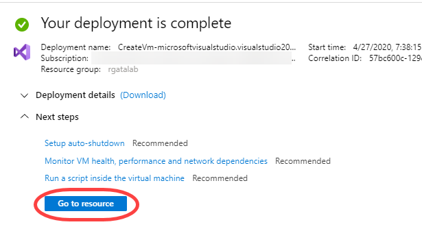
 
1.	Click (1) **Connect**, click (2) **RDP**, then on the next page, click (3) **Download RDP file**
    
    
 
1. 	Open the downloaded RDP file, and connect to the VM. 
 
    
 
1.	When prompted to enter your credentials, 
    - (1) Click **More choices**
    - (2) Click **Use a different account**
    - (3) Enter the **User name** and **Password** you provided when you created the VM
    - (4) Click **OK**, then clickk **OK** in the next dialog box.
    
        
  
1. In the **Remote Desktop Connection** dialog box, click (1) **Don't ask me again for connections to this computer** then click (2) **Yes**

    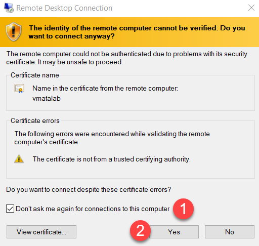

1. Once you're connected to the VM, if prompted, choose **No** to the **Networks** prompt.

    

1. Inside the VM, open **Internet Explorer** and download the sample project to the VM's C: drive from GitHub: https://github.com/Azure-Samples/dotnet-sqldb-tutorial/archive/master.zip
 
    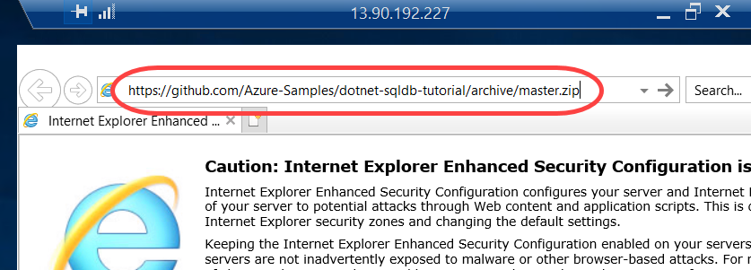
 
1. Create a folder to hold the project, (for example, **c:\HOL\ToDoApp**), and extract the files into it.
 
    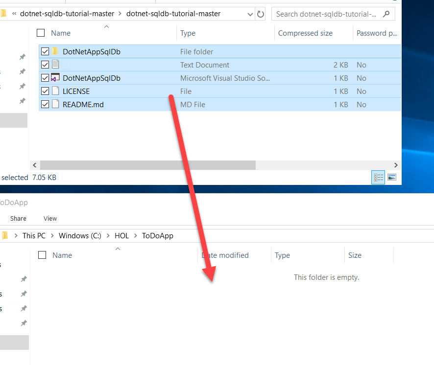

1. Open the solution in **Visual Studio 2019** by double-clicking on the extracted solution file **DotNetAppSqlDb.sln**.  
1. When prompted for credentials you can use your corporate credentials, your Microsoft account, or create them on the fly. 
1. Once Visual Studio opens it should look something like this.

    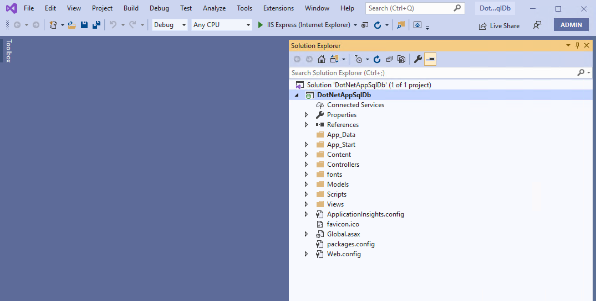
 
## Task 2. Publish the application to Azure
 
1. Right click on the project file **DotNetAppSqlDb** (1), and click **Publish…** (2) 

    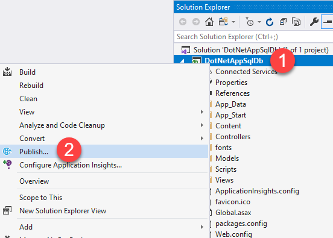

1. In the **Publish – Where are you publishing today?** wizard, click **Next** to select **Azure**, then click **Next** to select **Azure App Service (Windows)**.

    - (1) Then click **+ Create a new Azure App Service…**
    - (2) In the **App Service (Windows)** window that opens, select the **Subscription** and **Resource Group** you’re using for this lab 
    - (3) Click **New…** to the right of **Hosting Plan**
    - (4) In the **Hosting Plan Create new** window that opens, ensure the **Location** is the same as your other resources in this resource group (having resources in the same region helps with applicaiton performance)
    - (5) Click OK in the **Hosting Plan - Create new** window.

        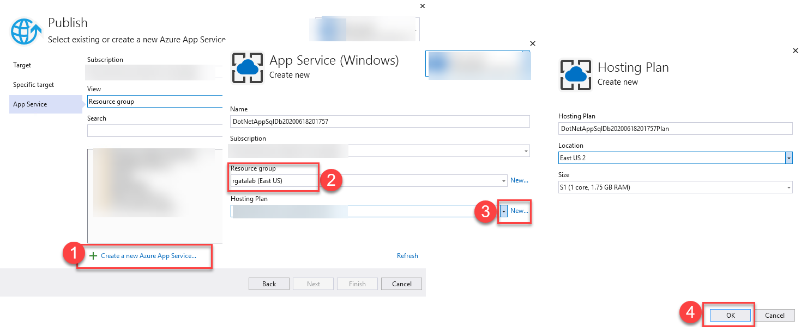

1. This brings you back to the **App Service (Windows)** window. Click **Create** to create the App Service Plan. It can take a couple of minutes to complete.
 
    

1. Once the **App Service Plan** is created you will automatically be returned to the **Publish Select existing or create a new Azure App Service** window. Click **Finish**
 
    

1. In the **Publish – Deploy your app to a folder** window, click **Configure** to configure a **SQL Server Database**

    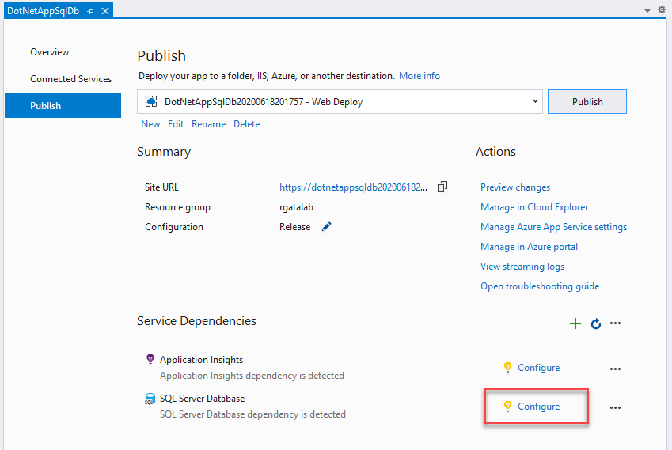

1. In the **Configure dependency** window, select **Azure SQL Database** and click **Next**

1. In the **Configure Azure SQL Database** window, click **+ Create a SQL Database**. 

    
 
1. In the **Azure SQL Database Create new** window 
    - (1) Select the **Resource Group** you’re using for this lab 
    - (2) Click **New…** to the right of **Database server** 

        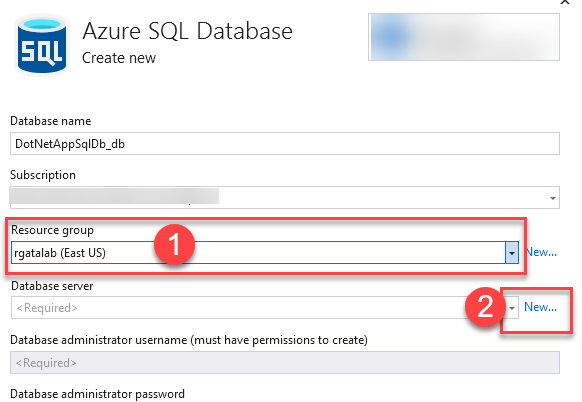

1. In the **SQL Server – Create new** window
    - (1) Give the **Database server name** a unique name
    - (2) Use the default or select a different **Location**. For better performance, it's good to have the database in the same region as the App Service
    - (3) Provide a database **Administrator username** and **Administrator password**. 
    - (4) Click **OK** 

        
  
1. Click **Create** in the **Azure SQL Database - Create new window** to create the database and close the window. It will take a few minutes to create the database. 

1. Back in the **Configure Azure SQL Database** wizard click **Next** 
 
    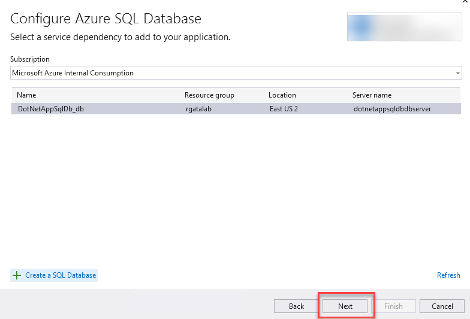

1. In the next step of the Configure Azure SQL Database dialog: 
    - (1) Enter the **Database connection string name**, **Database connection user name**, and **Database connection password** fields. These are the details your application will use to connect to the database at runtime. Best practice is to avoid using the same details as the admin username & password used in the previous step. 
    - (2) Click **Finish** then click **Close**. 
 
        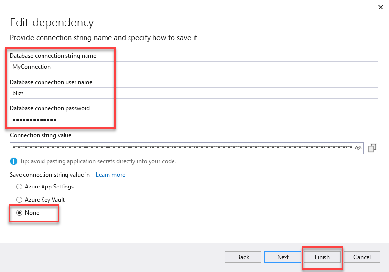
 

1. In the **Publish Summary** window click **Edit** 

    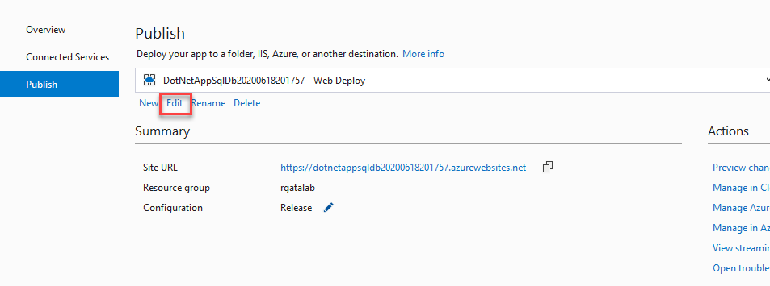

 
1. In the **Publish** dialog box
    - (1) Click **Settings**
    - (2) Click on the arrow to open the **Databases** dropdown list
    - (3) Click on the databse name **DotNetAppSqlDb_db**
    - (4) Click **Save**

        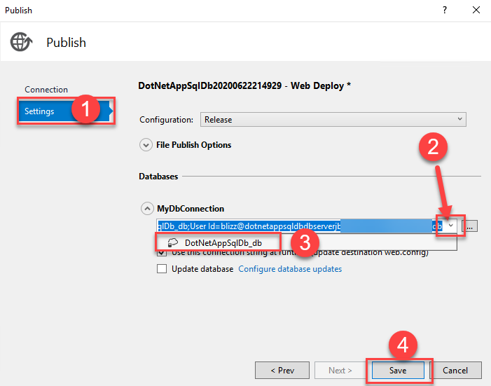

1. In the **Publish - Deploy your app to a folder...** window in Visual Studio, click **Publish**

    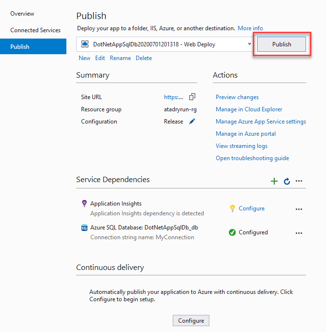

1. In the web browser that opens, verify that the site looks correct. 

    

    **Note:** If your browser did not automatically open, **Ctrl + Click** on the link in the **Output** window in **Visual Studio**. 

    

## Task 3. Create an Azure DevOps project and push your code to the project's Git repo

1.	In your VM, navigate to the Azure DevOps portal at https://dev.azure.com and sign in.

    
 
1.	Create a new DevOps project by clicking on **+ New Project**

    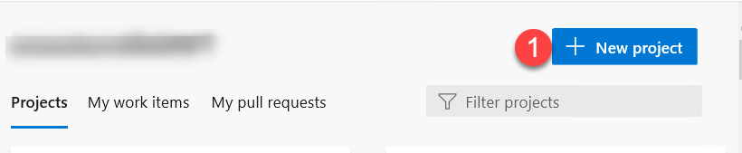

1. In the **Create new project** window
    - (1) For the **Project name** use **ATADevOpsLab followed by your initals** 
    - (2) Add some type of **Description**
    - (3) Make sure the project is **Private**
    - (4) Click **Advanced**, and set **Version control** to **Git** and **Work item process** to **Agile**
    - (5) Click **Create**
 
        
 
1.	To create a new repository
    - (1) In the left navigation bar, click on the **Repos** icon
    - (2) At the top click on the  repo name **ATADevOpsLabxxx** 
    - (3) Select **+ New repository**
 
        
 
1.	In the **Create a repository** window, 
    - (1) Use  **ToDoApp** for the **Reponsitory name**
    - (2) Click **Create**

        
 
 
1.	Still in the VM, switch to **Visual Studio** 
    - (1) Click on the  **Team Explorer** tab
    - (2) Click the **Connect** icon
    - (3) Click **Connect…**
 
        
 
 
1.	To clone Azure DevOps project's repo to the VM's file system
    - (1) In the **Connect to a Project** window, expand the list until you see your ***DevOpsLabxxx*** project, then expand to the **ToDoApp** repo
    - (2) Click **Clone**
 
        
 
1.	If prompted, sign into your Azure account. You should see  **The repository was cloned successfully** in Team Explorer. 
 
    
 
 
1.	Open the source code in File Explorer
    - (1) In the **Team Explorer** window, click on the **Connect** icon 
    - (2) Right click on the **Local Git Repository** name **ToDoApp**
    - (3) Click on **Open in File Explorer**
 
        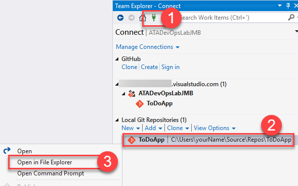
 
1.	Use **File Explorer** to copy the project files
    - (1) Select all the files in your existing solution folder and **copy** them to the new repository folder. 
    - (2) If prompted, replace the destination file named **README.md**. Now your local repo contains the working version of the application. 
 
        
 
1.	Push the solution to your Azure DevOps repo. In **Team Explorer** open the **Changes** window
    - (1) Click on the **Home** icon
    - (2) Click **Changes** 
 
        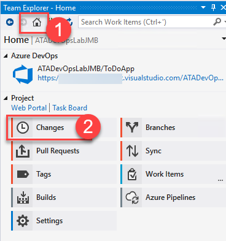
 
1.	If prompted, in the **Git User Information** window,enter your **Name** and **Email Address**, then click **Save**. In **Team Explorer** you can see all the changes based on the file copy into your local repo.

    

1. In **Team Explorer** commit the changes
    - (1) Add the comment **Release 1.0** 
    - (2) Click **Commit All**

    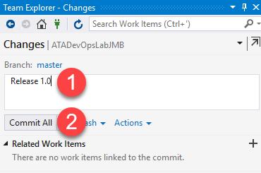

1. Push the changes to Azure DevOps
    - (1)	Click the **Sync** link to open to the **Synchronization** window
    - (2)  Click the **Push** link to push your changes to the repo in Azure DevOps. 
    - (3) You should then see the message "Successfully pushed to origin/master."
 
    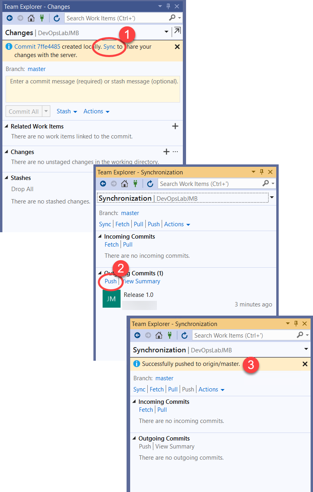
 
1. To see your code in **Azure DevOps**, go to the portal and select the **ToDoApp** repo. (You might need to refresh the browser.) 
 
    
 

## Task 4: Create and fix a bug

1. Create a bug
    - (1) Click the **Boards** icon
    - (2) Click **+ New Work Item** 
    - (3) Click **Bug** 
 
        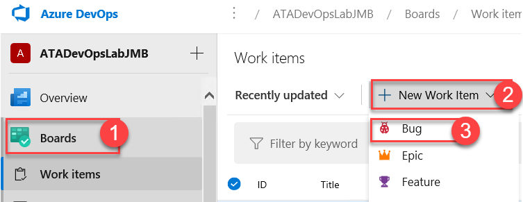
 
1. Give the bug the **Title** of **Header should be 'Training App'**, assign the bug to yourself, and in the **Discussion** text area, enter **Change the header from "My TodoList App" to "Training App"** then click **Save**. 

    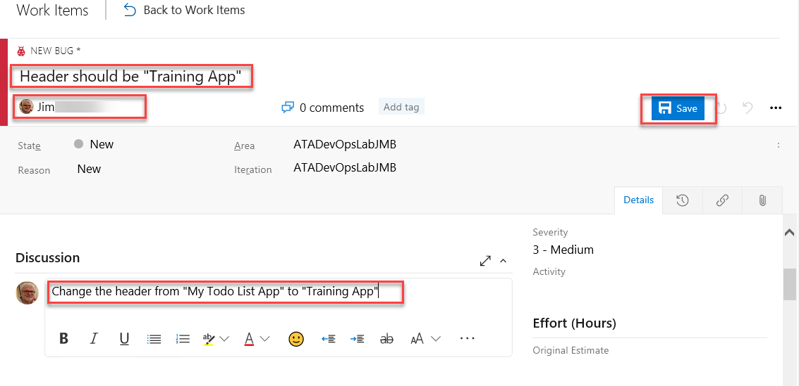

1. Note the work item number given to the new work item, for instance in the screenshot below, the Bug was given number 2256.

    
 
1. Switch to **Visual Studio**. Use **File | Close solution** to close the original solution.

1. In the **What would you like to do?** window, click on **Open a project or solution** 
 
1. In the **Open Project/Solution** window, navigate to the newly created repo in **C:\Users\YourName\Source\Repos\ToDoApp**, select the **DotNetAppSqlDb.sln file**, then click **Open**

    

1. In **Visual Studio**, **click** on the **Solution Explorer** tab to see the source code view

    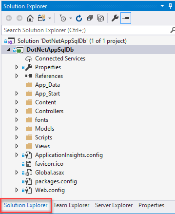

1. In **Solution Explorer** navigate to **Views | Shared | _Layout.cshtml** file, and change **line 19** to say **"Training App"**. Notice that Visual Studio recognizes a change was made and places a vertical yellow highlight to the left of line 19. It also places a check mark to the left of the _Layout.cshtml file name in **Solution Explorer**.

    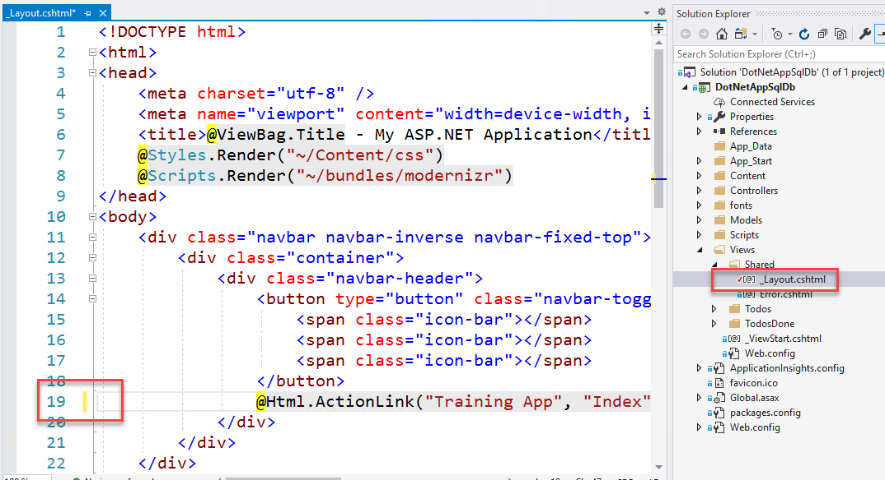

1. Click **Save**. (When you click Save, the yellow highlight on Line 19 turns green)
  
1. Select the **Team Explorer** tab, click the **Home** icon, then click **Changes**. 
1. Now you can commit the code to your local repository 
    - (1) In the **Enter a message** textbox, enter **Heading modified** 
    - (2) Add the **Related Work Item** to your code using the **+**  sign and type in the work item number for the bug you created, and press **Add** 
    - (3) Click on the **Changes** plus sign **+**
    - (4) Click on **Commit Staged**. 

        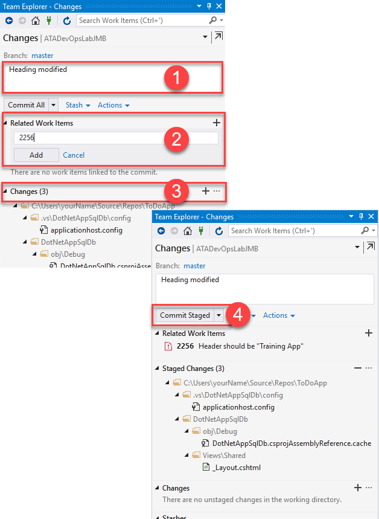
 
1. Click on **Sync**, then **Push** to update the Azure DevOps repo

    
 
1. You can verify the changes in the Azure DevOps portal now

    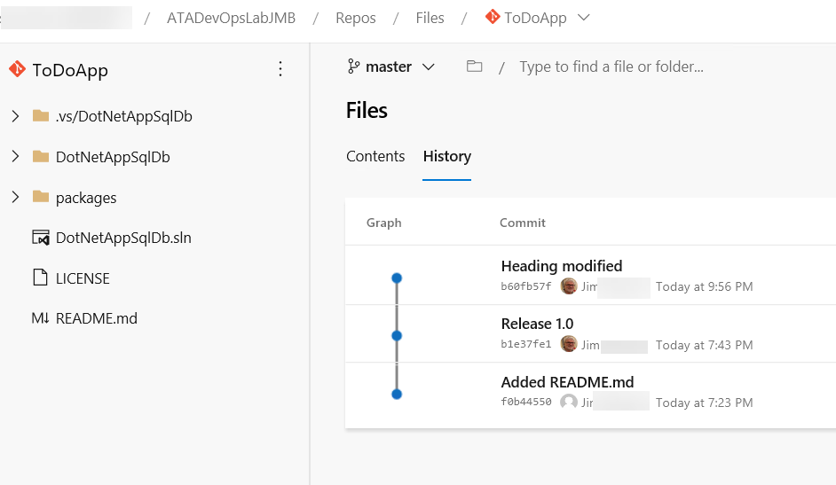
 
## Task 5. Create an Azure DevOps CI / CD Pipeline 
 
1. In your Azure DevOps project, 
    - In the left navigation bar, click on **Pipelines**, then **Create Pipeline**

        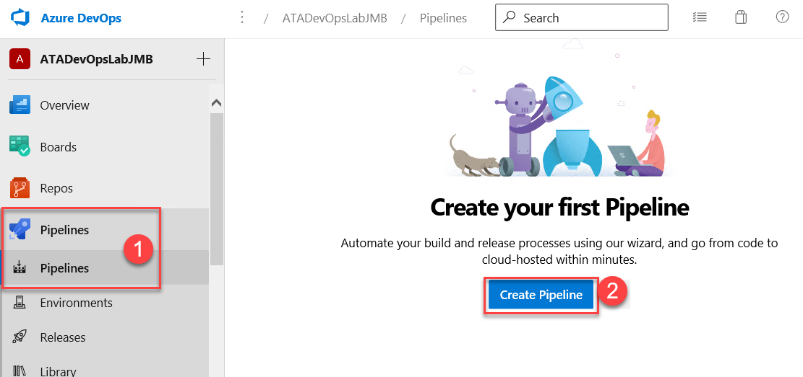
    
    - Click on **Azure Repos Git YAML** 
    - Select the **ToDoApp** repository
    - In **Configure your pipeline** select **ASP.NET Core (.NET Framework)**.  
1. In **Review your pipeline YAML** you'll see the YAML build definition that was created for you. We need to add a task to publish the build artifact that's created by the build. We'll use this artifact in the release pipeline in a few minutes. 
1. **Scroll to the bottom of the pipeline definition** and (1) add the following line  ```- task: PublishBuildArtifacts@1```  (The light gray "Settings" will be added by Azure DevOps - you don't have to type it.) Then (2) click **Save and run**.

    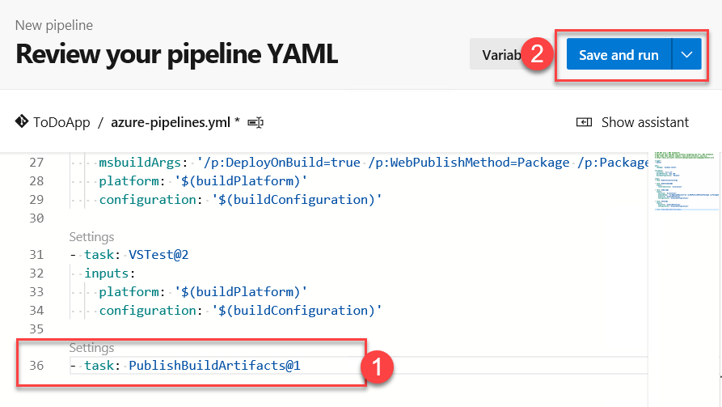 

1. In the **Save and run** window that opens, click **Save and run**

    
 
1. Once the build finishes you should see a **Success** status for the run. 

    

1. To define your release, click on **Releases** then click on **New pipeline**

    

    - On the **Select a template** page, select the **Azure App Service deployment** template and click **Apply**
1. On the **New release pipeline** page, click **Add an artifact**, select your **Source (build pipeline)**, leave **Latest** for the default version, then click **Add**.

    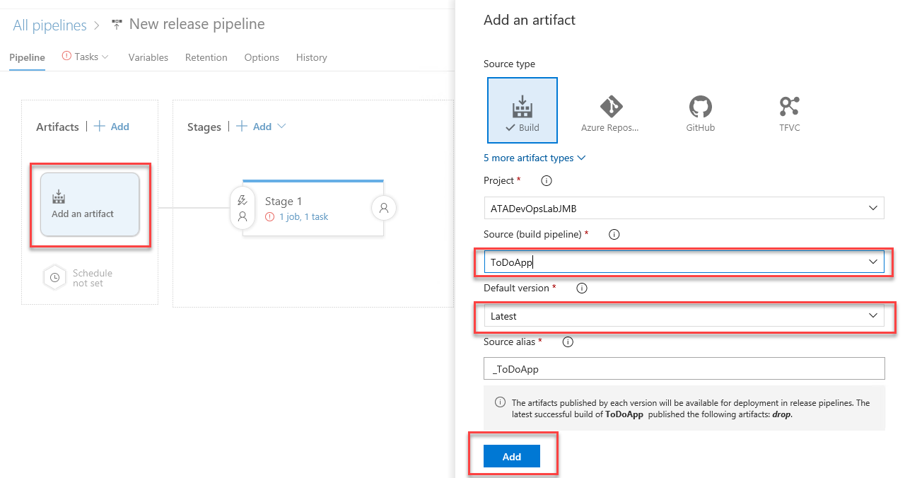

1. Click on the words **Stage 1** then change the **Stage name** to **Dev Environment**. Close the **Stage** pane using the **X**. 

    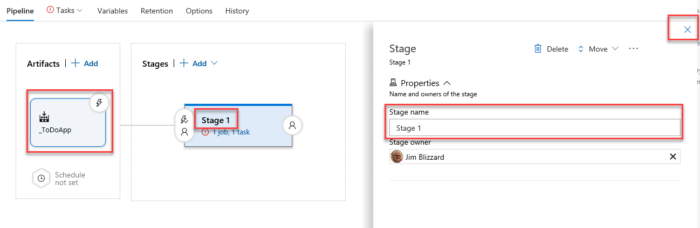

1. Click on the **lightning bolt** icon on the upper right of the **_ToDoApp** artifacts box, then click on the **Continuous deployment trigger** toggle switch to enable continuous deployment. Close the **Continuous deployment trigger** pane using the **X**.

    

1. Click on the words **New release pipeline** and change the release definition name to **ToDoApp-CD** then click on the **Tasks** tab

    

### You need to give your Release pipeline the ability to deploy to Azure resources. There are two options.
1. Option 1) 
    - With **Dev Environment** selected on the left, click on the **Azure subscription** dropdown box on the right. If you see the Subscription you used when you created your App Service from Visual Studio, select it. Click Authorize (it's to the right of the dropdown box -- you may have to zoom way out in the browser window to see it). Then select **App type** **"Web App on Windows"** then select your app service in the App service name dropdown box. The window should look something like this: (Your **App service name** will have a different ending). 
        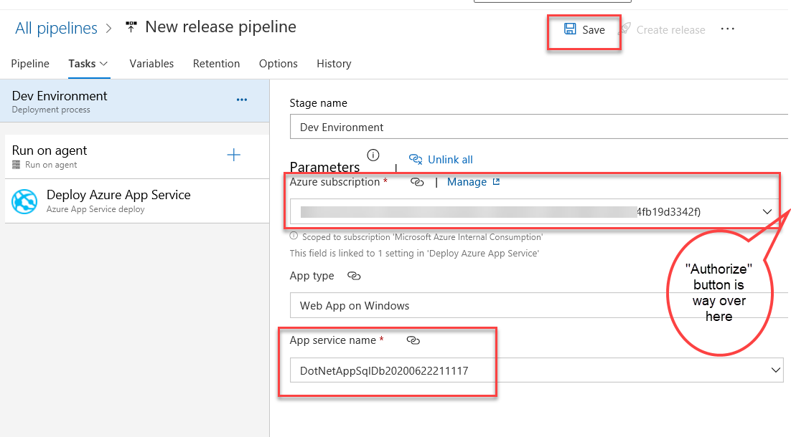
    - Click **Save** and then **OK** 
1. Option 2) 
    - If you didn't see your Subscription in Option 1, you will need to use a Service Principal. (FYI, documentation for Service Principal is located here: https://docs.microsoft.com/en-us/azure/devops/pipelines/library/service-endpoints?view=azure-devops&tabs=yaml)
    - **Right click** on **Project Settings** in the lower left of the navigation pane then select **Open in new tab** 

        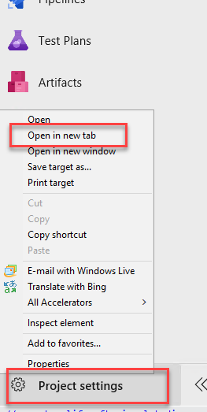
    
    - In the new tab, click on **Service Connections** in the navigation pane
    
        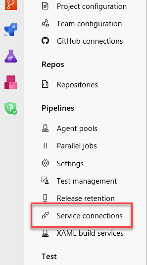
    
    - Click on **New service connection**, click on **Azure Resource Manager** then click **Next**. 
    
        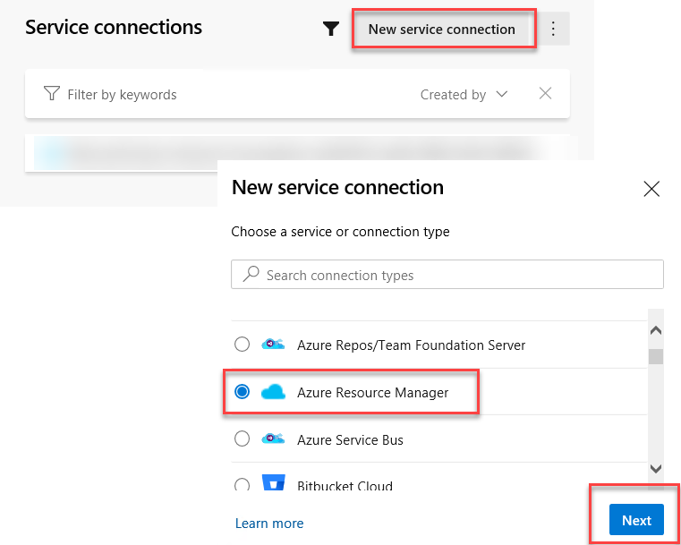
    
    - In the **New Azure service connection** window that opens up, select **Service principal (automatic)** then click **Next**
    - In the next window, set the **Scope level** to **Subscription**, provide a **Resource group** name and provide a **Service connection name**. Then click **Save**.
    
        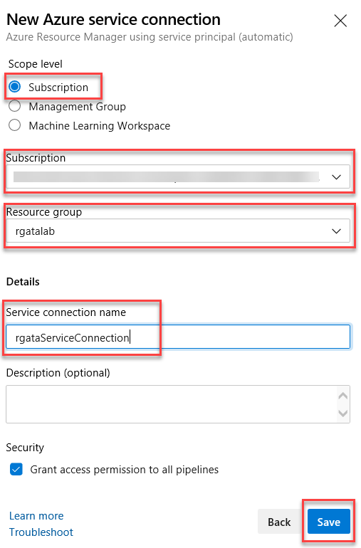
    
    - Once the service connection is saved, close the browser tab and return to the tab that has your release definition.
    - Click on the circular arrow beside the dropdown box for **Azure subscription**, and beside the **App service name**. This will refresh the lists. In the **Azure subscription** list, select your Service connection, then select your **App service name**.
    
        

**Now you're finshed with setting up the pipeline's connection to Azure. Continue editing the release definition.**

1. Click on the **Options** tab then **Integrations**. Check **Report deployment status to the repository host Stages**, **Report deployment status to Work**, **Report deployment status to Boards** and within that select **Deployment type** of **Development**. Then click **Save** then **OK**.
    
    

1. Click on the **Pipeline** tab, then on **Pre-deployment conditions** (lightning bolt with a check mark)

    

1. Enable **Pre-deployment approvals** by clicking on the toggle switch then search for yourself in the **Approvers** box. Close the window by clicking the X in the top right corner of the **Pre-deployment conditions** window.

    

1. Click **Save** in the upper right of the  release definition window then click **OK**. 
1. In the upper right corner, click on **Create release**.

    

1. In **Create a new release** window, click **Create**
1. You will see the message **Release Release-1 has been created** near the top of the window. Click on the **Release-1** link to view the status of the pipeline
1. The **Dev Environment** stage is pending approval before it can be deployed. Click on the **Dev Environment stage**. Do not click on Approve yet. 
1. In the window that opens, look at the **Summary**, **Commits**, and **Work Items** tabs. In the **Work Items** tab you'll see the Bug linked to your release. Click the X in the upper right cornder of the window.

    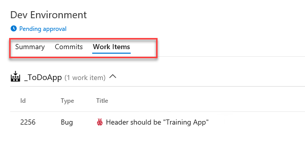  

1. Click on the **Approve** button and the next **Approve** button to allow the release to continue. Click the **X** in the upper right of the window. You'll see the deployment to the **Dev Environment** is **In progress**

    

1. After the deployment completes, click on the **Dev Environment**. You should see something like the screen below.

    

1. If you open the web app now, you should be able to see the change made ("Training App") which was applied through the pipeline. 

### Freestyle time

1. Make another change in Visual Studio and push the changes up to Azure DevOps. Then watch the Build pipeline run, followed by the Release pipeline. Approve the release and verify the website is updated correctly. Also poke around in the various parts of the completed Release screens. 
 
 
## Reminder: When you're done, remember to Stop your VM from the Azure Portal. And when you're really, really done, delete the resources you created for this lab. The easiest way is to delete your entire resource group. 
