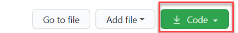
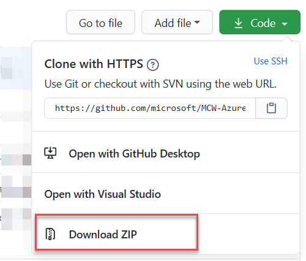
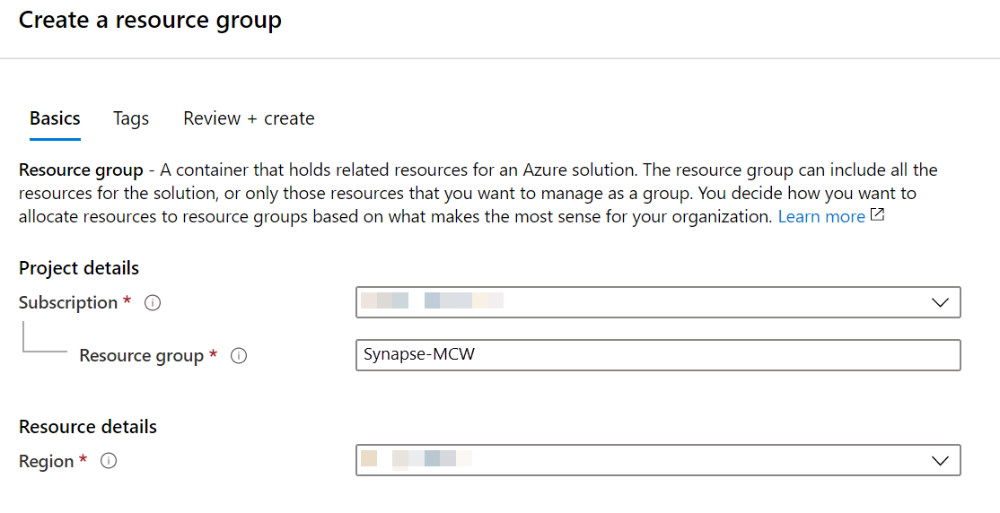
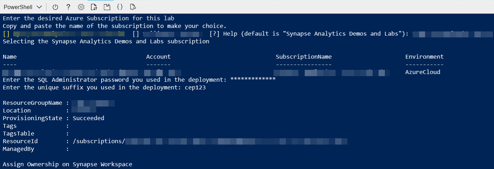

<div class="MCWHeader1">
Azure Synapse Analytics and AI
</div>

<div class="MCWHeader2">
Before the hands-on lab setup guide
</div>

<div class="MCWHeader3">
October 2020
</div>


Information in this document, including URL and other Internet Web site references, is subject to change without notice. Unless otherwise noted, the example companies, organizations, products, domain names, e-mail addresses, logos, people, places, and events depicted herein are fictitious, and no association with any real company, organization, product, domain name, e-mail address, logo, person, place or event is intended or should be inferred. Complying with all applicable copyright laws is the responsibility of the user. Without limiting the rights under copyright, no part of this document may be reproduced, stored in or introduced into a retrieval system, or transmitted in any form or by any means (electronic, mechanical, photocopying, recording, or otherwise), or for any purpose, without the express written permission of Microsoft Corporation.

Microsoft may have patents, patent applications, trademarks, copyrights, or other intellectual property rights covering subject matter in this document. Except as expressly provided in any written license agreement from Microsoft, the furnishing of this document does not give you any license to these patents, trademarks, copyrights, or other intellectual property.

The names of manufacturers, products, or URLs are provided for informational purposes only and Microsoft makes no representations and warranties, either expressed, implied, or statutory, regarding these manufacturers or the use of the products with any Microsoft technologies. The inclusion of a manufacturer or product does not imply endorsement of Microsoft of the manufacturer or product. Links may be provided to third party sites. Such sites are not under the control of Microsoft and Microsoft is not responsible for the contents of any linked site or any link contained in a linked site, or any changes or updates to such sites. Microsoft is not responsible for webcasting or any other form of transmission received from any linked site. Microsoft is providing these links to you only as a convenience, and the inclusion of any link does not imply endorsement of Microsoft of the site or the products contained therein.

© 2020 Microsoft Corporation. All rights reserved.

Microsoft and the trademarks listed at <https://www.microsoft.com/en-us/legal/intellectualproperty/Trademarks/Usage/General.aspx> are trademarks of the Microsoft group of companies. All other trademarks are property of their respective owners.

**Contents**

<!-- TOC -->

- [Azure Synapse Analytics and AI hands-on lab step-by-step](#azure-synapse-analytics-and-ai-hands-on-lab-step-by-step)
  - [Abstract and learning objectives](#abstract-and-learning-objectives)
  - [Overview](#overview)
  - [Solution architecture](#solution-architecture)
  - [Requirements](#requirements)
  - [Resource naming throughout this lab](#resource-naming-throughout-this-lab)
- [Azure Synapse Analytics and AI before the hands-on lab setup guide](#azure-synapse-analytics-and-ai-before-the-hands-on-lab-setup-guide)
  - [Before the hands-on lab](#before-the-hands-on-lab)
    - [Task 1: Download the current lab assets](#task-1-download-the-current-lab-assets)
    - [Task 1: Create a resource group in Azure](#task-1-create-a-resource-group-in-azure)
    - [Task 2: Create the Azure Synapse Analytics workspace](#task-2-create-the-azure-synapse-analytics-workspace)
    - [Task 3: Download lab artifacts](#task-3-download-lab-artifacts)
    - [Task 4: Establish a user context](#task-4-establish-a-user-context)
    - [Task 5: Run environment setup PowerShell script](#task-5-run-environment-setup-powershell-script)
  - [Exercise 1: Accessing the Azure Synapse Analytics workspace](#exercise-1-accessing-the-azure-synapse-analytics-workspace)
    - [Task 1: Launching Synapse Studio](#task-1-launching-synapse-studio)
  - [Exercise 2: Create and populate the supporting tables in the SQL Pool](#exercise-2-create-and-populate-the-supporting-tables-in-the-sql-pool)
    - [Task 1: Create the sale table](#task-1-create-the-sale-table)
    - [Task 2: Populate the sale table](#task-2-populate-the-sale-table)
    - [Task 3: Create the customer information table](#task-3-create-the-customer-information-table)
    - [Task 4: Populate the customer information table](#task-4-populate-the-customer-information-table)
    - [Task 5: Create the campaign analytics table](#task-5-create-the-campaign-analytics-table)
    - [Task 6: Populate the campaign analytics table](#task-6-populate-the-campaign-analytics-table)
    - [Task 7: Populate the product table](#task-7-populate-the-product-table)
  - [Exercise 3: Exploring raw parquet](#exercise-3-exploring-raw-parquet)
    - [Task 1: Query sales Parquet data with Synapse SQL Serverless](#task-1-query-sales-parquet-data-with-synapse-sql-serverless)
    - [Task 2: Query sales Parquet data with Azure Synapse Spark](#task-2-query-sales-parquet-data-with-azure-synapse-spark)
  - [Exercise 4: Exploring raw text based data with Azure Synapse SQL Serverless](#exercise-4-exploring-raw-text-based-data-with-azure-synapse-sql-serverless)
    - [Task 1: Query CSV data](#task-1-query-csv-data)
    - [Task 2: Query JSON data](#task-2-query-json-data)
  - [Exercise 5: Synapse Pipelines and Cognitive Search (Optional)](#exercise-5-synapse-pipelines-and-cognitive-search-optional)
    - [Task 1: Create the invoice storage container](#task-1-create-the-invoice-storage-container)
    - [Task 2: Create and train an Azure Forms Recognizer model and setup Cognitive Search](#task-2-create-and-train-an-azure-forms-recognizer-model-and-setup-cognitive-search)
    - [Task 3: Configure a skillset with Form Recognizer](#task-3-configure-a-skillset-with-form-recognizer)
    - [Task 4: Create the Synapse Pipeline](#task-4-create-the-synapse-pipeline)
  - [Exercise 6: Security](#exercise-6-security)
    - [Task 1: Column level security](#task-1-column-level-security)
    - [Task 2: Row level security](#task-2-row-level-security)
    - [Task 3: Dynamic data masking](#task-3-dynamic-data-masking)
  - [Exercise 7: Machine Learning](#exercise-7-machine-learning)
    - [Task 1: Create a SQL Datastore and source Dataset](#task-1-create-a-sql-datastore-and-source-dataset)
    - [Task 2: Create compute infrastructure](#task-2-create-compute-infrastructure)
    - [Task 3: Use a notebook in AML Studio to prepare data and create a Product Seasonality Classifier model using XGBoost](#task-3-use-a-notebook-in-aml-studio-to-prepare-data-and-create-a-product-seasonality-classifier-model-using-xgboost)
    - [Task 4: Leverage Automated ML to create and deploy a Product Seasonality Classifier model](#task-4-leverage-automated-ml-to-create-and-deploy-a-product-seasonality-classifier-model)
  - [Exercise 8: Monitoring](#exercise-8-monitoring)
    - [Task 1: Workload importance](#task-1-workload-importance)
    - [Task 2: Workload isolation](#task-2-workload-isolation)
    - [Task 3: Monitoring with Dynamic Management Views](#task-3-monitoring-with-dynamic-management-views)
    - [Task 4: Orchestration Monitoring with the Monitor Hub](#task-4-orchestration-monitoring-with-the-monitor-hub)
    - [Task 5: Monitoring SQL Requests with the Monitor Hub](#task-5-monitoring-sql-requests-with-the-monitor-hub)
  - [After the hands-on lab](#after-the-hands-on-lab)
    - [Task 1: Delete the resource group](#task-1-delete-the-resource-group)

<!-- /TOC -->

## Abstract and learning objectives

In this hands-on-lab, you will build an end-to-end data analytics with machine learning solution using Azure Synapse Analytics. The information will be presented in the context of a retail scenario. We will be heavily leveraging Azure Synapse Studio, a tool that conveniently unifies the most common data operations from ingestion, transformation, querying, and visualization.

## Overview

In this lab various features of Azure Synapse Analytics will be explored. Azure Synapse Analytics Studio is a single tool that every team member can use collaboratively. Synapse Studio will be the only tool used throughout this lab through data ingestion, cleaning, and transforming raw files to using Notebooks to train, register, and consume a Machine learning model. The lab will also provide hands-on-experience monitoring and prioritizing data related workloads.

## Solution architecture


This lab explores the cold data scenario of ingesting various types of raw data files. These files can exist anywhere. The file types used in this lab are CSV, parquet, and JSON. This data will be ingested into Synapse Analytics via Pipelines. From there, the data can be transformed and enriched using various tools such as data flows, Synapse Spark, and Synapse SQL (both provisioned and serverless). Once processed, data can be queried using Synapse SQL tooling. Azure Synapse Studio also provides the ability to author notebooks to further process data, create datasets, train, and create machine learning models. These models can then be stored in a storage account or even in a SQL table. These models can then be consumed via various methods, including T-SQL. The foundational component supporting all aspects of Azure Synapse Analytics is the ADLS Gen 2 Data Lake.

## Requirements

1. Microsoft Azure Subscription

2. An Azure Account with the ability to create an Azure Synapse Workspace.

3. [Python v.3.7 or newer](https://www.python.org/downloads/)

4. [PIP](https://pip.pypa.io/en/stable/installing/#do-i-need-to-install-pip)

5. [Visual Studio Code](https://code.visualstudio.com/)

6. [Python Extension for Visual Studio Code](https://marketplace.visualstudio.com/items?itemName=ms-python.python)

7. [Azure Function Core Tools v.3](https://docs.microsoft.com/en-us/azure/azure-functions/functions-run-local?tabs=windows%2Ccsharp%2Cbash#v2)

8. [Azure Functions Extension for Visual Studio Code](https://marketplace.visualstudio.com/items?itemName=ms-azuretools.vscode-azurefunctions)

9. [Postman](https://www.postman.com/downloads/)

10. [Ensure the Microsoft.Sql resource provider is registered in your Azure Subscription](https://docs.microsoft.com/en-us/azure/azure-resource-manager/management/resource-providers-and-types).

## Resource naming throughout this lab

For the remainder of this lab, the following terms will be used for various ASA (Azure Synapse Analytics) related resources (make sure you replace them with actual names and values from your environment):

| Azure Synapse Analytics Resource  | To be referred to                                                                  |
|-----------------------------------|------------------------------------------------------------------------------------|
| Azure Subscription                | `WorkspaceSubscription`                                                            |
| Azure Region                      | `WorkspaceRegion`                                                                  |
| Workspace resource group          | `WorkspaceResourceGroup`                                                           |
| Workspace / workspace name        | `asaworkspace{suffix}`                                                             |
| Primary Storage Account           | `asadatalake{suffix}`                                                              |
| Default file system container     | `DefaultFileSystem`                                                                |
| SQL Pool                          | `SqlPool01`                                                                        |
| SQL Serverless Endpoint           | `SqlServerless01`                                                                  |
| Azure Key Vault                   | `asakeyvault{suffix}`                                                              |

# Azure Synapse Analytics and AI before the hands-on lab setup guide

## Before the hands-on lab

**Duration**: 20 minutes

### Task 1: Download the current lab assets

1. Access the [GitHub repository page](https://github.com/microsoft/MCW-Azure-Synapse-Analytics-and-AI).

2. Toward the right side of the screen, expand the **Code** button menu.

    

3. From the expanded menu, select **Download ZIP**.

    

4. Download the ZIP file and extract it to a location of your choosing on your local machine.

### Task 2: Create a resource group in Azure

1. Log into the [Azure Portal](https://portal.azure.com) using your Azure credentials.

2. On the Azure Portal home screen, select the **+ Create a resource** tile.

    

3. In the **Search the Marketplace** text box, type **Resource group** and press the **Enter** key.

    

4. Select the **Create** button on the **Resource group** overview page.

5. On the **Create a resource group** screen, select your desired Subscription and Region. For Resource group, enter **Synapse-MCW**, then select the **Review + Create** button.

    

6. Select the **Create** button once validation has passed.

### Task 3: Create the Azure Synapse Analytics workspace

1. Deploy the workspace through the following Azure ARM template (press the button below):

    <a href="https://portal.azure.com/#create/Microsoft.Template/uri/https%3A%2F%2Fraw.githubusercontent.com%2Fmicrosoft%2FAzureTrailblazerAcademy%2Fmaster%2Fmonth2%2Flabs%2Flab_dw%2Fscripts%2Fautomation%2F00-asa-workspace-core.json" target="_blank"></a>

2. On the **Custom deployment** form:

    - **Subscription:** Select your subscription
    - **Resource Group:** Select the Resource Group you created earlier
    - **UNique Suffix:** Enter a random suffix to be added to resources created by this template (ex. your initials followed by your birth year
    - **SQL Administrator Login Password:**: at@February2021

    
  
3. Check the **I agree to the terms and conditions stated above**, then select the **Purchase** button.

    > **Note**: You may experience a deployment step failing in regard to Role Assignment. This error may safely be ignored.

### Task 4: Download lab artifacts

1. In the Azure Portal, open the Azure Cloud Shell by selecting its icon from the right side of the top toolbar. Be sure to select **Powershell** as the shell type.

    

    > **Note**: If you are prompted to create a storage account for the Cloud Shell, agree to have it created.

2. In the Cloud Shell window, enter the following command to clone the repository files.

    ```PowerShell
    git clone https://github.com/microsoft/AzureTrailblazerAcademy.git Synapse-MCW
    ```

3. Keep the Cloud Shell open.

### Task 5: Establish a user context

1. In the Cloud Shell, execute the following command:

    ```cli
    az login
    ```

2. A message will be displayed asking you to open a new tab in your web browser, navigate to [https://microsoft.com/devicelogin](https://microsoft.com/devicelogin) and to enter a code for authentication.

   

   

3. Once complete, you may close the tab from the previous step and return to the Cloud Shell.

### Task 6: Run environment setup PowerShell script

When executing the script below, it is important to let the scripts run to completion. Some tasks may take longer than others to run. When a script completes execution, you will be returned to a command prompt.

1. In the Cloud Shell, change the current directory to the **automation** folder of the cloned repository by executing the following:

    ```PowerShell
    cd './Synapse-MCW/month2/labs/lab_dw/scripts/automation'
    ```

2. Execute the **01-environment-setup.ps1** script by executing the following command:

    ```PowerShell
    ./01-environment-setup.ps1
    ```

    You will be prompted to enter the name of your desired Azure Subscription. You can copy and paste the value from the list to select one. You will also be prompted for the following information for this script:

    | Prompt |
    |--------|
    | Enter the desired Azure Subscription for this lab [you will be able to copy and paste from a listing] |
    | Enter the name of the resource group containing the Azure Synapse Analytics Workspace |
    | Enter the SQL Administrator password you used in the deployment |
    | Enter the unique suffix you used in the deployment |

    

3. At the end of the script, you should see a message indicating **Environment validation has succeeded**.

You should follow all steps provided *before* performing the Hands-on lab.