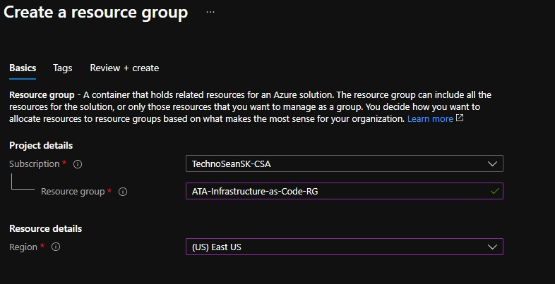
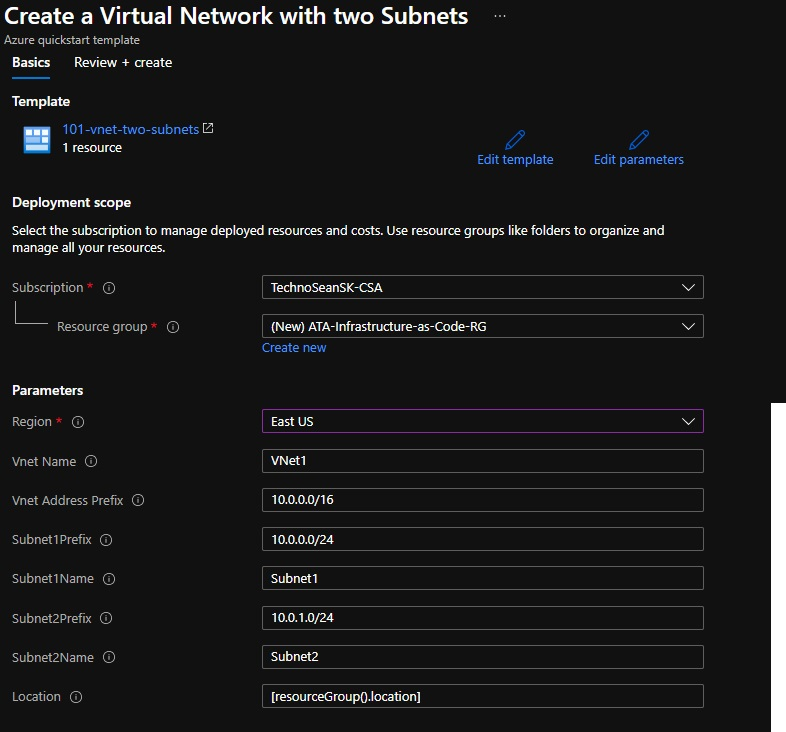
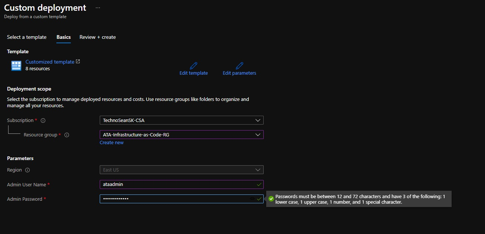

# Azure Infrastructure-as-Code Lab

## Prerequisites

- Microsoft Azure subscription
- Resource Group to deploy Azure services
- Permissions to create the following resource 
    - Virtual Machines
    - Virtual Networks
    - Public IP addresses
    - Network security groups
    - Network load balancers
    - Availability sets

## Step 1: Create a Resource Group
1. In a new browser window, sign in to the [Azure portal](https://portal.azure.com).
2. In the Azure Portal, search for **Resource Groups**.
3. Click on the **Add** button.
4. Fill out the **Basics** tab as follows:
- **Subscription:** Choose your subscription
- **Resource group:** Provide the name of "ATA-Infrastructure-as-Code-RG"
- **Region:** East US

4. Click the **Next: Review + Create** button
5. Click the **Create** button

## Step 2: Deploy an Azure Resource Manager (ARM) Quickstart Template
1. Right click [Quickstart Template Gallery](https://github.com/Azure/azure-quickstart-templates) to open in a new tab.  
2. Browse some of the templates to see what is available
3. Right click [Virtual Network with two Subnets](https://github.com/Azure/azure-quickstart-templates/tree/master/101-vnet-two-subnets) to open in a new tab.  
4. Click **Deloy to Azure** 
5. The Azure Portal will launch. It may ask you to login if you are not already. 
6. Click **Edit Template**
7. Click **Save**
3. Fill out the following fields:
- **Subscription:** Choose your subscription
- **Resource group:** Select the **ATA-Infrastructure-as-Code-RG** resource group that you created for this lab. 
- **Region:** Choose **East US**

4. Leave the rest of the fields as default, and click the **Review + create** button.
5. Click the **Create** button.

## Step 3: Deploy a highly available web server farm via Azure Resource Manager (ARM) Template
1. Right click on the following link and open in a new tab: [IaaS ARM Template](./code/iaas-foundations.json) 
2. Click **Raw**
3. Click **Ctrl-A** to highlight the entire code set.  
4. Click **Ctrl-C** to copy the code to the clipboard.  
5. Right click the following link and open in a new tab [Azure Portal](http://portal.azure.com)
6. Search for **Template Deployment** and select **Template deployment (deploy using custom templates)** 
7. Click **Build your own template in the editor** 
8. Erase everything in the template window and paste in the code from the clipboard by clicking **Ctrl-V**
9. Explore template sections.  
10. Click **Save**
11. Fill out the following fields:
- **Subscription:** Choose your subscription
- **Resource group:** Select the **ATA-Infrastructure-as-Code-RG** resource group that you created for this lab. 
- **Region:** Choose **East US**
- **Admin User Name** Enter a username such as **ataadmin**
- **Admin Password** Enter a password that meets the complexity requirements in the screenshot below such as **Password12345** 

12. Click the **Next: Review + Create** button
13. Click the **Create** button
14. Under **Deployment details** review each of the resources being created, and their type.  