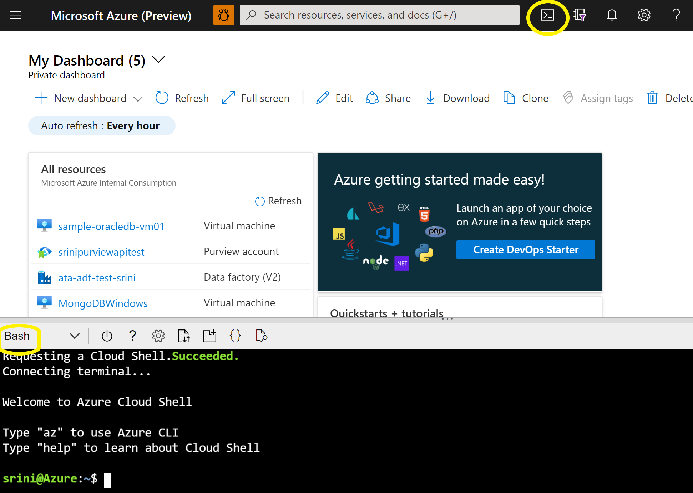
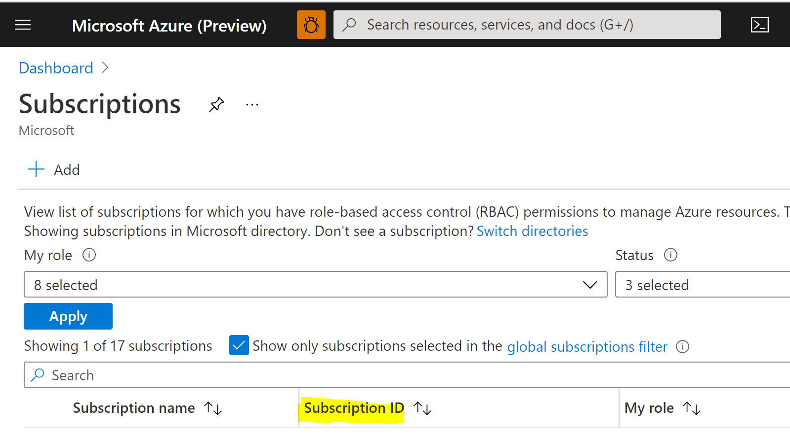
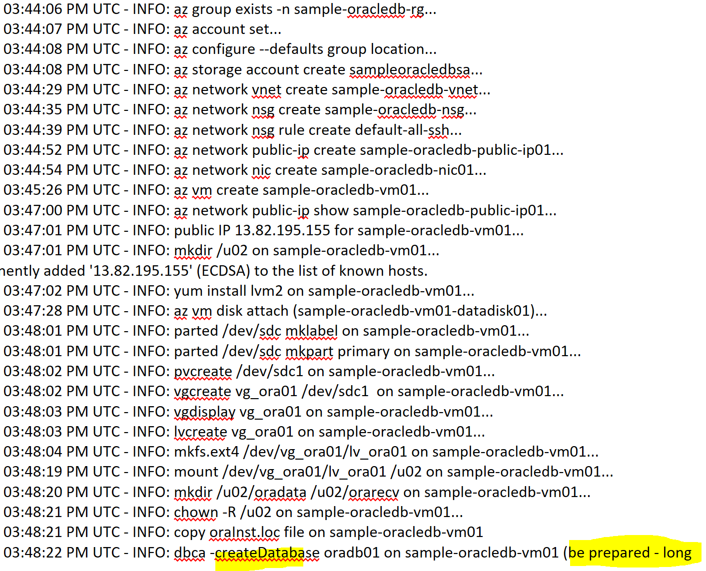
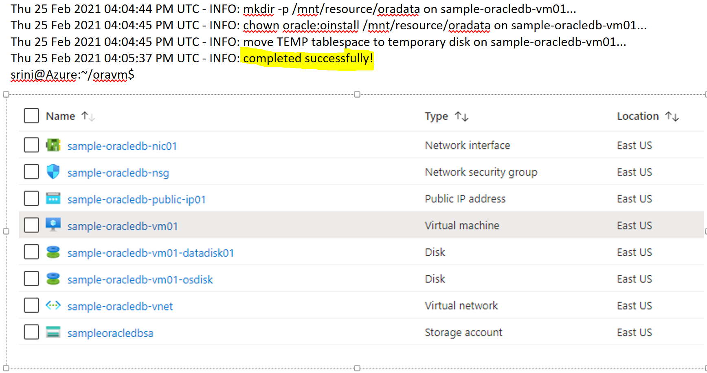
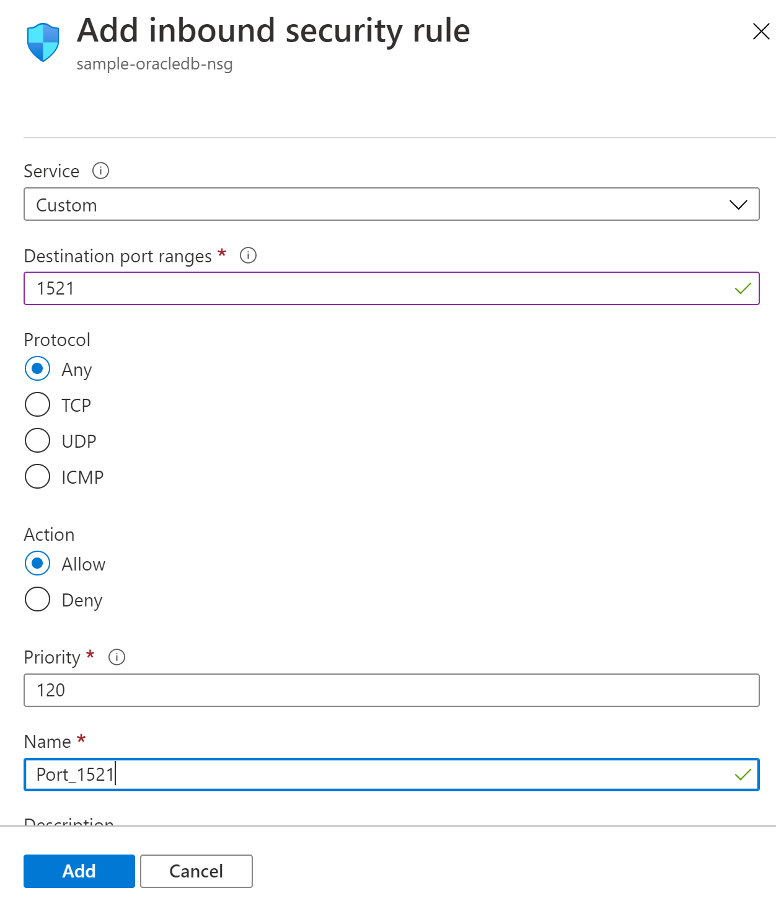
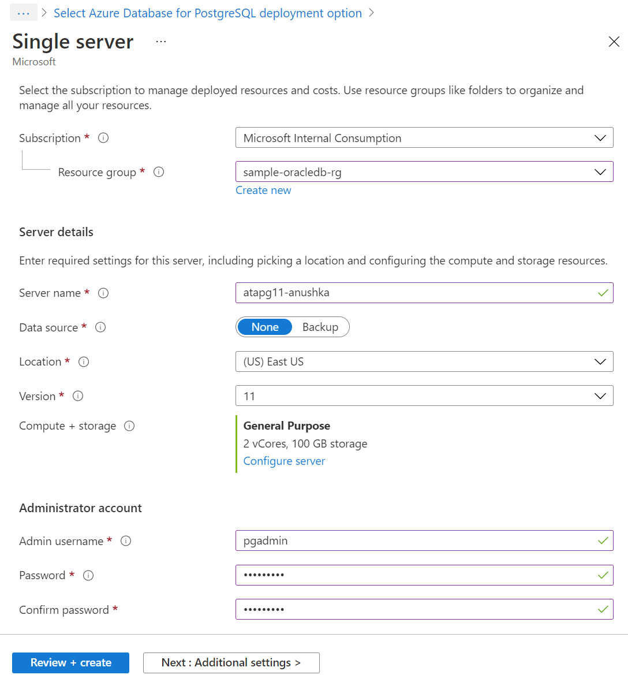
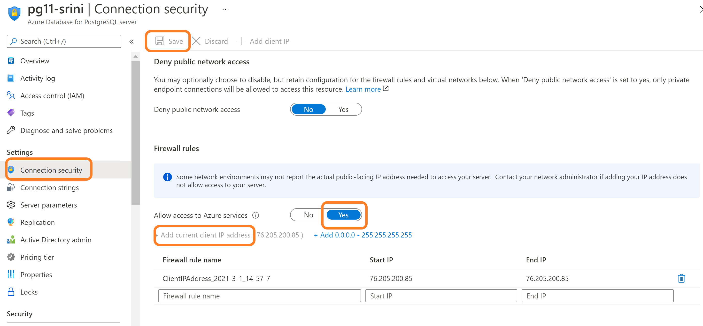
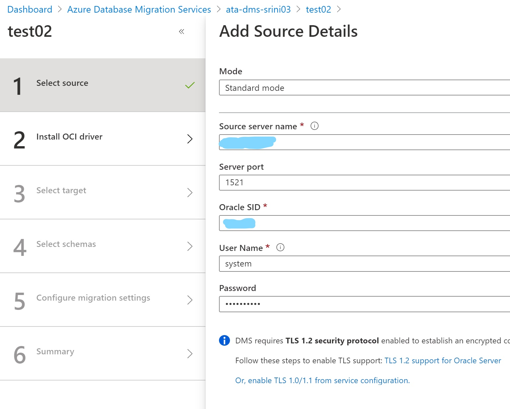
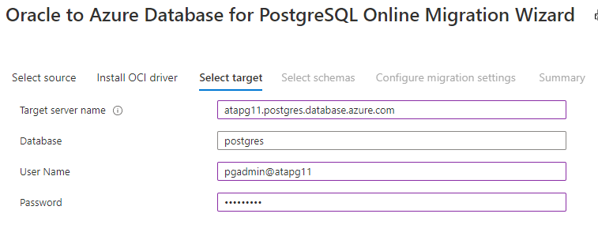
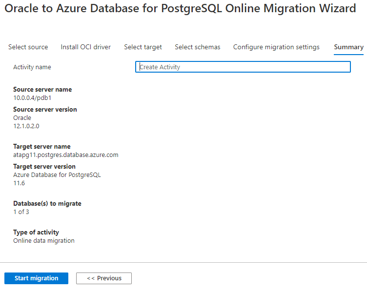

# Oracle Migration To Azure Database for PostgreSQL (Lab)
## Overview
- Azure Database for PostgreSQL is a relational database service based on the open-source Postgres database engine. It's a fully managed database-as-a-service offering that can handle mission-critical workloads with predictable performance, security, high availability, and dynamic scalability. It offers two deployment options Single Server and Hyperscale (Citus). Please access <a href="https://docs.microsoft.com/en-us/azure/postgresql/overview"> this link </a> for more details. 

- This lab provides the steps to migrate Oracle 19c database to Azure PostgreSQL version 11. This labs assumes that you have completed the assessment step using an open source tool <a href="https://datamigration.microsoft.com/scenario/oracle-to-azurepostgresql"> Ora2Pg </a>.

## Pre-requisites
- [Prep-1: Create Oracle Database on Azure VM](#prep-1-create-oracle-database-on-azure-vm)

## Task List
- [Task-1: Create Azure Database for PostgreSQL Service](#task-1-create-azure-database-for-postgresql-service)
- [Task-2: Create Azure Database Migration Service](#task-2-create-azure-database-migration-service)
- [Task-3: Create a project to Migrate Oracle HR schema](#task-3-create-a-project-to-migrate-oracle-hr-schema)
- [Task-4: Execute the initial load](#task-4-execute-the-initial-load)
- [Task-5: Perform the data sync and Prepare for the cutover](#task-5-perform-the-data-sync-and-prepare-for-the-cutover)
- [Task-6: Perform the cutover and go live](#task-6-perform-the-cutover-and-go-live)

### Prep-1: Create Oracle Database on Azure VM
1. Access Cloud Shell 
- Login to Azure Portal
- Start a cloud shell 
- Select Bash shell from dropdown 
- Create a default storage account if you don't have already

2. Copy Install Script
- create a directory called 'oradb-install'
- Open the cr_oravm.sh file from github located in the same folder of this document in a browser and copy the content.
- Use your favorite file editor on linux such as 'vi' and create cr_oravm.sh file to paste the content.
- Give execute permissions to the file by typing 'chmod +x cr_oravm.sh' command.   

3. Get SubscriptionID and Create a resource group
- Use portal and select 'Subscriptions' from the left navigation menu or type 'subscriptions' in the search bar.
- Copy the 'SubscriptionId'

- Type 'Resource' to select 'Resource Group' service
- Select '+' sign to create a new service group
- Enter 'sample-oracledb-rg' as the name
  
4. Run the Script
- Enter the command from the cloud shell in the same folder where you created the install script
- ./cr_oravm.sh -S \<Your SubscriptionId\> -O sample -P oracledb -r eastus -u Oracle:Oracle-Database-Ee:12.2.0.1:12.2.2018072
- Script should start running without any errors. 
- Check the log file in the same folder to troubleshoot issues.

- Make sure you see a log message saying 'be prepared - long wait'
- DO NOT WAIT, please continue with your next task. Come back after 25min to finish the rest of the steps.
- You should see the following message for a successful completion. 

- You have successfully created an Oracle database with sample schema on a Azure VM.

5. Connect to Oracle VM to set the environment
- Type "who am i" in the cloud shell to get the "UserName"
- Locate the public key in ".ssh" directory
- Copy the public key
- Reset the VM password with the public key by accessing "Reset Password" under "Support + troubleshooting" section of Oracle VM left menu from Azure Portal.   
- Access the Oracle VM (sample-oracledb-vm01) from the portal and get the public IP Address.
- connect to the vm by typing "ssh \<UserName\>@\<IPAddress\>"
- switch to root to stop the linux firewall. Not recommended for production
- Type "sudo su - "
- Type "systemctl status firewalld" to check the status of the linux firewall.
- Type "systemctl stop firewalld" to stop the filewall.
- Type "systemctl status firewalld" to verify if the firewall has stopped. 

6. Set Oracle Environment
- Type "sudo su - oralce" to login as oracle user.
- type ". oraenv" and enter "oradb01". make sure you have space after "."
- connect to oracle database by typing "sqlplus / as sysdba".
- Unlock the HR schema account by typing "alter user hr identified by hr account unlock;".
- Connect to HR schema by typing "connect hr/hr;". 
- View table data by typeing "select * from jobs;".
- type "exit" to get out of sqlplus.
- You are able to successfully access Jobs table in Oracle HR schema.

7. Set the connectivity to Oracle Database
- Access Oracle VM from the Azure Portal.
- Create an inbound port rule to provide access to Oracle database from outside.
- Select 'networking' from the left side setting section.
- Select 'Add inbound port rule'. 
- Leave the default values except the following:
- Destination port ranges:1521
- Name: port_1521

- Connect to Oracle HR schema from your favorite database tool for example DBeaver, toad etc
- Enter the following info: 
- Host: <OracleVM_IPAddress>
- Port: 1521
- database: oradb01
- type:SID
- Username: hr
- Password: hr

- View the data in Jobs & Employees tables

- Connection Troubleshooting tip:
- open a command prompt in your local environment.
- type "curl -v telnet://\<OracleVM_IPAddress\>:1521"
- It should come back with "Connected to \<OracleVM_IPAddress\>"

- You have successfully completed the pre-requisits for this lab:

### Task-1: Create Azure Database for PostgreSQL Service
1. Select Azure Database for PostgreSQL service
- Type 'Azure Database for postgresql' on the search bar to select Azure database for postgreSQL service
- Select Single Server option

2. Enter the following details
- Resource group: Select an existing resource group "sample-oracledb-rg" from the drop down.
- Server name: enter 'atapg11-\<yourname\>'.
- Location: select 'East US'
- Version: 11
- Compute + Storage: opt for 2 vCores by selecting 'Configure Server' link 
- Admin username: enter 'pgadmin'
- Password: enter 'atapg123!'

- Click on 'Review + create'.
- Click on 'Create' after the successful validation.
- Server creation takes few minutes. No need to wait, Start Task-2 and come back.

3. Open access to the PgAdmin Client Server
- Access Azure PostgreSQL Service and select 'Connection Security' from the left menu. 
- Set 'Allow access to Azure Services' to 'YES'
- Select 'Add current client IP Address' button to the NSG setup.

4. Install pgadmin tool
- Download PostgreSQL Admin tool using <a href="https://www.pgadmin.org/download/pgadmin-4-windows/">thislink</a>

5. Connect to the Azure PostgreSQL from PgAdmin Tool
- Enter the following:
- Host Name: copy host name from the Azure Portal
- User name:pgadmin@hostname
- Password:atapg123!

- Select 'Databases' and create a new Database
- Enter 'Oracle_Migrate' as the new database
- Create 'PGHR' as the schema

## Task-2: Create Azure Database Migration Service
1. Select Azure Database Migration Service
- Type 'Database Migration' in the search bar to select the service.

2. Enter the following information
- Resource Group: Select the resource group "sample-oracledb-rg" from the dropdown .
- Migration service name: Enter 'ata-dms-\<youname\>'
- Pricing tier: Click on 'Configure tier' and select Premium service.
- Click on 'Networking' button

- Select the existing Virtual Network for the resource group

- Click on 'Review + create'.
- Click on 'Create' after the successful validation.
- It will take a while, don't wait, go to the next step.

3. Enable Supplimental Loging and Archive Loging in Oracle
- Open the Cloud Shell
- Enter the following commands to access the Oracle VM:
- Type "who am i" and get the \<UserName\>
- ssh \<UserName\>@\<YourIP\> to access the VM
- type "sudo su -" to become root 
- type "sudo su - oracle" to become Oracle user
- type ". oraenv" to set the oracle environment
- enter "oradb01' as the ORACLE_SID
- Type "sqlplus \ as sysdba" to connect to the database
- SHUTDOWN IMMEDIATE;
- STARTUP MOUNT;
- ALTER DATABASE ARCHIVELOG;
- ALTER SYSTEM ARCHIVE LOG CURRENT
- ALTER DATABASE OPEN;
- ALTER DATABASE ADD SUPPLEMENTAL LOG DATA;
- SHUTDOWN IMMEDIATE;
- STARTUP;
- run the following commands to check the status:
- select log_mode from v$database;
- You should see 'ARCHIVELOG' as the response.
- select supplemental_log_data_min from v$database;
- You should see 'YES' as the response.
- type exit to come out of sqlplus prompt.
- You successfully enabled Oracle database for on-line migration.

## Task-3: Create a project to Migrate Oracle HR schema
1. Create a migration project 
- Select '+' next to 'New Migration Project' 
- Enter the following information
- Project name: ora19cToPg11
- Source server type: select 'Oracle' from the dropdown list
- Target server type: select 'Azure Database for PostgreSQL' 
- Click on 'Create and Run Activity' button
- It opens up 6 step configuration

2. Add Source Details
- Enter the following Oracle 12c HR database details
- Source Server name: Enter the Instructor provided Oracle Server IP address.
- Server port: Enter the default port number 1521.
- Oracle SID: Enter 'nonpdb' 
- User Name: Enter 'system'
- Password: Enter 'oracleA1'
- Click on Save button.

3. Provide Driver Install Detail
- Download the driver file from <a href="https://aka.ms/OracleDriverDownloads"> Oracle site</a> 
- Access the storage account in the resource group
- Create a file share and upload the driver file
- Get the path, user and password from the connection info as shown in the picture.

- Enter the following location details to access the driver file
- OCI driver path: Get the path from the connect info and add "instantclient-basiclite-windows.x64-12.2.0.1.0.zip" at the end. 
- For Example: \\ora122pgtestsa.file.core.windows.net\oracle-driver\instantclient-basiclite-windows.x64-12.2.0.1.0.zip
- User Name: Get the details from Connect Info
- Password: Get the details from the connect Info. Grab only the text inside the quotes. 
- Click on Save button

4. Add Target Info
- Enter the following info:
- Target Server Name: Get the name from PostgreSQL Overview 
- Database: keep the default value
- User Name: Get the admin name from the PostgreSQL Overview
- Password: Enter the password similar to 'atapg123!'

5. Select Source and Target Schemas
- Select 'HR' from Oracle and 'PGHR' from PostgreSQL

6. Select Source and target table mappings

## Task-4: Execute the initial load
1. Create an activity to start the migration
- Activity Name: 'MigrationTest01'
- Select 'Start Migration' button

2. Check the initial load statistics
- Verify the source and target server and version details. Check the migration status.

## Task-5: Perform the data sync and Prepare for the cutover
- Perform the following operations on the Oracle Database
1. Insert two rows using the SQL commands
- INSERT INTO hr.jobs VALUES('AC_MGR_02', 'Account Manager 02', 50000, 90000);
- INSERT INTO hr.jobs VALUES('AC_MGR_03', 'Account Manager 03', 60000, 99000);
- COMMIT;
2. Update a row using the SQL command
- UPDATE hr.jobs SET JOB_TITLE='Major Accountant' WHERE job_id='AC_ACCOUNT';
- COMMIT;
3. delete a row using the SQL command
- DELETE hr.jobs WHERE job_id='AC_MGR_02';
- COMMIT;
4. Verify all the changes have been captured in DMS and propagated to PostgreSQL

## Task-6: Perform the cutover and go live
1. Stop the source Oracle database
2. Activate cutover
3. Make sure there are no pending changes
4. Update the database connectivity info in all applications accessing the Oracle HR schema.
5. Confirm the cutover

5. Restart the applications with Azure PostgreSQL database connectivity to Go Live!!

- You have successfully migrated Oracle database to Azure PostgreSQL.

  

