<div class="MCWHeader1">
Continuous delivery in Azure DevOps
</div>

<div class="MCWHeader2">
Hands-on lab step-by-step
</div>

<div class="MCWHeader3">
June 2020
</div>

Information in this document, including URL and other Internet Web site references, is subject to change without notice. Unless otherwise noted, the example companies, organizations, products, domain names, e-mail addresses, logos, people, places, and events depicted herein are fictitious, and no association with any real company, organization, product, domain name, e-mail address, logo, person, place or event is intended or should be inferred. Complying with all applicable copyright laws is the responsibility of the user. Without limiting the rights under copyright, no part of this document may be reproduced, stored in or introduced into a retrieval system, or transmitted in any form or by any means (electronic, mechanical, photocopying, recording, or otherwise), or for any purpose, without the express written permission of Microsoft Corporation.

Microsoft may have patents, patent applications, trademarks, copyrights, or other intellectual property rights covering subject matter in this document. Except as expressly provided in any written license agreement from Microsoft, the furnishing of this document does not give you any license to these patents, trademarks, copyrights, or other intellectual property.

The names of manufacturers, products, or URLs are provided for informational purposes only and Microsoft makes no representations and warranties, either expressed, implied, or statutory, regarding these manufacturers or the use of the products with any Microsoft technologies. The inclusion of a manufacturer or product does not imply endorsement of Microsoft of the manufacturer or product. Links may be provided to third party sites. Such sites are not under the control of Microsoft and Microsoft is not responsible for the contents of any linked site or any link contained in a linked site, or any changes or updates to such sites. Microsoft is not responsible for webcasting or any other form of transmission received from any linked site. Microsoft is providing these links to you only as a convenience, and the inclusion of any link does not imply endorsement of Microsoft of the site or the products contained therein.

© 2020 Microsoft Corporation. All rights reserved.

Microsoft and the trademarks listed at https://www.microsoft.com/en-us/legal/intellectualproperty/Trademarks/Usage/General.aspx are trademarks of the Microsoft group of companies. All other trademarks are property of their respective owners.

**Contents**

<!-- TOC -->

- [Continuous delivery in Azure DevOps hands-on lab step-by-step](#continuous-delivery-in-azure-devops-hands-on-lab-step-by-step)
  - [Abstract and learning objectives](#abstract-and-learning-objectives)
  - [Overview](#overview)
  - [Solution architecture](#solution-architecture)
  - [Requirements](#requirements)
  - [Before the hands-on lab](#before-the-hands-on-lab)
  - [Exercise 1: Create an Azure Resource Manager (ARM) template that can provision the web application, PostgreSQL database, and deployment slots in a single automated process](#exercise-1-create-an-azure-resource-manager-arm-template-that-can-provision-the-web-application-postgresql-database-and-deployment-slots-in-a-single-automated-process)
    - [Task 1: Create an Azure Resource Manager (ARM) template using Azure Cloud Shell](#task-1-create-an-azure-resource-manager-arm-template-using-azure-cloud-shell)
    - [Task 2: Configure the list of release environments parameters](#task-2-configure-the-list-of-release-environments-parameters)
    - [Task 3: Add a deployment slot for the "staging" version of the site](#task-3-add-a-deployment-slot-for-the-staging-version-of-the-site)
    - [Task 4: Create the dev environment and deploy the template to Azure](#task-4-create-the-dev-environment-and-deploy-the-template-to-azure)
    - [Task 5: Create the test environment and deploy the template to Azure](#task-5-create-the-test-environment-and-deploy-the-template-to-azure)
    - [Task 6: Create the production environment and deploy the template to Azure](#task-6-create-the-production-environment-and-deploy-the-template-to-azure)
    - [Task 7: Review the resource groups](#task-7-review-the-resource-groups)
    - [Task 8: Update the deployed App Services and Slots to use .NET 5](#task-8-update-the-deployed-app-services-and-slots-to-use-net-5) 
  - [Exercise 2: Create Azure DevOps project and Git Repository](#exercise-2-create-azure-devops-project-and-git-repository)
    - [Task 1: Create Azure DevOps Account](#task-1-create-azure-devops-account)
    - [Task 2: Create a Service Connection](#task-2-create-a-service-connection)
    - [Task 3: Add the Tailspin Toys source code repository to Azure DevOps](#task-3-add-the-tailspin-toys-source-code-repository-to-azure-devops)
  - [Exercise 3: Create Azure DevOps build pipeline](#exercise-3-create-azure-devops-build-pipeline)
    - [Task 1: Create a build pipeline](#task-1-create-a-build-pipeline)
  - [Exercise 4: Create Azure DevOps Multi Stage Release Pipeline](#exercise-4-create-azure-devops-multi-stage-release-pipeline)
    - [Task 1: Modify YAML definition to create a multistage pipeline](#task-1-modify-yaml-definition-to-create-a-multistage-pipeline)
    - [Task 2: Add Test and Production Environments as stages in the pipeline](#task-2-add-test-and-production-environments-as-stages-in-the-pipeline)
  - [Exercise 5: Trigger a build and release](#exercise-5-trigger-a-build-and-release)
    - [Task 1: Manually queue a new build and follow it through the release pipeline](#task-1-manually-queue-a-new-build-and-follow-it-through-the-release-pipeline)
  - [Exercise 6: Setup a pull request policy, create a task branch and submit a pull request](#exercise-6-setup-a-pull-request-policy-create-a-task-branch-and-submit-a-pull-request)
    - [Task 1: Set up a pull request policy](#task-1-set-up-a-pull-request-policy)
    - [Task 2: Create a new branch](#task-2-create-a-new-branch)
    - [Task 3: Make a code change to the task branch](#task-3-make-a-code-change-to-the-task-branch)
    - [Task 4: Submit a pull request](#task-4-submit-a-pull-request)
    - [Task 5: Approve and complete a pull request](#task-5-approve-and-complete-a-pull-request)
  - [After the hands-on lab](#after-the-hands-on-lab)
    - [Task 1: Delete resources](#task-1-delete-resources)

<!-- /TOC -->

# Continuous delivery in Azure DevOps hands-on lab step-by-step

## Abstract and learning objectives 

In this hands-on lab, you will learn how to implement a solution with a combination of Azure Resource Manager templates and Azure DevOps to enable continuous delivery with several Azure PaaS services.

At the end of this workshop, you will be better able to implement solutions for continuous delivery with Azure DevOps in Azure, as well create an Azure Resource Manager (ARM) template to provision Azure resources, create an Azure DevOps project with a Git repository, and configure continuous delivery with Azure DevOps.

## Overview

Tailspin Toys has asked you to automate their development process in two specific ways. First, they want you to define an Azure Resource Manager template that can deploy their application into the Microsoft Azure cloud using Platform-as-a-Service technology for their web application and their PostgreSQL database. Second, they want you to implement a continuous delivery process that will connect their source code repository into the cloud, automatically run their code changes through unit tests, and then automatically create new software builds and deploy them onto environment-specific deployment slots so that each branch of code can be tested and accessed independently.

## Solution architecture

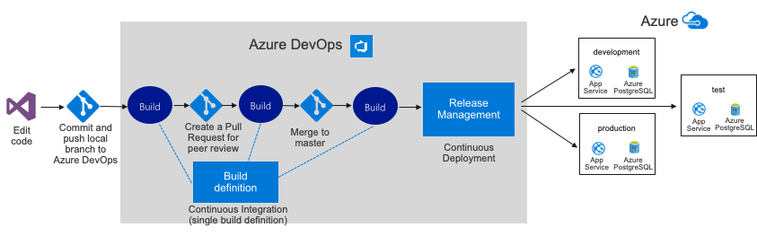

## Requirements

1.  Microsoft Azure subscription

  >**Note**: This entire lab can be completed using only the Azure Portal.

## Before the hands-on lab

Duration: 10 minutes

In this lab, you will configure a developer environment and download the required files for this course if you do not already have one that meets the requirements.

### Prerequisites

-   Microsoft Azure subscription <http://azure.microsoft.com/en-us/pricing/free-trial/>

### Task 1: Use Azure Shell as your development environment

>**Note**: This workshop can be completed using only the Azure Cloud Shell.

1.  In a web browser, navigate to https://shell.azure.com. Alternatively, from the Azure web portal, launch the **Azure Cloud Shell**. It has common Azure tools preinstalled and configured to use with your account. Make sure you are in **bash** mode.

    

2.  From inside the Azure Cloud Shell type these commands to configure Git:

    ```bash
    git config --global user.name "<your name>"
    ```

    ```bash
    git config --global user.email <your email>
    ```

>**Note**: Replace the <your name> and <your email> placeholders with your own full name and e-mail address respectively, removing the '<' and '>' characters from the placeholders. This information will be used by the Git CLI for any commits you might do from Azure Cloud Shell.

### Task 2: Download the exercise files

1.  Using the Azure Cloud Shell, you can download the file by executing the following command inside the Cloud Shell window (all on one line):

    ```bash
    curl -o studentfiles.zip https://cloudworkshop.blob.core.windows.net/agile-continous-delivery/studentfiles_dn5.zip
    ```  

2.  Extract the contents of the file to the new folder. Using the Azure Cloud Shell, you can execute the following command inside the Cloud Shell window:

    ```bash
    unzip studentfiles.zip
    ```

3.  When unzipped, there will be a new folder named **studentfiles**. Navigate to the newly created **studentfiles** directory.

    ```bash
    cd studentfiles
    ```
   
4.  Inside the **studentfiles** folder, there are two folders named **armtemplate** and **tailspintoysweb**. The workshop will refer to these folders throughout the exercises.

## Exercise 1: Create an Azure Resource Manager (ARM) template that can provision the web application, PostgreSQL database, and deployment slots in a single automated process

Duration: 45 Minutes

Tailspin Toys has requested three Azure environments (dev, test, production), each consisting of the following resources:

-   App Service

    -   Web App

    -   Deployment slots (for zero-downtime deployments)

-   PostgreSQL Server

    -   PostgreSQL Database

Since this solution is based on Azure Platform-as-a-Service (PaaS) technology, it should take advantage of that platform by utilizing automatic scale for the web app and the PostgreSQL Database PaaS service instead of running virtual machines.

### Task 1: Create an Azure Resource Manager (ARM) template using Azure Cloud Shell

1.  From within the **Azure Cloud Shell** locate the folder where you previously unzipped the Student Files. Open **Code** to this folder with the command below. It should also contain two sub-folders: **armtemplate** and **tailspintoysweb**.

    ```bash
    code .
    ```

    
  
2.  In the Code Explorer window, select the **armtemplate** sub-folder and open the **azuredeploy.json** file by selecting it.

    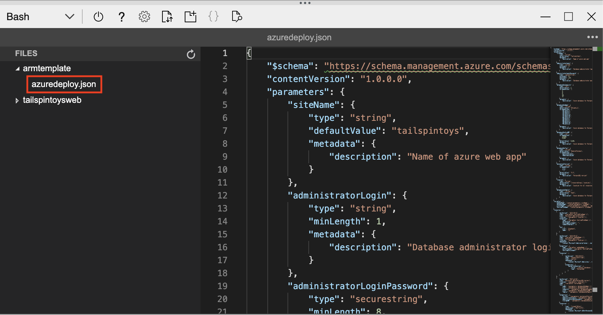

3.  In the open editor window for the **azuredeploy.json**, scroll through the contents of the Azure Resource Manager Template. This template contains all the necessary code to deploy a Web App and a PostgreSQL database to Azure.

    >**Note**: If you would like to use this template in a future deployment of your own, it can be found in the [Azure Quickstart Templates repository on GitHub](https://github.com/Azure/azure-quickstart-templates). This specific file can be found [here](https://raw.githubusercontent.com/Azure/azure-quickstart-templates/master/101-webapp-managed-postgresql/azuredeploy.json).

### Task 2: Configure the list of release environments parameters

1.  Next, you need to configure a list of release environments we'll be deploying to. Our scenario calls for adding three environments: dev, test, and production. This is going to require the addition of some manual code. At the top of the **azuredeploy.json** file, locate the following line of code (on or around line 4).
    ```json
    "parameters": {
    ```  

2.  Insert the following code immediately below that line of code.

    ```json
    "environment": {
        "type": "string",
        "metadata": {
            "description": "Name of environment"
        },
        "allowedValues": [
          "dev",
          "test",
          "production"
        ]
    },
    ```

    After adding the code, it will look like this:

    

    Save the file.

    >**Note**: The **environment** parameter will be used to generate environment specific names for our web app.

### Task 3: Add a deployment slot for the "staging" version of the site

1.  Next, you need to add the "staging" deployment slot to the web app. This is used during a deployment to stage the new version of the web app. This is going to require the addition of some manual code. In the **azuredeploy.json** file, add the following code to the "resources" array, just above the element for the "connectionstrings" (on or around line 156).

    ```json
    {
        "apiVersion": "2016-08-01",
        "name": "staging",
        "type": "slots",
        "tags": {
            "displayName": "Deployment Slot: staging"
        },
        "location": "[resourceGroup().location]",
        "dependsOn": [
            "[resourceId('Microsoft.Web/Sites/', variables('webAppName'))]"
        ],
        "properties": {
        },
        "resources": []
    },
    ```

    After adding the code, it will look like this:

    Save the file.

    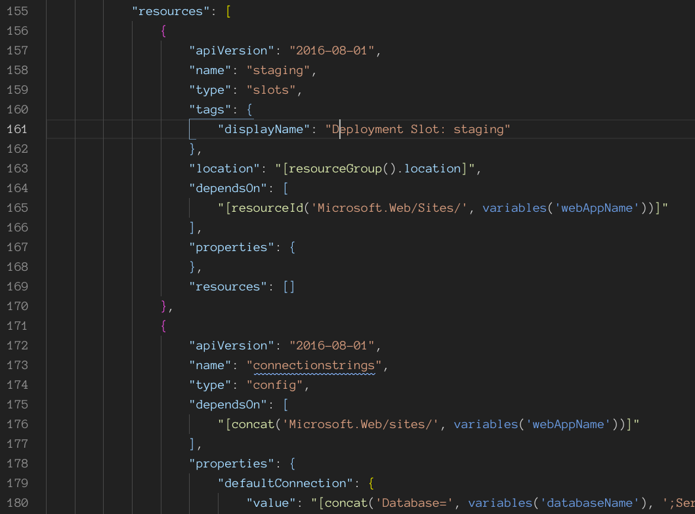

    The complete ARM template should look like the following:

    ```json
    {
        "$schema": "https://schema.management.azure.com/schemas/2015-01-01/deploymentTemplate.json#",
        "contentVersion": "1.0.0.0",
        "parameters": {
            "environment": {
                "type": "string",
                "metadata": {
                    "description": "Name of environment"
                },
                "allowedValues": [
                    "dev",
                    "test",
                    "production"
                ]
            },
            "siteName": {
                "type": "string",
                "defaultValue": "tailspintoys",
                "metadata": {
                    "description": "Name of azure web app"
                }
            },
            "administratorLogin": {
                "type": "string",
                "minLength": 1,
                "metadata": {
                    "description": "Database administrator login name"
                }
            },
            "administratorLoginPassword": {
                "type": "securestring",
                "minLength": 8,
                "maxLength": 128,
                "metadata": {
                    "description": "Database administrator password"
                }
            },
            "databaseSkuCapacity": {
                "type": "int",
                "defaultValue": 2,
                "allowedValues": [
                    2,
                    4,
                    8,
                    16,
                    32
                ],
                "metadata": {
                    "description": "Azure database for PostgreSQL compute capacity in vCores (2,4,8,16,32)"
                }
            },
            "databaseSkuName": {
                "type": "string",
                "defaultValue": "GP_Gen5_2",
                "allowedValues": [
                    "GP_Gen5_2",
                    "GP_Gen5_4",
                    "GP_Gen5_8",
                    "GP_Gen5_16",
                    "GP_Gen5_32",
                    "MO_Gen5_2",
                    "MO_Gen5_4",
                    "MO_Gen5_8",
                    "MO_Gen5_16",
                    "MO_Gen5_32"
                ],
                "metadata": {
                    "description": "Azure database for PostgreSQL sku name "
                }
            },
            "databaseSkuSizeMB": {
                "type": "int",
                "allowedValues": [
                    102400,
                    51200
                ],
                "defaultValue": 51200,
                "metadata": {
                    "description": "Azure database for PostgreSQL Sku Size "
                }
            },
            "databaseSkuTier": {
                "type": "string",
                "defaultValue": "GeneralPurpose",
                "allowedValues": [
                    "GeneralPurpose",
                    "MemoryOptimized"
                ],
                "metadata": {
                    "description": "Azure database for PostgreSQL pricing tier"
                }
            },
            "postgresqlVersion": {
                "type": "string",
                "allowedValues": [
                    "9.5",
                    "9.6"
                ],
                "defaultValue": "9.6",
                "metadata": {
                    "description": "PostgreSQL version"
                }
            },
            "location": {
                "type": "string",
                "defaultValue": "[resourceGroup().location]",
                "metadata": {
                    "description": "Location for all resources."
                }
            },
            "databaseskuFamily": {
                "type": "string",
                "defaultValue": "Gen5",
                "metadata": {
                    "description": "Azure database for PostgreSQL sku family"
                }
            }
        },
        "variables": {
            "webAppName": "[concat(parameters('siteName'), '-', parameters('environment'), '-', uniqueString(resourceGroup().id))]",
            "databaseName": "[concat(parameters('siteName'), 'db', parameters('environment'), uniqueString(resourceGroup().id))]",
            "serverName": "[concat(parameters('siteName'), 'pgserver', parameters('environment'), uniqueString(resourceGroup().id))]",
            "hostingPlanName": "[concat(parameters('siteName'), 'serviceplan', uniqueString(resourceGroup().id))]"
        },
        "resources": [
            {
                "apiVersion": "2016-09-01",
                "name": "[variables('hostingPlanName')]",
                "type": "Microsoft.Web/serverfarms",
                "location": "[parameters('location')]",
                "properties": {
                    "name": "[variables('hostingPlanName')]",
                    "workerSize": "1",
                    "hostingEnvironment": "",
                    "numberOfWorkers": 0
                },
                "sku": {
                    "Tier": "Standard",
                    "Name": "S1"
                }
            },
            {
                "apiVersion": "2016-08-01",
                "name": "[variables('webAppName')]",
                "type": "Microsoft.Web/sites",
                "location": "[parameters('location')]",
                "dependsOn": [
                    "[concat('Microsoft.Web/serverfarms/', variables('hostingPlanName'))]"
                ],
                "properties": {
                    "name": "[variables('webAppName')]",
                    "serverFarmId": "[variables('hostingPlanName')]",
                    "hostingEnvironment": ""
                },
                "resources": [
                    {
                        "apiVersion": "2016-08-01",
                        "name": "staging",
                        "type": "slots",
                        "tags": {
                            "displayName": "Deployment Slot: staging"
                        },
                        "location": "[resourceGroup().location]",
                        "dependsOn": [
                            "[resourceId('Microsoft.Web/Sites/', variables('webAppName'))]"
                        ],
                        "properties": {},
                        "resources": []
                    },
                    {
                        "apiVersion": "2016-08-01",
                        "name": "connectionstrings",
                        "type": "config",
                        "dependsOn": [
                            "[concat('Microsoft.Web/sites/', variables('webAppName'))]"
                        ],
                        "properties": {
                            "defaultConnection": {
                                "value": "[concat('Database=', variables('databaseName'), ';Server=', reference(resourceId('Microsoft.DBforPostgreSQL/servers',variables('serverName'))).fullyQualifiedDomainName, ';User Id=', parameters('administratorLogin'),'@', variables('serverName'),';Password=', parameters('administratorLoginPassword'))]",
                                "type": "PostgreSQL"
                            }
                        }
                    }
                ]
            },
            {
                "apiVersion": "2017-12-01",
                "type": "Microsoft.DBforPostgreSQL/servers",
                "location": "[parameters('location')]",
                "name": "[variables('serverName')]",
                "sku": {
                    "name": "[parameters('databaseSkuName')]",
                    "tier": "[parameters('databaseSkuTier')]",
                    "capacity": "[parameters('databaseSkucapacity')]",
                    "size": "[parameters('databaseSkuSizeMB')]",
                    "family": "[parameters('databaseskuFamily')]"
                },
                "properties": {
                    "version": "[parameters('postgresqlVersion')]",
                    "administratorLogin": "[parameters('administratorLogin')]",
                    "administratorLoginPassword": "[parameters('administratorLoginPassword')]",
                    "storageMB": "[parameters('databaseSkuSizeMB')]"
                },
                "resources": [
                    {
                        "type": "firewallRules",
                        "apiVersion": "2017-12-01",
                        "dependsOn": [
                            "[concat('Microsoft.DBforPostgreSQL/servers/', variables('serverName'))]"
                        ],
                        "location": "[parameters('location')]",
                        "name": "[concat(variables('serverName'),'firewall')]",
                        "properties": {
                            "startIpAddress": "0.0.0.0",
                            "endIpAddress": "255.255.255.255"
                        }
                    },
                    {
                        "name": "[variables('databaseName')]",
                        "type": "databases",
                        "apiVersion": "2017-12-01",
                        "properties": {
                            "charset": "utf8",
                            "collation": "English_United States.1252"
                        },
                        "dependsOn": [
                            "[concat('Microsoft.DBforPostgreSQL/servers/', variables('serverName'))]"
                        ]
                    }
                ]
            }
        ]
    }    
    ```

### Task 4: Create the dev environment and deploy the template to Azure

Now that the template file has been uploaded, we'll deploy it several times to create each of our desired environments: *dev*, *test*, and *production*. Let's start with the **dev** environment.

1.  In the **Azure Cloud Shell** terminal, from the same folder that your ARM template resides in, enter the following command and press **Enter**:

    ```bash
    echo "Enter the Resource Group name:" &&
    read resourceGroupName &&
    echo "Enter the location (i.e. westus, centralus, eastus):" &&
    read location
    ```  

    Enter the name of a resource group you want to deploy the resources to (i.e. TailSpinToysRG). If it does not already exist, the template will create it. Then, select **Enter**.  

    Next, you're prompted to enter an Azure region (location) where you want to deploy your resources to (i.e. westus, centralus, eastus). 
    
    Enter the name of an Azure region and then press **Enter**.

2. Create the resource group:

    ```bash
    az group create --name $resourceGroupName --location "$location"
    ```  

3. Validate that you are in the correct directory. Run an `ls` command and you should see the output `azuredeploy.json`.  If you don't see that file, use `cd <directory>` to move to the `armtemplate` directory.  

    ```bash  
    ls
    ```  

    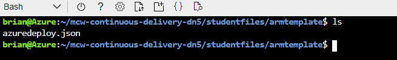

    >**Note**: Your path will likely be different than what is shown, as I put everything into a subfolder, which you likely did not do, and that is just fine.  

    Once you are certain you are in the correct folder, run the following command:  

    ```bash  
    az deployment group create --resource-group $resourceGroupName --template-file "azuredeploy.json"
    ```  
4.  Next, you're asked to enter a choice for environments you want to deploy to. The template will use your choice to concatenate the name of the environment with the name of the resource during provisioning. 
    
    For this first run, select the **dev** environment by entering **1** and then pressing **Enter**.
    
    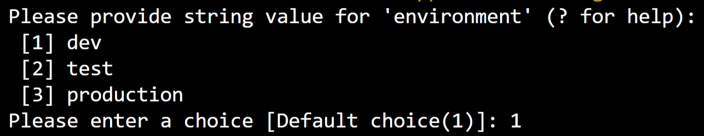 

5.  Supply an administrator login (username) for the PostgreSQL server and database. This will be the username credential you would need to enter to connect to your newly created database. 
    
    For the **administratorLogin**, enter a username value (e.g. **azureuser**) and then press **Enter**.

    

6.  Supply an administrator password for the PostgreSQL server and database. This will be the password credential you would need to enter to connect to your newly created database. Enter the following password: **at@February2021** then press **Enter**.

7. This will kick off the provisioning process which takes a few minutes to create all the resources for the environment. This is indicated by the "Running" text displayed at the bottom of the Azure Cloud Shell while the command is executing.

    

8. After the template has completed, JSON is output to the Azure Cloud Shell window with a *Succeeded* message.

    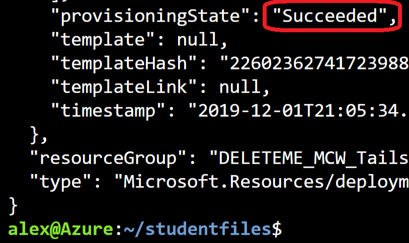

    >**Note**: The above steps were used to provision the *dev* environment. Most of these same steps will be repeated for the *test* and *production* environments below.  

### Task 5: Create the test environment and deploy the template to Azure

The following steps are very similar to what was done in the previous task with the exception that you are now creating the **test** environment. 

Repeat the above steps and select to create the **2. test** environment. You can use the same values as used in the dev environment.

### Task 6: Create the production environment and deploy the template to Azure

The following steps are very similar to what was done in the previous task with the exception that you are now creating the **production** environment. 

Repeat the above steps and select to create the **3. production** environment. You can use the same values as used in the dev environment.

### Task 7: Review the resource groups

1. You can now close CloudShell and go back to the Azure Portal. Navigate to the resource group where all of the resources have been deployed. It should look similar to the screenshot below.

    >**Note**: The specific names of the resources will be slightly different than what you see in the screenshot based on the unique identities assigned.

    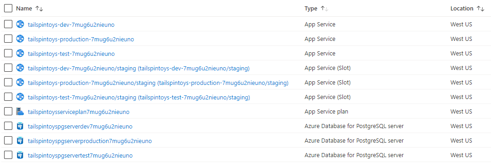  

### Task 8: Update the deployed App Services and Slots to use .NET 5   

After all of your environments are deployed, navigate to the azure portal and update all three app services and their corresponding staging slots to use the .Net 5 framework.  

1. In the window opened from the previous step, sort the deployed resources by type to get the App Services and their slots listed as the first six items (remember that the unique names will be different for you).  

    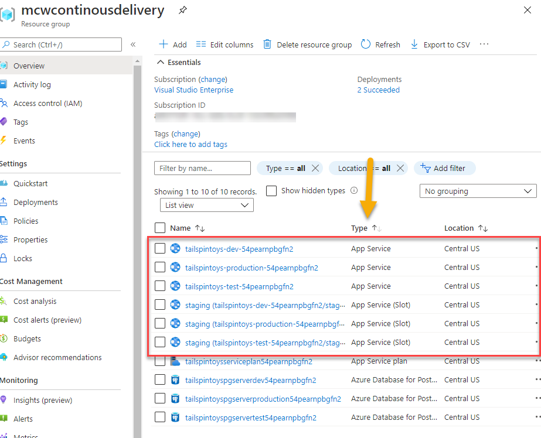  

2. For each of the three app services and their corresponding slots, you will do the following:  

    **Right-click on the name and select 'open in new tab'**.  

    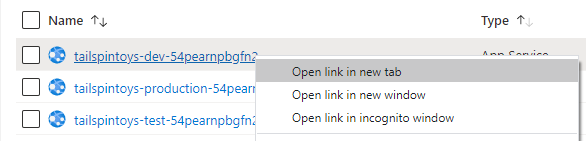  

    * **In the new tab, browse to configuration, then select `General Settings`.  On the General Settings tab, select the `.Net 5` item from the dropdown for the .NET Framework Version.**  

    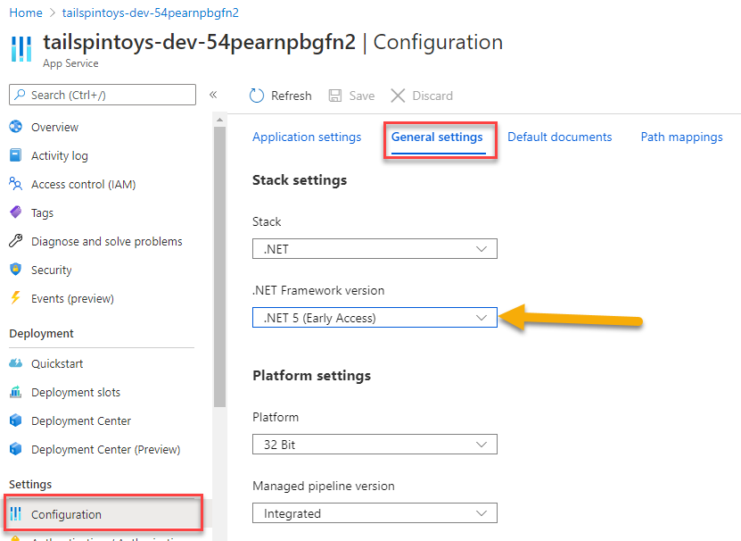  

    **After making the change, don't forget to `Save` the changes at the top**.

    Lastly, **do not forget to do this for all six entries, especially the staging slots where your pipeline will deploy the solutions**.

## Exercise 2: Create Azure DevOps project and Git Repository

Duration: 15 Minutes

In this exercise, you will create and configure an Azure DevOps account along with an Agile project.

### Task 1: Create Azure DevOps Account

1. Browse to the **Azure DevOps** site at <https://dev.azure.com>.

2. If you do not already have an account, select the **Start free** button.
    
    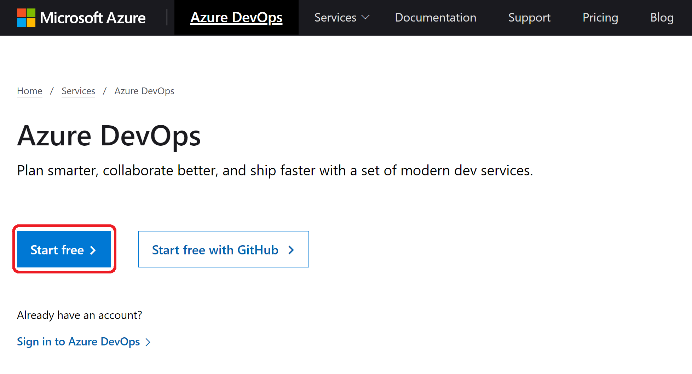

3. Authenticate with a Microsoft account.

4. Choose **Continue** to accept the Terms of Service, Privacy Statement, and Code of Conduct.

5. Choose a name for new your project. For the purposes of this scenario, we will use *TailspinToys*. Choose **Private** in the Visibility section so that our project is only visible to those who we specifically grant access. Then, select **+ Create project**.
    
    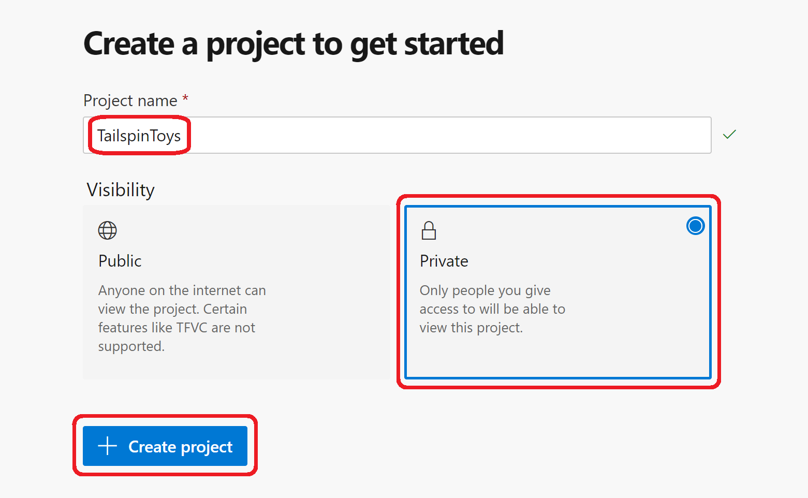

6. Once the Project is created, choose the **Repos** menu option in the left-hand navigation.

    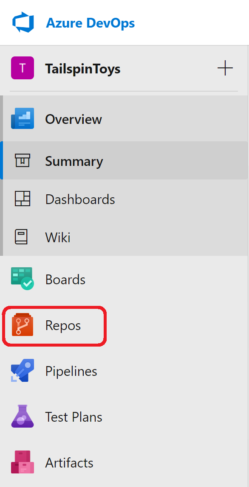

7. On the *Repos* page for the **TailspinToys** repository and locate the "Push an existing repository from command line" section. Choose the **Copy push commands to clipboard** button to copy the contents of the panel. We're going to use these commands in an upcoming step.

    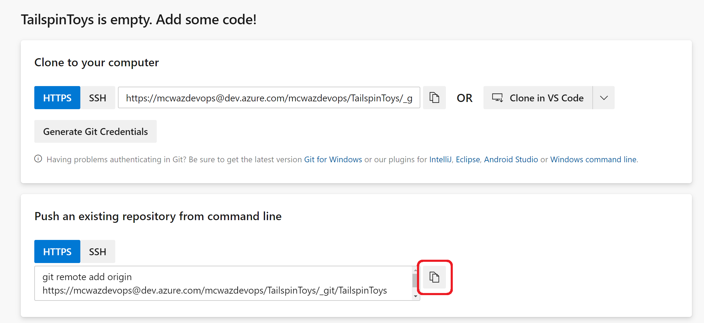


### Task 2: Create a Service Connection 

In this Task, you will configure the Azure DevOps with a Service Connection that allows Azure Dev Ops to securely connect to the resource group you just created in Azure.   

**Before continuing, make sure that you are signed in to both the Azure Portal and Azure DevOps using the same Microsoft account**!

1. In Azure DevOps, ensure you are in the project that you just created, and from the bottom corner of the page, select **Project settings**..
    
    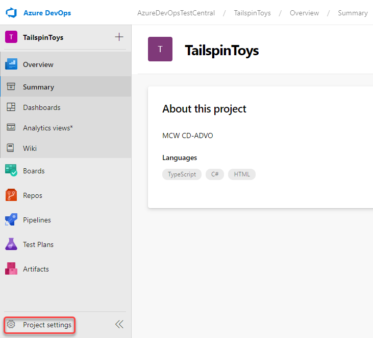

2. Under Pipelines, select **Service connections**.

    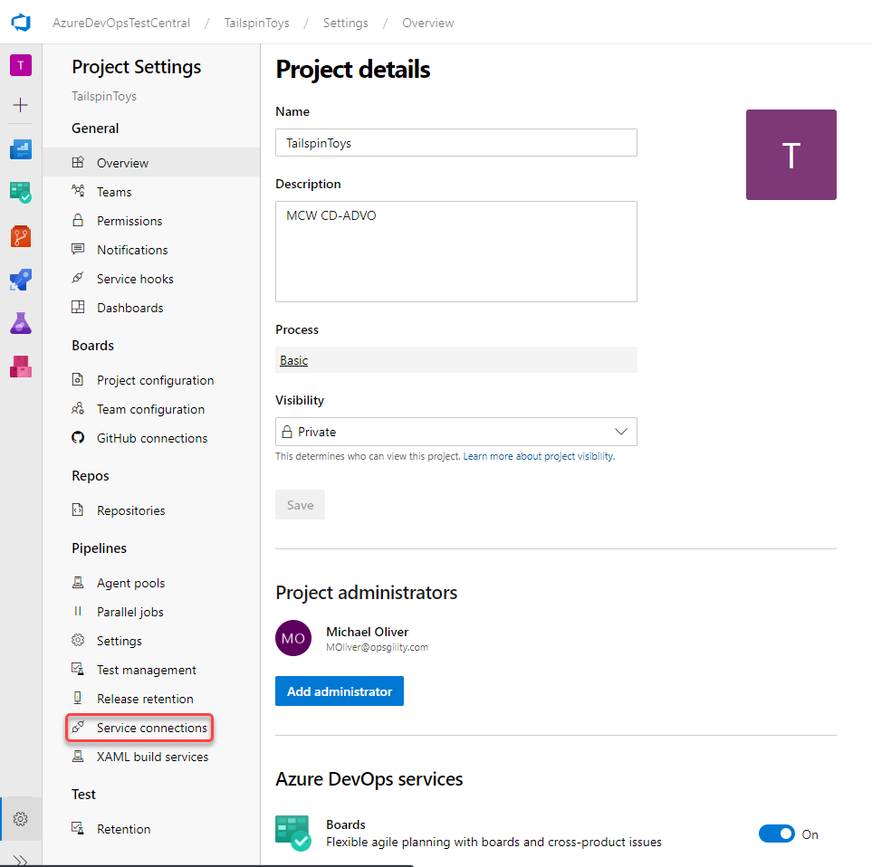

3. If this is your first service connection, you will see the below image and you can select **Create service connection** button to create your first service connection.

    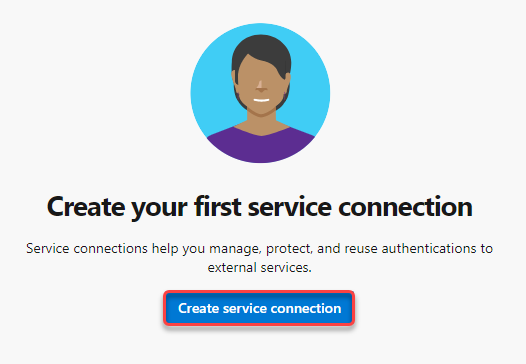
    
    However, if there are existing service connections you will see a view like below, can add a new one by selecting **New Service connection**:

    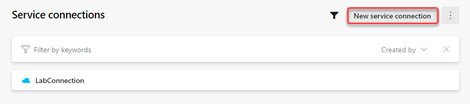

    In either case, you will get a **New service connection** panel showing common connection types.   
    
    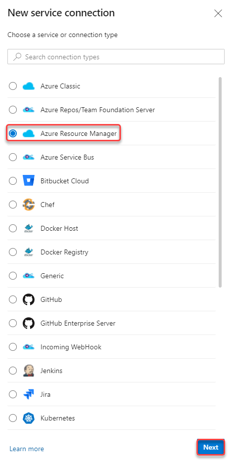

4. On this panel, **Select *Azure Resource Manager** and then select **Next**.

    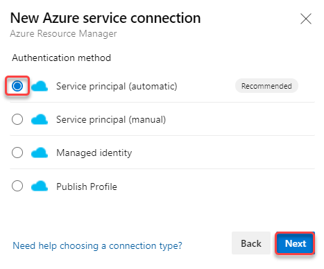
   
5. Near the top of the page, select **Service Principal (Automatic)** and select **Next** to view the **New Azure service connection** panel:

    

   >**Note**: If you logged in to Azure DevOps using a different account than what you used to login to your Azure Subscription, then follow these [instructions](https://docs.microsoft.com/en-us/azure/active-directory/develop/howto-create-service-principal-portal) to manually create a Service Principal in Azure and then select the **Service Principal (manual)** option in this menu . 

    
6. On this panel ensure the following settings:

    **Scope level:**  Subscription

    **Subscription:**	Choose your Azure subscription

    **Resource Group:**	Choose the resource group you created earlier
    
    **Service Connection Name:**	 Enter a string value such as "LabConnection"  so you can find this later. 

    Ensure **Grand access permissions to all pipelines** is checked

    >**Note**: During the Service Connection creation process, you might be prompted to sign into your Microsoft account if Azure DevOps detects it requires authentication. 
    
7. And finally, select **Save**.   
 
    Azure DevOps performs a test connection to verify that it can connect to your Azure subscription. If Azure DevOps can't connect, you have the chance to sign in a second time.

    Now you have a valid service connection!   Azure DevOps will use this to perform deployments in the resource group you created earlier.   

### Task 3: Add the Tailspin Toys source code repository to Azure DevOps

In this Task, you will configure the Git repository for the Azure DevOps instance you just created. Using Git command line tools from Azure Cloud Shell, you will configure the remote repository and then push your source code up to your Azure DevOps repository.

1. Open the **Azure Cloud Shell** to the folder where the Student Files were unzipped (e.g. studentfiles). Then, navigate to the **tailspintoysweb** folder which contains the source code for our web application.

    > **Note**: If this folder doesn't exist ensure you followed the instructions in the 'Before the hands-on lab'.  
    
    If you are using the Azure Cloud Shell you will be prompted for credentials to connect to your Azure DevOps instance when using Git. 
    
    The best way to authenticate is to use a [personal access token](https://docs.microsoft.com/en-us/azure/devops/organizations/accounts/use-personal-access-tokens-to-authenticate), (or PAT), configured with scope *Code, Full permissions*. After this configuration, you can then use the PAT as a password (leaving the username empty) when prompted by Git. 

2. In Azure Cloud Shell, initialize a local Git repository by running the following commands:

    > If a ".git" folder and local repository already exists in the folder, then you will need to delete the ".git" folder first before running the commands below to initialize the Git repository.

    ```bash
    git init
    git add . 
    git commit -m "initial checkin"
    ```

3. Paste the first command you copied from Azure DevOps. It will resemble the command below:
    
    ```bash
    git remote add origin https://<your-org>@dev.azure.com/<your-org>/TailspinToys/_git/TailspinToys
    git push -u origin --all
    ```  

4. In case the *Password for 'https://\<your-org>@dev.azure.com':* prompt appears, follow the next steps to generate a PAT (Personal Access Token) for your Azure DevOps organization. Otherwise, skip to step 13.
    
    > **Note**: **Do Not Close Azure Cloud Shell**. Use a different browser tab for the steps for creating a new PAT token.  Also, these PAT configuration steps are also useful when using a multi-factored protected user account with Azure DevOps.

5. In Azure DevOps, choose on the second to last icon on the top menu in the left-hand side of the screen, representing a user and a small gear icon.

6. From the context menu, choose **Personal access tokens**.

    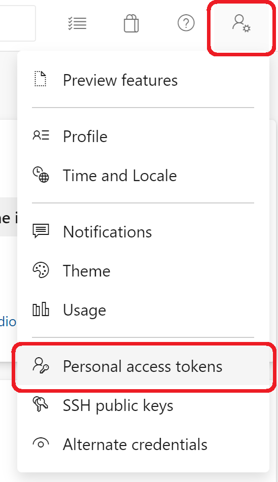

7. If the *Create a new personal access token* panel has appeared, skip to the next step. Otherwise, select the **+ New Token** button.

    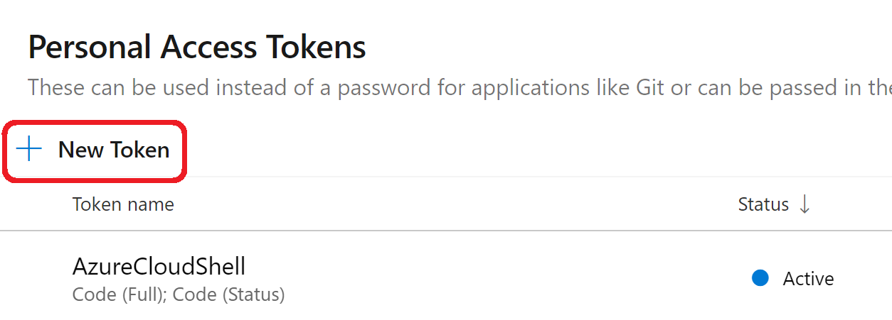

8. In the *Create a new personal access token* panel, type in a descriptive name for the new token, and from the *Code* section, choose **Full** and **Status**.

    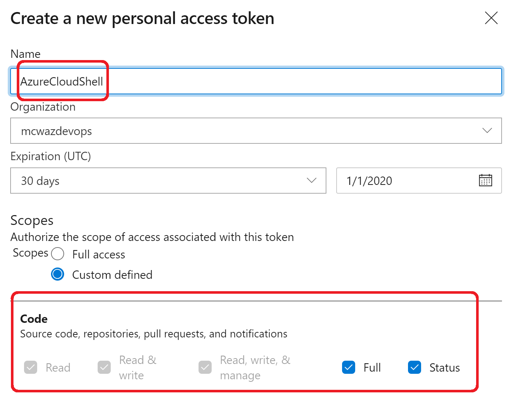

9. In the *Create a new personal access token* panel, select the **Create** button.

10. From the success confirmation panel, select the **Copy to clipboard** button to copy the newly created PAT token to clipboard.

    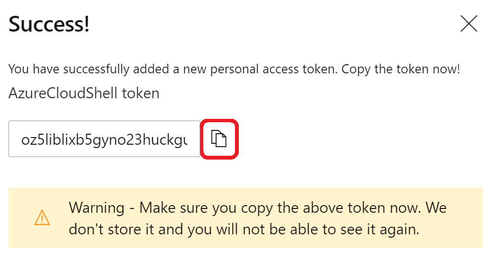

11. In Azure Cloud Shell, paste the PAT token and press **Enter**.   Git will push the contents of your local repository in Azure Cloud Shell to your new Azure DevOps project repository.  

      

12. Navigate to the Repos > Files page which shows the files in the repository. You may need to refresh the page to see the updated files. Your source code is now appearing in Azure DevOps.

    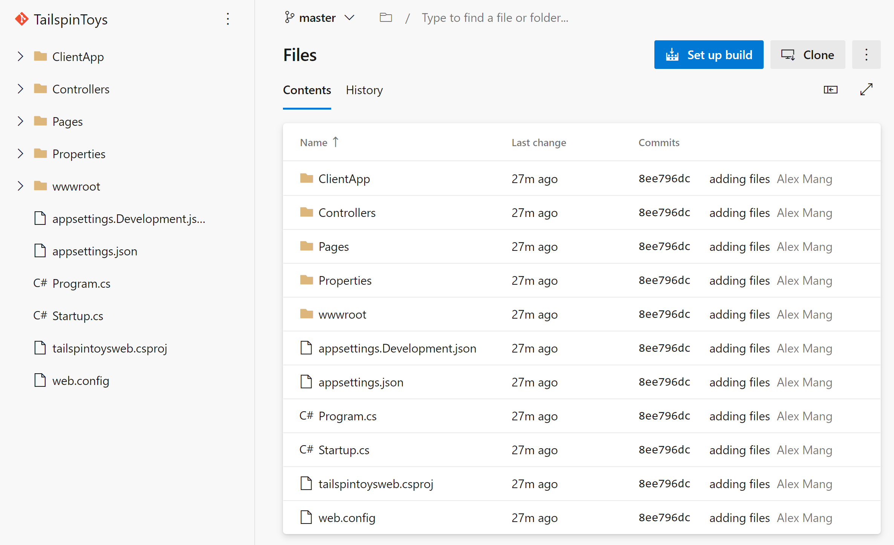

13. In the files for your repo, navigate to the folder `Client App -> src`.  If there is a file named **package-lock.json**, hover on the file, and from the context menu, choose **Delete**.

    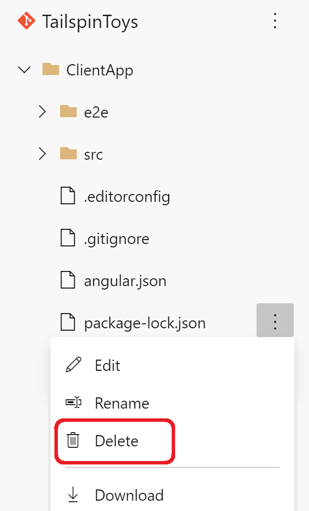  

    >**Note**: If there is no package.json file then you don't need to do anything else here.  You can skip to Exercise 3. 

15. Confirm the deletion, and when the commit panel shows, validate the commit message and choose **Commit**.

## Exercise 3: Create Azure DevOps build pipeline

Duration: 15 Minutes

**Azure DevOps Pipelines**

 Implementing CI and CD pipelines helps to ensure a consistent, repeatable process is used to build, test, and release code.   This results in higher quality code that's readily available to users.  Azure DevOps Pipelines provides an easy and extensible way to provide consistency when building and releasing your projects, while also making the configuration available to authorized users on your team.   Let's take a high-level look at the major components that make up an Azure DevOps Pipeline:  

**Stages** 

In essence, Azure Pipelines are made of one or more *stages* representing a given CI/CD process and are the major divisions of action in a pipeline.  Actions such as: "build this app", "run these tests", and "deploy to this environment" are good examples of stages.  Stages themselves, decompose to of one or more *Jobs*.  

**Jobs**

Jobs consist of a linear series of steps within a stage, where each step can be tasks, scripts, or references to external YAML templates that represent the tactical aspects of an action.  It is important to note that both stages and jobs can run in a simple linear fashion, or may be arranged into more complex *dependency graphs*, e.g. "run this stage before that one" or "this job depends on the output of that job".   

From here you can see that this simple relationship can embody both simple and complex staged build and release processes through a defined execution hierarchy. For Azure DevOps, this hierarchy is defined in the structure of a YAML (Yet Another Markup Language) file, which is a structured markup file that can be managed like any other source file.

**Configuration As Code**

This entire concept is based on a *Configuration As Code* methodology.   This means declaratively defining the pipeline, and pipeline components such as stages, tasks, and conditions in detail.   Using YAML provides more visibility into pipeline structure and condition in once concise place, and also provides integration and automation opportunities as well.  In Azure DevOps, YAML defines both "Build" or "Continuous Integration" pipelines as well as "Release" or "Continuous Delivery" pipelines in one shot, and this is what is meant by the term *"Unified YAML Pipeline"*.    

While teams can use the **Azure DevOps Pipeline visual designer** to create multistage build and release pipelines to support a wide array of CI/CD scenarios, many teams prefer to define their build and release pipelines by editing the YAML configuration directly. A YAML build definition can be added to a project by including the YAML source file at the repository root. Azure DevOps will reference this configuration, evaluate it, and execute the configuration during build runs.  

Azure DevOps also provides default templates within the editing workflow, for popular project types, integration points, and common tasks, and this works alongside a simple YAML designer to streamline the process of defining build and release tasks.

In this lab, you will build up a pipeline YAML definition - *"azure-pipelines.yml"* - representing a simple multi-stage pipeline with a custom trigger and a Pull Request Policy configuration.   In the following exercise you will use the Azure DevOps Pipelines UI to create a build definition for the current project, but in subsequent exercises, you will be editing the YAML directly using the *Unified YAML* workflow. 
  
### Task 1: Create a build pipeline
You will start with creating a basic build pipeline, tie it to the existing repository for to lay the groundwork for a basic CI scenario.   Then, you will expand the capability of the pipeline to include stages - transforming it into a multi-stage pipeline - representing basic CD characteristics within the same pipeline.  

build the web application with every commit of source code. This will lay the groundwork for us to then create a release pipeline for publishing the code to our Azure environments.


1. In your Azure DevOps project, select the **Pipelines** menu option from the left-hand navigation.

    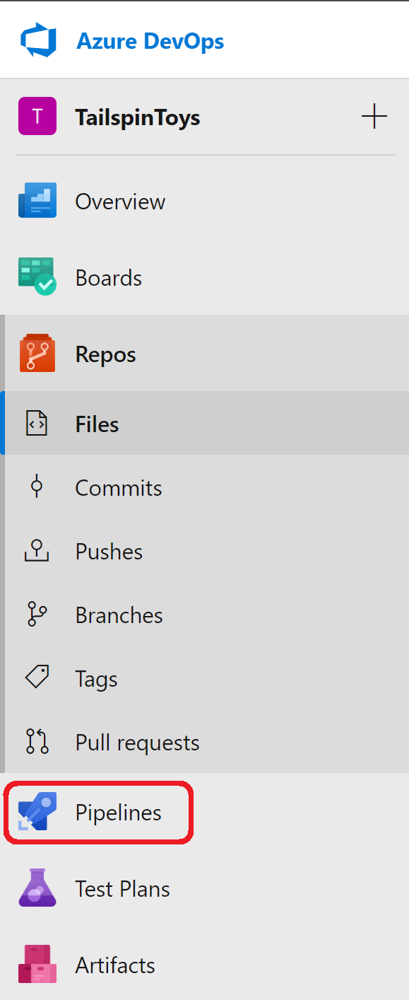

2. Select the **Create pipeline** button to create a new build pipeline.

    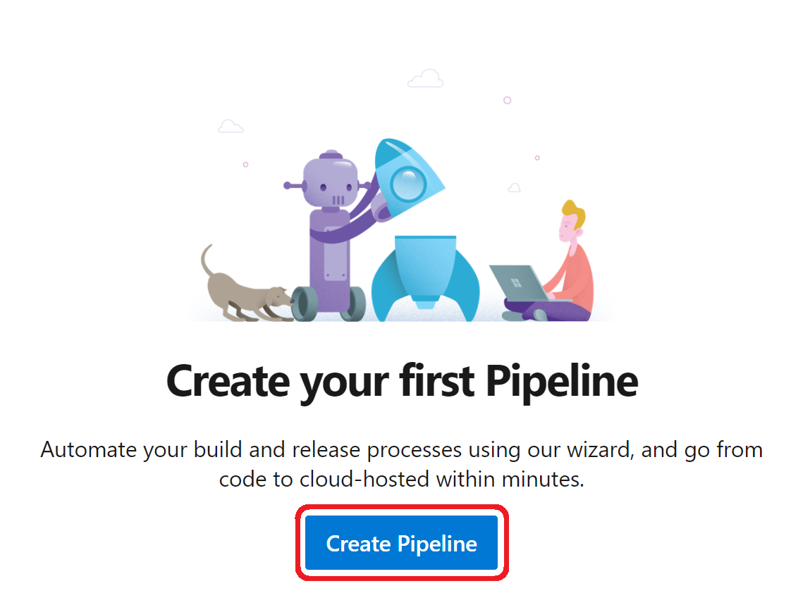

3. This starts a wizard where you'll first need to select where your current code is located. In a previous step, you pushed code up to Azure Repos. Select the **Azure Repos Git** option.

    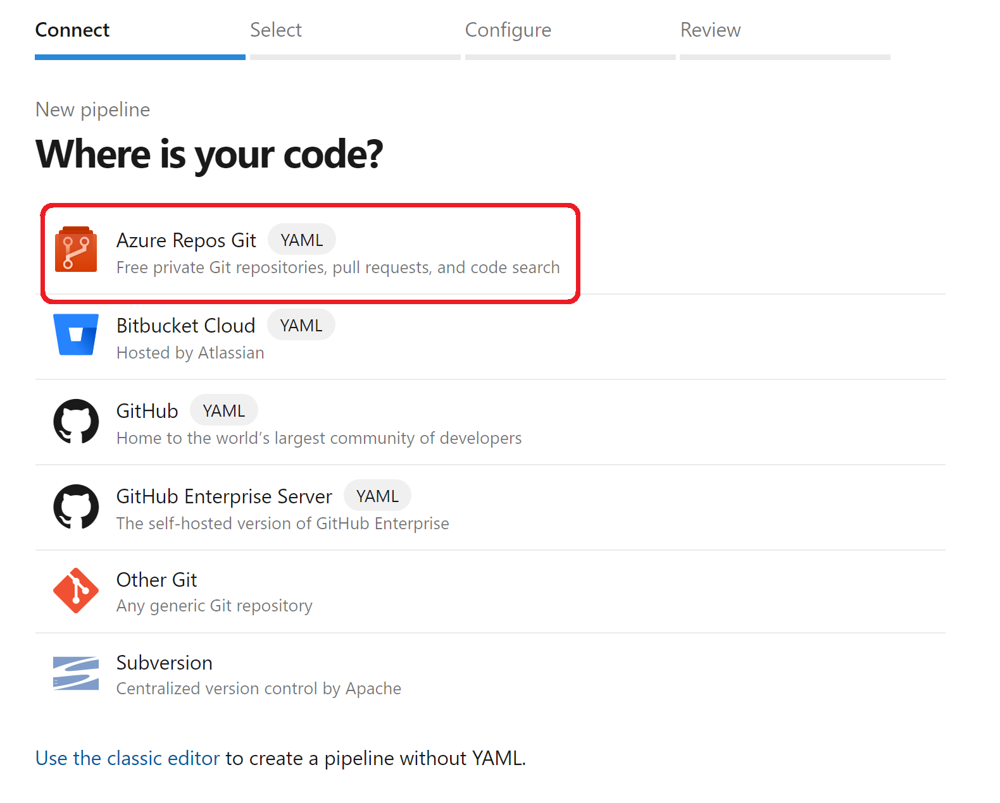

4. Next, you'll need to select the specific repository where your code was pushed. In a previous step, you pushed it to the **TailspinToys** repository. Select the **TailspinToys** git repository.

    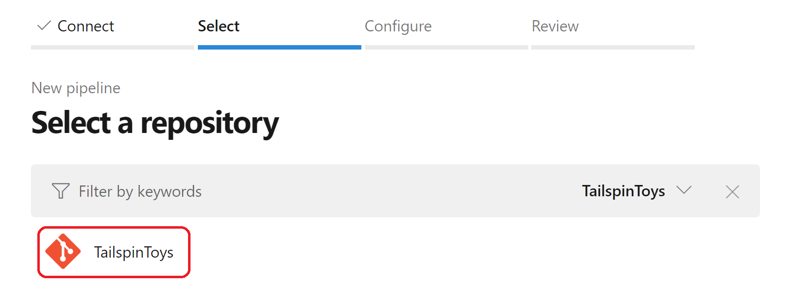

5. Then, you'll need to select the type of pipeline to configure. Although this pipeline contains a mix of technologies, select **ASP.NET Core** from the list of options.

    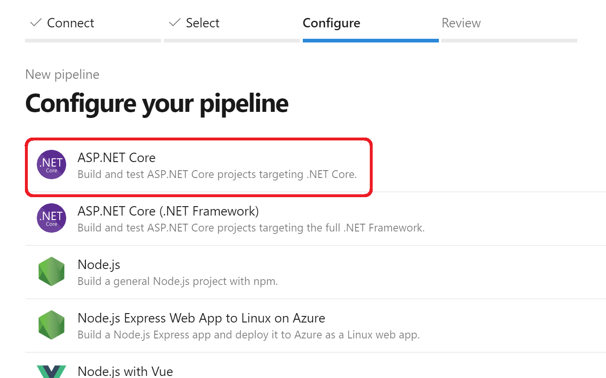

6. As a final step in the creation of a build pipeline, you are presented with a configured pipeline in the form of an azure-pipelines.yml file.   Azure DevOps has placed this file at the repository root and will reference the file as configuration during pipeline runs.  
   
7. The YAML file contains a few lines of instructions (shown below) for the pipeline. Let's begin by updating the YAML with more specific instructions to build our application. 

    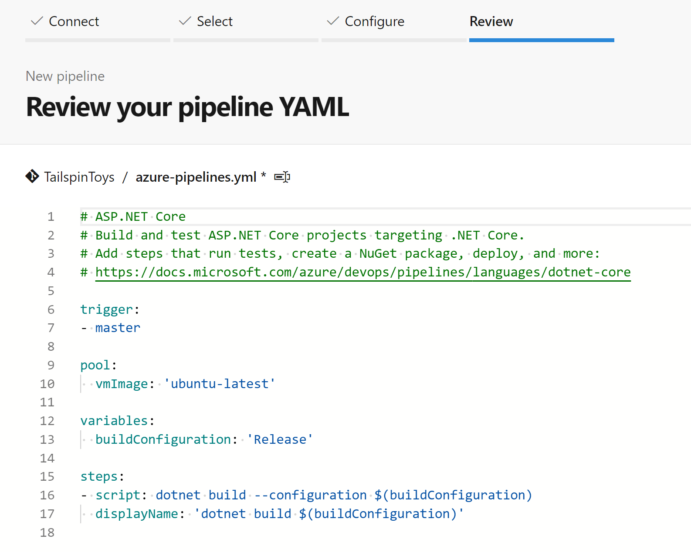

The *pool* section specifies which pool to use for a job of the pipeline. It also holds information about the job's strategy for running.

8. Select and replace the *pool* section with the following code:

    ```yml
    pool:
      vmImage: 'windows-latest'
      demands:
      - msbuild
      - visualstudio
      - vstest
    ```

    Steps are a linear sequence of operations that make up a job. Each step runs in its own process on an agent and has access to the pipeline workspace on disk. This means environment variables are not preserved between steps but, file system changes are.

9. Select and replace the *steps* section with the following code:
    
    ```yml
    steps:
    # Nuget Tool Installer Task
    - task: NuGetToolInstaller@1
      displayName: 'Use NuGet 5.5.1'
      inputs:
        versionSpec: 5.5.1      
    ```

    Tasks are the building blocks of a pipeline. They describe the actions that are performed in sequence during an execution of the pipeline.

10. Add additional tasks to your azure-pipelines.yml file by selecting and copying the following code. This should be pasted right after the NuGetToolInstaller@1 task which you pasted previously:
    
    >**Note**: The YAML below creates individual tasks for performing all the necessary steps to build and test our application along with publishing the artifacts inside Azure DevOps so they can be retrieved during the upcoming release pipeline process.

    ```yml
    # Node.js Tool Installer Task
    # Finds or downloads and caches the specified version spec of Node.js and adds it to the PATH
    - task: NodeTool@0
    inputs:
        versionSpec: '12.x' 

    # Nuget Restore Task
    - task: NuGetCommand@2
    displayName: 'NuGet restore'
    inputs:
        restoreSolution: '**/tailspintoysweb.csproj'

    # Build Task  
    - task: DotNetCoreCLI@2
    displayName: 'Build solution'
    inputs:
        command: publish
        publishWebProjects: True
        arguments: '--configuration $(BuildConfiguration) --output $(Build.ArtifactStagingDirectory)'  
        zipAfterPublish: true

    # Publish Task
    - task: PublishBuildArtifacts@1
    displayName: 'Publish Artifact'
    inputs:
        PathtoPublish: '$(build.artifactstagingdirectory)'
        ArtifactName: 'drop'
    condition: succeededOrFailed()
    ```

11. The final result should look like the following:

    ```yml
    trigger:
      - master

    pool:
      vmImage: 'windows-latest'
      demands:
      - msbuild
      - visualstudio
      - vstest

    variables:
      buildConfiguration: 'Release'

    steps:
    # Nuget Tool Installer Task
    - task: NuGetToolInstaller@1
      displayName: 'Use NuGet 5.5.1'
      inputs:
        versionSpec: 5.5.1

    # Node.js Tool Installer Task
    # Finds or downloads and caches the specified version spec of Node.js and adds it to the PATH
    - task: NodeTool@0
      inputs:
        versionSpec: '12.x' 
    
    # Nuget Restore Task
    - task: NuGetCommand@2
      displayName: 'NuGet restore'
      inputs:
        restoreSolution: '**/tailspintoysweb.csproj'

    # Build Task  
    - task: DotNetCoreCLI@2
      displayName: 'Build solution'
      inputs:
        command: publish
        publishWebProjects: True
        arguments: '--configuration $(BuildConfiguration) --output $(Build.ArtifactStagingDirectory)'  
        zipAfterPublish: true

    # Publish Task
    - task: PublishBuildArtifacts@1
      displayName: 'Publish Artifact'
      inputs:
        PathtoPublish: '$(build.artifactstagingdirectory)'
        ArtifactName: 'drop'
      condition: succeededOrFailed()
    ```
    At this point you have defined a simple, single stage pipeline, that will perform the following tasks:
    - execute on change commits to the master branch
    - install key tools required to build
    - build the code project, producing build artifacts
    - publish build artifacts to a known artifact location within Azure DevOps Pipelines.   

12. Choose the **Save and run** button to save our new pipeline and also kick off the first build.  

    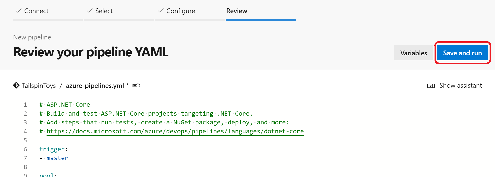    

13. When the editor process saves your YAML, Azure DevOps Pipelines creates a new source file called *azure-pipelines.yml* to the root of your TailspinToys repository. This is done through a git commit that Azure DevOps facilitates as part of the save process which also prompts you to enter a commit message.  

    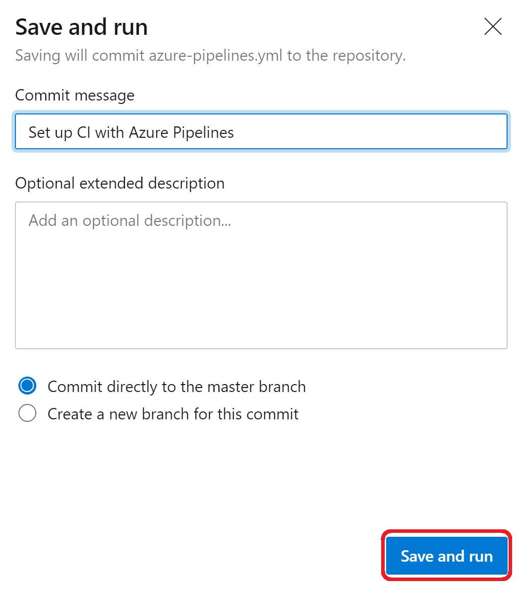  
    
    By default, **Commit Message** will be populated for you, but you may change this. Select the **Save and run** button at the bottom of the screen to commit the pipeline changes to your master branch.  

14. The build process will immediately begin and run through the steps defined in your new *azure-pipelines.yml* definition file, and the screen will refresh to show you the build process executing, in real-time.  

    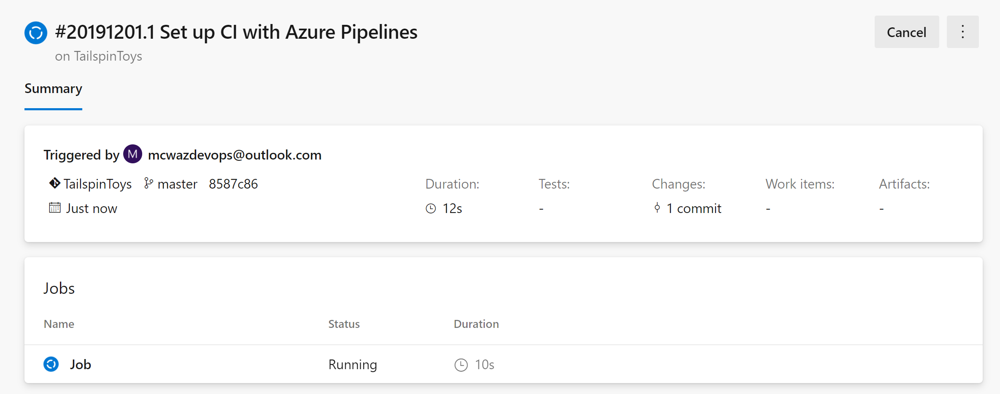  

15. After the build process completes, you should see a green check mark next to each of the build pipeline steps.  

    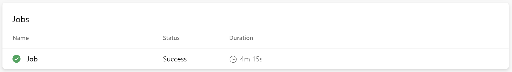  
    
    **Congratulations**, you have just created your first build pipeline! In the next exercise, we will create a release pipeline that deploys your successful builds.  

## Exercise 4: Create Azure DevOps Multi Stage Release Pipeline  

Duration: 30 Minutes

In this exercise, you will modify the existing pipeline to include a basic release stage that performs the following tasks:
- Automated deployment of build artifacts to Azure Pipeline storage. 
- Deploy to the three stages created earlier (dev, test, and production).

### Task 1: Modify YAML definition to create a multistage pipeline  

1. Now that we have a great build working, we can modify the YAML file to include stages.  At first, we will add one stage for Build and then run that so we can see the difference in output.  

    From left navigation, select **Pipelines** to view configured Pipelines.   From here, highlight your new pipeline definition and select Edit from the ellipses to the right:  

    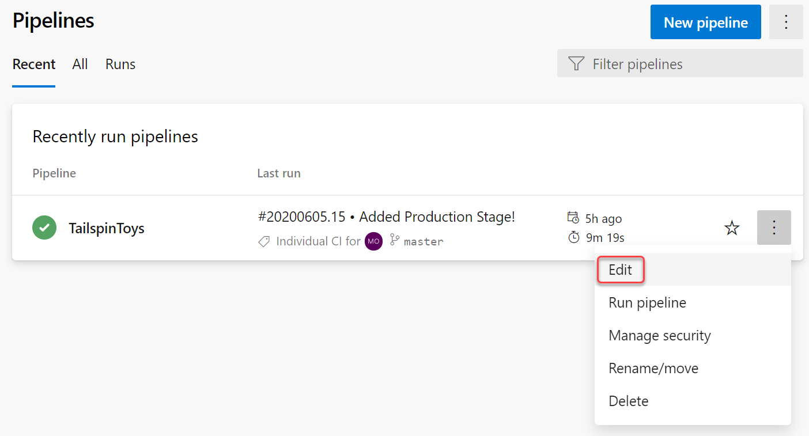  

    This action shows the **Azure Pipelines YAML Editor** that you viewed after building your initial pipeline.  You will be using this editor to make changes to your azure-pipelines.yml definition in the next steps.  

    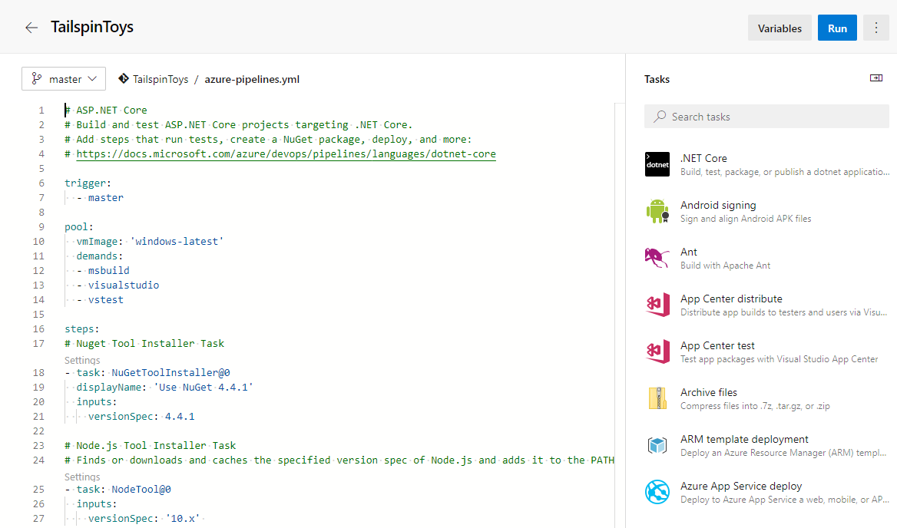  
    
    On the left, is the YAML editor containing the pipeline definition and the Tasks panel to the right, has common components that can be added to the pipeline.   Selecting from the task panel to add a component first shows a property panel supporting custom configuration for your pipeline, allowing fast configuration, and the result is additional formatted YAML added directly to the pipeline definition with the configuration customization you provided.  

2. Let's transform this pipeline to a multi-stage configuration by adding the following configuration right below the *trigger* section to define a **Build Stage** in your YAML pipeline.  

    ```yml  
        stages:
        - stage: Build
          displayName: 'Build Stage'
          jobs:
          - job: Build
    ```  
   This is the first step to a multi-stage pipeline!  
   
   You can define whatever stages you want to reflect the true nature of your CI/CD process, and as an added benefit, users get better visibility to entire pipeline process.  
   
   >**Note**: YAML is whitespace sensitive!  Indentation matters in a similar fashion as Python, so pay particular attention to formatting within this file.  The editor will highlight most formatting issues.  If you are off on your spacing at all, the file will likely contain errors, such as `Unexpected value 'steps'`.
   
   After adding this structure, your result should look like this:  

    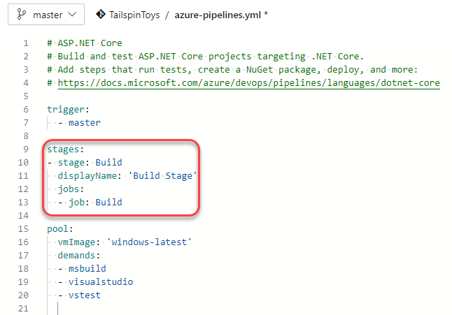  

3. Next, simply **highlight the remainder of the YAML file** that defines your build jobs and indent it four spaces (two tabs), thus making this definition a child of the build stage *jobs* node.   Your YAML should look like this now:

    

    **Take a moment now to triple-check your indentation is correct**:  

    * trigger is not indented
    * stages is not indented
    * Pool is indented four spaces and lines up with the 'j' in 'job' above it.
    * Everything else is also appropriately indented (you should be able to collapse the file at this point, so that all that shows is the stage)  Note that your line numbers may differ slightly from what is shown. 

    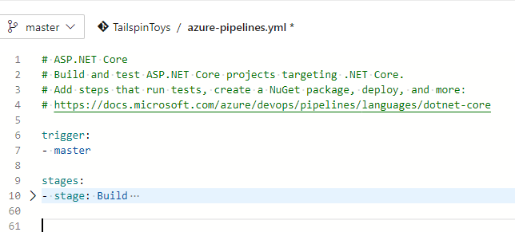

4. You now have a very simple multi-stage pipeline with exactly one stage - a **Build Stage**.   
   
   Running the pipeline now would execute the pipeline as a single stage, and it would build exactly like it did before.  For now, be aware that using simple stage definitions like this means the stages execute in the order they are defined in the file.  More advanced pipeline definitions can support conditionals for dependency graphs that govern more complex stage execution.

   Now, let's add a **Deployment Stage** by adding the YAML below to the bottom of the pipeline definition:


    ```yml
    - stage: DevDeploy  
      displayName: 'Dev Deploy Stage'
      jobs:
      - job: Deploy
        pool:
          name: Hosted VS2017
        steps:
    ```

    This is a simple definition for a Deployment Stage that by definition, will execute after the Build Stage because it is defined after the build stage. 
    
    Your YAML definition should now look like this:

    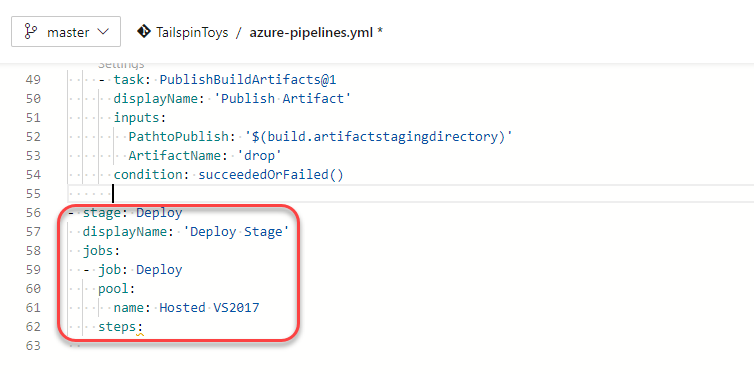

5. Now your pipeline definition file contains a *build stage and a deploy stage*.  For now, let's configure the deploy stage to deploy to the dev environment using deployment slots.   Then we can repeat this configuration to support test and production in a similar manner. perform the same action.  

    Set your cursor on a new line at the end of your YAML definition, and note this will be the location where new YAML is added in the next step:

    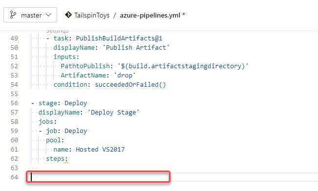


6. Using the Tasks panel, select the *Azure App Service Deploy* Task:  

    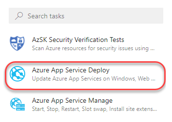
    
    This will show a configuration panel to configure this deployment task with some fields containing default values:

    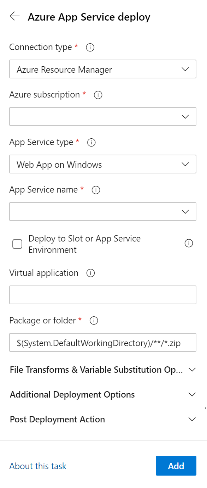

    Leave the **Connection type** as default, but in Azure Subscription, select the service connection you used earlier in the lab.   
    
    For **App Service type**, leave as default, and for **App Service name**, select the development appnamedropdown list, select **TailspinToys**.    
    
    Check **Deploy to Slot or App Service Environment**, and you should see additional configuration settings appear.   
    
    Set **Resource group** to the resource group you have been using, and select "Staging" for the **Slot**.   Leave all other fields as default, as we will configure those later.  

    At this point, the panel should look like this:

    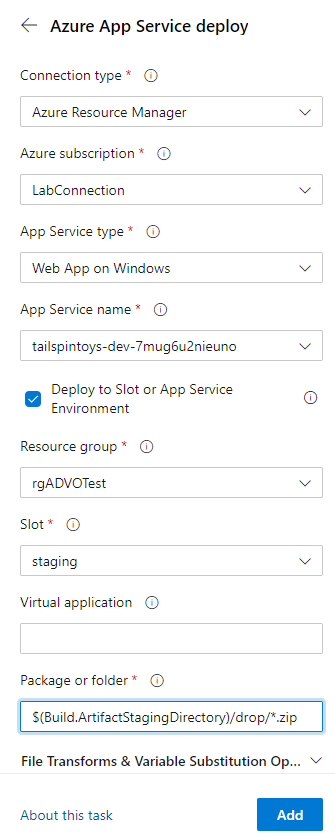

    If the service connection is not authorized, you may be asked to authorize the service connection like this:

    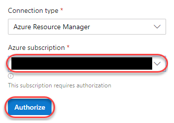

    In this scenario, select Authorize to enable the integration with Azure DevOps. 
    
    Select **Add** to add this task as configured to your pipeline definition file, and on completion, you can see that the following YAML has been added in the YAML editor:

    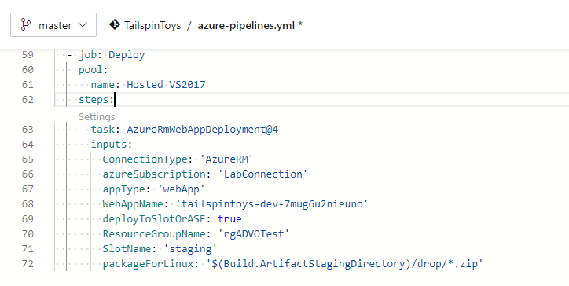  

    > **Note:** Pay close attention to the final line `packageForLinux`.  It is highly likely you will need to update this line to match the image above to use the correct drop location:    

    ```  
    '$(Build.ArtifactStagingDirectory)/drop/*.zip'
    ```  
    
7. At this point you now have a **Build Stage** that builds your project and publishes an artifact to a known location in Azure Pipelines.   You also have a **Deploy Stage** that will deploy the artifact to your dev environment, however, you need to make some additional adjustments to this stage to tie everything together. 

    Looking at the last task of your build stage you can see that the publish task places the build artifacts in a specific location: 

    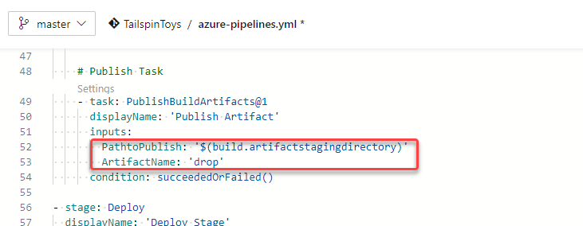

    Your deploy stage needs to download the artifacts from the Build Stage published location in order to install them in the dev environment, and Azure Pipelines has a task template for that.   
    
    In the YAML editor, place your cursor at this position, right before the AzureRmWebAppDeployment task you just added:

    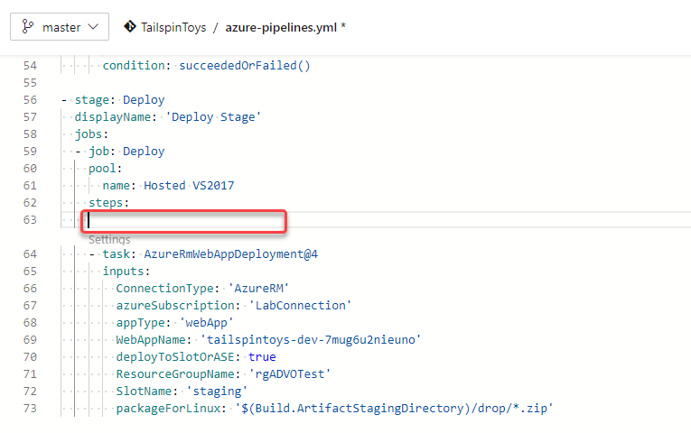
    
    Search Tasks for *"download build"* and select the **Download Build Artifacts** task.   
    
    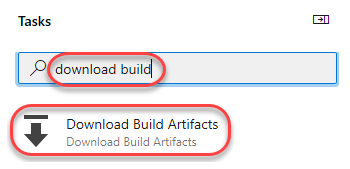
    
    As before, a configuration panel is shown so you can configure the task before adding:
    
    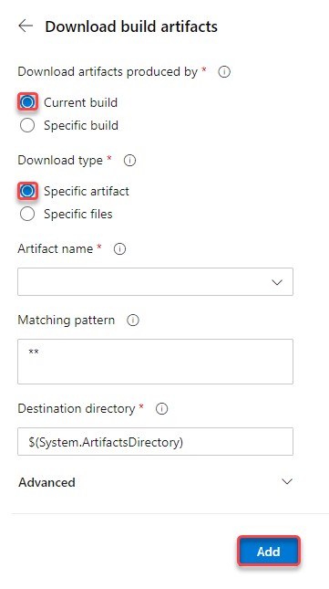
    
    For now, let's use the default values, and select **Add**.   
    
    This will add the task as configured to your YAML.  As an alternative, you can select tasks and add them, and then edit their properties directly in the YAML editor.  
    
    Finally, be sure to check task indenting:

    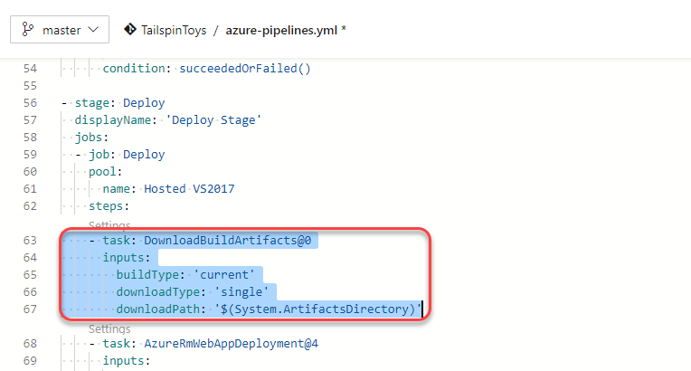
    
    
8.  The task you just added needs one additional property added in order to be able to execute properly.  We could have added this property using the UI, but let's modify the task by editing the YAML directly.  
    
    In the editor, modify the following:
    - Change the **downloadPath** property to *'$(Build.ArtifactStagingDirectory)'*.
    - Add a property *artifactName* to the task you just added, just under *downloadPath*, and set this new property to *"drop"*.   
    
    Your Download Task now matches the artifact staging directory that the Publish task above uses during the build stage.   
    
    Your YAML should now look like this:

    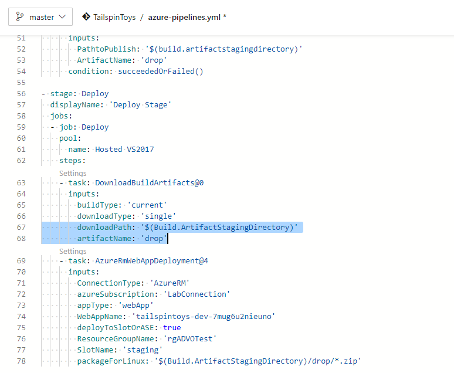

    
9.  At this point, the deployment stage can find and download the build artifacts during execution. However, the deployments and downloads will publish the files with successful build or commit regardless of what branch it comes from. You can add the following conditions to your tasks to ensure the environment matches only the ones you are expecting to ensure pull requests that are coming in do not trigger deployments:

    ```yml
    condition: and(succeeded(), eq(variables['Build.SourceBranch'], 'refs/heads/master'))
    ```

    Note that the "refs/heads/**master**" is the reference to the branch name.  Move your cursor to a line after the `job: Deploy` and paste the line above.

    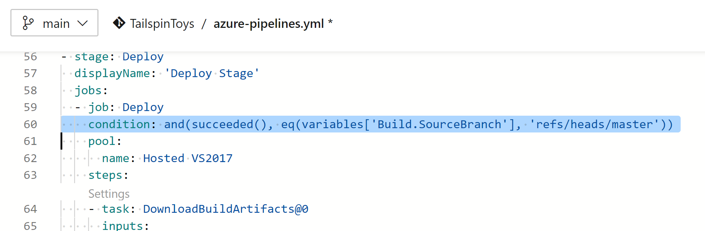

10.  The deployment should now happen only to builds within the master branch of your deployment even if they're the validation of a pull request.  Review your YAML file for proper indentation and then select **Save** to commit changes to the pipeline.
    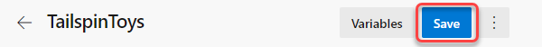

11. Azure DevOps will prompt for the commit message and the commit goes directly to the master branch: 

    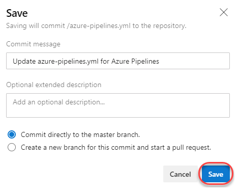
    
12. Since this changes the master branch, and your pipeline is configured to trigger on master, the pipeline will immediately run.   Using the left menu, navigate to **Pipelines** select the new build:

    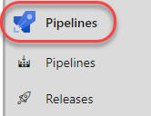
    
    From here you can see the multiple stages you've just added in the **Stages** column.  
    
    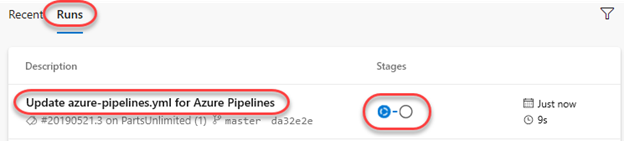


13. When the **Build** stage completes, select the **Deploy** stage to follow each task:

    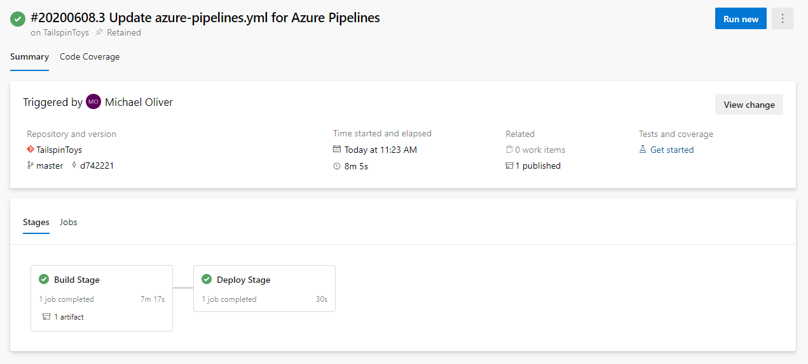

    Expand the **AzureRmWebAppDeployment** task to review the steps performed during the Azure deployment. Once the task completes, your app is live on Azure.

    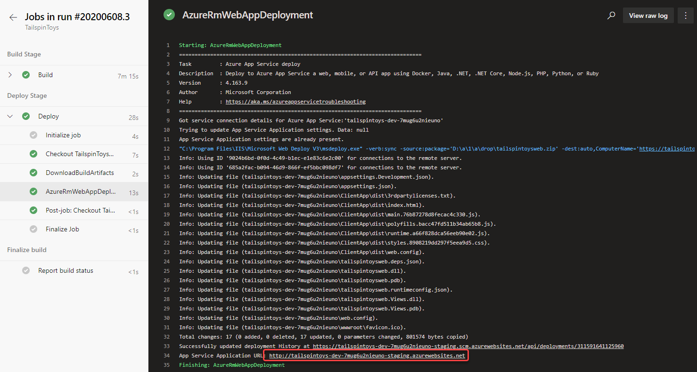

    
14. **Congratulations!** You have just created your first multistage pipeline!  Now, let's verify your deployment.   

    Using **Azure Portal**, navigate to the resource group you created earlier to view your app services in this resource group .   Sort by **Type** Select the development app service:

    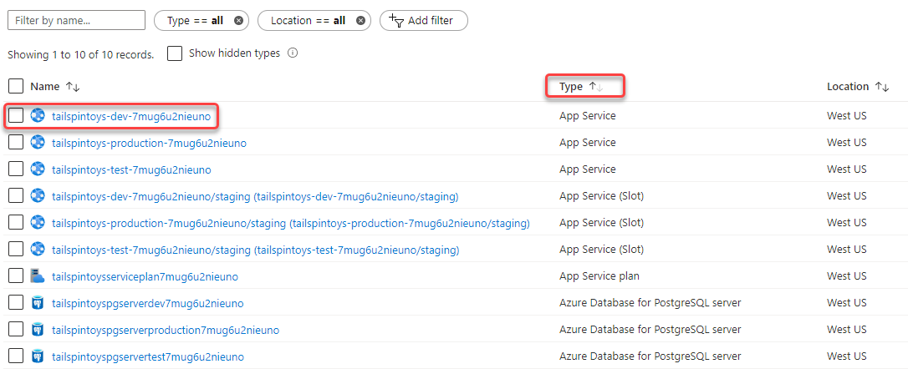  

15. On the App Service Overview, go to **Deployment slots** and select the Staging slot.

16. Click on the **Browse** button.

    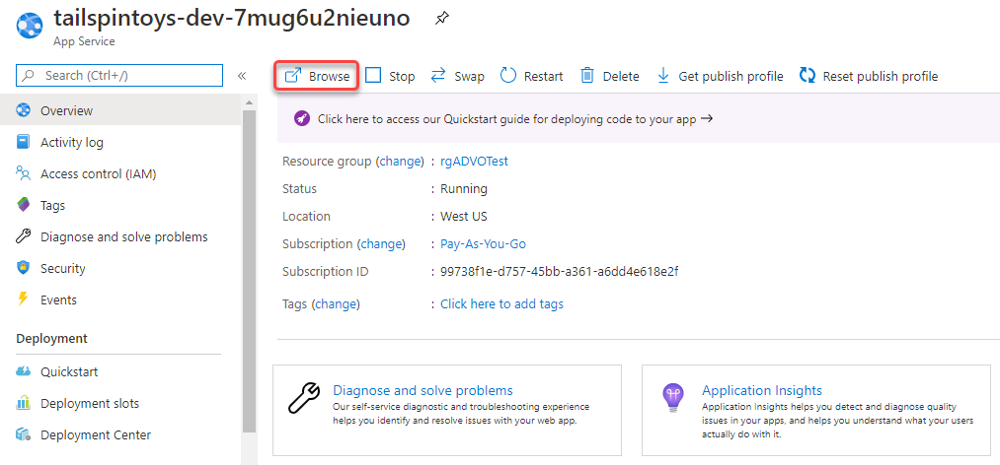  

    This will launch your default browser navigating to your development site:  

    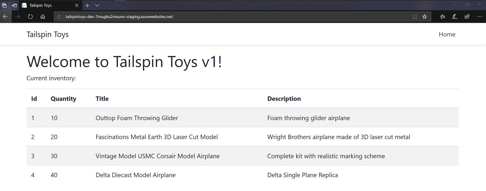  

    A successful deployment!  In the next task we will add stages for deploying to Test and Production.   Once you deploy, you can use this step to verify those sites too.  

### Task 2: Add Test and Production Environments as stages in the pipeline  

You could repeat the process in **Task 1** to add stages for Test and Production by using the Tasks panel.  However, the beauty of the unified YAML pipeline definition is the speed at which you can "copy-paste" the Development Deploy Stage within the YAML editor, and then just change the particular values for your Test and Production environments.   Let's add a Test deployment stage now.  

1. Return to Azure DevOps Pipeline view and select your new multistage pipeline and select **Edit** for the YAML editor.   

    Scroll down to the Development Deploy Stage and highlight and copy the script for that entire stage:  

    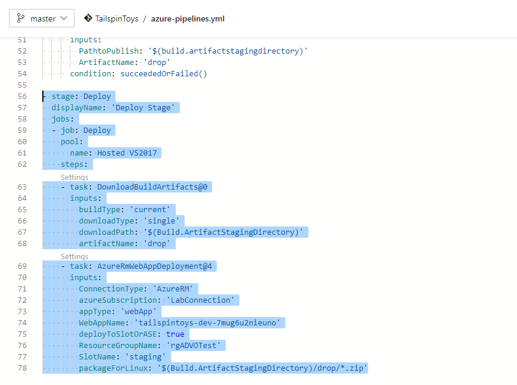  

2. Move your cursor to the very end of the YAML definition file and paste the copied development environment deployment stage code.  Now you can look though the newly pasted stage and change certain properties to match your Test environment.  Begin by changing the **stage:** string name property to *TestDeploy* and then, change the **DisplayName** property to *Test Deploy Stage*.  

3. Move to the nested Deployment Task, and change **WebAppName** to match the Web App Name for your test environment, in this case *tailspintoys-test-\<randomstring>*  

4. Leave every other property the same.  Your YAML should now look like this:  

    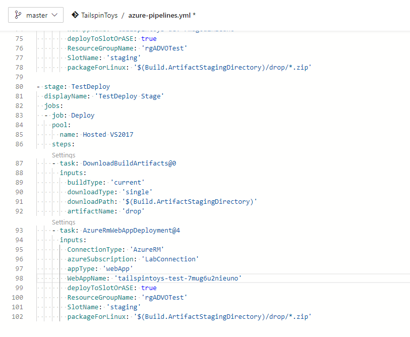  

    Select **Save**.   
    
    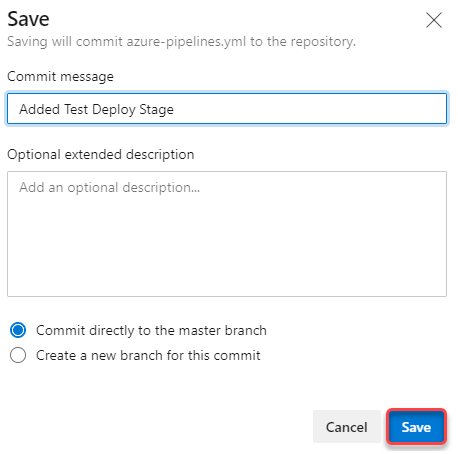  

    As before, add your commit message, and select **Save**.  This will save the YAML definition file contents, commit to the master branch and which will trigger a pipeline run.  

5. Let's go take a look at the pipeline run. Navigate to Pipeline view to view recently run pipelines.  You can see the run triggered from your committed change here.  
    
    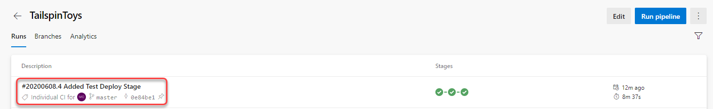  

    Select this newest run and let's dig deeper.  

    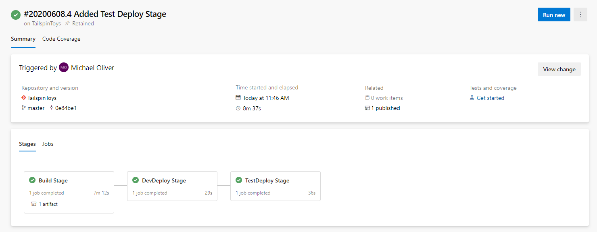  

    In this view, you can see that your multistage pipeline now has 3 stages:  Build, Dev, Test.    
    
    Selecting the **Test Deploy Stage** flow box shows you the Jobs detail view with access to all the tasks that executed.   Note that on the **AzureRmWebAppDeployment** task, you can see navigable links for deployment history and the application URL:  

    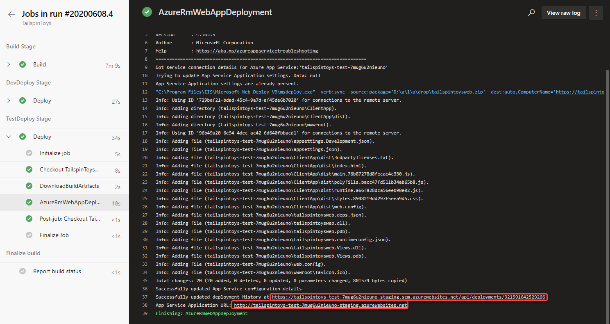  

6. At this point you have configured a working multistage pipeline that builds, publishes and deploy to two of your provisioned environments (Dev and Test).  Repeat the steps 1-5 above, to add a Test deployment stage to create a **Production Deployment Stage**.  Take careful note of the properties you changed above to edit them for the production environment, and save the pipeline configuration.  

7. If your configuration was successful, this should have triggered a pipeline run that looks like this:

    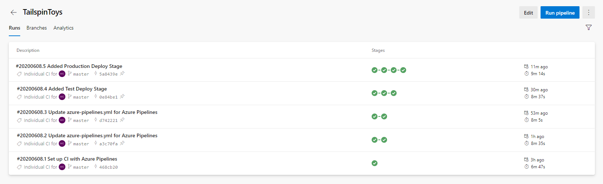

Congratulations! You have completed the creation of a release pipeline with four stages.   In the screen shot above you can see your progression in including new functionality by added each modification to your Unified YAML Pipeline.

## Exercise 5: Trigger a build and release

Duration: 10 Minutes

In this exercise, you will trigger an automated build and release of the web application using the build and release pipelines you created in earlier exercises. The release pipeline will deploy to three stages: dev, test, and production.

Any commit to the master branch will automatically trigger a build, but you can man manually trigger, or queue a build without a code change.

### Task 1: Manually queue a new build and follow it through the release pipeline

1. To manually queue a build, select **Pipelines** from left navigation and choose your *TailspinToys* pipeline to view recent runs and select the  **Run pipeline** button in the upper right corner to queue the build:

    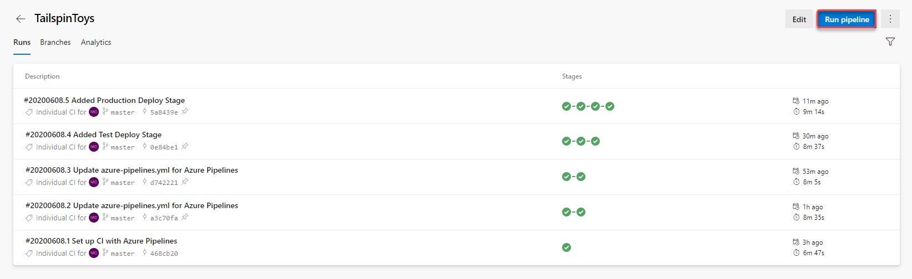


2. This action shows the **Run pipeline** view. Select **Run** at the bottom of the modal window to queue a manual build. 

    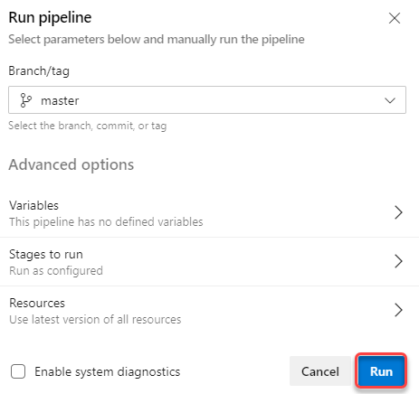


3. Because you configured continuous deployment using the Unified YAML approach you get a full execution from dev, through test, to production. Let's verify the run by selecting the manual run and viewing the details:

    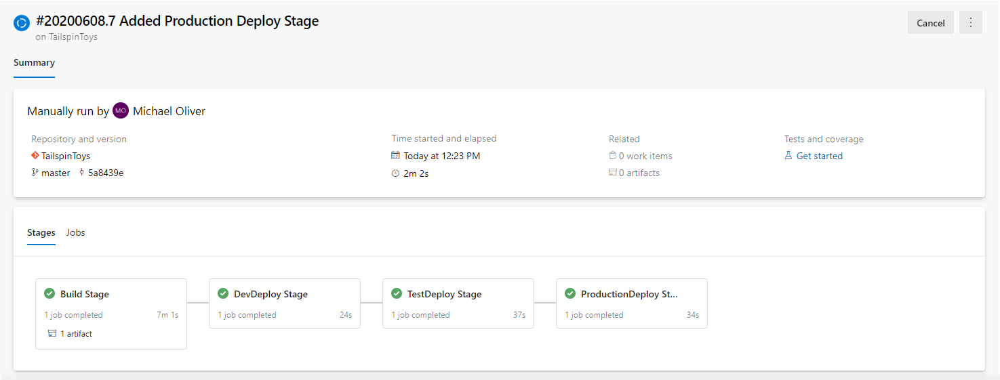


## Exercise 6: Setup a pull request policy, create a task branch and submit a pull request

Duration: 30 Minutes

In this exercise, you will first set up a pull request policy for the master branch, then create a short-lived task branch.  In this branch you will make a small code change, commit, push the code, and finally, submit a pull request with validation builds. 

Then, you will merge the pull request into the master branch, triggering an automated build and release of your application.  For this exercise, you will use Azure DevOps workflow to complete the tasks, but keep in mind this same process could be performed locally using the Azure Command Line Interface (CLI), or an IDE of your choice.

### Task 1: Set up a pull request policy

1.  Create a work item to associate to a pull request.

    For this task, you will be creating a new work item that simulates having a task for the developer to complete that will be eventually be associated to a pull request.  

    On the left navigation, select **Boards**, then use the green plus symbol in the `New` column to add a new work item.  Make sure to create the new work item as a `Product Backlog Item`.  

    >**Note**: Instead of `Product Backlog Item`, you may see `User Story` or `TODO`, depending on what methodology you chose when you setup your organization (such as Agile, Scrum, or CMMI).    

        

    In the dialog that appears, enter the following text:  

    ```  
    Fix the navigation on the main page home link.  Currently redirects to Privacy.
    ```  

    Save the work item so that it will be assigned a valid number and be ready to assign to the next pull request (created in a future exercise).   

    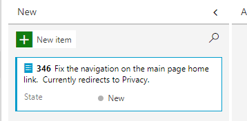  

    >**Note**: Your number will almost certainly be different than mine.  

2.  On left navigation, select **Repos** and select **Branches** to view branches associated with your repo.  For now there is only the master branch.   Select the ellipsis for the master branch and select **Branch policies**.

    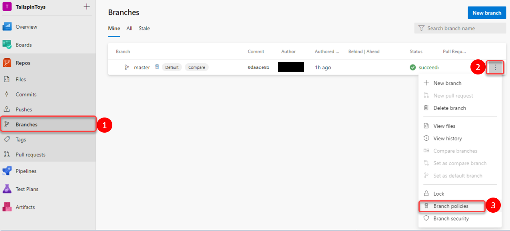  

3.  Enable the policy by checking **Check for linked work items** (1) and **Check for comment resolution** (2).

    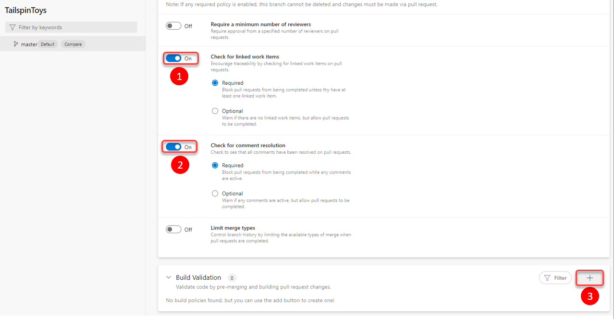
    
    Let's unpack what these configurations do:

    The first check, *Check for linked work items* enables the build policy to require a work item to be included with a pull request.  The work item may be added with one of the commits, or added directly to the pull request.

    >**Note**: It is recommended to enable this setting.  If you *do* enable this then you also must add a work item in your process below with the code changes in this task set.  You can ignore this setting for the workshop if you don't want to add a work item.

    The second check. *Check for comment resolution* ensures comments applied to this pull request during the peer review phase require resolution.

4.  Now select **+** (3) to add the build policy.  This will enable the build to run when a pull request is created.  In the *Add build policy* panel, choose the correct **Build pipeline** and add a **Display name** and select **Save**.   

    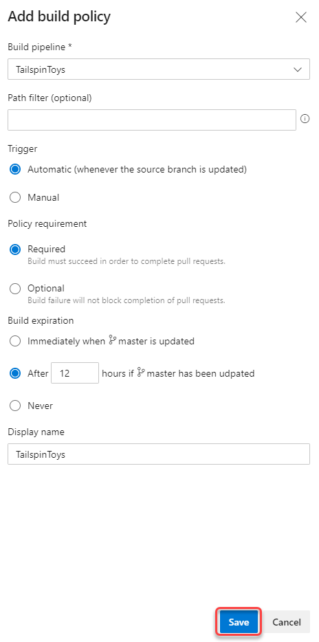

    You should see your new configured branch policy right below the Branch Policies section like this:

    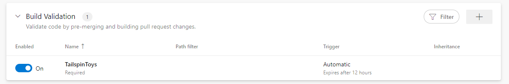

### Task 2: Create a new branch

1. From left navigation **Repos**, choose **Branches** to show the Branches view.  Select **New branch** in the upper right corner to create a new branch from master: 

    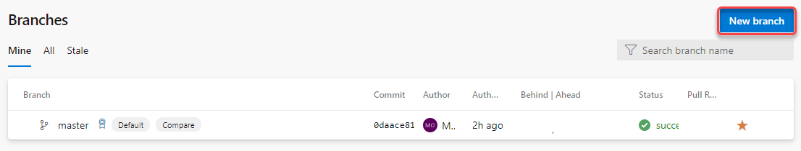

2. In the **Create a branch** panel, enter a name for the new branch (e.g. **new-heading**). In the *Based on* field, be sure **master** is selected.

    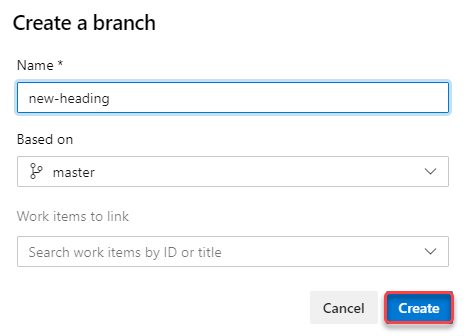

3. Select the **Create** button.

### Task 3: Make a code change to the task branch

1.  From the **Branches** view, select your newly created branch, this will navigate to a *Files* view showing all  files for this branch.

    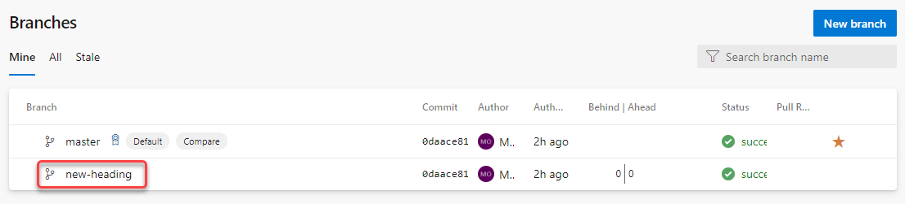

2. You will use this view to make a change to a source file from the web application we have been deploying to your 3 environments in earlier steps.  

    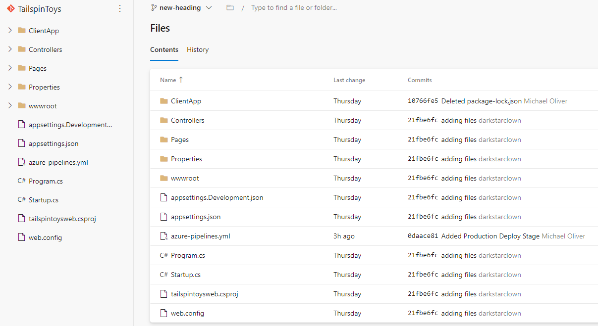
    
    Under the *tailspintoysweb* folder, select the **ClientApp** folder, and expand and select the **src** folder.  

3. Next expand the **app** folder then expand the **home** folder.  In this folder, select the **home.component.html** file.  The editor to the right displays the contents of this file.   Now, select **Edit** button on the top right of the screen to begin editing the page.

    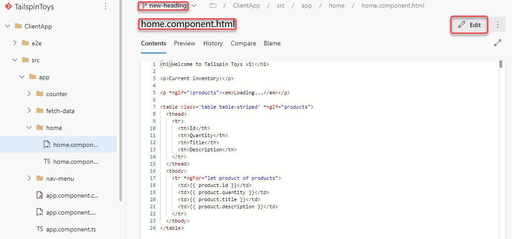
    
4. Replace the text ```<h1>Welcome to Tailspin Toys v1!</h1>``` on *line 1* with the following:

    ```
    <h1>Welcome to Tailspin Toys v2!</h1>
    ```
    
5.  Now that you've completed the code change, select the **Commit** button on the top right side of the screen.

    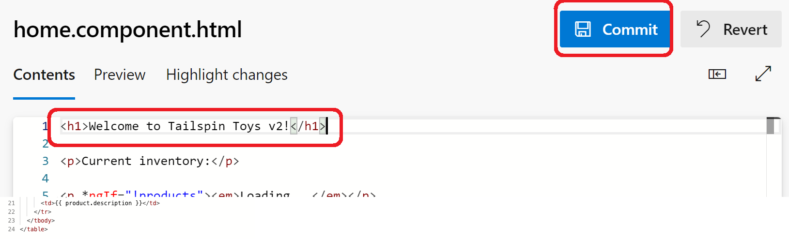

    This will present the Commit panel where you can enter a comment; one will automatically be filled in for you. Select the **Commit** button.

    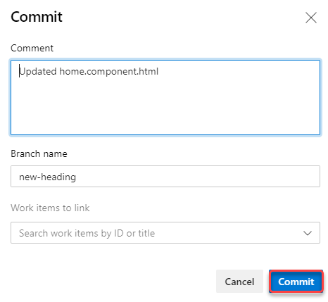

### Task 4: Submit a pull request

1. Locate and select the **Create a pull request** button.

    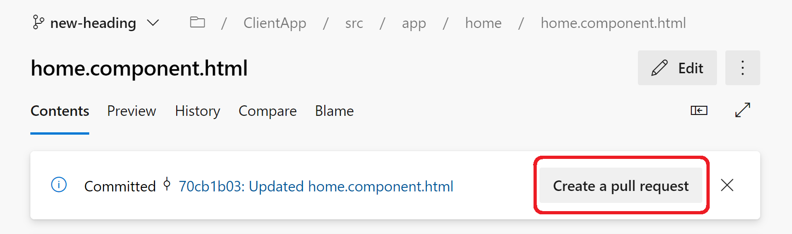

2. This brings up the *New Pull Request* page. It shows we are submitting a request to merge code from our **new-heading** branch into the **master** branch. You have the option to change the *Title* and *Description* fields. 
    
    For the **Reviewers** field, type **Tailspin** and select **[TailspinToys]\TailspinToys Team** from the search results to assign a review to the TailspinToys Team (which you are a member of).  
    
    A member of this team must review the pull request before it can be merged and the details for the code change are included in the middle of the view.

    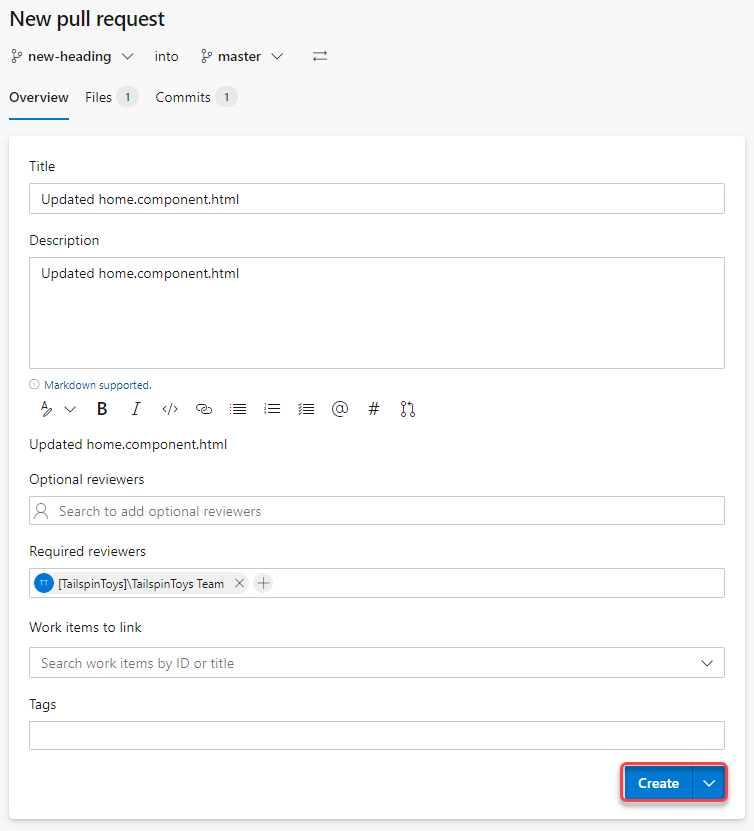

3. Select the **Create** to submit the pull request.

### Task 5: Approve and complete a pull request

Typically, the next few steps would be performed by another team member, allowing the code to be peer reviewed. 

However, in this scenario, you will continue as if you are the only developer on the project.  

1.  After submitting the pull request, you are presented with Pull Request review screen. Let's assume all the changes made were acceptable to the review team.  Submitting the pull request results in this view:

    

    There is a lot of functionality here, but for the purpose of this lab, let's focus on this pull request approval by confirming that the  build is green. 

    >**Note**: If the build is not green, you cannot merge the Pull Request as in step 2-4 below. You are then blocked. If you chose the **Check for linked work items** policy in task 1, you will be blocked until you create and attach a work item to your pull request. You can create a new work item by selecting **Boards** and then **Work items**. Then navigate back here and you can choose the new work item from the dropdown on the right side of the page.

2. Next, select the **Approve** button to approve of the code that was modified submitted as part of the pull request.  Here you can see all required checks succeeded and there are no merge conflicts.  Everything necessary is green! 

   The section below the **Description** notes you approved the pull request and now you can select **Complete** to merge the code from the pull request into the master branch.

    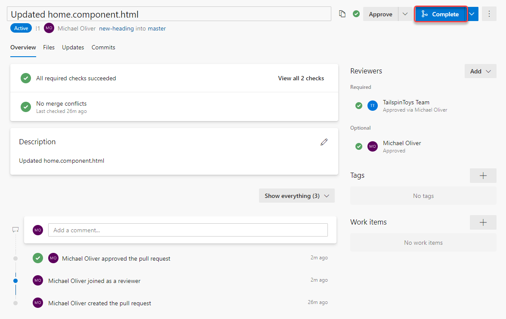

3.  On selecting **Complete** in the previous step, a **Complete pull request** panel shows. Here you can add additional comments for the merge activity. 

    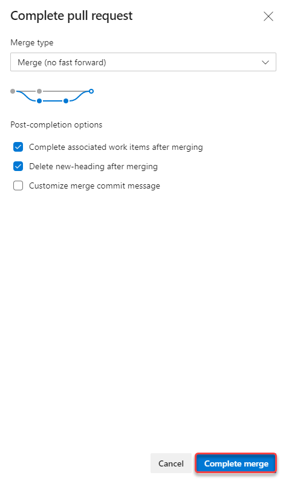

    By selecting the **Delete new-heading after merging** option, our branch will be deleted after the merge has been completed and this feature keeps your repository clean of old branches help to eliminate the possibility of confusion.

4.  Select the **Complete merge** button.  You will then see a confirmation view of the completed pull request.  

    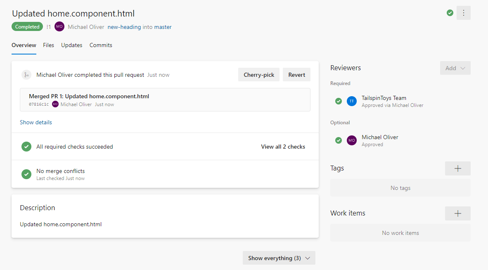


5.  **Congratulations!** By following the tasks in these exercises, you created a new branch and changed some code in the new branch, submitted a pull request and approved the pull request which resulted in a code merge to the master branch.  

    Because you configured continuous deployment using Azure DevOps Pipelines, an automated build was triggered:

    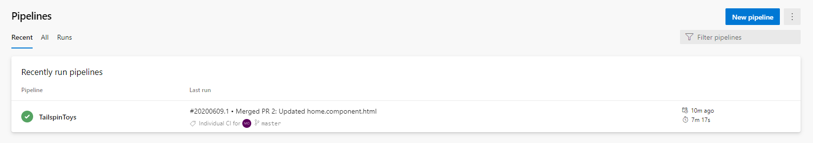

    And deployment to all stages executed immediately after the successful build:

    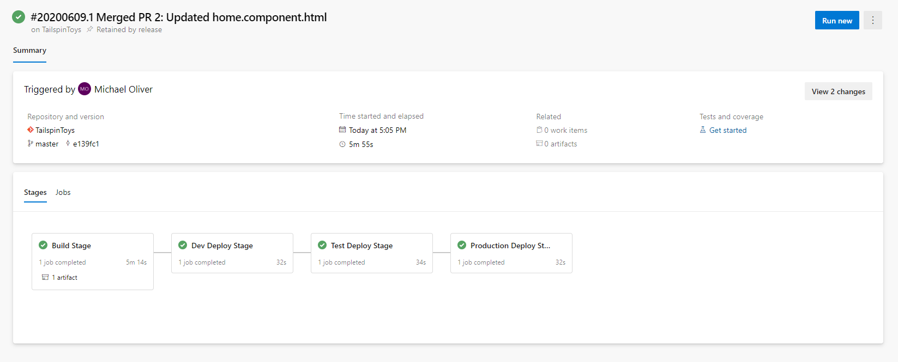

    All stages green!   Nice job!

## After the hands-on lab

Duration: 10 Minutes

### Task 1: Delete resources

1.  Now since the hands-on lab is complete, go ahead and delete the resource group you created for the Tailspin Toys deployments along with the Azure DevOps project that were created for this hands-on lab. You will no longer need those resources and it will be beneficial to clean up your Azure Subscription.

These steps should be followed only *after* completing the hands-on lab.