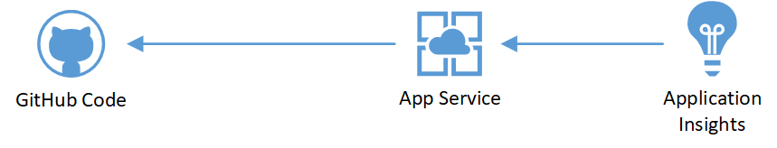
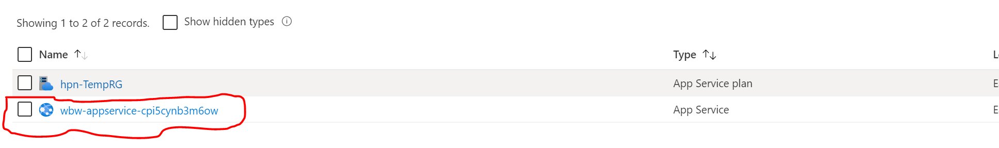
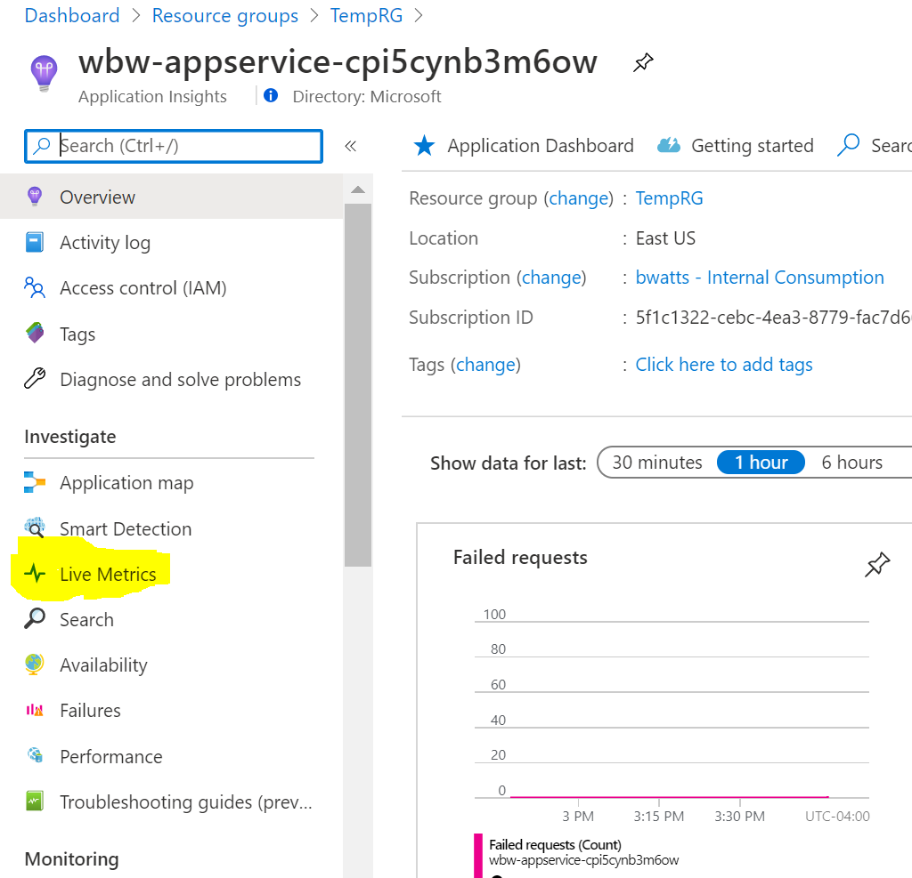

# Application Insights

## Prerequisites

- Microsoft Azure subscription
- Resource Group to deploy Azure services
- Permissions to create Web App and App Service Plan  
- Permission to creat an Application Insights Instance
- Deploy the environment to your resource group using the "Deploy to Azure" option below  

  

** Note: This will deploy a free tier Web App on an App Service Plan

## Lab Environment  

We will be monitoring the following environment using Azure Monitor.  

Monitoring Setup:  
1) Metrics  
    - Virtual Machines
2) Log Analytics
    - VM Insights (Windows and Linux VM)  
    - Diagnostic Settings  
-- Virtual Machines  
-- Network Security Groups  
-- Virtual Networks  

# Lab Setup

## Step 1: Enable Application Insights

1. In the Azure Portal, search for **Resource Groups**
2. Open the Resource Group used in the deployment of the Web App
3. There should be two resources in the resource group. An App Service Plan and an App Service. Click on the **App Service** which will be named initials-appservice-random  

4. Click on **Application Insights** under settings  

  

5. Click on **Turn on Application Insights**  

6. Leave the settings as the default and choose **Apply** at the bottom

## Step 2: Generate Traffic  

We will utilize a PowerShell script to simulate transacions to our website

1. In the portal click on the **Cloud Shell** icon and make sure your in PowerShell mode

2. Inside the cloud shell run the following command to download the needed script:

**curl https://raw.githubusercontent.com/microsoft/AzureTrailblazerAcademy/master/month3/labs/lab_appinsights/scripts/test_website.ps1 > test_website.ps1**

3. After that download run the following command to simulate load to the website:

**./test_website.ps1 -RGNAME \<ResourceGroupName\>

4. Leave the Azure Shell open to continue running the web test. Continue in another tab.

## Step 3: Explore Trafic
1. In the Azure Portal, search for **Resource Groups**
2. Open the Resource Group used in the deployment of the Web App
3. Click on the Application Insights instance   

4. In the Resource Blade for Application Insights click on the **Live Metrics** tab  

5. Verify that you see the traffic from the **test_website** script  

3. On you own explore the other views such as **Performance** and **Usage** report. Note that it could take 10 minutes for data to start to flow into these views

