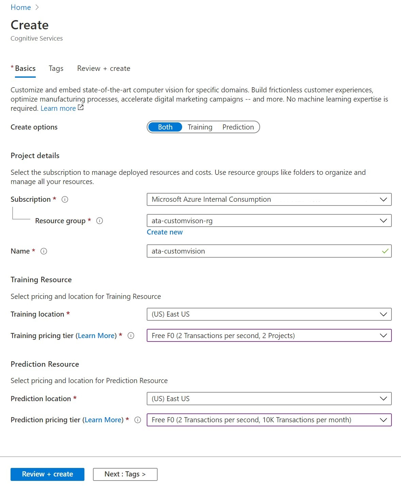
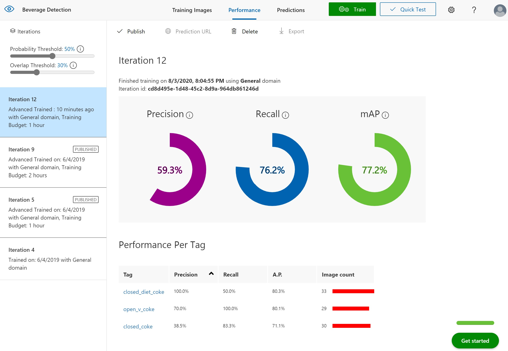
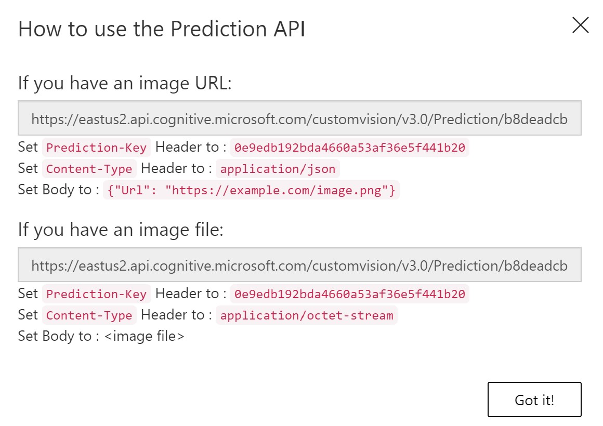

## Prerequisites
- Microsoft Azure subscription
- Resource Group to deploy Azure services
- Permissions to create Custom Vision resource 
- A set of images with which to train your classifier. See below for tips on choosing images.

## Create a Resource Group
1. In a new browser window, sign in to the [Azure portal](https://portal.azure.com).
2. In the Azure Portal, search for **Resource Groups**.
3. Click on the **Add** button.
4. Fill out the **Basics** tab as follows:
- **Subscription:** Choose your subscription
- **Resource group:** Provide a unique name like **<initial>-ata-customvision-rg
- **Region:** East US


4. Click the **Next: Review + Create** button
5. Click the **Create** button

## Create a Custom Vision resource

To use the Custom Vision Service you will need to create Custom Vision Training and Prediction resources in Azure. To do so in the Azure portal, fill out the dialog window on the [Create Custom Vision](https://portal.azure.com/?microsoft_azure_marketplace_ItemHideKey=microsoft_azure_cognitiveservices_customvision#create/Microsoft.CognitiveServicesCustomVision) page to create both a Training and Prediction resource. 
1. Fill out the **Basics** tab as follows:
- **Create options:** Both
- **Subscription:** Choose your subscription
- **Resource group:** Choose the resource group created for this lab
- **Name:** Provide a unique name for the resource
- **Training location:** East US
- **Training pricing tier:** Free F0
- **Prediction location:** East US
- **Prediction pricing tier:** Free F0



2. Click the **Review + Create** button
3. Click the **Create** button

## Create a new project

1. In your web browser, navigate to the [Custom Vision web page](https://customvision.ai) and select __Sign in__. Sign in with the same account you used to sign into the Azure portal.


1. If this is your first time visiting the portal, it will request some permissions. Click the **Yes** button to agree (you can revoke these permissions later if necessary).
1. If this is your first time visiting the portal, it will also prompt you to agree with the terms and conditions. **Check** the box to indicate consent and then click the **I agree** button.

1. To create your first project, select **New Project**. The **Create new project** dialog box will appear.


1. Enter Name and Description for the project and select the Custom Vision resource created for the lab.
1. Select __Object Detection__ under __Project Types__.

1. Next, select one of the available domains. Each domain optimizes the detector for specific types of images, as described in the following table. You will be able to change the domain later if you wish.

    |Domain|Purpose|
    |---|---|
    |__General__| Optimized for a broad range of object detection tasks. If none of the other domains are appropriate, or you are unsure of which domain to choose, select the Generic domain. |
    |__Logo__| Optimized for finding brand logos in images.|
    |__Product on Shelves__| Optimized for detecting and classifying products on shelves.|
    |__General (compact)__| Optimized for the constraints of real-time object detection on edge devices.|
    |__General (compact)[S1]__| Optimized for the constraints of real-time object detection on edge devices, for models without the postprocessing logic.|

1. Finally, select __Create project__.

## Upload and tag images

In this section you will upload and manually tag images to help train the detector. 
As a minimum, we recommend you use at least 30 images per tag in the initial training set. You'll also want to collect a few extra images to test your model once it's trained.

In order to train your model effectively, use images with visual variety. Select images that vary by:
* camera angle
* lighting
* background
* visual style
* individual/grouped subject(s)
* size
* type

Additionally, make sure all of your training images meet the following criteria:
* .jpg, .png, .bmp, or .gif format
* no greater than 6MB in size (4MB for prediction images)
* no less than 256 pixels on the shortest edge; any images shorter than this will be automatically scaled up by the Custom Vision Service


1. To add images, click the __Add images__ button and then select __Browse local files__. Select __Open__ to upload the images.


1. You'll see your uploaded images in the **Untagged** section of the UI. The next step is to manually tag the objects that you want the detector to learn to recognize. Click the first image to open the tagging dialog window. 


1. Click and drag a rectangle around the object in your image. Then, enter a new tag name with the **+** button, or select an existing tag from the drop-down list. It's very important to tag every instance of the object(s) you want to detect, because the detector uses the untagged background area as a negative example in training. When you're done tagging, click the arrow on the right to save your tags and move on to the next image.


To upload another set of images, return to the top of this section and repeat the steps.

## Train the detector

To train the detector model, select the **Train** button. The detector uses all of the current images and their tags to create a model that identifies each tagged object.


The training process should only take a few minutes. During this time, information about the training process is displayed in the **Performance** tab.


## Evaluate the detector

After training has completed, the model's performance is calculated and displayed. The Custom Vision service uses the images that you submitted for training to calculate precision, recall, and mean average precision. Precision and recall are two different measurements of the effectiveness of a detector:

- **Precision** indicates the fraction of identified classifications that were correct. For example, if the model identified 100 images as apples, and 99 of them were actually of apples, then the precision would be 99%.
- **Recall** indicates the fraction of actual classifications that were correctly identified. For example, if there were actually 100 images of apples, and the model identified 80 as apples, the recall would be 80%.



### Probability Threshold

Note the Probability Threshold slider on the left pane of the Performance tab. This is the level of confidence that a prediction needs to have in order to be considered correct (for the purposes of calculating precision and recall).

When you interpret prediction calls with a high probability threshold, they tend to return results with high precision at the expense of recall—the detected classifications are correct, but many remain undetected. A low probability threshold does the opposite—most of the actual classifications are detected, but there are more false positives within that set. With this in mind, you should set the probability threshold according to the specific needs of your project. Later, when you're receiving prediction results on the client side, you should use the same probability threshold value as you used here.

## Manage training iterations

Each time you train your detector, you create a new _iteration_ with its own updated performance metrics. You can view all of your iterations in the left pane of the **Performance** tab. In the left pane you will also find the **Delete** button, which you can use to delete an iteration if it's obsolete. When you delete an iteration, you delete any images that are uniquely associated with it.

# Use your model with the prediction API

After you've train your model, you can test images programmatically by submitting them to the Prediction API endpoint.

> [!NOTE]
> This document demonstrates using C# to submit an image to the Prediction API. For more information and examples, see the [Prediction API reference](https://southcentralus.dev.cognitive.microsoft.com/docs/services/Custom_Vision_Prediction_3.0/operations/5c82db60bf6a2b11a8247c15).

## Publish your trained iteration

From the [Custom Vision web page](https://customvision.ai), select your project and then select the __Performance__ tab.

To submit images to the Prediction API, you will first need to publish your iteration for prediction, which can be done by selecting __Publish__ and specifying a name for the published iteration. This will make your model accessible to the Prediction API of your Custom Vision Azure resource.


Once your model has been successfully published, you'll see a "Published" label appear next to your iteration in the left-hand sidebar, and its name will appear in the description of the iteration.


You can retrieve the required information by selecting __Prediction URL__. This will open up a dialog with information for using the Prediction API, including the __Prediction URL__ and __Prediction-Key__.



In this lab, you will use a local image, so copy the URL under **If you have an image file** to a temporary location. Copy the corresponding __Prediction-Key__ value as well.

## Create the application

1. In Visual Studio, create a new C# console application.

1. Use the following code as the body of the __Program.cs__ file.

    ```csharp
    using System;
    using System.IO;
    using System.Net.Http;
    using System.Net.Http.Headers;
    using System.Threading.Tasks;

    namespace CVSPredictionSample
    {
        public static class Program
        {
            public static void Main()
            {
                Console.Write("Enter image file path: ");
                string imageFilePath = Console.ReadLine();

                MakePredictionRequest(imageFilePath).Wait();

                Console.WriteLine("\n\nHit ENTER to exit...");
                Console.ReadLine();
            }

            public static async Task MakePredictionRequest(string imageFilePath)
            {
                var client = new HttpClient();

                // Request headers - replace this example key with your valid Prediction-Key.
                client.DefaultRequestHeaders.Add("Prediction-Key", "<Your prediction key>");

                // Prediction URL - replace this example URL with your valid Prediction URL.
                string url = "<Your prediction URL>";

                HttpResponseMessage response;

                // Request body. Try this sample with a locally stored image.
                byte[] byteData = GetImageAsByteArray(imageFilePath);

                using (var content = new ByteArrayContent(byteData))
                {
                    content.Headers.ContentType = new MediaTypeHeaderValue("application/octet-stream");
                    response = await client.PostAsync(url, content);
                    Console.WriteLine(await response.Content.ReadAsStringAsync());
                }
            }

            private static byte[] GetImageAsByteArray(string imageFilePath)
            {
                FileStream fileStream = new FileStream(imageFilePath, FileMode.Open, FileAccess.Read);
                BinaryReader binaryReader = new BinaryReader(fileStream);
                return binaryReader.ReadBytes((int)fileStream.Length);
            }
        }
    }
    ```

1. Change the following information:
   * Set the `namespace` field to the name of your project.
   * Replace the placeholder `<Your prediction key>` with the key value you retrieved earlier.
   * Replace the placeholder `<Your prediction URL>` with the URL you retrieved earlier.

## Run the application

When you run the application, you are prompted to enter a path to an image file in the console. The image is then submitted to the Prediction API, and the prediction results are returned as a JSON-formatted string. The following is an example response.

```json
{
    "id":"7796df8e-acbc-45fc-90b4-1b0c81b73639",
    "project":"8622c779-471c-4b6e-842c-67a11deffd7b",
    "iteration":"59ec199d-f3fb-443a-b708-4bca79e1b7f7",
    "created":"2019-03-20T16:47:31.322Z",
    "predictions":[
        {"tagId":"d9cb3fa5-1ff3-4e98-8d47-2ef42d7fb373","tagName":"cat", "probability":1.0},
        {"tagId":"9a8d63fb-b6ed-4462-bcff-77ff72084d99","tagName":"dog", "probability":0.1087869}
    ]
}
```

# Test and retrain your model

After you train your model, you can quickly test it using a locally stored image or an online image. The test uses the most recently trained iteration.

## Test your model

1. From the [Custom Vision web page](https://customvision.ai), select your project. Select **Quick Test** on the right of the top menu bar. This action opens a window labeled **Quick Test**.


2. In the **Quick Test** window, click in the **Submit Image** field and enter the URL of the image you want to use for your test. If you want to use a locally stored image instead, click the **Browse local files** button and select a local image file.


The image you select appears in the middle of the page. Then the results appear below the image in the form of a table with two columns, labeled **Tags** and **Confidence**. After you view the results, you may close the **Quick Test** window.

You can now add this test image to your model and then retrain your model.

## Use the predicted image for training

To use the image submitted previously for training, use the following steps:

1. To view images submitted to the detector, select the __Predictions__ tab. 
2. The default view shows images from the current iteration. You can use the __Iteration__ drop down field to view images submitted during previous iterations. 
3. Hover over an image to see the tags that were predicted by the model. Images are ranked, so that the images that can bring the most gains to the detector are at the top. 
4. To select a different sorting, use the __Sort__ section.


5. Use the __Train__ button to retrain the model.
