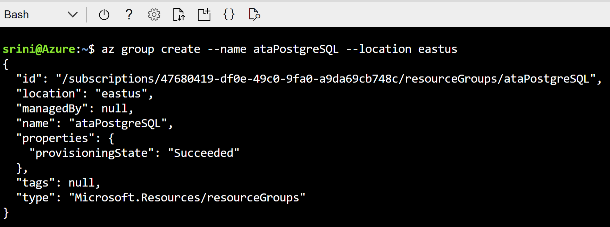
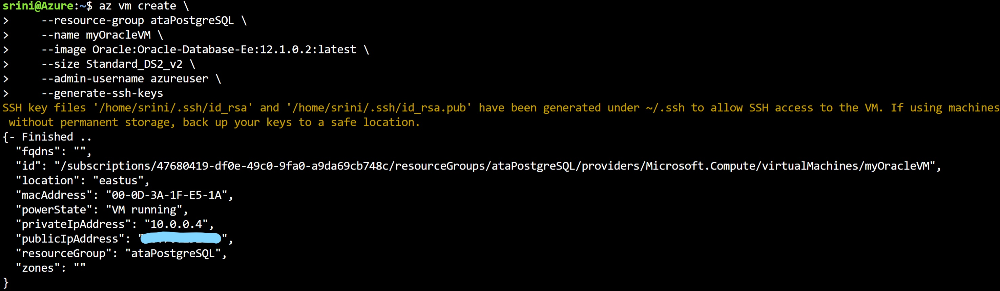
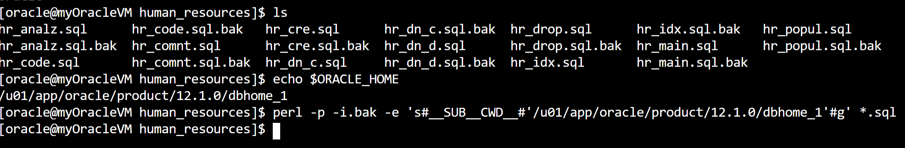
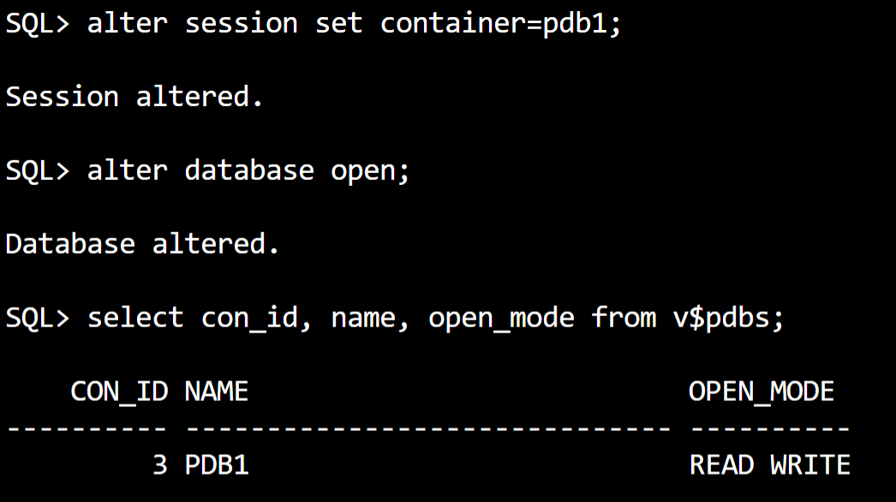
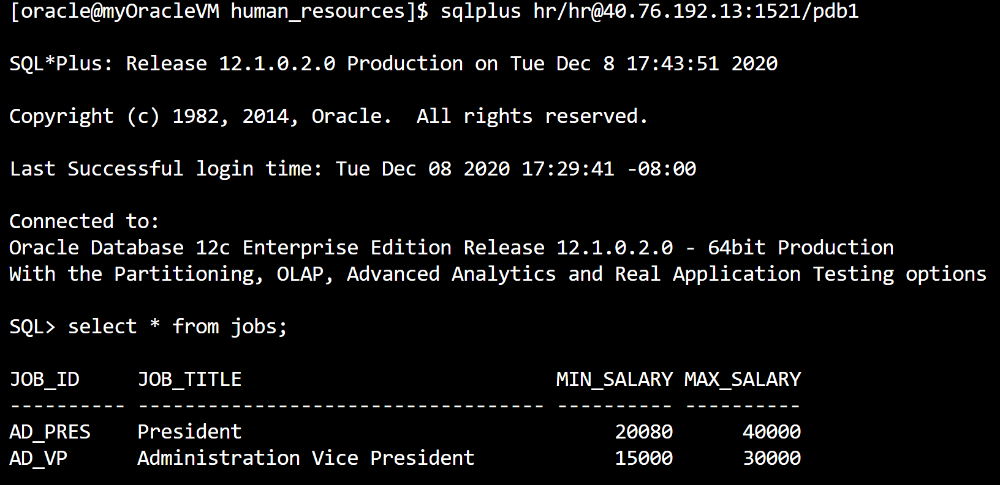
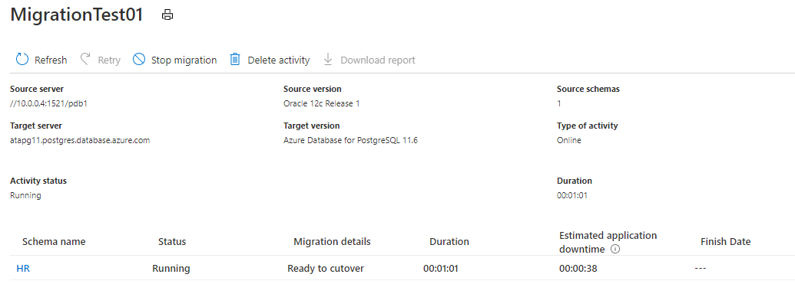
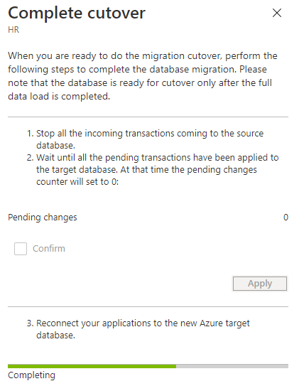

# Oracle Migration To Azure Database for PostgreSQL (Lab)
## Overview
- Azure Database for PostgreSQL is a relational database service based on the open-source Postgres database engine. It's a fully managed database-as-a-service offering that can handle mission-critical workloads with predictable performance, security, high availability, and dynamic scalability. It offers two deployment options Single Server and Hyperscale (Citus). Please access <a href="https://docs.microsoft.com/en-us/azure/postgresql/overview"> this link </a> for more details. 

- This lab provides the steps to migrate Oracle 12c database to Azure PostgreSQL version 11. This labs assumes that you have completed the assessment step using an open source tool <a href="https://datamigration.microsoft.com/scenario/oracle-to-azurepostgresql"> Ora2Pg </a>.

## Pre-requisites
- [Prep-1: Create Oracle Database in an Azure VM](#prep-1-create-oracle-database-in-an-azure-vm)
- [Prep-2: Install Sample HR Schema](#prep-2-Install-sample-hr-schema) 

## Task List
- [Task-1: Create Azure Database for PostgreSQL Service](#task-1-create-azure-database-for-postgresql-service)
- [Task-2: Create Azure Database Migration Service](#task-2-create-azure-database-migration-service)
- [Task-3: Create a project to Migrate Oracle HR schema](#task-3-create-a-project-to-migrate-oracle-hr-schema)
- [Task-4: Execute the initial load](#task-4-execute-the-initial-load)
- [Task-5: Perform the data sync and Prepare for the cutover](#task-5-perform-the-data-sync-and-prepare-for-the-cutover)
- [Task-6: Perform the cutover and go live](#task-6-perform-the-cutover-and-go-live)

### Prep-1: Create Oracle Database in an Azure VM
1. Create a resource group 
- Open Cloud shell in bash mode
- Enter the following command:
- az group create --name ataPostgreSQL-initial --location eastus

2. Create virtual machine
- Enter the following command:
- az vm create \
    --resource-group ataPostgreSQL-initial \
    --name myOracleVM \
    --image Oracle:Oracle-Database-Ee:12.1.0.2:latest \
    --size Standard_DS2_v2 \
    --admin-username azureuser \
    --generate-ssh-keys

-  Copy the Public_IP_Address from the output
3. Connect to the VM from the bash shell
- ssh azureuser@<Public_IP_Address>
4. Swith to Oracle User and create dataabse
- Enter the following commands:
- sudo -su oracle
- Start the Oracle listner
- lsnrctl start
5. Create a data directory for the Oracle data files
- Enter the following commands:
- mkdir /u01/app/oracle/oradata
- Create Oracle database by entering the following command:
- dbca -silent \
       -createDatabase \
       -templateName General_Purpose.dbc \
       -gdbname cdb1 \
       -sid cdb1 \
       -responseFile NO_VALUE \
       -characterSet AL32UTF8 \
       -sysPassword OraPasswd1 \
       -systemPassword OraPasswd1 \
       -createAsContainerDatabase true \
       -numberOfPDBs 1 \
       -pdbName pdb1 \
       -pdbAdminPassword OraPasswd1 \
       -databaseType MULTIPURPOSE \
       -automaticMemoryManagement false \
       -storageType FS \
       -datafileDestination "/u01/app/oracle/oradata/" \
       -ignorePreReqs
6. Set Oracle environment variables
- Open ~/.bashrc file and add the following lines as shown in the picture
- export ORACLE_SID=cdb1;
- export ORACLE_HOME=<Installed Directory>

7. Open ports for connectivity
- Open Oracle Database port to migrate the data
- Enter the following command:
- az network nsg rule create \
    --resource-group ataPostgreSQL\
    --nsg-name myOracleVmNSG \
    --name allow-oracle \
    --protocol tcp \
    --priority 1001 \
    --destination-port-range 1521

### Prep-2: Install Sample HR Schema
1. Get the HR schema install script from Github
- Enter the following commands:
- wget https://github.com/oracle/db-sample-schemas/archive/v19.2.zip
- unzip v19.2.zip
2. Replace ORACLE_HOME path in the scripts
- Run perl script to replace the Oracle Home directory
- perl -p -i.bak -e 's#__SUB__CWD__#'/u01/app/oracle/product/12.1.0/dbhome_1'#g' *.sql

3. Copy the sql scripts to Oracle Home
- Enter the following commands:
- cd $ORACLE_HOME
- mkdir human_resources
- cd human_resources
- cp /home/oracle/db-sample-schemas-19.2/human_resources/*.sql .
4. Connect to Oracle Database to setup environment
- Enter the following command:
- sqlplus / as sysdba
- Open the container PDB1 
-   Enter "alter session set container=pdb1;" 
-   Enter "alter database open;"
-   Enter "select con_id, name, open_mode from v$pdbs;"

5. Run the script to install HR schema
- Enter the info as shown in the picture
- Replace your IP address in step 6 \<OracleVMIP\>:1521/pdb1

- "quit;" to exit sqlplus
6. Test Sample Schema
- sqlplus hr/hr@\<OracleVMIP\>:1521/pdb1

7. You have successfully completed the pre-requisits for this lab:

### Task-1: Create Azure Database for PostgreSQL Service
1. Select Azure Database for PostgreSQL service
- Type 'Azure Database for postgresql' on the search bar to select Azure database for postgreSQL service
- Select Single Server option

2. Enter the following details
- Resource group: Select an existing resource group "ataPostgreSQL-initial" from the drop down.
- Server name: enter 'atapg11\<yourname\>'.
- Location: select 'East US'
- Version: 11
- Admin username: enter 'pgadmin'
- Password: enter 'atapg123!'

- Click on 'Review + create'.
- Click on 'Create' after the successful validation.

3. Open access to the PgAdmin Client Server
- Connect to the Azure PostgreSQL Server
- Add the IP address of the client in the server NSG setup

4. Install pgadmin tool
- Download PostgreSQL Admin tool using <a href="https://www.pgadmin.org/download/pgadmin-4-windows/">thislink</a>

5. Connect to the Azure PostgreSQL from PgAdmin Tool
- Enter the following:
- Host Name: copy host name from the Azure Portal
- User name:pgadmin@hostname
- Password:atapg123!

- Select 'Databases' and create a new Database
- Enter HR as the new database
- Create 'PGHR' as the schema

## Task-2: Create Azure Database Migration Service
1. Select Azure Database Migration Service
- Type 'Database Migration' in the search bar to select the service.
2. Enter the following information
- Resource Group: Select the resource group you have created in the Task-1.
- Migration service name: Enter 'ata-dms-\<youname\>'
- Pricing tier: Click on 'Configure tier' and select Premium service.
- Click on 'Networking' button

- Select the existing Virtual Network for the resource group

- Click on 'Review + create'.
- Click on 'Create' after the successful validation.
- Click on 'Goto Resource' after it is done.
3. Enable Supplimental Loging and Archive Loging in Oracle
- Open the Cloud Shell
- Login to Oracle Server
- Enter the following commands:
- ssh azureuser@\<YourIP\> to access the VM
- sudo su - oracle to change the user as Oracle
- sqlplus \ as sysdba to connect to the database
- SHUTDOWN IMMEDIATE;
- STARTUP MOUNT;
- ALTER DATABASE ARCHIVELOG;
- ALTER DATABASE OPEN;
- ALTER DATABASE ADD SUPPLEMENTAL LOG DATA;
- SHUTDOWN IMMEDIATE;
- STARTUP;
- alter session set container=pdb1;
- alter database open;
## Task-3: Create a project to Migrate Oracle HR schema
1. Create a migration project 
- Select '+' next to 'New Migration Project' 
- Enter the following information
- Project name: ora12cToPg11
- Source server type: select 'Oracle' from the dropdown list
- Target server type: select 'Azure Database for PostgreSQL' 
- Click on 'Create and Run Activity' button
- It opens up 6 step configuration

2. Add Source Details
- Enter the following Oracle 12c HR database details
- Source Server name: Enter the Instructor provided Oracle Server IP address.
- Server port: Enter the default port number 1521.
- Oracle SID: Enter 'nonpdb' 
- User Name: Enter 'system'
- Password: Enter 'OraPasswd1'
- Click on Save button.

3. Provide Driver Install Detail
- Download the driver file from <a href="https://aka.ms/OracleDriverDownloads"> Oracle site</a> 
- Create a storage account file share and upload the file
- Get the path, user and password from the connection info as shown in the picture.

- Enter the following location details to access the driver file
- OCI driver path: Get the path from the connect info and add "instantclient-basiclite-windows.x64-12.2.0.1.0.zip" at the end.
- User Name: Get the details from Connect Info
- Password: Get the details from the connect Info
- Click on Save button

4. Add Target Info
- Enter the following info:
- Target Server Name: Get the name from PostgreSQL Overview 
- Database: keep the default value
- User Name: Get the admin name from the PostgreSQL Overview
- Password: Enter the password similar to 'atapg123!'

5. Add the network access to DMS Service from PostgreSQL service
- You will get an error showing the IP address which need the access from PostgreSQL.
6. Select Source and Target Schemas
- Select 'HR' from Oracle and 'PGHR' from PostgreSQL

7. Select Source and target table mappings

## Task-4: Execute the initial load
1. Create an activity to start the migration
- Activity Name: 'MigrationTest01'
- Select 'Start Migration' button

2. Check the initial load statistics
- Verify the source and target server and version details. Check the migration status.

## Task-5: Perform the data sync and Prepare for the cutover
- Perform the following operations on the Oracle Database
1. Insert two rows using the SQL commands
- INSERT INTO hr.jobs VALUES('AC_MGR_02', 'Account Manager 02', 50000, 90000);
- INSERT INTO hr.jobs VALUES('AC_MGR_03', 'Account Manager 03', 60000, 99000);
- COMMIT;
2. Update a row using the SQL command
- UPDATE hr.jobs SET JOB_TITLE='Major Accountant' WHERE job_id='AC_ACCOUNT';
- COMMIT;
3. delete a row using the SQL command
- DELETE hr.jobs WHERE job_id='AC_MGR_02';
- COMMIT;
4. Verify all the changes have been captured in DMS and propagated to PostgreSQL

## Task-6: Perform the cutover and go live
1. Stop the source Oracle database
2. Activate cutover
3. Make sure there are no pending changes
4. Update the database connectivity info in all applications accessing the Oracle HR schema.
5. Confirm the cutover

5. Restart the applications with Azure PostgreSQL database connectivity to Go Live!!

- You have successfully migrated Oracle database to Azure PostgreSQL.

  

