# Intelligent Bot Lab: LUIS, Text Analytics and Bot Services

## Table of Content
- [Intelligent analytics hands-on lab step-by-step](#intelligent-analytics-hands-on-lab-step-by-step)
  - [Abstract and learning objectives](#abstract-and-learning-objectives)
  - [Overview](#overview)
  - [Solution architecture](#solution-architecture)
  - [Requirements](#requirements)
  - [Exercise 1: Environment setup](#exercise-1-environment-setup)
    - [Task 1: Setup a lab virtual machine](#task-1-setup-a-lab-virtual-machine)
    - [Task 2: Connect to the lab VM](#task-1-connect-to-the-lab-vm)
    - [Task 3: Download and open the ConciergePlus starter solution](#task-2-download-and-open-the-conciergeplus-starter-solution)
    - [Task 4: Create App Services](#task-3-create-app-services)
    - [Task 5: Provision Function App](#task-4-provision-function-app)
    - [Task 6: Provision Service Bus](#task-5-provision-service-bus)
    - [Task 7: Provision Event Hubs](#task-6-provision-event-hubs)
    - [Task 8: Provision Azure Cosmos DB](#task-7-provision-azure-cosmos-db)
    - [Task 9: Provision Azure Search](#task-8-provision-azure-search)
    - [Task 10: Create Stream Analytics job](#task-9-create-stream-analytics-job)
    - [Task 11: Start the Stream Analytics job](#task-10-start-the-stream-analytics-job)
    - [Task 12: Provision an Azure Storage account](#task-11-provision-an-azure-storage-account)
    - [Task 13: Provision Cognitive Services](#task-12-provision-cognitive-services)
  - [Exercise 2: Implement message forwarding](#exercise-2-implement-message-forwarding)
    - [Task 1: Implement the event processor](#task-1-implement-the-event-processor)
    - [Task 2: Configure the Chat Message Processor Function App](#task-2-configure-the-chat-message-processor-function-app)
      - [Event Hub connection string](#event-hub-connection-string)
      - [Event Hub name](#event-hub-name)
      - [Storage account](#storage-account)
      - [Service Bus connection string](#service-bus-connection-string)
      - [Chat topic](#chat-topic)
      - [Text Analytics API settings](#text-analytics-api-settings)
  - [Exercise 3: Deploying the App Services](#exercise-3-deploying-the-app-services)
    - [Task 1: Restore NuGet Packages for the solution](#task-1-restore-nuget-packages-for-the-solution)
    - [Task 2: Publish the ChatMessageSentimentProcessor Function App](#task-2-publish-the-chatmessagesentimentprocessor-function-app)
    - [Task 3: Publish the ChatWebApp](#task-3-publish-the-chatwebapp)
    - [Task 4: Testing hotel lobby chat](#task-4-testing-hotel-lobby-chat)
  - [Exercise 4: Add intelligence](#exercise-4-add-intelligence)
    - [Task 1: Implement sentiment analysis](#task-1-implement-sentiment-analysis)
    - [Task 2: Implement linguistic understanding](#task-2-implement-linguistic-understanding)
    - [Task 3: Re-deploy the function application and test](#task-3-re-deploy-the-function-application-and-test)
  - [Exercise 5: Building the Power BI dashboard](#exercise-5-building-the-power-bi-dashboard)
    - [Task 1: Provision Power BI](#task-1-provision-power-bi)
    - [Task 2: Create the static dashboard](#task-2-create-the-static-dashboard)
    - [Task 3: Create the real-time dashboard](#task-3-create-the-real-time-dashboard)
    - [Task 4: Add a trending sentiment chart to the dashboard](#task-4-add-a-trending-sentiment-chart-to-the-dashboard)
  - [Exercise 6: Enabling search indexing](#exercise-6-enabling-search-indexing)
    - [Task 1: Verifying message archive](#task-1-verifying-message-archive)
    - [Task 2: Creating the index and indexer](#task-2-creating-the-index-and-indexer)
    - [Task 3: Update the Chat Web App Configuration](#task-3-update-the-chat-web-app-configuration)
    - [Task 4: Re-publish web app](#task-4-re-publish-web-app)
  - [Exercise 7: Add a bot using Bot service and QnA Maker](#exercise-7-add-a-bot-using-bot-service-and-qna-maker)
    - [Task 1: Create a QnA service instance in Azure](#task-1-create-a-qna-service-instance-in-azure)
    - [Task 2: Create a QnA bot](#task-2-create-a-qna-bot)
    - [Task 3: Embed the bot into your web app](#task-3-embed-the-bot-into-your-web-app)
  - [After the hands-on lab](#after-the-hands-on-lab)
    - [Task 1: Delete the resource group](#task-1-delete-the-resource-group)

# Intelligent analytics hands-on lab step-by-step

## Overview

First Up Consultants specialize in building software solutions for the hospitality industry. Their latest product is an enterprise mobile/social chat product called Concierge+ (aka ConciergePlus). The mobile web app enables guests to easily stay in touch with the concierge and other guests, enabling greater personalization and improving their experience during their stay. Sentiment analysis is performed on top of chat messages as they occur, enabling hotel operators to keep tabs on guest sentiments in real-time.

## Solution architecture

Below is a diagram of the solution architecture you will build in this lab. Please study this carefully so you understand the whole of the solution as you are working on the various components.


Messages are sent from browsers running within laptop or mobile clients via SignalR to an endpoint running in an Azure Web App. Chat messages received by the Web App are sent to an Event Hub where they are temporarily stored. An Azure Function picks up the chat messages and applies sentiment analysis to the message text (using the Text Analytics API), as well as contextual understanding (using LUIS). The function forwards the chat message to an Event Hub used to store messages for archival purposes, and to a Service Bus Topic which is used to deliver the message to the intended recipients. A Stream Analytics Job provides a simple mechanism for pulling the chat messages from the second Event Hub and writing them to Cosmos DB for archiving, and to Power BI for visualization of sentiment in real-time as well as trending sentiment. An indexer runs atop Cosmos DB that updates the Azure Search index which provides full text search capability. Messages in the Service Bus Topic are pulled by Subscriptions created in the Web App and running on behalf of each client device connected by SignalR. When the Subscription receives a message, it is pushed via SignalR down to the browser-based app and displayed in a web page. Bot Services hosts a bot created using QnA maker, which automatically answers simple questions asked by site visitors.

## Requirements

- Microsoft Azure subscription must be pay-as-you-go or MSDN.
  - Trial subscriptions will not work.
- A virtual machine configured with:
  - Visual Studio Community 2019 or later.
  - Azure SDK 2.9 or later (Included with Visual Studio 2019).

## Exercise 1: Environment setup

Duration: 60 minutes

The following section walks you through the manual steps to provision the services required in the [Azure portal](https://portal.azure.com).  First Up Consultants have provided a starter solution for you. They have asked you to use this as the starting point for creating the Concierge Plus intelligent chat solution in Azure.

### Task 1: Setup a lab virtual machine

1. In the [Azure Portal](https://portal.azure.com/), select **+Create a resource** from the left menu, then type `Visual Studio Latest` into the search bar. Select **Visual Studio Community 2019(latest release) on Windows Server 2016 (x64)** from the results.

    

     on Windows 2019 (x64) selected")

2. Select the **Create** button.

3. Set the following configuration on the Basics tab:

    - **Subscription**: (Your Subscription) Select the subscription you are using for this hands-on lab.

    - **Resource Group**: Select the **Create new** link, and enter `intelligent-analytics` as the name of the new resource group.

    - **Virtual Machine Name**: Enter `LabVM`

    - **Region**: Select a region close to you.

    - **Availability Options**:  Leave the availability option as **No infrastructure redundancy required**

    - **Image**: Select **Visual Studio 2019 Community (latest release) on Windows Server 2019 (x64)**

    - **Size**: Select the **Change size** link, and choose **Standard D2s v3**

    - **Username**: `demouser`

    - **Password**: (your password)

    - **Public inbound ports**: **Allow selected ports**

    - **Select inbound ports**: Select **RDP (3389)**.

4. Set the following configuration on the Disks tab:

    - **OS disk type**: Select **Premium SSD**.

    - **Advanced** - Use managed disks: **Yes**

    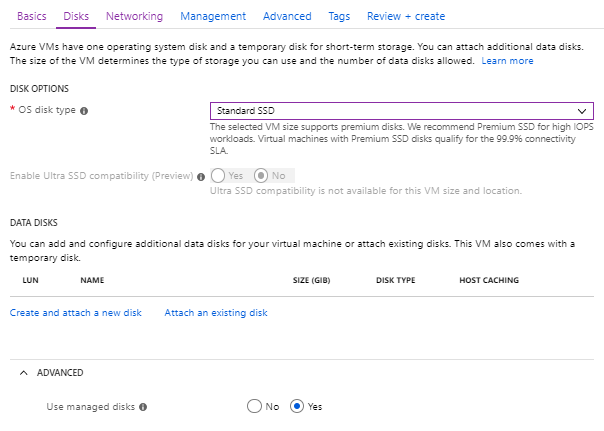

5. Select **Next: Networking**.

    

6. Leave defaults.

    

7. Select the **Review + create** button.

    

8. Azure will validate your settings.  If everything is valid, then select **Create**.

    

### Task 2: Connect to the lab VM

1. In the [Azure portal](https://portal.azure.com), and select Resource groups from the left-hand menu, then enter intelligent-analytics into the filter box, and select the resource group from the list.

    

2. Next, select **LabVM** from the list of available resources.

    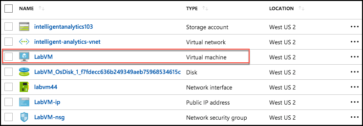

3. On the LabVM blade, select **Connect** from the top menu, which will download an RDP file.

    

4. Open the downloaded RDP file.

5. Select Connect on the Remote Desktop Connection dialog.

    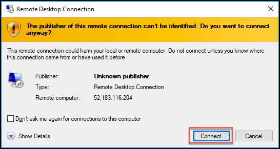

6. Enter the following credentials (or the non-default credentials if you changed them):

    - **Username**: `demouser`

    - **Password**: (your password)

7. Select Yes to connect, if prompted that the identity of the remote computer cannot be verified.

    

8. Open **Internet Explorer**, then download and install Edge.

### Task 3: Download and open the ConciergePlus starter solution

1. From your Lab VM open the Edge browser.

2. Go to the following URL [Intelligent Bot Zip File](code/intelligent-bot.zip).

3. Click on the "View Raw" link to download the intelligent-bot project .zip file  

4. Open the .zip file and unzip the contents of the starter-project folder to **C:\\ConciergePlus**\\.

   >**Note**: Make sure to extract to this exact path. If you extract to a longer directory path, you will hit a Windows max 260 character path limit when you try to build the Visual Studio solution. You will not be able to download the NuGet packages. Keep the solution directory path short.

     Folders window")

5. Open **ConciergePlusSentiment.sln** in the `C:\ConciergePlus\starter-project` folder with Visual Studio 2019.

6. Sign in to Visual Studio or select create account, if prompted.

7. If presented with the Start with a familiar environment dialog, select Visual C\# from the Development Settings drop down list, and select Start Visual Studio.

    

8. If the Security Warning window appears, uncheck Ask me for every project in this solution, and select OK.

    

    

> **Note**: If you attempt to build the solution at this point, you will see many build errors. This is intentional. You will correct these in the exercises that follow.

> **Note**: Visual Studio Installer will show the installed version of Visual Studio and if the Azure SDK is installed. If the Azure SDK is missing, go back to the **Before the HOL** and make sure you created the correct VM. Updating Visual Studio manually may install components that may not work with the lab.

### Task 4: Create App Services

In these steps, you will provision a Web App within a single App Service Plan.

1. Sign in to the Azure Portal (<https://portal.azure.com>).

2. Select **+Create a resource**, then search for `Web` and choose **Web App**. Select the **Create** button.

    

3. On the Create Web App blade, enter the following:

    - **Subscription**: Select your subscription.
    - **Resource Group**: Select Use existing, and select the **intelligent-analytics** resource group created previously.
    - **Name**: Provide **a unique name** that is indicative of this resource being used to host the Concierge+ chat website (e.g., `conciergepluschatapp + (namespace)`).
    - **Publish**: Choose the **Code** option.
    - **Runtime stack**: **.NET Core 3.1**
    - **OS**: **Windows**
    - **Region**: Choose a region close to you.
    - **App Service plan**: Create a new App Service Plan.
    - **Sku and Size**: **Standard S1**

    - Select **Review and Create** to provision both Web App and the App Service Plan. Select the **Create** button.

4. When provisioning completes, navigate to your new Web App in the portal by selecting **App Services** from the left menu, and then selecting your web app from the list.

    

5. On the App Service screen, select **Configuration** from the left menu, and then select the **General settings** tab.

    

6. Select the toggle for **Web Sockets** to **On**.

   > **Note**: Failure to complete this step will not allow the JavaScript client to communicate with the web application and receive continuous data exchange.

7. Select **Save**.

### Task 5: Provision Function App

In this section, you will provision a Function App that will be used as the EventProcessorHost for processing and enriching Event Hubs data.

1. From the Azure Portal left menu, select **+ Create a resource**, and search for `Function App`. Choose the **Function App** search result and select the **Create** button.

    

2. On the Function App form, enter the following on the **Basics** tab:

    - **Subscription**: Select your subscription.

    - **Resource Group**: Select Use existing, and select the **intelligent-analytics** resource group created previously.

    - **App Name**: Provide **a unique name** that is indicative of this resource being used to process chat messages (e.g., `chatprocessor`).

    - **Publish**: **Code**
  
    - **Runtime Stack**:  Select **.NET Core**.
  
    - **Version**: Select **3.1**.

    - **Region**: Select the location you used for the resource group created previously.

    - Select **Review + create** to provision the Function App.

    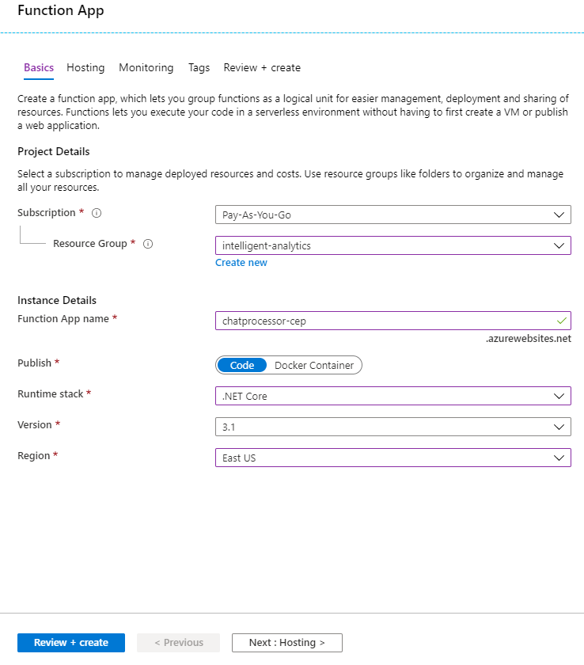

### Task 6: Provision Service Bus

In this section, you will provision a Service Bus Namespace and Service Bus Topic.

1. Continuing in the [Azure portal](https://portal.azure.com), select **+ Create a resource** from the left menu.

2. Search for **Service Bus** and select the **Create** button.

    

3. On the Create namespace blade enter the following:

    - **Name**: Provide a unique name for the namespace (e.g., `awhotel-namespace`). Namespace could be your initials.

    - **Pricing tier**: Select **Standard**.

    - **Subscription**: Select the Azure subscription you are using for this hands-on lab.

    - **Resource Group**: Select the **intelligent-analytics** resource group.

    - **Location**: Select the location you are using for resources in this hands-on lab.

      

4. Select **Create**.

5. Once provisioning completes, navigate to your new Service Bus in the portal by choosing Resource Groups in the left menu, then selecting the **intelligent-analytics** resource group, and selecting your Service Bus Namespace from the list of resources.

    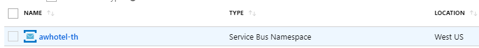

6. On the Overview blade, select on Topic under Entities on the left-hand side of the blade.

    

7. Add a new Topic by selecting +Topic.

    

8. On the Create topic blade, enter the following:

    - **Name**: Enter `awhotel`. This represents that this topic will handle the messages for a particular hotel.

    - **Max topic size**: Leave set to **1 GB**.

    - **Message time to live**: Set to `1` day.

    - **Enable partitioning**: Ensure this checkbox remains unchecked. Chat will not function properly if this is checked.

      

9. Select **Create**.

10. Create a subscription to the Service Bus topic you just created. The web application will use the subscription to retrieve messages and send them messages to the browser client. Enter these configurations:

    - Select the topic you just created.
    - Select the Subscription menu item on the left-hand menu.
  
    

    

    - Enter `ChatMessageSub` as the name.
    - Max delivery count: 10
    - Auto-delete after idle: 1 day.
    - Message time to live and dead-lettering: 1 day.
  
    Select the **Create** button.
  
11. Navigate back to the **Service Bus namespace** in the Azure Portal.

    

    >**Note:** Do not create the policy at the topic level for this lab. Create it at the Namespace.

    - Select **Shared access policies** within the left menu, under Settings.

    - In the **Shared access policies**, you are going to create a new policy that the **ChatConsole** can use to retrieve messages. Select **+Add**.

    

    - For the New Policy Name, enter `ChatConsole`.

    - In the list of claims, check **Send** and **Listen** claims.

    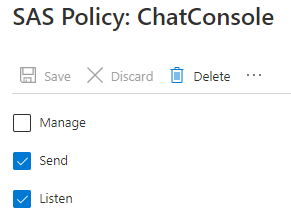

    - Select **Create**.
  
    - Open the newly created **ChatConsole** policy. Capture the **ServiceBusConnectionString** value in a text file.

    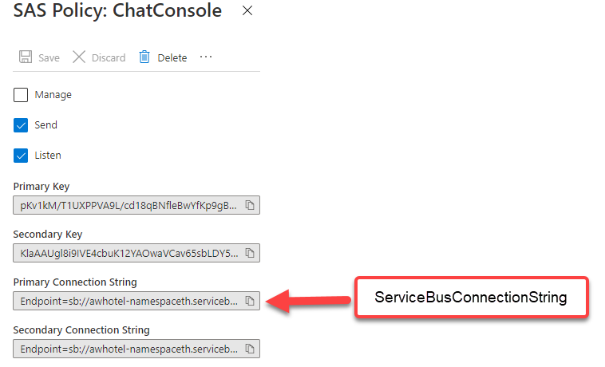

### Task 7: Provision Event Hubs

In this task, you will create a new Event Hubs namespace and instance.

1. In the [Azure portal](https://portal.azure.com) left menu, select **+Create a resource**, then search for `Event Hubs`.

    

2. On the **Create namespace** blade enter the following:

    - **Name**: Provide a unique name for the namespace (e.g., `awhotel-events-namespace`).

    - **Pricing tier**: Select **Standard (20 Consumer groups, 1000 brokered connections)**.

    - **Subscription**: Select the subscription you are using for this hands-on lab.

    - **Resource Group**: Select the **intelligent-analytics** resource group.

    - **Location**: Select the location you are using for resources in this hands-on lab.

    - **Throughput Units**: Leave at `1`.

    - **Enable auto-inflate**: **Unchecked**.

    - Select **Create** to provision the Event Hubs namespace.

      

3. When provisioning completes, navigate to your new Event Hub namespace in the portal by choosing **Resource Groups** from the Azure Portal left menu. Select the **intelligent-analytics** resource group followed by your Event Hub Namespace.

    

4. On the **Overview** blade, select **+Event Hub** to add a new Event Hub. This event hub will receive chat messages from the web application.

    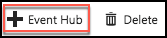

5. On the **Create Event Hub** blade, enter the following:

    - **Name**: Enter `awchathub`.

    - **Partition Count**: Set to the max value of `32`. This will enable you to significantly scale up the number of downstream processors on the Event Hub, where each partition consumer (as handled by the EventProcessorHost) can reach up to 1 Throughput Unit per partition should the need arise. You cannot change this value later.

    - **Message Retention**: Leave set to `1`.

    - **Capture**: Leave set to **Off**.

    - Leave the remaining values as their defaults.

    - Select **Create**.

      

6. Repeat steps listed 5 to create another Event Hub. Name the event hub `awchathub2`.This one will store messages for archival and be processed by Stream Analytics. Stream Analytics forwards the message to Cognitive Search.

    If you select the **Event Hubs** menu item from the left menu, this will display the list of event hubs, you should see the following:

    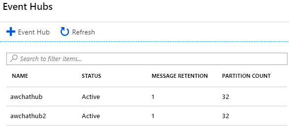

7. You will create the `ChatConsole` Event Hub shared policy.  Select **Shared access policies**, under **Settings**, within the left-hand menu.

8. In the **Shared access policies**, you are going to create a new policy that the **ChatConsole** can use to retrieve messages. Select **+Add**.

    

9. For the **New Policy Name**, enter `ChatConsole`.

10. In the list of Claims, select **Send** and **Listen**. Select the **Create** button.

11. Select the **ChatConsole** policy you just created. Open Notepad and save the primary connection string value for the **EventHubConnectionString**.  Later, you will use it for the Application Settings.

    

### Task 8: Provision Azure Cosmos DB

Duration: 15 minutes

In this section, you will provision an Azure Cosmos DB account, a database, and a collection that will be used to collect all the chat messages. Cognitive Search will index this data later. Power BI will use the data for visualizations.

1. In the [Azure portal](https://portal.azure.com), select **+Create a resource**.  Search for **Azure Cosmos DB**.

    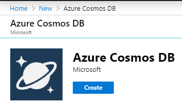

2. On the **Azure Cosmos DB** blade, enter the following:

    - **Subscription**: Select the subscription you are using for this hands-on lab.

    - **Resource Group**: Select the **intelligent-analytics** resource group.

    - **Account Name**: Provide a unique name for the Azure Cosmos DB account (e.g., `awhotelcosmosdb + namespace`).

    - **API**: Select **Core(SQL)**.

    - **Notebooks (Preview)**: Keep this set to **Off**.

    - **Apply Free Tier Discount**: There is a limit to one free tier Cosmos DB discount per account. If you still have this available, feel free to apply it here.

    - **Location**: Select the region you are using for resources in this hands-on lab.

    - **Account Type**: Keep this set to **Non-Production**.
  
    - **Enable geo-redundancy**: Ensure this is set to **Enable**.

    - **Multi-region Writes**: Ensure this is set to **Disable**.

    - **Availability Zones**: Ensure this is set to **Disable**.

    - Select **Review + Create**, then **Create** to provision the Azure Cosmos DB instance.

      

3. When the provisioning completes, navigate to your new Azure Cosmos DB account in the portal.

4. On the **Overview screen**, select **+Add Container**.

    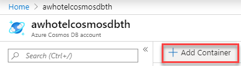

5. On the **Add Container** blade, enter the following:

    - **Database id**: Create new. Enter `awhotels`.

    - **Container Id**: Enter `messagestore`.

    - **Partition Key**: Enter a partition key such as `/username`.

        > **Note**: Pick a field in this schema.  Otherwise, you will have no documents in the Cosmo DB container. Below is a sample of the messages stored in the Cosmo DB at a later part in the lab.

        

    - **Throughput**: Set to `400`.

    - Select **OK** to add the container.

    

6. Add another container with the following:

    - **Database id**: Enter existing database id `awhotels`.

    - **Container Id**: Enter `trendingsentiment`.

    - **Partition Key**: Enter a partition key such as `/Snapshot`.

    - **Throughput**: Set to `400`.

    - Select **OK** to add the container.

    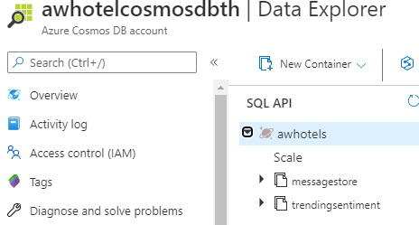

### Task 9: Provision Azure Search

In this section, you will create an Azure Search instance.

1. Select **+Create a resource**, then search for `Search`. Select **Azure Cognitive Search** from the results, then select the **Create** button on the resource overview screen.

    

2. On the **New Search Service** blade, enter the following:

    - **Subscription**: Select the subscription you are using for this hands-on lab.
  
    - **Resource Group**: Select the **intelligent-analytics** resource group.

    - **URL**: Provide a **unique name** for the search service (e.g., `conciergeplusapp`).

    - **Location**: Select the location you are using for resources in this hands-on lab, or the next closest location if your location is unavailable in the list.

    - **Pricing Tier**: Select **Change Pricing Tier** and choose **Basic**.

    - Select **Review + Create**, and once validation has passed, select **Create**.

      

### Task 10: Create Stream Analytics job

In this section, you will create the Stream Analytics Job that will be used to read chat messages from the Archival Event Hub and write them to the Azure Cosmos DB and Service Bus.

1. From the Azure Portal left menu, select **+Create a resource**, the search for **Stream Analytics** **job**.  Choose the **Create** button.

2. On the **New Stream Analytics Job** blade, enter the following:

    - **Job Name**: Enter `MessageLogger`.

    - **Subscription**: Select the subscription you are using for this hands-on lab.

    - **Resource Group**: Select the **intelligent-analytics** resource group.

    - **Location**: Select the location you are using for resources in this hands-on lab.

    - **Hosting environment**: Select **Cloud**.

    - Select **Create** to provision the new Stream Analytics job.

      

3. When provisioning completes, navigate to your new Stream Analytics job in the portal by selecting **Resource Groups** in the left menu, and selecting the **intelligent-analytics** resource group, then selecting your **Stream Analytics Job**.

    

4. From the **Stream Analytics job** left menu, beneath **Job topology**, select the **Inputs** menu item.

    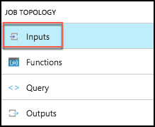

5. On the **Inputs** blade, select **+Add stream input** and then select **Event Hub**.

    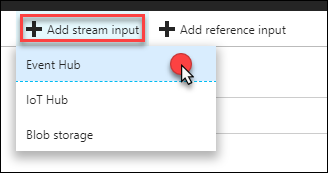

6. On the **New Input** blade, enter the following:

    - **Input Alias**: Set the value to `eventhub`.

    - Choose **Select Event Hub from your subscriptions**.

    - **Subscription**: Choose the same subscription you have been using thus far.

    - **Event Hub namespace**: Choose the Namespace which contains **your Event Hubs instance** (e.g., `awhotel-events-namespace`).

    - **Event hub name**: Choose `awchathub2`, the second Event Hub instance you created. awchathub2 is the archiving event hub.  Messages are pushed there from the ChatMessageSentimentProcessFunction Azure function.

    - **Event hub policy name**: Select **Use existing**, and choose **ChatConsole**.

    - **Event hub consumer group**: Select **Use existing**, and select **$Default**.

    - **Event serialization format**: Leave as **JSON**.

    - **Encoding**: Leave as **UTF-8**.

    - **Event compression type**: Leave set to **None**.

    - Select **Save**.

      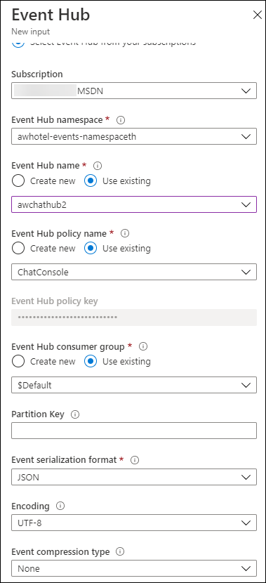

7. Now, select **Outputs** from the left-hand menu, under **Job Topology**.

    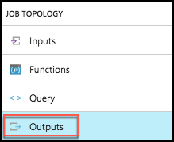

8. In the **Outputs** blade, select **+Add**, then select **Cosmos DB**.

    

9. On the **Cosmos DB New output** blade, enter the following:

    - **Output alias**: `cosmosdb`.

    - Choose **Select Cosmos DB from your subscriptions**.

    - **Subscription**: Choose the same subscription you have been using thus far.

    - **Account Id**: Select your Account id (e.g., **awhotel-cosmosdb**).

    - **Database**: `awhotels`

    - **Container name**: Set to the name of your messages collection, `messagestore`.

    - **Document id**: Set to **messageid** (all lowercase).

    - Select **Save**.

    

10. **Optional**: Test your connection. Select the Output link on the left-hand side.  Your new `cosmosdb` connection should be listed.  Select the test connection icon. Below is an example of a problem with a Cosmos DB configuration.

    

    You should get this success message if the configuration is correct.

    

11. Select **Save**.

12. Create another Output, this time for **Power BI**.

    

    A blade will open asking to authorize your Power BI account, select **Authorize**. When prompted in the popup window, enter the account credentials you used to create your Power BI account in the Before the Hands-on Lab exercise. You may have to enter your Username and Password.

13. On the **New output** blade, enter the following:

    - **Output alias**: Enter `powerbi`.

    - **Group workspace**: Select **My workspace** or your corporate workspace.

    - **Dataset Name**: Set to `Messages`.

    - **Table Name**: Set to `Messages`.
  
    - **Authentication Mode**: Select **User token**.

      

    - Select the **Save** button.

14. Create one final Output for **Power BI**.

    

    Select **Authorize** (if not already authorized). This will authorize the connection to your Power BI account. When prompted in the popup window, enter the account credentials you used to create your Power BI account in the Before the Hands-on Lab exercise. You may have to enter your Username and Password.

15. On the **New output** blade, enter the following:

    - **Output alias**: `trendingsentiment`

    - **Group workspace**: `My workspace`

    - **Dataset Name**: `TrendingSentiment`

    - **Table Name**: `TrendingSentiment`

    - **Authentication Mode**: `User token`

    

16. Select **Save**.

17. Next, select **Query** from the left-hand menu, under **Job Topology**.

    

18. Paste the following text into the query window:

    ```sql
    SELECT
    *
    INTO
    cosmosdb
    FROM
    eventhub

    SELECT
    *
    INTO
    powerbi
    FROM
    eventhub

    SELECT AVG(score) AS Average, System.TimeStamp AS Snapshot
    INTO trendingsentiment
    FROM eventhub
    WHERE score > 0
    GROUP BY TumblingWindow(minute, 2)
    ```

19. Select **Save** again.

    

### Task 11: Start the Stream Analytics job

1. Navigate to your Stream Analytics job in the portal by selecting Resource Groups in the left menu, and selecting **intelligent-analytics**, then selecting your **Stream Analytics Job**.

    

2. From the **Overview** blade, select **Start**.

    

3. In the **Start job** blade, select **Now** (the job will start processing messages from the current point in time onward).

    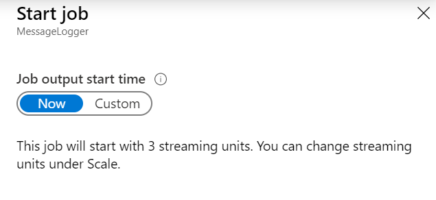

4. Select **Start**.

5. Allow your Stream Analytics Job a few minutes to start. Once the Job starts it will move to a state of Running.

    

### Task 12: Provision an Azure Storage account

The EventProcessorHost requires an Azure Storage account that it will use to manage its state among multiple instances. In this section, you create that Storage account.

1. In the [Azure portal](https://portal.azure.com) left menu, select **+Create a resource**, search for `Storage account`, then select **Storage account - blob, file, table, queue**.  Select the Create button on the resource overview page.

2. In the **Create storage account** form, **Basics** tab, enter the following:

    - **Subscription**: Select the subscription you are using for this hands-on lab.

    - **Resource Group**: Choose Use existing and select the **intelligent-analytics** resource group.

    - **Storage account name**: Provide a unique name for the account e.g., `awhotelchatstore + (namespace)`.

    - **Location**: Select the location you are using for resources in this hands-on lab.

    - **Performance**: Set to **Standard**.

    - **Account kind**: **StorageV2 (general purpose v2)**.
  
    - **Replication**: Set to **Locally Redundant Storage (LRS)**.

    - **Access tier**: **Hot**

    Go to the **Advanced** tab.

    - **Secure transfer required**: Select Disabled.

    - Select **Review + create**.  Select **Create**.

      

### Task 13: Provision Cognitive Services

To provision access to the Text Analytics API (which provides sentiment analysis features), you will need to provision a Cognitive Services account. Based on a phrase, you can tell if a hotel guest is happy or upset.

1. From the [Azure portal](https://portal.azure.com) left menu, select **+Create a resource**, then search for `Text Analytics`

    

2. On the **Create** blade, enter the following:

    - **Name**: Enter a unique name like `awhotels-sentiment`.

    - **Subscription**: Select the subscription you are using for this hands-on lab.

    - **Location**: Select the location you are using for resources in this hands-on lab.

    - **Pricing tier**: Choose **F0 (5K Transactions per 30 days)**.

    - **Resource Group**: Select the **intelligent-analytics** resource group.

    

3. Select the **Create** button.

4. When it finishes provisioning, browse to the newly created cognitive service by selecting **Resource Groups** in the left menu, then selecting  the **intelligent-analytics** resource group, and selecting the Cognitive Service, **awhotels-sentiment**.

5. Acquire the key for the API by selecting **Keys and Endpoint** on the left-hand menu.

    

6. Capture the configuration settings and paste them into Notepad. You will create Application Settings later. Capture:

   - TextAnalyticsAccountName = NAME
   - TextAnalyticsBaseUrl = ENDPOINT
   - TextAnalyticsAccountKey = KEY 1

    

7. Select **+Create a resource**, select **Language Understanding**, and **Create**.

     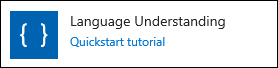

8. On the **Basics** tab of the **Create Cognitive Services** screen, populate the form fields as follows:

    - **Subscription**: Select the subscription you are using for this hands-on lab.

    - **Resource Group**: Select the **intelligent-analytics** resource group.  

    - **Name**: Enter a unique name, like `luis-api-namespace`, where namespace may be your initials.
  
    - **Authoring Resource: Authoring Location**: Select a region closest to you.
  
    - **Authoring Resource: Authoring pricing tier**: Select **F0 (5 Calls per second, 1M Calls per month)**.
  
    - **Prediction Resource: Prediction Location**: Select the location you are using for resources in this hands-on lab.

    - **Prediction Resource: Prediction Pricing Tier**: Select **F0 (5 Calls per second, 1M Calls per month)**.

     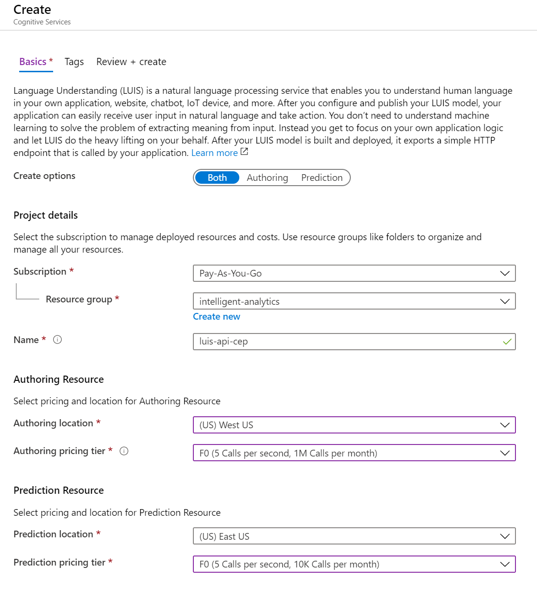

9. Select **Review + create**, then select **Create**.

10. Select the **Keys and Endpoint** link under Resource Management to  retrieve the **Key 1** value for the **luis-api-namespace** Cognitive Service.

11. Verify that you have captured the two API keys for later reference in this lab.

## Exercise 2: Implement message forwarding

Duration: 45 minutes

In this section, you will implement the message forwarding from the ingest Event Hub instance to an Event Hub instance and a Service Bus Topic. You will also configure the web-based components, which consist of two parts: The Web App UI and the Function App that runs the EventProcessorHost.

### Task 1: Implement the event processor

1. On your Lab VM, open the **ConciergePlusSentiment.sln** file that you downloaded using Visual Studio, if it is not already open.

2. Open **ProcessChatMessage.cs** (found within the **ChatMessageSentimentProcessorFunction** project in the Solution Explorer).

    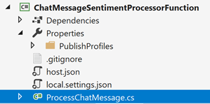

3. Scroll down to the **Run** method. This method represents the heart of the message processing logic utilized by the Event Processor Host running in an Azure function. It is provided a collection of EventData instances, each of which represent a chat message in the solution.

    

4. Locate **TODO: 1** through **TODO: 5** comments and uncomment the code:

    ```csharp
    //TODO: 1.Extract the JSON payload from the binary message
    string sourceEventHubEventBody = Encoding.UTF8.GetString(eventData.Body);
    var sentimentMessage = JsonConvert.DeserializeObject<MessageType>(sourceEventHubEventBody);

    //TODO: 12 Append sentiment score to chat message object
    //if (sentimentMessage.messageType.Equals("chat", StringComparison.OrdinalIgnoreCase))
    //{
    //    sentimentMessage.score = await GetSentimentScore(sentimentMessage);
    //    log.LogInformation("SentimentScore: " + sentimentMessage.score);
    //}

    //TODO: 2.Create a Message (for Service Bus) and EventData instance (for EventHubs) from source message body
    var updatedMessage = JsonConvert.SerializeObject(sentimentMessage);
    var chatMessage  = new Message(Encoding.UTF8.GetBytes(updatedMessage));

    // Write the body of the message to the console.
    log.LogInformation($"Sending message: {updatedMessage}");

    //TODO: 3.Copy the message properties from source to the outgoing message instances
    foreach (var prop in eventData.Properties)
    {
        chatMessage.UserProperties.Add(prop.Key, prop.Value);
    }

    //TODO: 4.Send chat message to Topic
    // Send the message to the topic which will be eventually picked up by ChatHub.cs in the web app.
    await topicClient.SendAsync(chatMessage);

    //TODO: 5.Send chat message to next EventHub (for archival)
    using var eventBatch = archiveEventHubClient.CreateBatch();
    EventData updatedEventData = new EventData(Encoding.UTF8.GetBytes(updatedMessage));

    eventBatch.TryAdd(updatedEventData);
    await archiveEventHubClient.SendAsync(eventBatch);
    Console.WriteLine("Forwarded message to event hub.");
    ```

5. Save the file.

### Task 2: Configure the Chat Message Processor Function App

1. Navigate to your Function App in the [Azure portal](https://portal.azure.com). You can find it by opening your **intelligent-analytics** Resource Group and looking through the list of resources.

2. Select the **Configuration** link in the **Overview** blade of the **Function App**. Choose the **Application settings** link.

    

3. You will add the following application settings. The following sections walk you through the process of retrieving the values for the Application settings.  If you have already captured these values, you can skip ahead to the adding the **New application setting**.

    ```text
    ChatTopicPath  (e.g. awhotel)
    DestinationEventHubName  (e.g. awchathub2)
    EventHubConnectionString

    ServiceBusConnectionString
    SourceEventHubName   (e.g. awchathub)
    StorageAccountKey
    StorageAccountName

    TextAnalyticsAccountKey
    TextAnalyticsAccountName
    TextAnalyticsBaseUrl
    ```

    > **Note**: It is beneficial to open a second tab or browser window and access the Azure Portal. This way one instance of the Azure Portal may be used to populate the application settings, and the second one can be used to navigate to different resources to obtain key values, connection strings, and URLs. If you decide to use only a single instance of the Azure Portal, be sure to **Save** application settings (available in the Application Settings toolbar) before leaving the screen.

#### Event Hub connection string

The connection string required by the ChatMessageSentimentProcessor is different from the typical Event Hub consumer, because not only does it need Listen permissions, but it also needs Send and Manage permissions on the Service Bus Namespace (because it receives messages, as well as creates Subscriptions).

1. To get the **EventHubConnectionString**, navigate to the Event Hub namespace in the Azure Portal by selecting **Resource Groups** on the left menu, then selecting the **intelligent-analytics** resource group, and selecting your **Event Hubs Namespace** from the list of resources.

    

2. Select **Shared access policies**, under **Settings**, within the left-hand menu.

3. Select the **ChatConsole** from the list of policies, and then copy the **Connection string--primary key** value.

    

4. Return to the **Application Settings** for the Function App in the [Azure portal](https://portal.azure.com) by selecting the **Configuration** link on the Overview pane. Select **+ New application setting** in the toolbar menu of the Application Settings section.

    

5. Enter `EventHubConnectionString` into the **Name** field, and paste the copied connection string value from step 6 into the **Value** field. Select the **OK** button.

    

#### Event Hub name

Your event hubs can be found by going to your Event Hub overview blade, and selecting Event Hubs from the left menu.


1. Create a new application setting with the **Name** `SourceEventHubName`. For the Value, enter the name of your first Event Hub, `awchathub`.

2. Create a new application setting with the **Name** `DestinationEventHubName`, enter the name of your second Event Hub, `awchathub2`, as the **Value**.

#### Storage account

Your storage accounts can be found by going to the intelligent-analytics resource group, and selecting the Storage account.

1. Create a new application setting with the **Name** `StorageAccountName` and enter the name of the storage account you created in the **Value** field.

2. Create a new application setting with the **Name** `StorageAccountKey` and enter the Key for the storage account you created (which you can retrieve from the Portal).

    - From your storage account's blade, select **Access Keys** from the left menu, under **Settings**.

      

    - Copy the Key value for **key1**, and paste that into the value for **StorageAccountKey**.

      

#### Service Bus connection string

1. Navigate to the **Service Bus Namespace Overview** page. From the left menu, select the **Shared Access policies** link in the **Settings** section. Select the **ChatConsole** from the list of policies and copy the **Primary Connection String** value and paste into your text file.

    

2. Return to the Function App's Application Settings and create a new setting with the **Name** `ServiceBusConnectionString` and paste this connection string as the **Value**.

#### Chat topic

1. Create a new application setting with the **Name** `ChatTopicPath`. Enter the name of the Service Bus Topic you had created (e.g., `awhotel`) as the **Value**. This can be found under **Topics** on the **Service Bus Namespace Overview blade**.

    

#### Text Analytics API settings

1. In the [Azure portal](https://portal.azure.com), open the Cognitive Service Text API (e.g. **awhotels-sentiment**) in your resource group.

2. On the left-hand menu of the Text API blade, select **Keys and Endpoint**. You will use these configuration values for creating Function Application settings. 

3. Create a new application setting with the **Name** `TextAnalyticsBaseUrl` and enter the **ENDPOINT** as the **Value**. **Use all lower case alpha characters with no spaces**.

4. Create a new application setting with the **Name** `TextAnalyticsAccountName` and paste the value of the Cognitive Service **Name** into the **Value** field.

5. Create a new application setting with the **Name** `TextAnalyticsAccountKey` and paste the value of **KEY 1** of the Cognitive Service into the **Value** field.

6. Scroll to the top of the function **Application Settings** and select **Save** from the toolbar. Your application settings should now resemble the following (to see the hidden values, select the eye icon in the Value column)

    

## Exercise 3: Deploying the App Services

Duration: 15 minutes

1. Navigate to the web application and then select the **Configuration** menu item on the left hand side. Add these new application settings:  

    ```config
    ChatMessageSubscriptionName  (e.g. ChatMessageSub)
    ChatTopicPath  (e.g. awhotel)
    EventHubConnectionString
    SourceEventHubName  (e.g. awchathub)
    ServiceBusConnectionString
    ```

    

With the App Services projects properly configured, you are now ready to deploy them to their pre-created services in Azure.

### Task 1: Restore NuGet Packages for the solution

1. In **Visual Studio Solution Explorer**, right-click on the Solution at the top of the tree, and select **Restore NuGet Packages** from the context menu. Build the Solution.

   

### Task 2: Publish the ChatMessageSentimentProcessor Function App

1. Within **Visual Studio Solution Explorer**, right-click the `ChatMessageSentimentProcessorFunction` project, and select **Publish...** from the context menu.

    

2. In the **Publish** dialog, choose **Select Existing** beneath Azure App Service as the publish target.

    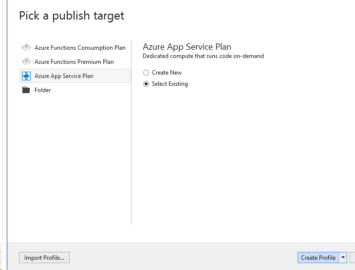

3. Select **Create Profile**.

4. In the **App Service** dialog, choose the **Subscription** that contains your Function App you provisioned earlier. Expand your **Resource Group** (e.g., **intelligent-analytics**), then select the node for your **Function App** in the tree view to select it.

    

5. Select **Publish**.

    

6. When the publish completes, the Output window should indicate success similar to the following:

    

    > **Note**: If you receive an error in the Output window, as a result of the publish process failing (The target "MSDeployPublish" does not exist in the project), expand the Properties folder within the Visual Studio project, then delete the PublishProfiles folder.

7. Repeat steps 1-5 to publish.

### Task 3: Publish the ChatWebApp

1. Within **Visual Studio Solution Explorer**, right-click the ChatWebApp project and select **Publish...** from the context menu.

    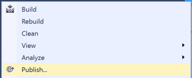

2. In the **Publish blade**, select **App Service**, and choose the **Select Existing** radio button. Select **Create Profile**.

    

    > **Note**: You may see a different dialog than what is shown above. If so, select Microsoft Azure App Service:

    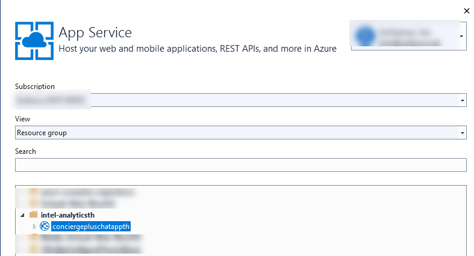

3. In the **App Service** dialog, choose your **Subscription** that contains your Web App you provisioned earlier. Expand your **Resource Group**, **intelligent-analytics**, then select the node for your **Web App** in the tree view to select it.

4. Select **OK**.

5. When the publishing is complete, a browser window should appear with content like the following:

    

    > **Note**: It may take a couple of minutes for the browser to render. You must use a modern browser like Edge. If the site is opened in Internet Explorer, copy the URL from the address bar, open Edge (that you installed earlier), and navigate to the site with Edge instead.

### Task 4: Testing hotel lobby chat

1. Open a browser instance (Edge is recommended for this web app), and navigate to the deployment URL for your Web App.

    - If you are unsure what this URL is, it can be found in two places:

      - First, you can find it on the **ChatWebApp** document in **Visual Studio**, that was opened when you published the Web App.

        

      - Alternatively, this can be found in the [Azure portal](https://portal.azure.com) on the **Overview** blade for your **Web App**.

2. Under the **Join Chat** area, enter your username (anything will do).

3. Leave **Hotel Lobby** selected.

4. Select the **Join** button.

5. The Live Chat should appear. Wait for a 1 minute. The first message warms up the system. You should see a message stating you have connected to the chat service and you have joined the session.

   The **connected** message means you have connected to the web application via SignalR.  The **join** message means you have sent a message to the event hub and the function app Event Hub Trigger copied the message to the service bus topic. Also, the web application has received the message using the topic subscription and pushed it the browser client.

   > **Warning**: Failure to see these messages means your configuration could be incorrect and will cause problems in the next exercises.

    

    - Open the browser console. You should see similar SignalR messages.

    

6. Open another browser tab and navigate to the web site.

7. Enter `HotelLobby` (no spaces), and select **Join**.

8. From either session, fill in the Chat text box and select **Send**. You can try using @ and \# too, just to seed some text for search.

    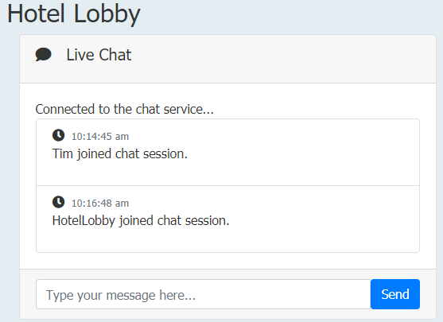

9. Debugging Chat Messages

    - Event Hub Message Debugging.
      - Navigate back to the Azure Portal and select your resource group.
      - Select the event hub.
      - Select the your event hub link.  e.g. awchathub.
      - Select the **Process Data** in the left-hand menu item.
      - Select the **Explore** button.

        

      - Select the **Test query** link.  You may have to grant permissions.
        

        Your chat messages should appear here.  This means your web application and event hub configuration settings are correct. If messages do not show, go back and check your Application Settings. Notice your messages are spread across the different partitions.

        

    - Check your function app.

        > **Note**: _Debugging Tips_: If you navigate to the Azure Function Monitor, you can get more clues to any problems. Below is example of the log output. It can take up to 5 minutes for log entries to display.

        - Select your **ProcessChatMessage** function from the list of functions.

        - Select **Monitor** from the left-hand menu.

        

    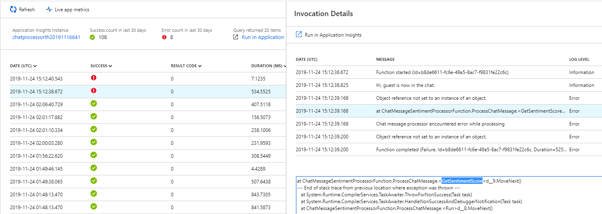

    - Check your Service Bus Subscription activity.
      - Navigate back to your service bus overview.  You should see the message count greater than zero. The web application is going to pull these messages and display them in the browser.

    

10. Test your Stream Analytics Query.

    - Navigate back to your MessageLogger Stream Analytics job.
    - Select the Query item on the left-hand side.
    - Review the Event Hub `Input preview` and the Stream Analytics `Test results`.

    

## Exercise 4: Add intelligence

Duration: 60 minutes

In this exercise, you will implement code to activate multiple cognitive intelligence services that act on the chat messages.

### Task 1: Implement sentiment analysis

In this task, you will add code that enables the Event Processor to invoke the Text Analytics API using the REST API and retrieve a sentiment score (a value between 0.0, negative, and 1.0, positive sentiment) for the text of a chat message.

1. In the **Solution Explorer** in **Visual Studio**, open **ProcessChatMessage.cs** in the **ChatMessageSentimentProcessorFunction** project.

2. Scroll down to the method **Run**.

3. Uncomment the code for **TODO: 6**. It should look like:

    ```csharp
    //TODO: 6 Append sentiment score to chat message object
    if (sentimentMessage.messageType.Equals("chat", StringComparison.OrdinalIgnoreCase))
    {
        sentimentMessage.score = await GetSentimentScore(sentimentMessage);
        log.LogInformation("SentimentScore: " + sentimentMessage.score);
    }
    ```

4. Build your **ChatMessageSentimentProcessFunction** project.
5. Publish your **ChatMessageSentimentProcessFunction** project to Azure.
6. Test your sentiment query by selecting the sentiment query and selecting the `Test selected query` button.  Check your results.  Look at the **score** column. You should have all of the negative chat messages. Sentiment analysis has not been applied just yet. The sentiment analysis will be tested after the Language Understanding configuration has been completed.

    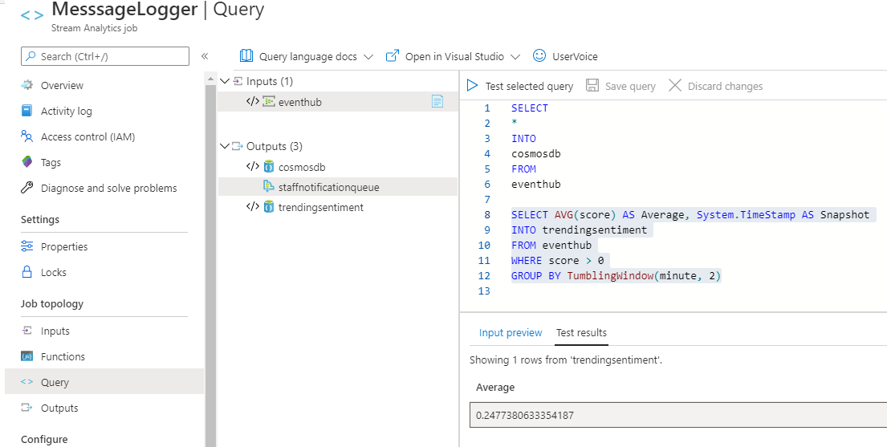

### Task 2: Implement linguistic understanding

What is the hotel guest's intention?

In this task, you will create a LUIS app, publish it, and then enable the Event Processor to invoke LUIS using the `Microsoft.Azure.CognitiveServices.Language.LUIS.Runtime` NuGet package. You will be setting up the LUIS model hierarchy and executing these steps.


1. Using a browser, navigate to <http://www.luis.ai>.  

    > **Note**: If in Exercise 1, Step 12 you created your Luis account in Azure in an European region (e.g. West Europe), user <http://eu.luis.ai> instead. If you selected an Australian region use <http://au.luis.ai>.

2. Select **Sign in** **or create an account**.

3. Sign in using your Microsoft account (or \@Microsoft.com account if that is appropriate to you). The new account startup process may take a few minutes. If you are prompted to migrate to the Preview version of the LUIS portal, select **Migrate Later**.

4. Select **Accept** terms button.

5. You should be redirected to the **My Apps** list page. In the toolbar, select **+Create new app**.

    

6. Complete the **Create a new app** form by providing `awchat` as the name for your LUIS app, and selecting the **English** culture then select **Done**.

    

7. Scroll through the examples of how to create the intents and utterances. Close the dialog.

8. In a moment, your new `awchat` app will appear.

9. Choose **Build** from the toolbar. In the **Intents** pane, select **+ Create** link.

    

10. In the **Intents** dialog, for the **Intent Name** enter `OrderIn` and select **Done**.

    

11. Select **Entities** from the menu on the left.

    

12. Select **+Create**.

    

13. For the **Entity name**, enter **RoomService**.  Select the **Create** button.

    

14. Return to the **OrderIn** intent screen to enter `utterances`.

    

15. In the example input text box, enter the "order a pizza" utterance and **press the Enter key to save your work**.

16. Your newly created pizza utterance is shown below. Select the utterance with your mouse and associate it with the RoomService entity in the dropdown. Upon entity selection, your work will be saved.

    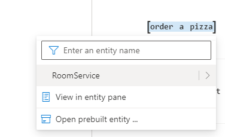

    Your work is saved automatically.

    
17. Time to train your model.  Select the Train button in the upper right.  You should see the following result:

    

18. Now, it is time to test your model.  Select the Test button. Type in, "I would like to order a pizza" into the text box and select the `Enter` key. Select the **Inspect** link. You should see a correlation result above to 90% as well as the associated ML entity.

    

    It is important to see a high correlation (above .75) and a resulting ML entity because the chat application needs it in order to send the message to the correct hotel department. Below is the code from the function application that determines if there is an utterance match.

    

19. Repeat this process for the following phrases and associate them with the **RoomService** entity:

    - I am hungry
    - order food
    - order a hamburger
    - order a soda
    - order dinner
    - order breakfast
    - order a drink

20. Create a **Housekeeping** entity.

21. Create the following utterances and associate them with the Housekeeping entity:

    - more towels
    - more blankets
    - room too warm
    - room too cold
    - I am cold
    - I am too hot

22. Train and test your model.  Did you get the expected test results?

23. Enter one more utterance, `order a hotdog`. There is some new functionality in LUIS. Notice the predicted label/entity was suggested for you.  Confirm the **RoomService** entity. Train and test your model.

    

    

24. Right-click on the **ChatMessageSentimentFunction** project in Visual Studio. Build the project. Select **Publish App** from the Visual Studio menu.

25. When the publish process completes, go back to the LUIS web page. Select **Manage** from the toolbar, then select **Azure Resources** from the left menu. In the **luis-api-namespace** section, the URL is available in the **Example Query** textbox.

    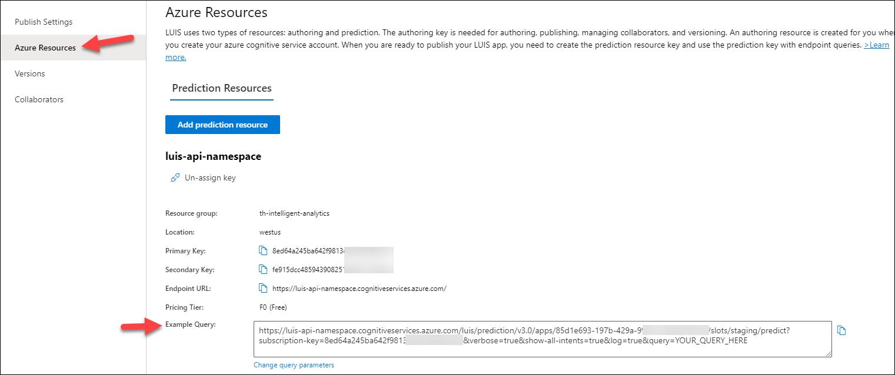

26. Open a new tab in your browser. Paste the **Example Query** URL into the address bar and modify the end of the URL (the text following q= ) so it contains the phrase `bring me towels` and press **ENTER**. You should receive output similar to the following. Observe that it correctly identified the intent as **OrderIn** (in this case with a confidence of 0.969854355 or nearly 100%) and the entity as **towels** having an entity type of **Housekeeping:RoomItem** (in this case with a confidence score of 98.9%).

    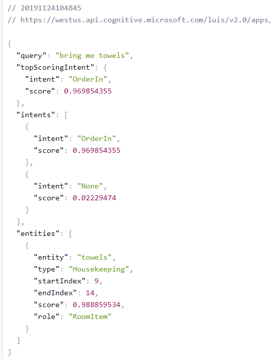

27. Go back to the **luis-api-namespace** screen. Capture three LUIS values and add them to the Azure Function application settings.

    ```text
    LuisPredictionKey
    LuisBaseUrl
    LuisAppId
    ```

    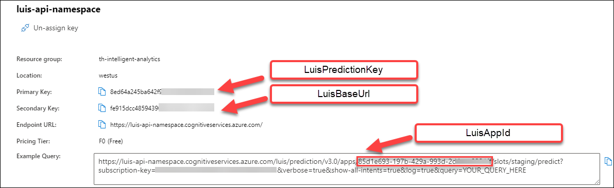

28. In the LUIS web page, select the **Publish** button.

    

29. Select the **Production Slot** setting.  Select the **Done** button.

    

30. **Save** your Application Settings. The Event Processor is pre-configured to invoke the LUIS API using the provided App ID and key.

31. Open **Visual Studio** then open **ProcessChatMessage.cs** within the **ChatMessageSentimentProcessorFunction** project, and navigate to the Run method.

32. Locate **TODO: 7** and uncomment the code:

    ```csharp
    //TODO: 7.Respond to chat message intent if appropriate
    var updatedMessageObject = JsonConvert.DeserializeObject<MessageType>(updatedMessage);

    // Get your most likely intent based on your message.
    var intent = await GetIntentAndEntities(updatedMessageObject.message);
    await HandleIntent(intent, updatedMessageObject, topicClient);
    ```

33. Take a look at the implementation of both methods if you are curious how the entity and intent information is used to generate an automatic chat message response from a bot.

34. Save the file.

### Task 3: Re-deploy the function application and test

Now that you have added sentiment analysis and language understanding to the solution, you need to re-deploy the apps so you can test out the new functionality.

1. Publish the **ChatMessageSentimentProcessorFunction** Function App using **Visual Studio** just as you did in [Exercise 4, Task 2](#task-2-publish-the-chatmessagesentimentprocessor-function-app).

2. Open the Hotel Lobby web page. Join a chat in the **Hotel Lobby**.

3. Type a message with a positive sentiment, like `I love this weather`. Observe the **thumbs-up** icon that appears next to the chat message you sent. Next, types something like, `I hate this weather` and observe the **thumbs-down** icon. These are indicators of sentiment (as applied by your solution in real-time).

    

4. Next, try ordering some items from room service, like `bring me towels` and `order a pizza`. Observe that you get a response from the **ConciergeBot**, and that the reply indicates whether your request was sent to **Housekeeping** or **Room Service**, depending on whether the item ordered was a room or food item.

    

## Exercise 5: Building the Power BI dashboard

Duration: 30 minutes

Now that you have the solution deployed and exchanging messages, you can build a Power BI dashboard that monitors the sentiments of the messages being exchanged in real time. The following steps walk through the creation of the dashboard.

### Task 1: Provision Power BI

If you do not already have a Power BI account:

1. Go to <https://powerbi.microsoft.com/features/>.

2. Scroll down until you see the **Try Power BI for free!** section of the page, and select the **Try Free** button.

    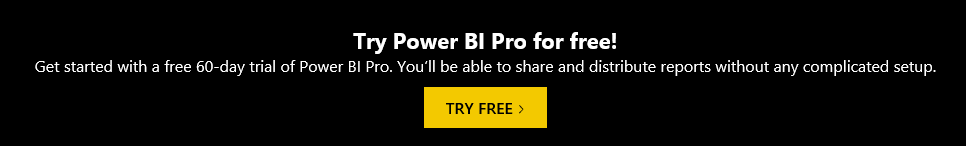

3. On the page, enter your work email address (which should be the same account as the one you use for your Azure subscription), and select **Sign up**.

    

4. Follow the on-screen prompts, and your Power BI environment should be ready within minutes. You can always return to it via <https://app.powerbi.com/>.

### Task 2: Create the static dashboard

1. Sign in to your Power BI subscription (<https://app.powerbi.com>).

2. Select **My Workspace** on the left-hand menu, then select the **Datasets** tab.

    

3. Under the **Datasets** list, select the **Messages** dataset.

    

4. Select the **Create Report** button under the **Actions** column.

    

5. On the **Visualizations** palette, select **Gauge** to create a semi-circular gauge.

    

6. In the **Fields** listing, select and drag the **score** field and drop it onto the **Value** field.

    

7. Select the drop-down menu that appears where you dropped score and select **Average**.

    

8. You now should have a gauge that shows the average sentiment for all the data collected so far, which should look similar to the following:

    

9. From the **File** menu, select **Save** to save your visualization to a new report.

    

10. Enter `ChatSentiment` for the report name, and select **Save**.

    

### Task 3: Create the real-time dashboard

This gauge is currently a static visualization. You will use the report just created to seed a dashboard whose visualizations update as new messages arrive.

1. Select the **Pin Live Page** item located on the toolbar.

    

2. Select New **dashboard**, enter `Real-time Sentiment` as the name, and select **Pin Live**.

    

3. Return to the **My Workspace** page, and select your newly created dashboard from the list of dashboards.

    

4. Real-time dashboards are created in Power BI using the Q&A feature, by typing in a question to visualize in the space provided. In the **Ask a question about your data** field, enter: `average score created between yesterday and today`.

    

    

5. Next, convert this to a Gauge chart by expanding the **Visualizations** palette at right, and selecting on the **Gauge** control. You will need to set the **New Q&A experience** to **Off** in order to see the **Visualizations** palette. This switch is on the toolbar on the right-hand side.

    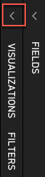

6. In the **Visualizations** palette, select the **Gauge** control. Select the **Format** (paint roller) icon and expand the **Gauge axis** section. Format the Gauge axis so it ranges between **0.0** and **1.0** and has a **target** (indicator) set at **0.5**.

    

7. Your gauge should now look similar to the following:

    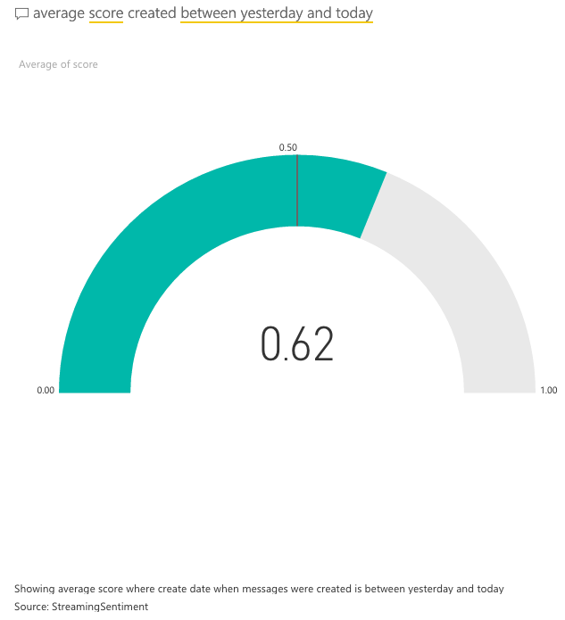

8. In the top-right corner, select **Pin visual**.

    

9. In the dialog that appears, select the dashboard you recently created and select **Pin**.

    

10. In the list of dashboards, select your **Real-time Sentiment** dashboard. Your new gauge should appear next to your original gauge. If the original gauge fills the whole screen, you may need to scroll down to see the new gauge. You can delete the original gauge if you prefer. (Select the top of the visualization, then ellipses that appear, and then, the trash can icon.)

    

11. Navigate to the chat website you deployed and send some messages and observe how the sentiment gauge updates with moments of you sending chat messages.

### Task 4: Add a trending sentiment chart to the dashboard

The sentiment visualization you created is great for getting a sense of sentiment as of this moment. However, First Up Consultants wishes to view sentiment over time for historical reference and to see whether overall sentiment is trending one way or another. To do this, we will use the tumbling window query output from Stream Analytics to display this data in a line chart.

1. While still in **Power BI**, select **My Workspace** once again, then select the **Datasets** tab. You should see the **TrendingSentiment** dataset dynamically created by Stream Analytics. Select the **Create Report** action.

    

2. Select the **Line chart** visualization.

    

3. Drag the **average** field to the **Values** setting, and **snapshot** to **Axis**.

    

4. Resize the line chart and observe how the average sentiment is tracked over time.

    

5. Select **Save this report** on the top of the page. Name the report `Trending Sentiment` when prompted.

    

6. Next, select **Pin Live Page**.

    

7. In the **Pin to dashboard** dialog, select **Existing dashboard**, select the dashboard you created previously, then select **Pin live**.

    

8. Position the Trending Sentiment line chart beneath the average score gauge.

    

9. Try building out the rest of the real-time dashboard that should look as follows. We provide the following Q&A questions you can use to get started.

    

    - Count of Messages (Card visualization): Count of messages between yesterday and today.

    - Count of Messages by Username (Pie chart visualization): Count of messages by username between yesterday and today.

    - Upset Users (Bar chart visualization): Average score by username between yesterday and today.

10. Invite some peers to chat and monitor the sentiments using your new, real-time dashboard.

## Exercise 6: Enabling search indexing

Duration: 30 minutes

Now that you have primed the system with some messages, you will create a Search Index and an Indexer in Azure Search upon the messages that are collected in Azure Cosmos DB.

### Task 1: Verifying message archive

Before going further, a good thing to check is whether messages are being written to Azure Cosmos DB from the Stream Analytics Job.

1. In the **Azure Portal**, navigate to your **Azure Cosmos DB account**.

2. On the left-hand menu, select **Data Explorer**.

    

3. Under the **awhotels** Cosmos DB, select **messagestore**, then **Items**. You should see some data here.

    

4. If you want to peek at the message contents, select any item in the listing.

    

    > **Note**: If you don't see messages, then check for errors in MessageLogger, Outputs, Cosmos DB.  If you have to delete the collection and recreate them, make sure to stop and start the MessageLogger.  Test the connection.

    

### Task 2: Creating the index and indexer

1. Select **Resource Groups** from the left menu, then select the **intelligent-analytics** resource group.

2. Select your **Search service** instance from the list.

    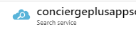

3. Select **Import data**.

    

4. On the **Import data** blade, select **Connect to your data**.

    

5. For **Data Source**, select **Cosmos DB** from the dropdown.

6. Enter `messagestore` for the **Data Source Name**.

7. **Cosmo DB account**: Select the **Choose an existing connection**, and select the **awhotelcosmosdb-namespace** database. This will auto-populate the connection string.

8. For **Database**, select your **awhotels** database.

9. For **Collection**, choose your **messagestore** collection.

    

10. Select the **Next: Add cognitive search** button.

    

    Select **Skip to: Customize target index**.

    

11. Select **Customize target index**, and observe that the field list has been pre-populated for you based on data in the collection.

12. Enter `chatmessages` for the name of the index. Capture this value for later web application configuration.

13. Set the Key to **id**

    

14. Select the **Retrievable** check box for the following fields: **message, createDate**, and **username** (id will be selected automatically). Only these fields will be returned in query results.

15. Select the **Filterable** check box for **createDate, username**, and **sessionId**. These fields can be used with the filter clause only (not used by this Tutorial, but useful to have).

16. Select the **Sortable** check box for **createDate**, **username**, and **sessionId**. These fields can be used to sort the results of a query.

17. Select the **Searchable** check box for **message**. Only this field will be indexed for full text search.

18. Confirm your grid looks similar to the following, and select **Next: Create an Indexer**.

    

19. On the **Create an Indexer** blade, enter `messages-indexer` as the name.

20. Set the **Schedule** toggle to **Custom**.

21. Enter an **interval** of **5** minutes (the minimum allowed).

22. Keep the **Start time** to the default value of **today's date**.

23. The description and other fields can be ignored.

24. Select **Submit** to begin importing data using your indexer.

25. You should test your index and configure it to be searchable by client applications. After a few moments, examine the Indexers tile for the status of the Indexer.

    

    You should see your messages indexed.

    

    Select the **chatmessages** index.  You can test the searches by entering values in the **Query string** text box. Enter `search=test` into the Query string box and select **Search**.

    

    Select the **CORS** tab. Select **All** for the option. Press the Save button.

    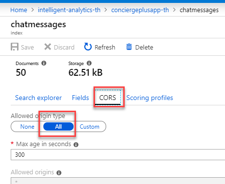

    > **Note**: The **All** setting allows search requests from other client applications to successfully execute. For a production application, you would choose the **Custom** option and enter the domain you will be receiving requests from.

26. We need to capture the index query api key for the Azure Web App configuration.

    - On the **Search service** blade, select **Keys** on the left-hand menu. Capture the **Primary admin key**. The value will be used for the ChatSearchApiKey.

    

### Task 3: Update the Chat Web App Configuration

1. Navigate to your web app.

2. Select the configuration blade. We are going to add the following values:

    ```text
    ChatSearchApiBase
    ChatSearchApiIndexName
    ChatSearchApiKey
    ```

3. For the `ChatSearchApiBase` key, enter the URI of the Search App (e.g., <https://conciergeplusappsearchth.search.windows.net)>.

    - You can find this by going to **Resource Groups**, selecting the **intelligent-analytics** resource group, and selecting your **search app service** from the list.

    

4. Save the web application configuration.

### Task 4: Re-publish web app

1. Publish the updated **ChatWebApp** using Visual Studio, as was shown previously in [Exercise 4, Task 3](#task-3-publish-the-chatwebapp).

2. When the publishing is complete, a browser window should appear.

3. Navigate to the **Search** tab on the deployed Web App and try searching for chat messages.

    

## Exercise 7: Add a bot using Bot service and QnA Maker

Duration: 30 minutes

At this point, you have created a real-time chat service in Azure, allowing people to interact with one another. Now we will build a bot that will automatically respond to user questions, helping take the load off the hotel staff.

### Task 1: Create a QnA service instance in Azure

Microsoft's QnAMaker is a Cognitive Service tool that uses your existing content to build and train a simple question and answer bot that responds to users in a natural, conversational way.

1. In a new web browser window, navigate to <https://www.qnamaker.ai>.

2. On the home page, select **Sign In** on the top right of the page. Sign in with the same credentials you use for the [Azure portal](https://portal.azure.com).

    

3. Select **Create a knowledge base**.

    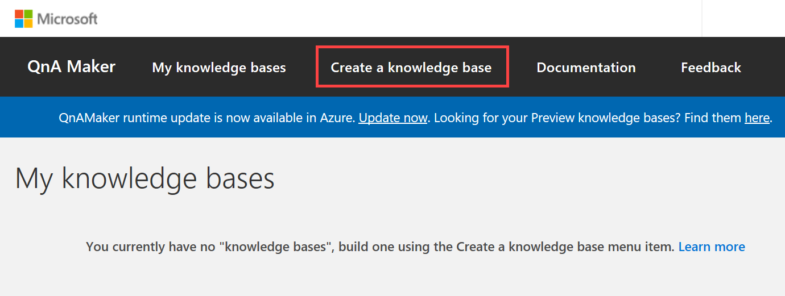

4. Within the **knowledge base creation** page, select **Create a QnA service** under Step 1.

    

5. Within the **Create QnA Maker** form in Azure, provide the following:

    - **Name**: Provide a **unique name** for the QnA Maker Service (e.g., `awhotel-qna`).

    - **Subscription**: Choose the same subscription you used previously.

    - **Pricing tier**: Choose **F0 (3 managed documents per month ...**

    - **Resource Group**: Choose the **intelligent-analytics** resource group.

    - **Azure Search pricing tier**: Choose **F (3 Indexes)**.

    - **Azure Search location**: Choose the **same location** you used previously. If the region you've been using isn't available, select a different location for this resource.

    - **App name**: Provide a **unique name** for the QnA Maker Service (e.g., `awhotel-qna`).

    - **Website location**: Choose the **same location** you used previously. If the region you've been using isn't available, select a different location for this resource.

    - **App insights**: Select **Disable**.

    

6. Select **Create**.

7. Once the service has been created, switch back to the browser tab with the **QnA Maker knowledge base creation** page and select the **Refresh** button in the **Step 2** section.

8. Underneath Step 2, select your **Microsoft Azure Directory ID** under which you created the QnA Maker service, select the **Azure subscription name**, select the **Azure QnA service**, and **English** as the **Language**.

    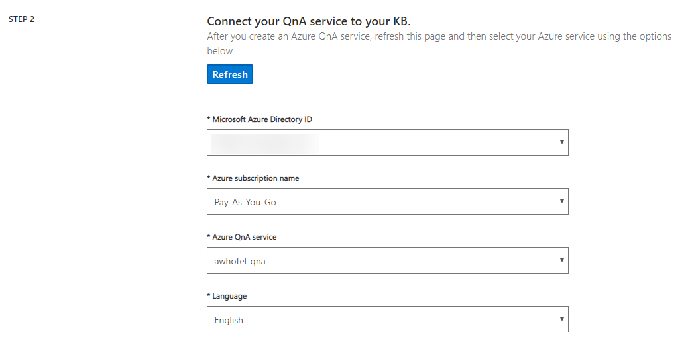

9. Underneath Step 3 (Name your KB), provide a unique name, such as `ConciergePlus`

10. Underneath Step 4 (Populate your KB), select **+ Add file**. [Download this file](lab-files/faq.xlsx) then select it from the file browser.

    

11. Finally, underneath Step 5 (Create your KB), select **Create your KB**.

    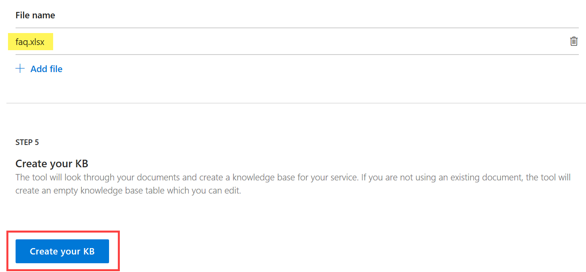

12. When the KB is being created, the Knowledge base will be displayed in the window. It takes a few seconds for the extraction process to read the Excel document and identify questions and answers.

    

13. Select **+ Add QnA pair** in the toolbar to add a new row in the **Editorial** section of the Knowledge Base. Enter `Hi` into the **Question** field and `Hello. Ask me questions about the hotel.` into the **Answer** field of the new row you created.

    

14. Choose **Save and train** button on toolbar of the page. This will save your changes and train the bot how to respond to questions, given the information you imported.

15. Once your changes have been saved, select **Test** at the top of the page. Try typing `hi` and press enter. You should see the **Hello. Ask me questions about the hotel.** response. Experiment with asking different questions.

    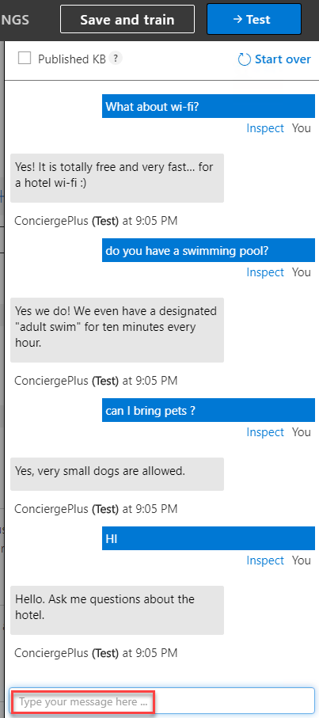

16. Select **Inspect** underneath one of your test questions. The **Inspect** pane will appear, showing the question you typed, the answer, and a confidence score. This pane provides you an easy way to add alternate phrasing or change the answer. Choose **Save and train**. Select the **Test** button to hide the testing pane.

    

17. Select **Publish** on top of the page. In the publish page that appears, select the **Publish** button.

    

### Task 2: Create a QnA bot

1. Select the **Create Bot** button.

    

2. Enter the **Web App Bot** configuration as follows:

    - **Bot handle**: Enter the Bot name, e.g. `awhotel-qna-bot`.
    - **Subscription**: Select your subscription.
    - **Resource Group**: Select **intelligent-analytics**.
    - **Location**: Select the region you've been using throughout this lab.
    - **Pricing tier**: Select **F0 (10K Premium Messages)**.
    - **App name**: This will be defaulted to the same name as the **Bot handle**.
    - **Application Insights**: Set to **Off**.

    > **Note**: Do not change the QnA Auth Key.
    
    > **Note**: You may receive a message that the **Resource provider 'Microsoft.BotService' is not registered from the subscription. If this is the case, it can be rectified by following [one of these solutions (choose 1)](https://docs.microsoft.com/en-us/azure/azure-resource-manager/templates/error-register-resource-provider).

    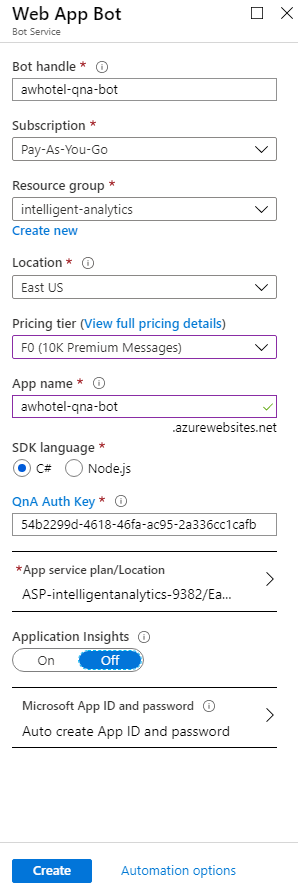

3. Select the **Create** button.

4. Choose your new **QnA Web App Bot** from the resource group.

    

5. Test out the bot by selecting **Test in Web Chat** on the left-hand menu (it may take a couple minutes to appear the first time). Type in a few questions to make sure it responds as expected.

    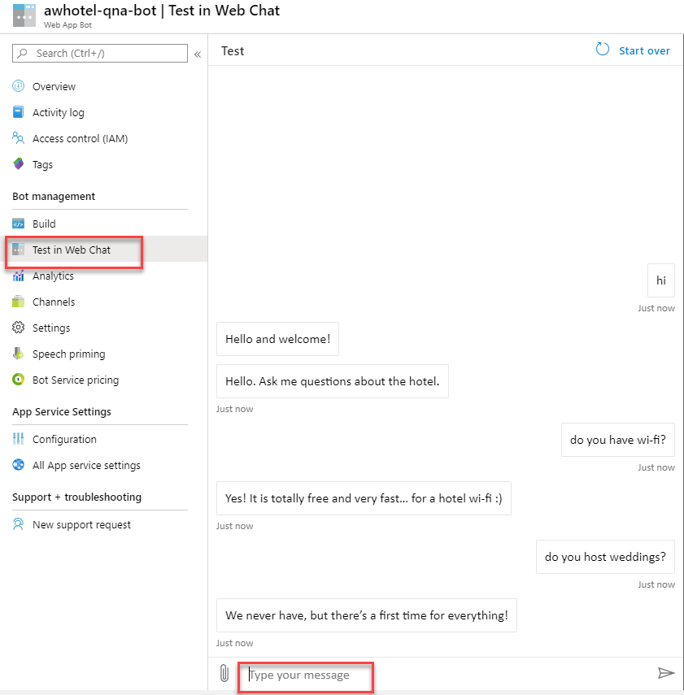

6. Select **Settings** from the left-hand menu. Change the display name to something like `Concierge+ Bot`, then select **Save**.

    

7. Select **Channels** from the left-hand menu, then select **Get bot embed codes** underneath the **Web Chat channel**.

    

8. A dialog will appear for the embed codes. Select the **Select here to open the Web Chat configuration page** option.

9. Select **Copy** next to the **Embed code** textbox. Paste that value to notepad or other text application. Select **Show** beside the first Secret key. Copy the value and replace **YOUR_SECRET_HERE** within the embed code with that secret value. Example: `<iframe src='https://webchat.botframework.com/embed/concierge-plus-bot?s=XEYx9upcGtc.cwA.Ku8.hAL6pCxFWfxIjOE9WM48qxkPNtsy4BkT_LST5y0FxEQ'></iframe>`.

    

### Task 3: Embed the bot into your web app

1. Open **Visual Studio** and open **Bot.cshtml** located within the **Views\Home** folder of the **ChatWebApp**.

    

2. Find `<!-- PASTE YOUR BOT EMBED CODE HERE -->` within the page and paste your iframe embed code on a new line beneath.

3. Modify the iframe style values to match as follows. The iframe code should look like:

    ```html
    <!-- PASTE YOUR BOT EMBED CODE HERE -->
    <iframe src='YOUR_SOURCE' style='min-width: 400px; width: 100%; height: 300px;'></iframe>
    ```

    

4. **Publish** your web app.

5. After the web app has been published, navigate to it by selecting the **Bot** menu item. Type in a few questions to ensure the bot is functioning correctly.

    

## After the hands-on lab

Duration: 10 mins

In this exercise, attendees will deprovision any Azure resources that were created in support of the lab.

### Task 1: Delete the resource group

1. Using the Azure portal, navigate to the Resource group you used throughout this hands-on lab by selecting Resource groups in the left menu.

2. Search for the name of your Resource Group and select it from the list.

3. Select Delete in the command bar and confirm the deletion by re-typing the Resource Group name and selecting Delete.

4. Power BI - Delete **Real-time Sentiment** workspace.

5. LUIS - <https://www.luis.ai/applications>.  Delete the **awchat** app.

You should follow all steps provided _after_ attending the Hands-on lab.